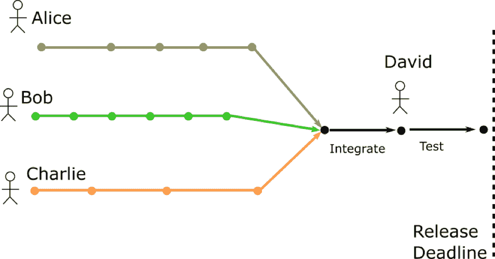
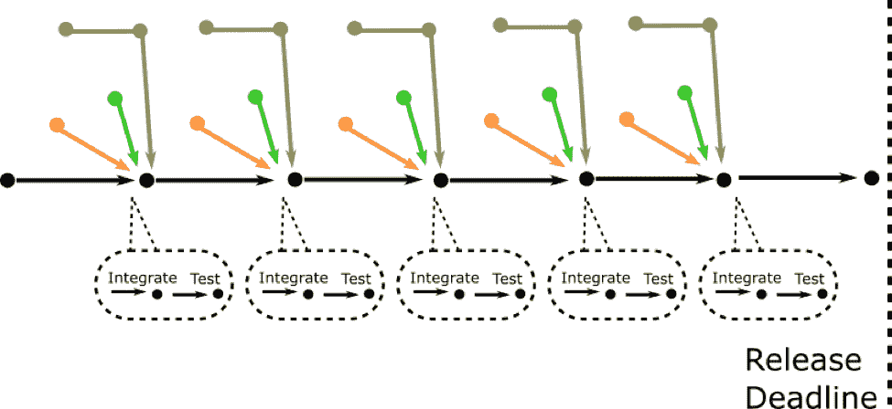
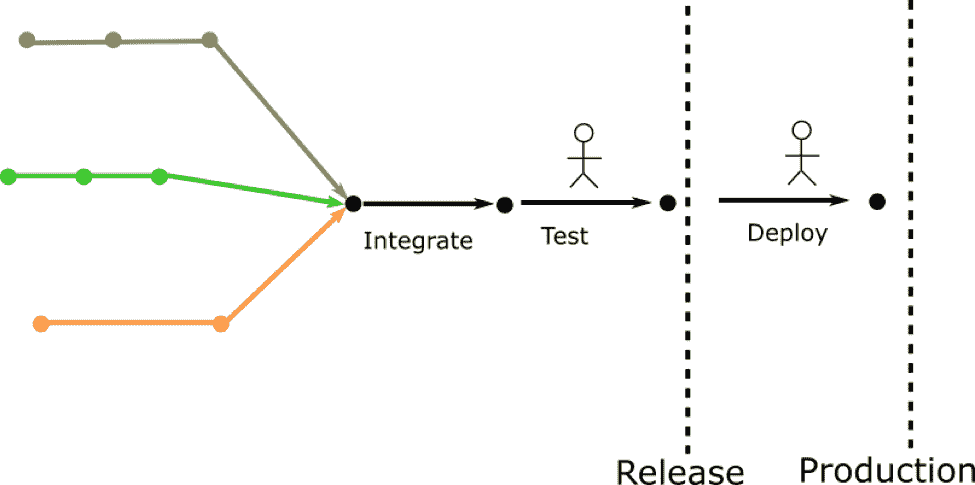
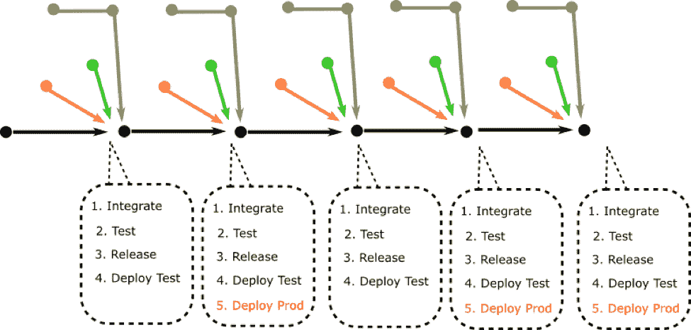
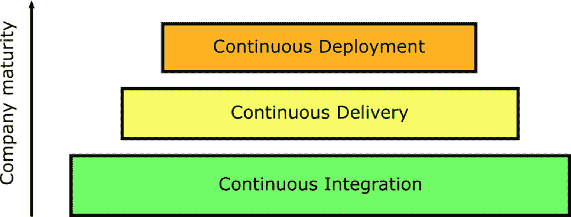
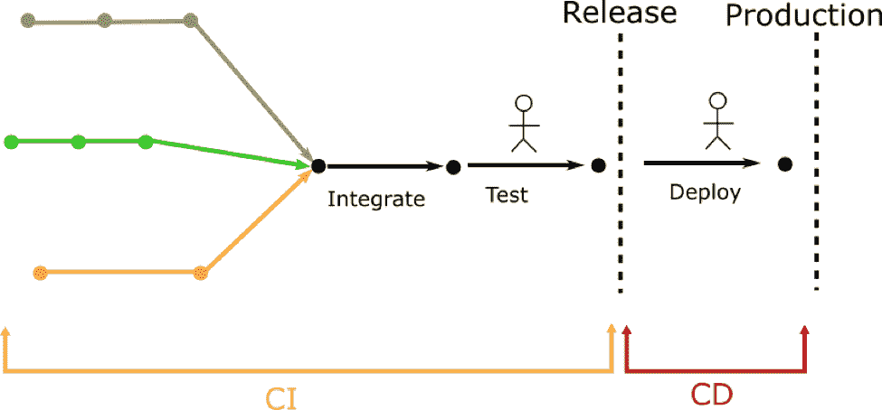

# 理解 CI 和 CD 的区别

> 原文：<https://thenewstack.io/understanding-the-difference-between-ci-and-cd/>

[Kostis Kapelonis](https://codefresh.io/)

[Kostis Kapelonis 是 Codefresh 的开发人员，code fresh 是一个为 Kubernetes 和 containers 构建的连续交付平台。Kostis 以前是一名软件工程师，在应用程序容器化、构建 CI/CD 管道和开发 Java 应用程序方面有多年的经验。他住在希腊，喜欢轮滑。](https://codefresh.io/)

有很多关于持续集成(CI)和持续交付(CD)的信息。许多博客文章试图用技术术语解释这些方法做什么，以及它们如何帮助您的组织。不幸的是，在某些情况下，这两种方法通常都与特定的工具甚至供应商相关联。在公司的自助餐厅里，一个非常常见的对话可能是:

1.  你在你的团队中使用持续集成吗？
2.  是的，当然，我们使用 X 工具

*告诉你一个小秘密*。持续集成和交付都是开发方法。它们不与特定工具或供应商相关联。尽管有工具和解决方案可以帮助你做到这两点(比如 [Codefresh](https://codefresh.io/) )，但实际上，一个公司可以只使用 bash 脚本和 Perl 一行程序来实践 CI/CD(不太实际，但肯定是可能的)。

因此，我们不会陷入使用工具和技术术语来解释 CI/CD 的常见陷阱，而是使用最重要的东西来解释 CI/CD:人！

## 一个关于人的故事——软件集成的黑暗时代

认识一下爱丽丝、鲍勃、查理、大卫和伊丽莎白。他们都为 *SoftwareCo Inc.* 构建 *SuperBigProject* 应用程序而工作。爱丽丝、鲍勃和查理是开发人员。大卫是一名测试工程师。伊丽莎白是团队的项目经理。

开发应用程序的传统方式如下:

Alice、Bob 和 Charlie 各自在他们的工作站上开发三个不同的功能。每个开发人员都以自己的方式编写和测试代码。他们使用长期运行的特性分支，这些特性分支在被合并到产品中之前会存在几个星期甚至几个月。

在某个时间点，Elizabeth(项目经理)召集了整个团队并发布了一个公告:“各位，我们需要创建一个发布。请让它发生！”

此时，Alice、Bob 和 Charlie 正在努力将所有三个特性集成到同一个分支中。这是一个非常紧张的时期，因为这些特性以前从未一起测试过。由于错误的假设或环境问题，许多错误和问题会突然出现(请记住，到目前为止，所有功能都是在每个单独的工作站上测试的，相互之间是隔离的)。

一旦这个高度紧张的时期结束，合并的结果被传递给 David，他将执行额外的手动和自动测试。这一阶段也很耗时，因为他可以根据发现的关键错误的数量来批准或阻止发布。所有的目光都集中在大卫身上，因为他的测试可以揭示一些严重的问题，这些问题会推迟发布。

最后，测试完成了，Elizabeth 高兴地宣布发布版已经准备好打包并发送给客户了。

那么在这个虚构的(但高度现实的)故事中，人们是什么感觉呢？

1.  Alice、Bob 和 Charlie(开发)不高兴，因为他们总是在发布即将发生之前才了解集成问题。整合期就像同时出现多个问题的交火。
2.  大卫(测试)不开心，因为他的工作真的很不平衡。有些平静的时期，他只是等待开发人员完成特性方面的工作。然后是测试阶段，他工作忙得不可开交，必须处理意想不到的测试场景，每个人都小心翼翼。
3.  伊丽莎白(管理层)也不高兴。集成阶段是项目的关键路径。这是一个紧张的时期，因为任何意想不到的问题都会使产品的交付进一步推迟。伊丽莎白一直梦想着一个没有任何惊喜的软件发布，但这在现实中从未发生过。估计项目时间表中的集成阶段总是一个猜谜游戏。

团队中的每个人都不开心。(顺便说一句，如果你的公司还这样开发软件，请试着理解这种开发工作流程是在损害你团队的士气。)

这里的主要问题是在每个产品发布时发生的**单个**“集成”阶段。这是工作流的痛点，它阻止了团队进行无压力的发布。

## 将“持续”添加到集成中

既然我们已经看到了“集成”的含义，那么就很容易理解“持续集成”需要什么了。俗话说，“如果某件事很痛苦，那就多做几次吧”持续集成本质上是高频率地重复集成步骤，以减轻其痛苦。最显而易见的方法是在每次特性合并后进行集成(而不是等待正式发布)。

当一个团队实践持续集成时…

1.  所有功能都直接合并到主分支(主线)中。
2.  开发人员并不是孤立工作的。所有功能都是从主线开发的。
3.  如果主线是健康的，那么一个特性就被认为是完成了，而如果它在一个单独的工作站上独立工作，就不是了。
4.  测试在特性级和主线级都是自动进行的。

这就是持续集成的要点！当然，还有更多细节(实际上有一本[关于这个主题的整本书](https://martinfowler.com/books/duvall.html))但主要的一点是，不是有一个单一的压力集成期，在这个期间所有的东西都被合并和测试，而是“集成”一直以连续的方式发生。

持续集成是开发软件的一种更好的方式(与“简单的”集成相比),因为它:

1.  减少合并要素时出现的意外情况。
2.  解决了“在我的机器上工作”的问题。
3.  将测试阶段分成许多阶段，在这些阶段中，每个特性都逐渐融入到主线中(而不是一次全部)。

结果是，使用 CI 工作的团队没有经历过山车(平静的开发阶段，然后是紧张的发布)，而是以渐进的方式更好地了解项目离完成有多近。

使用 CI 工作是现代软件开发的支柱之一。这种技术在这个时间点上有很好的记录和了解。如果你今天没有在你的软件项目中实践 CI，你的组织没有借口。

## 软件交付的黑暗时代

现在我们已经看到了“集成”的历史以及持续集成是如何工作的，我们可以通过持续交付将它带到下一个层次。

如果我们回到最初的故事，我们可以看到发布方式的类似模式:

执行发布本质上是一个“大爆炸”事件。在软件被认为已经过测试之后，有人负责打包和部署过程。将软件部署到生产环境中也是一个非常紧张的时期，传统上涉及许多手动步骤(和清单)。部署很少发生(有些公司至今每六个月才部署一次)。在极端情况下，部署只发生一次(瀑布设计方法)。

仅在最后期限到来时交付软件会带来与不经常集成相同的挑战:

1.  生产环境通常与测试环境不同，需要在最后一刻进行额外的配置。
2.  在测试环境中运行良好的特性在生产环境中被破坏了。
3.  在发布时还没有准备好的特性要么根本不会提供给客户，要么将发布日期往后推得更远。
4.  发布会在开发人员(希望发布新特性)和运营人员(希望稳定，不希望一次部署太多新特性)之间制造紧张。

你应该能看到这里的模式。如果我们通过更经常地做来减轻“集成”阶段的痛苦，我们也可以为“交付”阶段做同样的事情。

## 将“连续”添加到交货中

连续交付是尽可能频繁地打包和准备软件的实践(就好像它被发送到产品中一样)。最极端的交付方式是在每个功能合并之后。

因此，CD 将 CI 向前推进了一步。在每个特性被合并到主线分支之后，应用程序不仅要进行正确性测试，还要被打包并部署到测试环境中(理想情况下与产品相匹配)。所有这些都是以完全自动化的方式发生的。请注意，上图中缺少简笔画(代表手动步骤)。

还要注意，每个新特性都是推向生产的潜在候选**。并不是所有的候选人都被送去生产。根据组织的不同，部署到生产环境的决策需要人工干预。人类仅仅决定一个发布是否要进入生产阶段(但是不准备发布本身)。该版本已经在测试环境中打包、测试和部署。**

 **持续交付比持续集成更难采用。原因在于，由于每个候选版本都有可能进入生产阶段，因此整个生命周期都需要自动化:

1.  构建应该是可重复的和确定的。
2.  所有的发布步骤都应该是自动化的(这比听起来要难)。
3.  所有配置和相关文件都应该存在于源代码控制中(不仅仅是源代码)。
4.  每个特性/版本都应该在它自己的测试环境中进行测试(理想情况下是以动态的方式创建和销毁)。
5.  所有的测试套件都应该是自动化的，并且相对较快(也比听起来要难)。

虽然云肯定可以帮助满足所有这些需求，但是软件团队(开发人员和运营人员)需要一定程度的纪律，以便真正接受连续交付。

一旦 CD 就位，发布就变得微不足道了，因为只需按一下按钮就可以完成。每个人(不仅仅是项目经理)都可以看到当前的候选版本。当前的候选版本可能没有所有被请求的特性，或者它可能还没有解决所有的需求，但是就发布过程而言，这并不重要。重要的一点是，这个版本已经过充分的测试和打包，可以投入生产了(如果需要的话)。任何项目涉众都应该能够开绿灯，并立即将版本投入生产。

如果您使用的是 CD，软件生命周期可以总结如下:

每个候选版本总是提前准备好的。一个人决定一个候选发布是否也将被推向生产。如果将来需要召回的话，没有进入生产环境的候选版本仍然被存储为工件。

像持续集成，有一个[全书围绕持续交付](https://martinfowler.com/books/continuousDelivery.html)如果你想知道所有的细节。

## 好处:持续部署

CD 中的“D”也可以表示部署。这种开发方法建立在持续交付的基础上，并且基本上完全消除了所有的人为干预。任何被发现已经准备好的候选版本(并且通过了所有的质量和测试关卡)都会被立即**推向生产**。

诚然，只有极少数的公司可以这样运作。不应该轻视在没有人的情况下直接投入生产，在撰写本文时，许多公司甚至没有实践连续交付，更不用说部署了。现在应该很清楚，每一种开发方法都需要前一种方法的基础。

在晋升之前，你的组织应该确保每个基础都非常坚实。在 Codefresh，我们看到许多公司试图进入云时代，他们试图在 CI/CD 管道中硬塞他们现有的实践(针对数据中心进行了优化),而没有真正了解其中一些实践现在已经过时。试图采用连续部署而不首先完全接受连续交付是一场失败的战斗。

查看这些方法涵盖的内容以及 CD 如何需要 CI 的另一种方法是下图:

确保您以正确的顺序处理每个开发范例。以持续交付为目标是一个更加现实的目标，并且工具选项非常丰富。

<svg xmlns:xlink="http://www.w3.org/1999/xlink" viewBox="0 0 68 31" version="1.1"><title>Group</title> <desc>Created with Sketch.</desc></svg>**