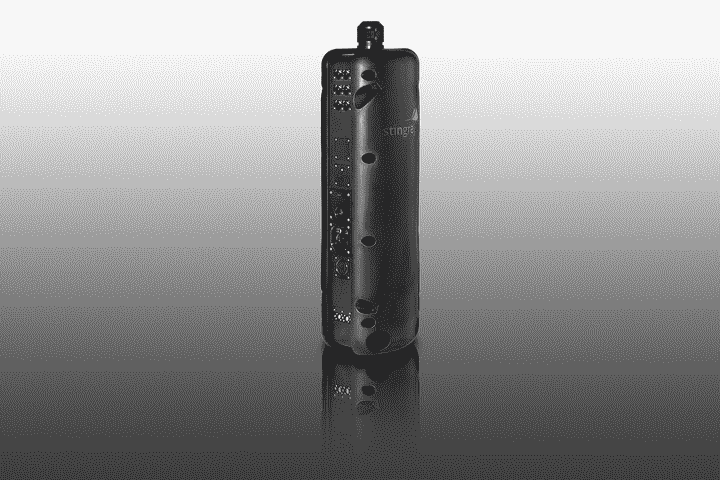
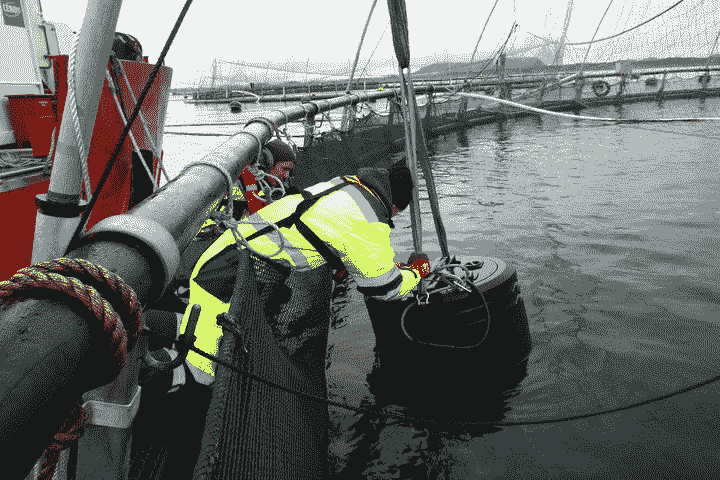

# 水下无人机用激光爆破虱子保护三文鱼

> 原文：<https://thenewstack.io/underwater-drone-protects-salmon-blasting-lice-lasers/>

如果你喜欢吃鱼，尤其是三文鱼，你可能已经注意到在过去的几个月里，新鲜三文鱼产品的价格大幅上涨。随着世界对三文鱼需求的增长，我们也看到三文鱼养殖场的飞速增长，为满足需求，三文鱼养殖场已成为全球约 100 亿美元的产业。但是在如此近距离饲养这些鱼意味着为海虱——以宿主鱼的皮肤和血液为食的微小寄生虫——创造了完美的滋生地。海虱的侵扰会伤害甚至杀死养殖的鲑鱼，最终使鲑鱼生产者损失数百万美元，并提高了存活下来的鱼的价格。

为了解决这个日益严重的问题，挪威和苏格兰的一些大型鲑鱼养殖场正在转向一种不太可能的技术解决方案:配备摄像头和激光的水下无人机，可以将生病鲑鱼身上的吸血小动物烧成灰烬。由挪威公司 [Stingray Marine Solutions](http://www.stingray.no/) 制造的 Stingray 无人机安装在铝制外壳中，配备了一对立体摄像机和一个运行图像识别软件的处理器。这些工具类似于移动设备上使用的面部识别软件，允许黄貂鱼在鲑鱼游动时放大并识别鲑鱼身上的海虱。

它配备了外科二极管激光器，很像牙医或眼科医生办公室使用的那种激光器，一旦检测到寄生虫，它可以用 100 毫秒的激光脉冲快速杀死寄生虫。幸运的是，鲑鱼没有受到激光的伤害，这要归功于它们闪亮的鳞片，它们很容易反射激光。该公司估计，无人机每天可以消灭数万只这种小虱子——这是一个很大的数字，如果考虑到只需要不到十几只海虱就可以有效地残害和杀死一只较小的鲑鱼。

https://youtu.be/e0Ul3zvWwfc

## 大虱子问题

“在挪威的鲑鱼养殖业之外，这并不是一个众所周知的问题，”黄貂鱼海洋解决方案总经理约翰·布雷维克在 [*数字趋势*](http://www.digitaltrends.com/cool-tech/laser-salmon-norway/) 节目中说道。“事实上，这是鲑鱼养殖场正在花费大量资金来应对的事情。鱼寄生虫本身来自野外，但当你在同一个地方有很多生物量时，它就会开花，这正是你在鱼密度高的农场里看到的情况。这是一个刚刚爆发的问题。”

对挪威来说尤其如此，它是世界上最大的养殖鲑鱼生产国，每年供应全球 250 万吨鲑鱼中的近一半。对于现在支持这个创新创业公司的大型挪威生产商来说，黄貂鱼的一个主要优势是它被编程为自主的。它连接到一个绞盘上，当它使用推进器绕着鲑鱼围栏移动时，绞盘起到系绳的作用；在寻找最佳停泊点时，它能够考虑水温、含氧量和盐度等因素，并使用机器视觉技术来跟踪和瞄准每只只有几毫米大小的海虱。

毫不奇怪，这种被该公司称为“光学除虱”的自主方法比传统方法劳动强度小得多，成本效益也高得多，例如使用有害的杀虫剂，或者用强大的热水冲洗鲑鱼，以及引入第二种“更清洁的鱼”，如濑鱼或鮟鱇鱼，它们吃虱子，但不与鲑鱼竞争。虽然这些疗法可能有效，但它们很昂贵。清洗受感染鱼的任务通常取决于好天气等因素，使用更清洁的鱼可能会引发新的问题，如病毒性鱼类疾病的传播。

对一些人来说，使用激光拍摄无人机似乎是短视的，这是一种权宜之计，忽视了这些庞大、密集的鲑鱼养殖场对周围环境和其他海洋野生动物的可怕和有害影响。尽管如此，全球对鲑鱼的需求没有放缓的迹象，我们很可能会看到更多这种锐利的水下无人机从人为问题中拯救这些鲑鱼。

图片:黄貂鱼海洋解决方案。

<svg xmlns:xlink="http://www.w3.org/1999/xlink" viewBox="0 0 68 31" version="1.1"><title>Group</title> <desc>Created with Sketch.</desc></svg>