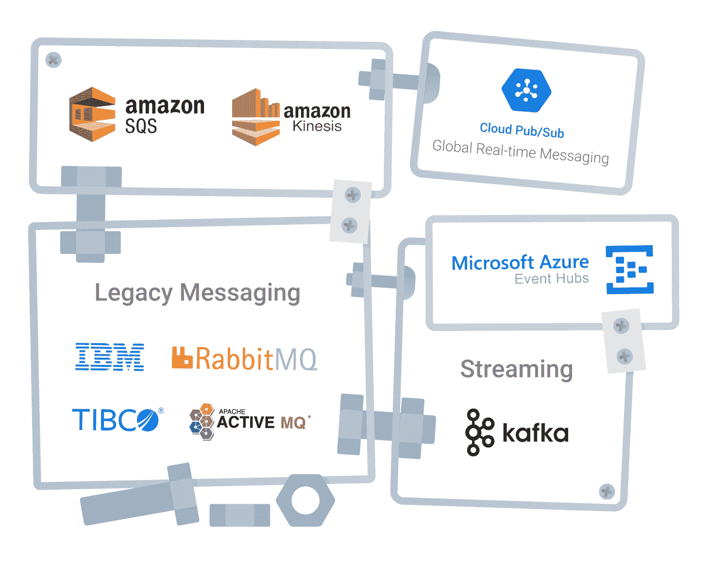
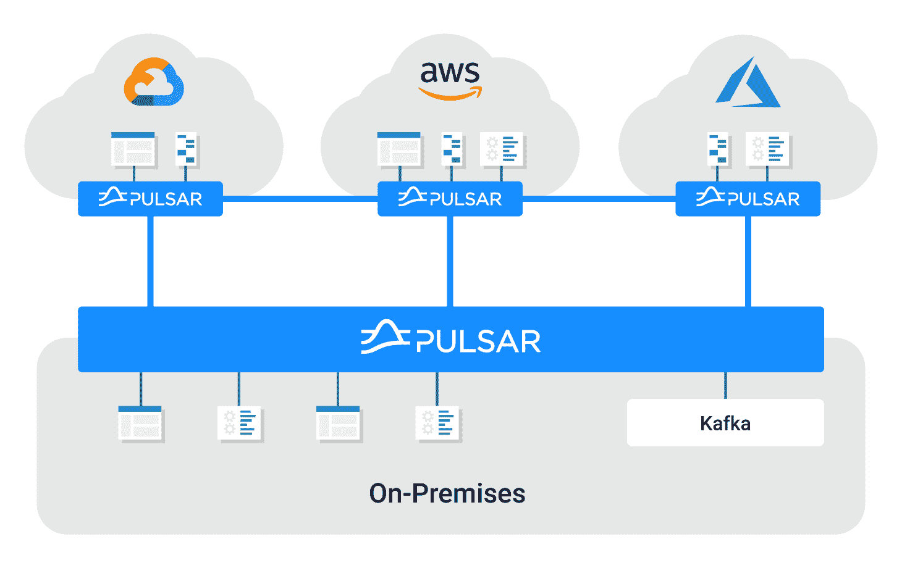

# 面向云原生企业的统一事件驱动架构

> 原文：<https://thenewstack.io/unified-event-driven-architecture-for-the-cloud-native-enterprise/>

CTO 和企业架构师很早就认识到了事件驱动架构(EDA)的重要性。虽然曾经被认为是纯粹的技术问题，但随着我们周围的世界发生变化，投资 EDA 的组织的远见已经变得显而易见。在过去的十年中，我们见证了技术世界几乎每个方面的变化，其中绝大多数都在某种程度上受到了向事件驱动的实时处理发展的影响。

 [克里斯·拉蒂默

Chris Latimer 是 DataStax 的产品管理副总裁，负责该公司在事件流和云消息方面的产品战略。在加入 DataStax 之前，Chris 在谷歌、NetJets 和 Apigee 等公司担任软件工程师、架构师和产品经理，在技术领域工作了 20 多年。](https://www.linkedin.com/in/chrislatimer/) 

我们的工作方式已经改变。未来协调和安排会议日期的电子邮件已经被 Slack 等工具上的临时对话所取代，这导致了即兴视频会议，可以快速做出决定。我们的饮食方式已经改变了。再也不用在网站上订购比萨饼，坐在那里等待送货司机的到来。相反，我们可以看到数十家餐厅的菜单，用手机点餐，并在食物送到我们家的过程中实时跟踪司机。在幕后，企业的经营方式也发生了变化。实时库存、销售和需求数据的可用性正在推动全球供应链的实时优化。

与此同时，公共云技术的进步和不断增长的采用使我们能够应用相同的实时信号来高效地运行支持所有这些变化的应用和系统。容器和虚拟机实例根据需求进行扩展，然后随着负载的减少而稳定下来。

即使对于在构建 EDA 方面做得很好的企业来说，新需求的冲击加上云中高度分布式计算带来的复杂性也带来了新的挑战，需要重新思考现代 IT 的这一关键能力。

## 弗兰肯斯坦的建筑

企业架构师在 EDA 领域面临的最常见挑战之一是消息传递和流技术的激增。JMS 和各种 MQ 实现等老化技术在整个应用程序环境中根深蒂固。当开发人员对内部应用进行现代化改造并将其迁移到云中时，他们通常会用云原生的消息系统来替换传统的消息系统，如 GCP 发布/订阅或 AWS Kinesis。专注于全新数字体验开发的开发人员和架构师经常发现，像 JMS 和 MQ 这样的平台已经跟不上创建引人入胜的客户体验所需的规模和性能要求。这一点，再加上保留事件流以供数据科学家使用的愿望，通常会导致采用其他专门的平台，如 Kafka。虽然这些单独的决策在真空中是有意义的，但当它们组合在一起时，会导致一个支离破碎的体系结构，具有有限的互操作性和不合理的高成本，从而带来资本支出和运营支出(资本支出和运营支出)的缺点。

所有这一切的结果是一个架构开始类似于一个讨厌的附加技术，阻碍，而不是帮助，EDA 的核心原则。

## 创建统一的 EDA

为了应对这些挑战，企业内部正在形成一种新的模式。这种模式有各种各样的名称，包括“统一事件结构”或“企业消息主干”，甚至“数字神经系统”。所有这些标签通常旨在提供一组通用特征，以满足现代 EDA 的需求。为了简单起见，我们将这种模式称为“统一 EDA”

为了成功采用，统一 EDA 计划必须首先认识到一个现实，即当今大多数企业并不完全是云原生的。底层基础必须支持本地运行的系统和云中运行的系统。从平台的角度来看，每个系统的位置应该没有区别。从利用统一 EDA 平台的应用程序的角度来看，发布消息和订阅消息流应该很简单。这些系统不应该承担理解上游或下游系统位于何处或每个系统使用的单个消息传递平台的细节的负担。所有这些复杂性都必须通过统一的 EDA 平台进行抽象。从实践的角度来看，这一切意味着统一的 EDA 必须跨越多个数据中心和云区域，并在不同的网络上工作，同时公开一个简单的外观，以方便平台消费者的使用。

统一 EDA 还必须应对这样一个现实，即很少有企业愿意进行“大爆炸”式的迁移。这意味着建立兼容性和解决互操作性问题是另一个主要挑战。虽然使一个消息传递系统能够与另一个消息传递系统对话的连接器是一个良好的开端，但它们没有解决维护庞大的消息传递和流技术生态系统的潜在复杂性和成本。

实现统一 EDA 的一个更好的方法是关注兼容性，并随着使用的消息传递系统的数量趋向于一个，努力寻找能够推动整合、架构简化和成本节约的替代产品。

## Apache Pulsar，统一 EDA 的未来

到目前为止，企业一直在努力构建统一的 EDA 解决方案。Kafka 等平台是为流媒体和发布/订阅而构建的，将传统的排队用例排除在外。结合 Kafka 的[基础架构挑战，企业很快得出结论，Kafka 不适合作为其统一 EDA 的基础。同样，传统的消息平台在面对 Kafka 所支持的流媒体用例时表现不佳。这常常让技术从业者寻找更好的替代方案来为他们的组织实现统一的 EDA，并经常导致他们发现 Apache Pulsar。](https://www.datastax.com/blog/2021/01/four-reasons-why-apache-pulsar-essential-modern-data-stack)

Pulsar 正是为了解决企业在实施统一 EDA 战略时面临的所有挑战而创建的。它专为多云构建，内置了地理复制功能。它既可以在传统企业数据中心运行，也可以在公共云基础架构上运行，并且可以在混合运行时配置中跨越两者。这创建了一个无处不在的消息传递结构，应用程序可以使用它在企业内的任何地方交换消息和发布事件。

Pulsar 的架构将计算和存储问题分开，允许弹性可扩展性，并支持在 AWS S3、HDFS 或谷歌云存储等低成本存储上无限的消息保留。这不仅降低了运行 Pulsar 的成本，还在 EDA 和数据科学之间创造了一种自然的和谐，允许数据科学家使用他们的标准工具来构建 ML 模型。

Pulsar 还提供全面的功能，使其适合队列、发布/订阅、流和流处理用例。

所有这些因素都促成了人们对阿帕奇脉冲星的兴趣激增。

## Pulsar 入门

我们都知道学习一项新技术有多难。当你刚刚起步时，文章、博客文章、书籍、视频和其他内容的数量可能会多得令人不知所措。这就是为什么 DataStax 创建了一系列完全免费的网络研讨会和研讨会，以使这一过程变得快速而简单。首先报名参加我们的[网络研讨会](https://www.datastax.com/resources/webinar/successfully-migrate-kafka-application-pulsar)，帮助您快速了解 Pulsar。

## 结论:获得事件驱动的权利

事件驱动的架构比以往任何时候都更重要，但让它们变得正确也从未如此具有挑战性。当今技术环境的复杂性加上现代数字业务的需求使得传统系统不堪重负，并导致不可持续的次优架构。Apache Pulsar 社区和 DataStax 正在努力为企业提供一个专门构建的平台来解决这个问题。

如果您的组织还没有 Apache Pulsar，那么是时候开始调查了。一旦你这样做了，你可能会发现自己和你之前的许多人得出了相同的结论:如果你需要统一的 EDA，你需要 Apache Pulsar。

<svg xmlns:xlink="http://www.w3.org/1999/xlink" viewBox="0 0 68 31" version="1.1"><title>Group</title> <desc>Created with Sketch.</desc></svg>