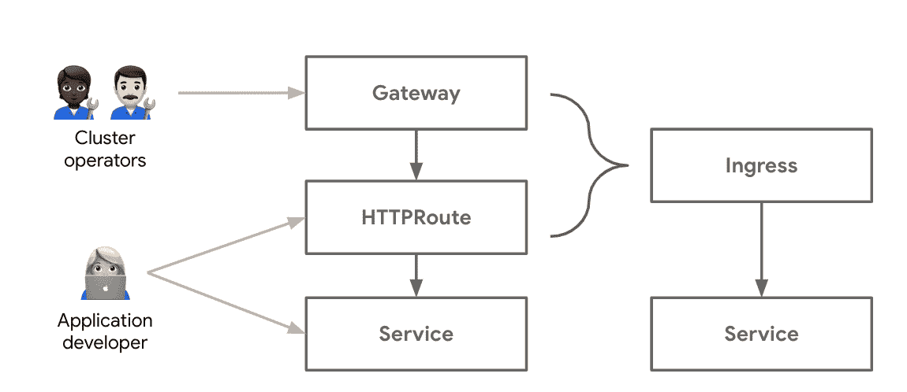
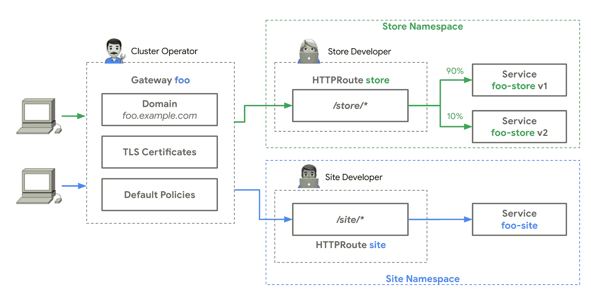

# 将 Kubernetes 服务网络(再次)与网关 API 统一起来

> 原文：<https://thenewstack.io/unifying-kubernetes-service-networking-again-with-the-gateway-api/>

[网关 API](https://gateway-api.sigs.k8s.io/) ，之前被称为服务 API，在进入 V2 之前，首次在圣地亚哥举行的 Kubecon 2019 上详细讨论——并亲自讨论。Ingress 和 Kubernetes 网络 API 已经有许多众所周知的和[详细记录的](https://dave.cheney.net/paste/ingress-is-dead-long-live-ingressroute.pdf)限制。[网关 API](https://www.youtube.com/watch?v=GiFQNevrxYA) 是这些 API 的重做，建立在服务、入口和服务网格社区的经验之上。

[https://www.youtube.com/embed/GiFQNevrxYA?feature=oembed](https://www.youtube.com/embed/GiFQNevrxYA?feature=oembed)

视频

集合了一组入口和服务[控制器实现者](https://kubernetes.io/docs/concepts/services-networking/ingress-controllers/)之后，我们想出了我们想要在 Kubernetes 网络 API 版本 2 中拥有的属性:

 [马克·丘奇

Mark Church 是 Google 的一名产品经理，他主要负责 Google Cloud 的 Kubernetes 网络。在加入谷歌之前，他曾在 Docker 和思科工作。](https://www.linkedin.com/in/markac/) 

*   **扩展性:**我们滥用了我们的注释，我们承认这一点。复杂的路由规则结构从来就不应该放在注释中，但是我们还有别的选择吗？网关 API 被设计成具有灵活的一致性，它要求 100%支持核心特性。它要求一组可选的扩展特性具有可移植性，最重要的是，它为独特的定制特性增加了更多的扩展点。这使得可移植性显而易见，并且不会限制特定于供应商的功能。
*   **API 可组合性**:虽然这可以归结为一个代理配置，但是应用程序和基础设施端的众多用户必须为他们的角色定义服务网络表面区域的不同部分。单一入口资源不能提供共享基础设施所需的面向角色的设计。一个可组合的 API(更多的 API 资源一起工作，而不是一个单一的资源)也允许资源的混合和匹配，从而促进持续和渐进的发展。
*   **表达能力:**入口的简单性(主机/路径路由和 TLS)使得可移植性变得容易，但它也是限制入口的最低公分母。网关 API 通过流量分割、流量镜像、HTTP 报头处理等功能提升了核心路由功能。这些核心和扩展的功能使得更多的特性可以跨实现进行真正的移植。
*   **可移植性:**这是我们不想改变的一件事。服务负载平衡器和入口实现的普遍存在使得网络项目和产品的生态系统得以存在；这让用户的生活变得更加轻松。最重要的是，网关 API 旨在保持行业标准的网络语义在实现之间的可移植性。

一年后，有几个网关控制器实现正在进行中，用户可以使用。实施之间的这种压倒性的一致性证明了供应商和用户对服务网络更新的需求。

## **动手使用网关 API**

 [罗伯特·斯科特

Robert Scott 是谷歌的一名软件工程师，他主要研究 Google Kubernetes 引擎——网络。](https://www.linkedin.com/in/robertjscott1/) 

为了理解网关 API 如何实现这些目标，让我们介绍它的两个资源:

*   **网关**代表一个负载平衡器或任何通用数据平面，它监听它路由的流量。你可以有许多网关，或者只有一个网关可以在应用程序之间共享。
*   **路由**是应用于这些网关的路由配置。这些资源是特定于协议的，因此有 HTTPRoutes、TCPRoutes、UDPRoutes 等等。一个或多个路由可以绑定到一个网关；并且它们一起定义了由网关资源表示的底层数据平面的路由配置。

[https://www.youtube.com/embed/hqkPbW9RfD8?feature=oembed](https://www.youtube.com/embed/hqkPbW9RfD8?feature=oembed)

视频

网关+路由在某种程度上相当于单个入口资源。因为它们是两种资源，所以基础设施团队能够拥有网关(并将策略和配置附加到网关上),应用程序所有者能够拥有自己的路由。这允许这些组之间更少的直接协调和更多的开发人员自主权。

## **面向角色的多租户设计**

如果这个概念进一步发展，它还允许许多团队共享同一个网关。网关为它们与路由绑定的方式提供了内置的控制，甚至可以跨越名称空间边界。这使得管理员可以控制应用程序向客户端公开的方式。下图显示了两个不同的团队在各自的名称空间中使用相同的负载平衡器(由网关资源建模)。

这种安排允许应用程序所有者定义流量路由、流量加权、重定向或健康检查，因为这些属性与他们的应用程序密切相关。基础设施所有者可能希望定义应用程序可以使用哪些负载平衡器、使用哪些 TLS 证书或允许连接哪些源 IP，因为这些是独立于应用程序的平台级属性。关注点的分离在不同的组织中可能是不同的，API 模型也提供了匹配不同所有权模型的灵活性。

## **带网关的多集群网络**

网关 API 的可扩展性还支持以前不可能的新用例。上周发布的来自谷歌云的 [GKE 网关控制器](https://cloud.google.com/blog/products/containers-kubernetes/new-gke-gateway-controller-implements-kubernetes-gateway-api)允许 HTTPRoutes 跨不同集群引用服务。这开启了多集群网络的世界，例如[多集群高可用性](https://cloud.google.com/kubernetes-engine/docs/how-to/deploying-multi-cluster-gateways#external-gateway)或[蓝绿/多集群流量分割](https://cloud.google.com/kubernetes-engine/docs/how-to/deploying-multi-cluster-gateways#blue-green_multi-cluster_traffic_splitting_with_an_internal_gateway)。谷歌的网关控制器能够使用其全球网络来实现多集群负载平衡，甚至在流量进入集群之前就做出路由决策。

## **前方的路**

虽然网关 API 已经显示出统一集群入口的前景，但是已经有提议使用网关和路由资源来建模[基于边车的服务网格](https://www.youtube.com/watch?v=9BOlFIpkZpk)和 TCP/UDP 负载平衡。这将带来路由 API 的统一，这可能会降低新服务网格用户的准入门槛，并在 L4 和 L7 之间提供一些融合。

网关 API 还处于起步阶段，还有大量的工作要做。由于定义良好的一致性和分层的 API 模型，Gateway API 已经显示出很大的前景和很长的路要走。

## **尝试并参与其中**

要了解更多信息，可以查看许多资源:

*   查看用户指南，了解可以解决哪些用例。
*   在谷歌云博客上了解一下[谷歌 Kubernetes 引擎网关控制器](https://cloud.google.com/blog/products/containers-kubernetes/new-gke-gateway-controller-implements-kubernetes-gateway-api)。
*   在学习 Kubernetes 和 Google 视频系列中找到更多关于 Gateway API 的剧集
*   试用一个现有的网关控制器
*   或者[参与其中](https://gateway-api.sigs.k8s.io/contributing/community/)，帮助设计并影响 Kubernetes 服务网络的未来！

<svg xmlns:xlink="http://www.w3.org/1999/xlink" viewBox="0 0 68 31" version="1.1"><title>Group</title> <desc>Created with Sketch.</desc></svg>