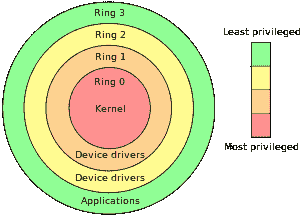

# UNIX 内核会产生比它们解决的更多的安全问题

> 原文：<https://thenewstack.io/unikernels-will-create-security-problems-solve/>

[Randy Bias](https://www.linkedin.com/in/randybias)

[Randy Bias 为 EMC 运营着一个战略性的 R & D 团队，专注于开发开源贡献。兰迪是云计算领域的企业家、作家、演说家和未来学家。他准确预测了 AWS 的几何增长率，是开源技术的倡导者，也是第一批确定从大型机到客户机/服务器再到云的 30 年转变的人之一。兰迪推广了宠物对牛迷因，作为描述企业堆栈和云堆栈管理方式之间根本区别的一种结构。Randy 是 OpenStack 项目的先驱和早期直言不讳的倡导者，他领导的团队实现了许多云第一，包括韩国的第一个公共云、第一个全球运营商 NFV 云和财富 5 强公司的第一个“牛云”。](https://www.linkedin.com/in/randybias)

uni nucles 是最近一种寻求解决问题的过度宣传的技术，它有许多声称的属性，使其成为“T8”更好的选择。一个最常见的说法是它们“比更安全”。这是一系列文章中的第一篇，这些文章揭示了 UNIX 内核的现实，这样你就可以正确地考虑它们，利用它们做好事，避免炒作。

这里有一句妙语:*对于单内核，您的应用程序运行在与内核(ring 0)* 相同的空间中。任何缓冲区溢出都可能意味着允许远程访问系统，这可能对每个人来说都是糟糕的一天。

首先，我要说的是，单核可能有一席之地。最有可能的是围绕构建嵌入式系统，这才是最初产生它们的真正原因。问题是人们希望单核成为他们不是的东西:更好的管理程序或更好的应用程序容器。单核“更好”的一个方面是其声称的安全优势。

安全性是一个复杂的话题。任何在这个领域工作了很长时间的人都会对此感到厌倦。没有在信息安全(INFOSEC)领域投入大量时间的人会感到困惑，因为他们一次只看一部分安全性，而在所有 IT 学科中，安全性最依赖于系统思维。

当谈到单核的安全性时，他们声称在一个方面更安全:代码更少，因此“攻击面”更小名义上这使系统更安全，因为有更少的软件攻击。实际上，单内核架构可能会降低系统的整体安全性。

## **了解攻击面**

[攻击面](http://whatis.techtarget.com/definition/attack-surface)是一个安全术语，指所有可能针对特定系统的“攻击媒介”或“攻击途径”的集合。例如，如果您有一个面向互联网的 web 服务器，并提供对 HTTP/HTTPS 的访问，那么它就是攻击面的一部分或系统中可被攻击的区域。同样，操作系统(OS)和加载到服务器上的任何软件都将被视为系统攻击面的一部分，因为如果攻击者获得了操作系统的访问权限，他们就可以攻击那里的所有软件，试图[提升权限](https://en.wikipedia.org/wiki/Privilege_escalation)或以其他方式进一步渗透系统。

在最极端的情况下，从攻击者的角度来看，系统的攻击面实际上可以被视为整个系统本身，这使得这个概念变得毫无用处。相反，大多数安全人员会围绕系统构建一个“威胁模型”，评估入口点(攻击媒介)、攻击者的类型、攻击者的复杂程度等等。这个威胁模型有效地映射了系统的有效和真实的攻击面。

这里需要理解的重要一点是，攻击面是对可能被攻击的对象和这些潜在攻击的结果的整体衡量，意味着系统可以被渗透多深。通过互联网访问 web 服务器的日志文件远不如[远程根攻击](https://lwn.net/Articles/91280/)严重，在远程根攻击中，可以完全访问单个服务器，该系统可用于引导攻击进一步进入系统。

换句话说，攻击面不仅要根据有多少攻击媒介来衡量，还要根据攻击的结果来衡量。换句话说，必须考虑攻击者在任何特定载体上能够达到的渗透水平。因此，有一个与渗透深度相结合的不断升级的矢量集。下面是一个简化的例子:

在您认为“相对表面积”数字下降的地方，我的观点是，虽然 web 服务器日志的泄漏是一个问题(这里是我的基线)，但像远程用户访问这样的事情是一个更大的问题(如果您正在执行威胁建模，可能是一个倍数)。在大多数情况下，完全管理权限是结束的开始。

这就把我们带到了房间里的巨大的大象:单内核实际上可能比传统的通用操作系统更不安全，因为任何利用都是 A)远程的和 B)管理的(最坏的最坏的)。

这样，unikernels 增加了攻击面**。**去掉软件，运行极简系统，没什么特别的。多年来，我们一直将此作为标准强化技术，它可以应用于虚拟机管理程序、容器，甚至裸机。

这是怎么发生的？请继续阅读。

**Unikernels 以管理员/Root 身份运行您的应用**

不幸的是，单内核的核心前提是将内核、操作系统和应用程序整合成一个整体。最好的方法是将它们看作是自定义内核，将您的应用程序集成为内核本身的一部分。创建了足够的内核来提供对特定应用程序所需的硬件组件(磁盘、网络、RAM、CPU)的访问。不提供其他用户区域或操作系统(OS)组件。所有这些都使得系统不太安全，即使攻击面更小。

很长一段时间以来，传统的操作系统使用[保护环](http://searchsecurity.techtarget.com/definition/buffer-overflow)，允许对系统的访问级别升级。环 0 是内核运行的地方。设备驱动程序在环 1 和环 2 中运行，应用程序或“用户区”在环 3 中运行。这些保护环防止一个应用程序读取另一个应用程序的内存。这也是阻止简单的远程访问利用(如缓冲区溢出)攻击 web 服务器访问内存的其他部分(web 服务器应用程序之外)的原因。

问题来了，攻击者必须在您的应用程序代码中找到一个“0 天”漏洞，才能完全访问您的基于单内核的系统。您的应用程序正在 ring 0 中运行，因此任何缓冲区溢出都可能导致对系统的远程访问以及在服务器上运行任意代码的能力，这再次为攻击者提供了对整个系统发起攻击的场所。

觉得这很难还是不可能？攻击者没有应用程序的代码？不知道从哪里下手？是的，她有。

攻击者非常老练，对应用程序代码的访问是无关紧要的。在 BlackHat/DefCon 的一次演示中，Michael Lynn 演示了针对 Cisco 路由器的完整远程利用。这是职业攻击者和研究人员的主流面包和黄油。

所以，现在你可以看到 unikernels 是如何增加你的系统的攻击面的，因为所有的东西都是以特权用户的身份运行的。您正在有意删除 Linux/Windows 中存在的所有相对复杂的安全机制，更不用说您可以从默认操作系统安装中添加的所有额外的安全措施，以提高安全性并使其难以以未被发现的方式提升权限。

当你这么做的时候，你被“单核更安全”的宣传欺骗了

## **Linux 很容易被精简**

想要以安全的方式减少应用程序的攻击面吗？以非特权用户的身份在容器中运行它。

容器内应该只有应用程序用来运行的静态链接库(libc 等。).以这种方式构建的容器有几百千字节到几十兆字节(即，和大多数单内核系统一样小)。当然，运行容器的主机有更多的软件，但是攻击者不能直接访问这些软件。攻击者必须穿透您的应用程序，然后攻击主机操作系统。此外，由于它是一个通用的 Linux 操作系统，许多安全机制(se Linux、Tripwire)可以在主机级别运行，以保持应用程序在容器中独立运行，并检测对正在运行的应用程序的未经授权的更改。

瞧啊。减少了攻击面，提供了单核假装提供的东西。

## **Linux 和 Windows 已经很好地理解了安全机制**

在重新创建通用操作系统拥有的大量内置安全机制之前，单核还有很长的路要走。这些操作系统固有地包括:

*   特权分离
*   保护环
*   受保护的内存空间
*   名称空间
*   细粒度的访问控制(例如 SELinux)
*   应用程序执行实施(例如 AppArmor)
*   网络过滤
*   审计能力
*   记录
*   而[更是如此](https://www.linux.com/learn/overview-linux-kernel-security-features)。

不仅如此，通用操作系统的安全性也很好理解。安全人员知道它们是如何失败的，知道如何对它们进行故障排除，知道如何强化它们，并且知道如何在默认操作系统的基础上添加额外的安全机制。

单内核没有这些，事实上，由于其架构，不清楚是否可以应用相同级别的安全性。因此，有人可能会合理地问，当该技术的其他好处已经在更成熟的计算模型中可用时，我们为什么还要花费稀缺的工程资源来修复单核安全问题。

## **安全问题和单内核不是一个安全的模型**

在您加入每月流行人群并开始爱上单核之前，请考虑一个关键的声明——它们更安全——似乎本质上是错误的，可能会误导您。单核可能不如正确配置的通用操作系统安全，当然也明显不如正确配置的基于 VM 或容器的方法安全。

接下来，我将讨论单核，以及它们的性能优势，然后思考一下单核到底有什么好处，以及为什么对企业来说这可能无关紧要。

通过 Pixabay 的特征图像。

<svg xmlns:xlink="http://www.w3.org/1999/xlink" viewBox="0 0 68 31" version="1.1"><title>Group</title> <desc>Created with Sketch.</desc></svg>