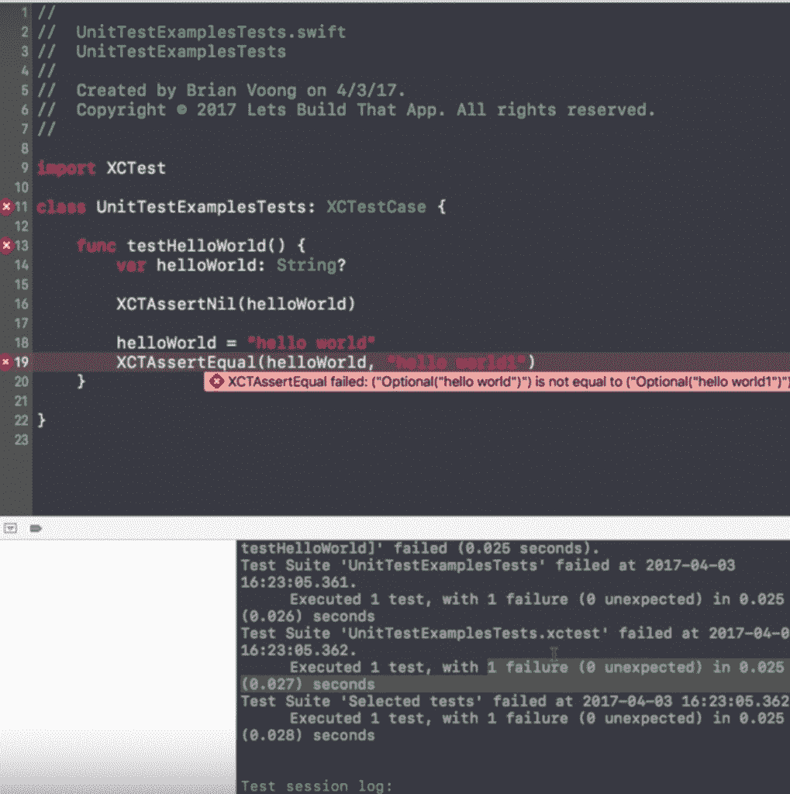
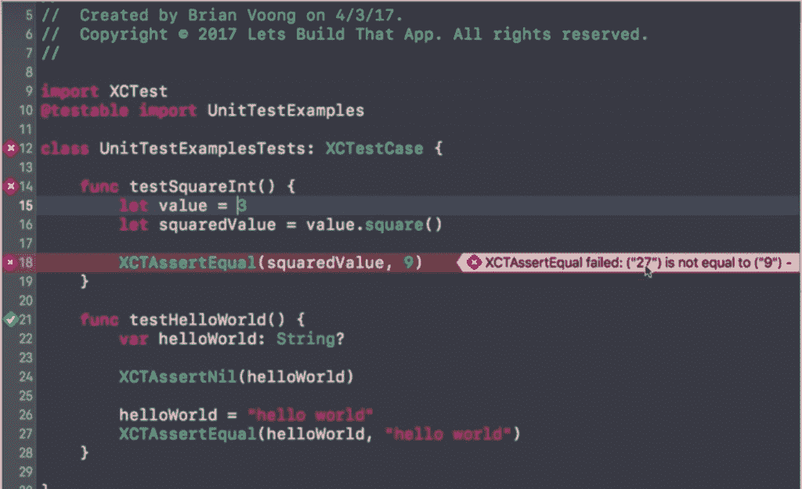
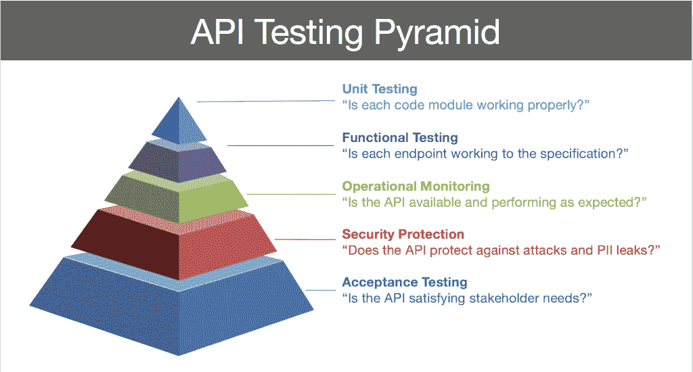

# 单元测试:耗时但节省产品

> 原文：<https://thenewstack.io/unit-testing-time-consuming-product-saving/>

“今天我终于认识到单元测试是我编程流程的一个重要部分”——阿什莉·威廉姆斯，[推特](https://twitter.com/ag_dubs/status/916413038944714752?ref_src=twsrc%5Etfw)。

Node.js 的长期支持者阿什莉·威廉姆斯[开始了她最近的 Twitter 帖子](https://twitter.com/ag_dubs/status/916413038944714752?ref_src=twsrc%5Etfw)，就像许多开发人员在面对真相时经历的那种意识流一样:单元测试令人讨厌，但却是必要的。

单元测试是开发软件应用的重要部分。也被称为**组件测试**，它是关于隔离一个代码单元来验证它是否正常工作。与许多类型的测试不同，这通常是由代码开发人员自己完成的。

单元测试不同于集成测试，因为集成测试，顾名思义，关注于这些单元、模块或组件之间的交互，因为单元测试关注于一个特定的部分。当集成测试在实际代码或生产中运行时，单元测试也模拟行为。

单元测试最好与集成测试结合使用，但是单元测试也有独特的好处。这包括更快的开发，因为通常在编写代码之前就要编写单元测试，然后根据所述测试来测试代码。而且它在单元级别上更早地捕捉错误，因此修复错误的成本大大降低。

另外，由于您必须使您的代码更加模块化来执行单元测试，您最终会看到可重用代码的增加。当然，最重要的是单元测试的代码更加可靠，通过单元测试，你可以从一开始就知道错误来自哪里。

正如[软件测试基础](http://softwaretestingfundamentals.com/unit-testing/)网站所说:“单元测试经常被忽视，但事实上，它是最重要的测试级别。”

## 单元测试的基础

单元测试的一个例子可以是一个特定的特性或模块，比如应用程序的登录。在这种情况下，您将测试该模块的典型用例，例如当登录正确时会发生什么，当密码或电子邮件不正确时会发生什么，以及当有人单击“登录”但实际上没有填写任何信息时会发生什么。单元测试在模拟错误方面特别有用。

[的 Brian Voong](https://www.letsbuildthatapp.com/course/instagram-firebase) 让我们建立应用程序在线开发课程也给出了 iOS Instagram 应用程序中时间戳的例子。如果有人打错了“mims”而不是“3 分钟前”呢？这不会破坏代码，但是这是一个非常尴尬的错误，你的常规自动化测试套件可能不会发现。但是单元测试会。

执行单元测试的一种方法是编写一个每次发布新代码时都会运行的测试。如果出了问题，测试失败了，你的开发人员会被通知哪一行代码被修改了，谁做了修改。这是从你的错误中学习的一个很好的方法，它使得确定谁应该修复错误变得容易，并且——与其他类型的测试相比特别方便——错误在哪里。

大多数 iOS 和 Android 的单元测试工具包都可以上传到你的应用程序中，甚至包括一个测试用例，你可以用它来建模你的测试用例，然后删除。

Voong 解释说:“要编写你的第一个测试用例，你必须声明一个新函数，并在它前面加上‘test’这个词。然后，您可以在它后面的括号中添加变量，并按照下面的截图创建您的测试。通常，成功的测试将显示绿色复选标记，失败的测试将显示红色警报。

在下面的例子中，Voong 正在用平方根函数对一个应用程序进行单元测试。

然后，为了确保您编写的单元测试实际工作，您可以按住 command 键单击期望值(在上面的示例中，在“square”上)，并将代码修改为不正确的。当您再次运行测试时，它应该用一个红色的 x 警告您一个错误。

最后，当编写单元测试时，像所有的测试自动化一样，不要忽略了版本控制。

## 单元测试真的那么重要吗？

> "没有单元测试的开发就像没有安全网的空中飞人."—马尔扬·韦内马

可悲的是，在双周冲刺和其他截止日期的匆忙中，单元测试经常被跳过——毕竟，结果通常是一无所获，对吗？但是通过预先跳过单元测试，你不仅冒着代码错误的风险，还冒着偏离业务目标的缺陷的风险。

当你第一次构建一个小的应用程序时，你可能只是执行手工回归测试，以确保你的代码没有回归到以前的版本。您可能在电子表格中有这些手动测试，并且正在运行它们，但是随着您的应用程序的进展，这个列表开始变得不可逾越。这甚至可能成为某个人的工作。

“更复杂的是，你意识到你的客户可能有不同的环境来运行你的应用。例如，他们可能有不同的操作系统或不同的设备，不同种类的移动电话，或者他们可能在不同的网络浏览器中运行它们。这影响了你的测试，”[趣味函数编程系列](https://medium.com/humans-create-software)的主持人[马蒂亚斯·约翰松](https://twitter.com/mpjme?lang=en)说。

“因此，这一百个回归测试的列表实际上是乘以您支持的操作系统的数量，然后乘以您支持的设备的数量，从而产生了这种……爆炸，”他继续说道。

它变得势不可挡。

Johansson 指出:“你很少会从软件中删除东西，至少与你向软件中添加东西的频率相比是如此。”。

这就是为什么您需要自动化您的回归测试，并且用单元保持您的代码简单。

此外，尽管单元测试很重要，但您不必为每件事都创建测试用例，而是可以关注那些影响系统行为的测试用例。

## 单元测试如何适应你的其他测试

有点像原子，单元测试是测试的最小形式，因此意味着它是在测试你的代码的核心。但是你也必须测试更大的部分，所以将单元测试和其他测试结合起来是很重要的。下面是 API 策略顾问 [James Higginbotham 的](https://twitter.com/launchany) [API 测试金字塔](http://launchany.com/api-training)。他认为单元测试很重要，但不是目的。

“单元测试主要关注于确保你的代码模块行为正常。对于测试 API，最重要的焦点应该是验收测试，它验证你的 API 解决了真正的问题和用例，”Higginbotham 告诉新的堆栈。

“然后，功能测试可以用于验证每个端点满足预期的行为，并遵守 API 为消费者定义的合同——“黑盒测试”。最后，通过隔离 API 实现的各个部分，单元测试可以用来防止错误的内部回归——也就是‘白盒测试’，”他继续说道。

[Johansson 同意](https://www.youtube.com/watch?v=vqAaMVoKz1c)单元测试并不完美，他发现了以下两个问题:

### 单元测试的缺点#1:他们不测试合同。

通过契约，他指的是该单元应该如何表现以及与其他单元的关系。单元测试将测试组件 A 将调用某段数据。另一个单元测试将检查组件 B 是否会返回该数据。但并不一起测试交互。他还说，如果你在测试中犯了一个错误，测试不会捕捉到这些错误。要完成这一切，集成测试是必要的。

### 单元测试的缺点 2:你必须写合同。

仅仅为了测试代码而编写样板代码是很烦人的。他说，为了编写单元测试，交互之间必须有明确的分离。另一方面，集成测试并不关心你的部分是否足够“模块化”

单元测试的一个主要好处是区分单元测试的优先级。它自然会帮助你暴露意大利面条式的代码，并迫使你从那时起写更干净、更模块化的代码。

但是可能大多数开发人员最喜欢的是单元测试实际上让你知道你的错误在哪里，而集成只是通过或失败。这也是一种更快的测试方式，因为集成测试让你运行一个真实的数据库——Johansson 说单元测试可以快几百倍。他说，由于集成涵盖了许多活动的部分，这可能会使它们变得“脆弱”,编写起来明显更加困难。

这并不意味着所有的团队都在、能够或者应该执行单元测试，因为单元测试的一个缺点是显而易见的:时间。它们需要时间，特别是在没有进行单元测试的代码库中。

## 野外单元测试

拥有超过 30 年经验的开发人员和[有抱负的敏捷教练](http://marjanvenema.com/) [Marjan Venema](https://twitter.com/cabriodriver) 向 New Stack 讲述了她在单元测试方面的经验。

“单元测试是一个预警系统。她说:“如果你的代码很复杂，你可以在这里修改一些东西，但这会导致应用程序的另一个领域出现问题，如果你不专注于此，你就看不到它。”

在 Venema 正在开发的一个应用上，一个单元测试发现了一个只在边缘情况下才会出现的 bug。

“单元测试导致我们没有将某些东西放入产品中，并且出现了我们可能连续几个月都没有注意到的故障。如果我们没有那些单元测试，我们将会错过那些特定的场景，因为它们并不常见，但是它们是真实的，因为客户有符合那些场景的数据。我们会推出一些会给我们的客户带来不正确结果的东西，”她说。

### 首先编写单元测试

许多单元测试爱好者认为测试必须在代码之前编写。

“如果你没有使用测试驱动的方法，单元测试的缺点是它们通常遵循编码，而不是预先被改变和纠正，这总是导致‘哦，天哪，我们仍然需要修复单元测试！’，”维尼玛说。

测试驱动开发或 TDD 关注于非常短的软件开发周期，其中需求仅被转化为非常具体的用例，并且完成的定义仅是通过那些新的使用测试。Venema 说这是单元测试带来的挫折的一部分:

“当你正在做一个预期的改变，而你没有开始改变单元测试——这是工作方式应该的——那么单元测试将会开始失败，当人们使用单元测试，并把单元测试作为事后的想法，或者把单元测试作为‘完成’的定义，而他们还没有开始做它，修复单元测试是一件苦差事时，这将导致很多挫折。”

这就是为什么她和许多人认为编写单元测试的最佳方式是在开始时，在你开始编写代码之前。

“如果您正在更改功能，并且已经有测试，您需要首先更改测试，然后更改代码，这样它才能正常工作，这样测试就能帮助您。如果你反过来，他们会觉得自己是个负担，”她说。

她说，首先考虑测试会让你更详细地了解功能应该做什么，并确保你清楚需求——甚至可能与产品所有者澄清它们。由于单元测试在检查错误报告方面非常出色，它确保了您讨论了什么时候出错以及错误实例看起来如何。

尽管编写测试需要更多的时间，Venema 认为“通过预先明确需求，可以加速开发。”

她说当你因为一个 bug 而改变一个特性时，这个 bug 存在是因为它不在单元测试中。

“你改变现有的测试来预测正确的结果，当然当你这样做时，当前的单元测试将会失败，因为代码库还没有改变。当你第一次接近你的测试时，单元测试失败了，所以你知道测试是正确的，然后当你改变代码时，测试变绿了，你知道你是好的。

她将单元测试比作一个总是用网表演的成功的空中飞人。

“单元测试通常被视为一种负担，因为它们从未抓住任何东西，但如果你没有单元测试，并且从秋千上滑下，你就只是地板上的一堆垃圾，但如果你有网，你可以跳回去。”Venema 继续称单元测试为早期预警系统:“有了单元测试，当有人报告一个错误时，你可以知道错误的原因和位置。”

但是有时几乎不可能涵盖所有的测试。

### 当你不得不写单元测试的时候

作为红眼公司的软件服务经理， [Adam Davis](https://twitter.com/webmull) 负责管理开发团队，他们编写大量的单元测试，甚至数百个，还有数千个功能测试。

“我们告诉开发人员，当他们开始工作时，他们需要考虑为这些功能编写测试，”他告诉新堆栈。

Davis 说，理想情况下，他们在编写代码之前编写测试，但这通常是不现实的。

能够在特性之前编写测试一直是我的梦想。这是我们努力要做的，但并不实际。”

他说，这是因为通常存在对另一个团队的依赖，比如需要时间才能访问的数据库。为了不耽误开发，团队想出了一个变通办法。取而代之的是，他们针对每个特性召开会议，提前计划测试自动化。这个会议总是包括一个测试人员和一些其他的开发人员。这延迟了测试的编写，但是为了让一个卡完成，必须包含一个单元或者特性测试。

他们有一个沉重的以 UI 为中心的应用程序，所以他们使用单元测试来确保基本的 UX 过程——这个按钮还能用吗？你能关上窗户吗？你还能做到吗？用那个？—正在工作，为此他们使用更多的功能测试，同时使用单元测试来测试更多的后端和数据库连接。

戴维斯说，他们致力于使所有代码“非常原子化，非常小的东西，我们可以测试。”

但并不总是这样。对于这个有 20 年历史的企业来说，他们甚至没有开始运行测试。戴维斯说，他们的年龄“留下了一个很大的洞，测试赤字明智。”

在某一点上，他们只需要停止新功能的开发，花六个月的时间编写测试，所以他们知道单元测试的潜在成本。

当被问及是否值得时，戴维斯说，“肯定值得。在我们上路之前，它已经抓到了很多严重的问题，并造成了很大的损害。知道和不知道是有区别的。我们的软件版本更加稳定，没有重大问题。”

他说，单元测试和功能测试也提高了 QA 的作用，为他们提供了更多的创作自由。红眼 QA 过去必须按照脚本手动执行所有测试。现在，他们可以专注于更具探索性的测试。

不仅开发中的这种中断需要很长时间，Davis 承认他们所谓的“覆盖测试”通常需要很长时间并且非常复杂，这就是为什么他们在部署时和每天晚上运行自动化测试——大约一千个功能测试和几百个后端单元测试。他们通宵运行他们所谓的“覆盖率”，尽管开发人员仍然可以按需运行较小的需求。

红眼最近对他们的测试框架进行了从 [Selenium](https://github.com/SeleniumHQ/selenium/wiki/ChromeDriver) 到 [ChromeDriver](https://sites.google.com/a/chromium.org/chromedriver/) 的过渡，自动化了他们所有的功能测试。改变又花了很长时间，但他们不后悔移动他们的网络驱动程序来告诉 Chrome 该做什么。

“基本上，当你运行一个测试时，你不希望他们在本地或环境中运行时有任何变化。ChromeDriver 在服务器上做着同样的事情。戴维斯说:“测试环境和用户行为之间不应该有任何差异。

## 单元测试也与文化有关。

像所有的变化一样，你必须发展一种单元测试的文化，因为这必须是你的团队发展的一种习惯。通过养成这个习惯，你不仅可以保证你的代码质量，而且“单元测试[增加了改变/维护代码的信心](http://softwaretestingfundamentals.com/unit-testing/)”

Johansson 提供了三条规则,你必须建立这些规则——并作为一个团队达成一致——来养成单元测试的习惯。

### 规则 1:单元测试是完成定义的一部分。

就像在 Redeye 一样，Johansson 说:“决定提交必须经过单元测试…如果一个提交没有单元测试，它就不会进入存储库。”

这在项目开始时很难推销，因为代码很容易测试。但是会变得更复杂。复杂得多。也就是他说你能做成这笔交易的时候。

当然，这将符合规则#3，因为你必须解开你的代码才能做到这一点。但是，提前了解这条规则将会创建更干净、更可隔离的代码，并且可以养成单元测试的习惯。

### 规则#2:用强制性代码评审来指导(这将指导团队进行单元测试)

单元测试通常由代码的作者来执行，但是也可以由你的同事来执行。

正如 LinkedIn 技术负责人 Szczepan Faber 所定义的那样，正式的代码审查过程“要求在代码投入生产之前，每一个代码变更都要经过另一个团队成员的正式审查。”

LinkedIn 将代码评审用于质量和职业发展。这导致了大量的标准化和更开放的公司反馈文化。

Johansson 说你应该将同行代码评审作为单元测试过程的一部分。这也提高了单元测试的质量，并捕获了更多的边缘案例。

对于团队中的新开发人员来说，单元测试也是了解代码和应用程序整体用户体验的非常有趣的方式。通读单元测试是查看后端的一个很好的方式，没有比使用应用程序获得 UX 更好的方式了。

### 规则 3:将你的代码分解成单元

当然，如果你想让你的代码更简单，你必须解开它的网。然后当你写单元测试时，结果是更简单的代码。

单元测试的最后一个好处是什么？您可以从测试自己的代码中学到很多东西。

<svg xmlns:xlink="http://www.w3.org/1999/xlink" viewBox="0 0 68 31" version="1.1"><title>Group</title> <desc>Created with Sketch.</desc></svg>