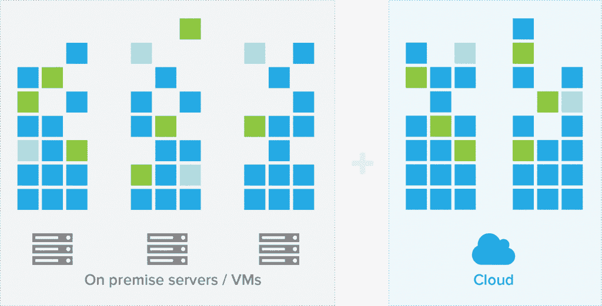

# Univa 为 Kubernetes 带来超级计算机调度

> 原文：<https://thenewstack.io/univa-augments-kubernetes-supercomputer-scheduling-technology/>

随着[集装箱调度](https://thenewstack.io/container-orchestration-scheduling-herding-computational-cattle/)市场的升温，来自高性能计算(HPC)市场的工作负载管理专家 [Univa](http://www.univa.com/) 也加入了这个行列。

本月早些时候，该公司在得克萨斯州奥斯丁的 OSCON 会议上展示了 [Navops Command](http://www.navops.io/command.html) ，这是一个面向 Kubernetes 的可插拔、自动化工作负载放置和策略管理解决方案

Navops 副总裁兼总经理 Robert Lalonde 表示:“Navops Command 的一大优势在于其丰富的策略管理，这使得 Kubernetes 管理员能够更好地控制何时何地运行什么。NavOps Command 提供了 Kubernetes 增强功能访问控制、公平共享资源布局、工作负载优先排序、抢占和各种布局策略，可实现企业级调度。

Univa 去年推出了它的 Navops 容器管理套件，该套件基于最初由 Sun Microsystems 开发、后来从 Oracle 收购的[网格引擎](http://gridscheduler.sourceforge.net/)集群工作负载调度技术。该公司意识到，随着人们开始构建微服务，围绕在 HPC 中供应和管理工作负载的网格引擎核心技术将与容器世界相关。该技术可以跨内部、混合和云基础架构扩展计算资源。

该公司还通过其 Univa Grid 引擎容器版支持 Docker。其 [Navops 发布](http://blogs.univa.com/2015/11/navops-eases-deployment-time-and-provides-advanced-orchestration/)为 Docker 容器提供了一个带有企业级管理控制的快速启动包。

Navops Command 使公司能够使用任何基于 Kubernetes 的系统，如 RedHat 的 OpenShift 和 CoreOS 的 structural。在一篇博客文章中，CoreOS 的洪超·邓最近讨论了其为改进 Kubernetes 调度程序所做的努力。

Lalonde 解释说，Kubernetes 支持多个调度程序，让客户可以选择使用最适合他们的程序。Kubernetes 调度程序被关闭，取而代之的是 Navops 命令。它与 Hashicorp 的 [Nomad](https://www.infoq.com/articles/scaling-containers-hashicorp-nomad) 和谷歌的 [Omega、](https://research.google.com/pubs/pub41684.html)等专门为容器设计的产品竞争，与 IBM 的[平台 LSF](http://www.nextplatform.com/2015/03/23/hpc-schedulers-snap-to-docker/) 调度器和 Adaptive Computing 的 [Moab、](http://www.adaptivecomputing.com/)等已经适应容器的高性能计算解决方案竞争。

“我们的客户中有数百万枚内核。有些人经营着数百万份工作；有些人跑了几千英里，”拉隆德说。“每个客户都想用不同的方式来做这件事。对于如何管理工作负载、如何放置和跟踪工作负载、如何向使用集群的客户和内部客户收取费用，他们有不同的规则。

## 精炼库伯内特斯

Navops Command 的功能包括高级调度算法、用于管理 SLA 的复杂策略，以及在资源变得稀缺时确定优先级的能力。

“微服务应用分解成许多许多容器，可能有 50 或 1，000 个容器。这些容器中的每一个都可能有多个实例，”Lalonde 说。“您可能正在启动购物车容器，而不是税务模块。你的网站上会有很多东西在运行，对它们的管理变得非常复杂。

“你需要确保事情以一定的比率运行；你需要确保某些事情在一天中的特定时间运行。随着太阳在地球上移动，工作负载来自不同的国家，这意味着使用不同的用户界面，可能使用不同的语言，某些税务模块在一天的特定时间处于活动状态。这就是高级策略管理允许您设置何时运行什么的规则的地方。”

Univa 是 KubeCon 2015 大会上关于调度器的[对话的一部分。它是](https://thenewstack.io/tns-analysts-talking-openshift-schedulers-kubecon-2015/)[云本地计算基金会](https://cncf.io/)的创始成员，该基金会旨在协调云应用和运营的新兴技术。

[naops 发布包括](http://www.nextplatform.com/2015/12/04/bridging-the-gap-between-grid-and-containers/)该公司 [UniCloud](http://www.univa.com/resources/webinar-unicloud.php) 供应工具的子集、Puppet 系统配置工具、Docker 容器、Kubernetes 容器和 pod 管理以及 Red Hat 发布的 Atomic Host Linux 的极简 Fedora 开发版本。

拉隆德说，它的网格引擎客户包括松下、联合航空和西门子，尽管现在确定 Navops 的客户还为时过早。

然而，它吹捧三星 SDS America Cloud Native Computing 团队[的研究，将 Navops Launch](http://blogs.univa.com/2016/02/navops-launch-shines-in-3rd-party-test/) 比作手动提供裸机 Kubernetes 集群。该测试发现，大型集群的安装和启动速度提高了五倍以上，所需步骤减少了三分之二。

CoreOS、Docker、IBM 和 Red Hat OpenShift 是新堆栈的赞助商。

特征图片:[规则](https://www.flickr.com/photos/mwichary/3422978136/in/photolist-fQSAU-CABeQ-zm3xR-6dtE9q-gyXm3-bLWAx-7LTqNd-buT673-iWS7my-buT7Sh-bHMWoT-35JfEH-6Zx686-8Nox8i-fxXTUB-2vWz8-qFtHK-qteyRf-3s1tpD-pFHvtu-bF4pDv-7vcxAT-aeCi23-6pFNS-bs9tj9-6EHb5M-5ePWsW-8eZJh7-djYwjW-ct1ft7-5zXRhW-adhSUZ-djYw6G-5A83qY-87xoEi-pVnZ3j-62RwYE-vWaqAG-oGK5Cy-djYwdy-dmVwLS-5hP5gq-djYwxW-6iaNRE-8aFvg5-7U1CA5-5aCuLU-8J6EM5-8KTceY-c5S54m)作者 [Marcin Wichary](https://www.flickr.com/photos/mwichary/) ，授权于**CC BY-SA 2.0**。

<svg xmlns:xlink="http://www.w3.org/1999/xlink" viewBox="0 0 68 31" version="1.1"><title>Group</title> <desc>Created with Sketch.</desc></svg>