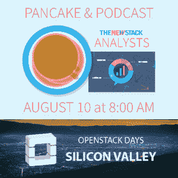

# Univa、Sysdig 为集装箱生态系统带来先进管理

> 原文：<https://thenewstack.io/univa-sysdig-bring-advanced-management-to-container-ecosystems/>

随着企业越来越多地采用容器，Kubernetes 等平台带来了新的方式，开发人员可以通过这些方式管理、调度和扩展他们基于容器的工作负载。

在这一集的[中，新的堆栈制造商](https://thenewstack.io/podcasts/)嵌入在下面，我们来看看 [Univa](http://www.univa.com/) 基于 Kubernetes 的容器工作负载管理产品 [NavOps Command](https://thenewstack.io/univa-augments-kubernetes-supercomputer-scheduling-technology/) ，以及监控工具提供商 [Sysdig](https://sysdig.com/) 如何让 Kubernetes 和容器变得可见。主持人 [Lee Calcote](https://twitter.com/lcalcote) 采访了[Univa 副总裁兼总经理 Rob la londe](https://www.linkedin.com/in/roblalonde)； [Cameron Brunner](https://www.linkedin.com/in/cameron-brunner-58608b2) ，Univa 工程总监；Sysdig 创始人洛里斯·德吉奥安尼在 2016 年 OSCON 上的演讲。

[为什么库伯内特和容器是规模化发展的未来](https://thenewstack.simplecast.com/episodes/why-kubernetes-and-containers-are-the-future-of-development-at-scale)

管理大规模的容器对刚刚开始使用这项技术的企业来说是一个挑战，这是 Univa 旨在通过其 [NavOps Command](http://www.univa.com/products/navops.php) 产品来改善的。

“NavOps Command 是一套围绕管理容器工作负载和集群供应的产品。它基于 Kubernetes，非常容易在云中构建集群。它还具有策略管理功能，因此您可以根据需要灵活地扩展您的集群。NavOps Command 还利用了 Univa 的一些网格引擎产品功能，Lalonde 继续解释了这些功能，重点是 Kubernetes 的高级策略管理。

由于其功能的全面性，Univa 选择 Kubernetes 作为其平台选择。Brunner 解释说，Univa 希望 NavOps 不仅适用于那些使用云原生应用程序的人，也适用于那些使用传统软件的企业。

Degioanni 很快陈述了使用容器的优势，“容器的隔离和容器的简单性是很大的优势，也是容器化应用程序概念的卖点。它们还使得在不破坏容器模型的情况下提取容器中运行的网络和系统级矩阵变得非常困难。”

Degioanni 不仅总结了为什么开发人员热衷于 Kubernetes 和容器化，而且还总结了为什么企业也应该这样做:“我真的感觉开源社区作为一个整体正在拥抱和关注这一点。它会是什么样子。这涉及到容器，涉及到编写软件、微服务的新方法，还涉及到编排。感觉是讨论的主要话题。就在两三年前，它还是大数据、移动或云，而现在是这个。对我来说，毫无疑问，这就是人们要去的地方。”

[https://www.youtube.com/embed/JxyKXm01aRo?feature=oembed](https://www.youtube.com/embed/JxyKXm01aRo?feature=oembed)

视频

Capital One 和 Sysdig(T4)是新堆栈的赞助商。

专题图片:(从左至右):卡梅隆·布鲁纳，罗布·拉隆德，洛里斯·德吉奥安尼，李·卡尔科特。

<svg xmlns:xlink="http://www.w3.org/1999/xlink" viewBox="0 0 68 31" version="1.1"><title>Group</title> <desc>Created with Sketch.</desc></svg>