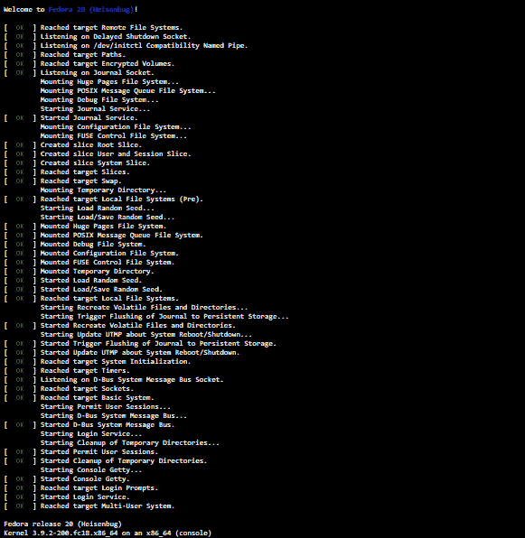

# 伦纳特吟诵着 systemd 的混乱优势

> 原文：<https://thenewstack.io/unix-greatest-inspiration-behind-systemd/>

注意:这个故事的早期版本断言 Linus Torvalds 是 systemd 的“热情支持者”。

Lennart poet ering 是为数不多的极其多产和杰出的工程师之一，他们真正改变了基于 Linux 的操作系统的设计。在这次采访中，我们讨论了他与 Linux 社区的第一次互动，为什么 Canonical 的[新贵](http://upstart.ubuntu.com/)初始化守护进程未能获得牵引力，以及为什么 Poettering 创建了他自己的初始化软件 [systemd](https://www.freedesktop.org/wiki/Software/systemd/) 。他还谈到了他觉得 Docker 容器有什么问题，等等。

## PulseAudio 和 Avahi

Poettering 与软件有很长一段时间的联系，甚至在他上大学之前。他做的第一个项目是 [Avahi](http://avahi.org/) ，它是苹果 [Bonjour](https://support.apple.com/bonjour) 网络服务发现框架的重新实现。然后他写了关于那个项目的大学论文。

“实际上，我写的是 OLPC ( [每个孩子一台笔记本电脑](http://one.laptop.org/))和 OLPC 收集的网状网络中的服务发现。这只是我的论文；我在那里的提议从未实现，因为我为什么要这么做。我已经不得不写了，”Poettering 说。

> "如果你想要完全的特权，为什么要使用容器，这对我来说毫无意义."—伦纳德·诗化

在某种程度上，Poettering 编写 Avahi 来支持他编写的 Unix 声音服务器， [PulseAudio](https://www.freedesktop.org/wiki/Software/PulseAudio/) ，于 2004 年首次发布。

“我写 Avahi 的原因之一是我想用 PulseAudio 实现网络音频，我觉得如果我能自动发现网络上的其他声音服务，这将非常有用。这就是为什么我在寻找服务发现，并发现 Bonjour，但我真的不喜欢的来源。我想好吧，我会在周末写这个。这比一个周末要长得多。然后我做了 PulseAudio，工作量很大。这是我在 Linux 社区第一次接触 pushing thing。”

## 在红帽工作

Poettering 在 PulseAudio 上的工作也让他在红帽公司(Red Hat)找到了一份工作，他目前在那里工作。他回忆说，当 Pulse Audio 发布的时候，Linux 世界中很少有人从事音频方面的工作，主要是因为音频不是 Linux 供应商可以从中赚钱的市场。Poettering 的工作很好，足以得到红帽的注意，他受雇从事音频工作。“Red Hat 实际上想让我做 PulseAudio，这很舒服，因为我是当时 Red Hat 唯一做音频的人，现在 Red Hat 也只有一个人做这个。我有很多自由，”他说。

## 新贵的结束和系统的开始 d

【T2

正是 PulseAudio 和 Poettering 对服务管理的兴趣导致了 systemd 的概念化。“由于 PulseAudio 是一项服务，我一直在思考服务管理。我甚至开始和红帽公司的一位同事讨论这件事。”虽然多产，但 poeting 开始编写一个名为 babykit 的项目。

大约在那个时候，来自 Canonical 的 Scott Remnant 组织了 Upstart，Poettering 说这似乎是 Linux 服务管理的未来。虽然许多人认为 systemd 是 Red Hat 对 Upstart 的回应，但一些人指责 Red Hat 破坏了它。“从来都不是这样,”Poettering 说。

事实上，Red Hat 在其企业产品中采用了 Upstart。但是随着 Upstart 的成熟，Poettering 看到了这个项目的一些基本问题。他说，这些反对意见从来都不是政治性的，总是技术性的。“Upstart 很棒，但我认为最终它实际上没有取得任何进展，它移动得非常慢，”Poettering 说，“尽管代码非常好，但我们最终发现它背后的概念和逻辑并不真正令人信服。我们甚至不能处理启动过程中许多最基本的部分。例如文件系统检查，它无法正确安排。它将所有这些都分派给了一个名为 [Mountall](http://manpages.ubuntu.com/manpages/xenial/man8/mountall.8.html) 的外部项目。

就在那时，poeting 认定 Upstart 并不是他在服务管理方面的计划。他觉得 Upstart 背后的整个概念都被打破了，所以没有什么可以挽救的了，需要一个新的项目。那时他创造了 systemd。

与人们的想法相反，Poettering 在 Red Hat 的经理们不喜欢他的提议。“我认为这在一定程度上是政治性的，因为 Upstart 是 Canonical 唯一积极维护的东西，它是通用堆栈的一部分。当时的红帽管理层很喜欢它。他们想让 Canonical 参与进来。有了 systemd，我们就结束了，因为在 systemd 被 Debian 采用之后，Upstart 的故事就结束了。Canonical 失去了兴趣，用户也失去了兴趣。”

## 为企业解决问题？

那么 systemd 为企业客户解决了什么问题呢？“systemd 目前解决的问题确实是核心问题:服务管理。无论您使用的是企业系统还是嵌入式系统或桌面系统，监控计算机确实需要同时运行许多部分、许多程序。我们倾向于称较低级别的组件为服务，它们只是为其他程序提供功能，然后是更高级别的程序，”他说。

> “我怀疑很多人在他们不应该使用的地方使用容器”——Lennart poeting。

“使用 systemd，我们将重点放在较低级别的应用程序上，并对其进行管理，这意味着在启动时将它们带出来，并确保它们保持运行。确保如果有人需要它们，它们会自动启动。确保它们在插入特定硬件时自动启动。确保它们对某些系统数据更改做出反应，并且管理员可以与它们交互。这是 systemd 的核心业务:服务管理。”

实际上这是一项复杂的任务。在启动时，系统必须处理大约的依赖关系，以确保它们以正确的顺序调度服务。这实际上会变得非常复杂。“在 systemd 中，我们有这种依赖树和循环依赖检查，以确保我们在那里执行的东西实际上是有意义的，并且开发人员可以在启动时以正确的顺序安排事情，systemd 实际上可以处理它，”他说。

现在 poeting 正致力于将服务管理引入下一代操作系统。

## 系统 d 和容器

诗歌批评了人们不严格地使用术语和技术容器管理的方式。“很多人我会说是误用，其他人可能会说是使用，他们实际上在寻找服务管理的容器管理。容器和服务管理之间的界限很窄，但我总是把它分开，”他说。

Poettering 解释说，容器试图为程序创建一个非常孤立的环境，而传统意义上的服务是直接在主机上运行的集成，可以看到主机运行时对象。

根据他的说法，容器最重要的特性之一是 app 打包和交付。“它们基本上就是我所说的 RPM 2.0[指的是 [RPM 包管理器](http://rpm.org/) ]。一种人们可以打包东西并在系统上交付的方式。看到这里，我怀疑很多人在他们不应该使用的地方使用容器。他们对图像传递部分感兴趣，但对隔离部分不太感兴趣。或者他们实际上对沙盒功能感兴趣，但仍然没有完全隔离。”

Poettering 对所谓的超级特权容器的概念非常不满，超级特权容器基本上是在完全系统特权下运行并看到整个操作系统的容器。“对我来说，这是一个很大的矛盾，如果你想要完全的特权，你为什么要使用容器，这对我没有意义。如果你这样做了，你就不是在说集装箱了。如果你这样做，那么你真的关心图像的运输。”

> “关于 Unix，人们经常引用的一个最广为人知的概念是，一切都是文件。我个人认为那完全是扯淡的事情。”—伦纳德·诗化

像往常一样，诗人在研究自己的解决方案，而不是抱怨这个问题。他正致力于将服务管理提升到一个新的水平。他想让它变得简单，这样用户就可以用沙箱保护系统服务，而不必将他们与主机完全隔离。不需要假装一个系统服务是一组完全独立于主机的进程，容器就是这样做的。系统服务仍然可以是主机的一部分，仍然可以看到它，但不一定能访问它。

超级特权容器背后的概念实际上是关于能够使用 etc 内核目录、本地文件系统和本地设备。“通过我们目前在 systemd 开发的沙盒，你基本上可以单独选择加入或退出这些不同的组件。因为最终服务仍然在主机上运行，只是它运行在一个稍微受限的环境中。同样，不是完全与主机隔离，也不在它自己的名称空间集中，但仍然是相同的名称空间，只是权限更严格。容器和这种沙盒服务之间的区别实际上是集成和隔离，而不是沙盒，如果你明白我的意思的话。”

## Systemd 和 Unix 哲学

Systemd 实际上是所有三个企业 Linux 玩家的操作系统上的初始化系统:Red Hat、SUSE 和 Canonical。领先的内核开发者 Greg Kroah-Hartman 对 systemd 大加赞赏。“Systemd 做了很多正确的事情，”Linux 创造者 Linus Torvalds [说](https://youtu.be/5PmHRSeA2c8?t=19m3s)。但是其他人对 systemd 颇有微词，批评该软件的设计没有坚持 Unix 的理念，即“一切”都是一个文件。

“大多数深深热爱 Unix 方案的人:他们实际上知道 Unix 到底是什么，”他说。“对 systemd 的我们来说，Unix 是一个奇妙的灵感。毫无疑问，Systemd 在很大程度上是一个 Unix 项目。然而，它永远不应该被视为一种完美设计的学说。”

尽管如此，他批评了所有东西都应该是操作系统的文件的观点:“人们经常引用的关于 Unix 的最著名的概念之一是，所有东西都是文件。我个人认为那完全是扯淡的事情。那是因为一切都不是文件。我的打印机不是一个文件，如果 Unix 假装我的打印机是一个文件，那完全是一派胡言，因为文件是完全不同的东西。”

他说，大多数程序员最终都会学习面向对象编程，希望是在大学或其他学校。他们会发现，面向对象编程最抽象的概念，即它如何看待世界，通常是对象。在 Unix 上是文件。“我很确定把文件作为最基本的概念是完全没有意义的，因为文件太具体了；它与打印机和声卡有很大的不同。我对‘一切都是一个文件’的概念很有意见，我认为这是错误的设计。”

“Unix 基本上是 20 世纪 70 年代(之前)的设计。我认为今天的计算机工作方式与那时大不相同。他说:“那些仍然认为计算机的工作方式与 20 世纪 70 年代完全相同的人，可能没有太多与计算机打交道的经验，也不知道它们发生了多大的变化。”。

然后，他指出了围绕 Unix 的另一个误解，即像 systemd 这样的大型代码库必须分布在多个目录中。“人们经常抱怨 systemd 有一个大型存储库，其中许多组件都位于一个源代码存储库中。他们认为这不是 Unix，这实际上是最大的垃圾。因为如果你看看[BSD](http://www.bsd.org/)，它们与 Linux 不同，实际上是真正的 Unixes，它们都在一个单一的源代码库中维护了几乎整个内核和用户空间。与人们的想法相反，在 Unix 中，所有东西最终都被维护在一个存储库中，就像 systemd 一样。”

Linux 实际上是相反的，因为这里每个人都有自己的迷你项目的迷你库。Poettering 说 Unix 模型在这方面更好，事实上，他们试图用 systemd 向 Unix 倒退一步。

“如果你问我 systemd 是不是 Unix，我会说是的，在某些方面，它比以前的 Linux 更像 Unix。在某些方面，它更少 Unix，我认为以宗教的方式问这个问题是完全错误的。这和狂热于任何其他宗教一样是错误的。”

他说他真正认为 Unix 是 systemd 最大的灵感，但不是唯一的灵感。“对于 systemd，我们真的很努力地研究其他操作系统，虽然我们主要关注类似 Unix 的操作系统，但我们也花了很多时间研究 Windows，从中找到一些有趣的想法。”

<svg xmlns:xlink="http://www.w3.org/1999/xlink" viewBox="0 0 68 31" version="1.1"><title>Group</title> <desc>Created with Sketch.</desc></svg>