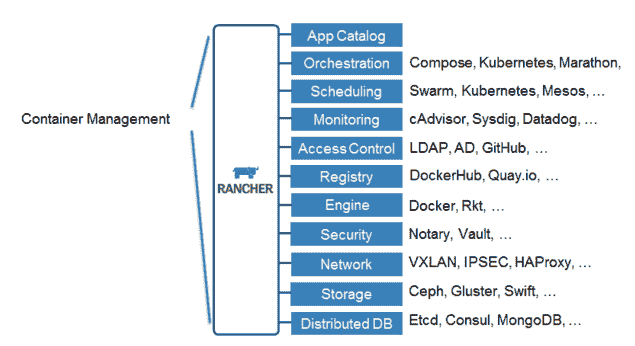
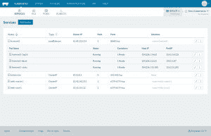
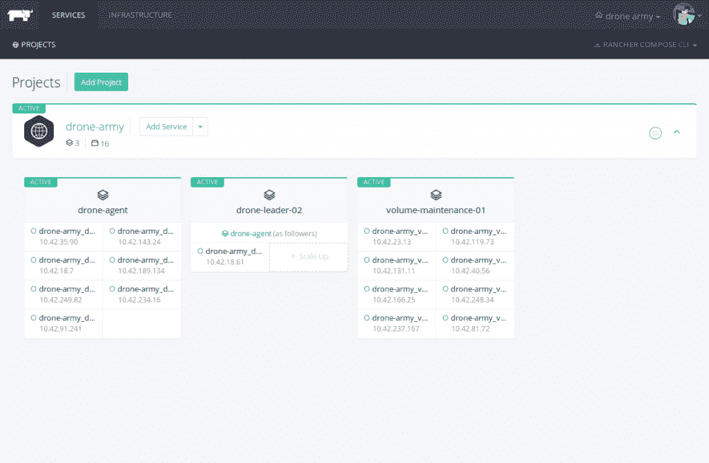

# 释放牛群:牧场主容器编排平台现已全面上市

> 原文：<https://thenewstack.io/unleash-cattle-rancher-container-platform-reaches-general-availability/>

在企业要求的一致性水平上运行容器化的应用程序，同时仍然能够灵活地改变或改变自己的容器管理策略，这是许多开发人员的愿望。牧场主实验室(Rancher Labs)在这项任务中提供了一些帮助，该实验室周二发布了与其同名的容器平台 1.0，这是一个在过去 18 个月中工作的项目。

## 卑微的出身

Rancher Labs 的联合创始人香农·威廉姆斯(Shannon Williams)和盛亮(Sheng Liang)在 Citrix 为企业开发云之后，创立了这家公司。“这是预备码头。我们在利用 LXC。Docker 过来了，我们说，‘这太棒了。’因此，我们建造了牧场主，”威廉姆斯说。

牧场主实验室:容器管理架构

Rancher 最初是一个用于构建、管理和部署容器的开源平台，于 2015 年 11 月进入早期 alpha 阶段。Williams 指出，该项目的总体反馈是积极的，因为许多开发人员没有像 Rancher 那样考虑使用容器。

对于去年的 DockerCon，Rancher 进入了公共测试，并受到了热情的社区采用。大约 200 名用户测试了最初的私有 alpha 版本，超过 2500 名用户采用了该平台的 beta 版本。威廉姆斯指出，该软件被下载了 60 多万次。

“有了 Rancher 和 Docker，我们将能够利用容器的力量来改善开发、研究和教学的工作流程，”早期用户、奥克兰大学 IT 战略和设计负责人 Steve Shipway 说。

Rancher 可以在任何平台和基础设施上运行，包括裸机、AWS 或 Kubernetes。

从高层次上来说，管理服务或容器舰队的安全性、网络和目录对于任何开发团队来说都是令人畏惧的。Rancher 为其用户提供了交钥匙体验，允许他们管理基于容器的基础设施，而不必花费宝贵的资源来手动连接、更新和保护其设置的每个方面。

## 释放…牛？

Rancher 为其用户提供了选择自己的平台来部署其容器的能力，无论是 [Kubernetes](http://kubernetes.io/) 、 [Docker Swarm](https://docs.docker.com/swarm/) ，还是 Rancher 自己的牛群设置。Rancher 用户可以使用应用级服务、负载平衡、DNS 信息等等。

牧场主实验室 Kubernetes 服务仪表板

Williams 指出，Rancher 提供了牛作为其自己的本地调度程序，尽管更多的编排工具，如 Hashicorp 的 [领事](http://rancher.com/using-rancher-compose-templates-to-build-a-secure-consul-cluster/)和[阿帕奇中间层](https://mesosphere.com)最终将能够与 Rancher 集成。由于每个开发设置、基础设施和容器用例都是不同的，Rancher 旨在为其用户提供立即修改、更改或定制设置的能力。在一个简短的产品演示中，Williams 展示了 Rancher 通过添加几个访问键将一系列集群从运行在 Kubernetes 上更改为 Docker Swarm 的能力。

虽然 Rancher 最近才增加了对 Kubernetes 的支持，但这两者很快在开发人员社区中掀起了波澜。当跨分布式集群工作时，服务可见性、访问策略和身份验证至关重要。Rancher 允许开发人员和 IT 管理人员设置访问内容的方式和时间，以及哪些用户可以轻松查看或修改集群中的容器。

“牧场主插入你现有的企业。这是开发框架维护的完整解决方案，因为没有到处蔓延，”Williams 说。

牧场主实验室:无人机部队，特工集群

DevOps 团队可以将 Rancher 与他们已经运行的工作流集成在一起，能够将代码推送到 [Jenkins](https://jenkins.io/index.html) 或 GitHub 存储库中，以便打包到容器中。对于那些运行 [VMware](http://www.vmware.com/) 或 AWS 的人来说，Rancher 从头到尾处理实现过程，部署、升级和管理他们栈中的容器。用户不仅可以查看他们正在运行的集群；他们可以在环境之间切换，轻松查看在另一个环境中运行的主机。

Rancher 的 v1.0 版本为开发人员提供了企业级容器管理，同时仍然保持了其开源的灵活性和定制性。无论是在 Docker Swarm 还是 Kubernetes 上部署容器，Rancher 都可以消除管理基础设施的繁忙工作。

<svg xmlns:xlink="http://www.w3.org/1999/xlink" viewBox="0 0 68 31" version="1.1"><title>Group</title> <desc>Created with Sketch.</desc></svg>