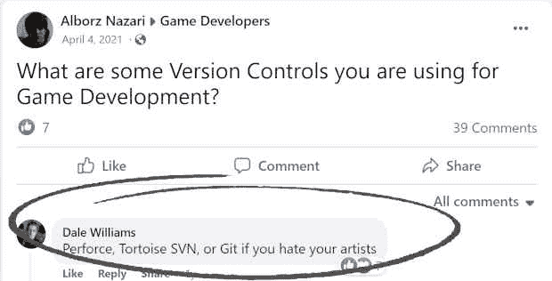

# 为游戏开发行业释放 Git

> 原文：<https://thenewstack.io/unleashing-git-for-the-game-development-industry/>

游戏可能是最常见的计算机(和移动)软件类型之一——游戏占苹果应用商店的 21.8%(截至 2021 年 6 月)，在安卓 Play 商店中也有类似的比例。视频游戏的市场规模预计将在 2024 年增长到令人震惊的 2187 亿美元[，CAGR 为 8.7%](https://newzoo.com/insights/trend-reports/newzoo-global-games-market-report-2021-free-version) 。

游戏主要适用于个人电脑、移动设备和专用游戏机，但它们不会就此止步。元宇宙[近年来取得了进展](https://www.bvp.com/atlas/virtual-reality-coming-soon/)，迄今为止 Oculus Quest 已售出超过 1500 万台，游戏是推动其采用的主要吸引力之一，它们将仍然是元宇宙生态系统的重要组成部分。

作为软件经济的核心，精简和优化游戏开发可以转化为直接的利益和收益。今天的大多数游戏都是使用 Unity 或 Unreal Engine(还有其他几个，但这两个主导了市场)等游戏引擎开发的，在这些引擎中，很少或没有软件开发经验的艺术家可以创建令人惊叹的艺术，并与编写驱动游戏的代码的开发人员合作。

这些游戏引擎已经存在了几十年，并随着技术的发展而显著发展。他们足够强大，可以创建最先进的 2D 和 3D 图形，但他们的价格(都包括免费层)足够灵活，甚至可以让独立游戏工作室使用。

然而，游戏开发就像任何其他类型的软件开发一样，需要实现软件开发的最佳实践，比如版本控制(SCM)。Git、SVN、Perforce 和 plastic SCM([2020 年被 Unity 收购](https://www.mcvuk.com/development-news/unity-acquires-plastic-scm-developer-codice-software/)并整合到 Unity 开发环境中)等工具，在如今的游戏开发公司中相当常见。

然而，请注意，这些工具中的大部分主要是为管理标准软件源代码而开发的，这使得它们对于有一些独特需求的游戏公司来说不是最理想的。网络上的游戏开发论坛充斥着关于版本管理工具、最佳实践和方法论的讨论。一致的意见是，需要对配置管理工具和工作流程进行一些调整，以及对这些组织中的一些个人进行专门的培训，以便有效地使用版本管理。

## 游戏开发中的独特挑战

游戏开发中的独特优势之一始于流程中的利益相关者这样的基本要素。游戏开发让游戏设计师与软件工程师紧密合作，构建和发布游戏软件。最流行的平台 Unity 和 Unreal 也有自己的一套需求和设计者专有的文件格式。

当使用典型的源代码控制管理平台时，所有这些，连同质量需求和过程遵循，增加了相当多的摩擦。下面我们将逐一深入这些，看看它们在游戏开发中增加了哪些摩擦，以及如何消除这些摩擦，将现代软件交付的好处带入游戏开发。

游戏开发特有的四大难题是:

*   他们的文件和存储库的巨大规模。
*   非技术涉众是技术交付的关键部分。
*   测试合规性和其他交付要求的复杂性。
*   难以解决专有文件格式的冲突。

我们还将概述典型的工作流程，以及游戏开发可以从与其他工程领域更加一致的改进流程中受益的地方。

## 文件和存储库大小

今天一些最流行的配置管理工具不太适合处理大型二进制文件(如游戏中大量使用的多媒体文件)，作为项目的一部分，尽管流行的工程领域需要处理大型文件(从游戏开发到人工智能和机器学习)。这仍然是复杂和未解决的问题。例如，Git，其他工程领域中事实上的 SCM，需要使用一个叫做 Git-LFS 的专用扩展来有效地处理大文件。根据流行观点，这个扩展的使用很麻烦，至少可以说[，并且增加了过多的摩擦，使得用户做任何事情都很慢。](https://news.ycombinator.com/item?id=27134972)

即使是能够在本地处理大型二进制文件的工具，也会由于同步到变更列表或分支等功能需求而减慢工作流程。这需要在每次检出或提取时，传输和替换作为正在处理的文件集的一部分的大文件。即使文件与当前的变更或正在进行的工作无关，也是如此。因此，许多游戏开发公司采用“影子版本管理”来管理大型二进制文件，使用 Google Drive 或 Dropbox 等工具，将版本编码到文件或文件夹名称中，并使用 SCM 系统中的源代码，应用手动过程将这些文件“缝合”到一个连贯的项目中。

## 关键的非技术利益相关者

设计师和艺术家是游戏开发团队的重要组成部分，他们不太习惯于配置管理工具相对复杂的工作流程(例如，分支、签出、提交)，尽管他们被要求交付他们的工件和代码，并使用与软件交付相同的工作流程。

虽然这可以通过培训来克服，但许多组织通常通过使用 Google Drive 或 Dropbox 等工具来处理这个问题(这些工具也消除了前面讨论的大文件问题)。这给培训和入职，甚至是招聘人才增加了很多摩擦。它还增加了与文件格式及其在典型测试、质量和自动化过程中的管理相关的其他方面的摩擦，我们很快就会谈到。

## 根据合规性和游戏要求进行测试

游戏开发有严格的合规要求，以确保最终产品的质量，并允许不同利益相关方之间高效、简化的协作。然而，由于正在创建的文件的性质、软件文件和专有格式之间的差异，将典型的质量、测试和自动化门应用于游戏软件是相当复杂的。这需要大量的人工干预和额外的管道胶带来验证软件是否符合相关要求。

需要的人工干预越多，过程中的摩擦就越多，出错的可能性就越大。手动和人工流程更容易出错。游戏开发克服这个问题的一个方法是在设计团队中有一个专门的人(“技术艺术家”)，将大的二进制图形文件合并到配置管理工具中。一些公司甚至已经建立了他们自己的专有工具和插件(一些将它们贡献给他们的社区)来克服 SCM 的这些限制。然而，这些过程应该是自动化的，就像在其他领域一样。

## 合并专有文件格式

与前面的挑战密切相关的是解决专有文件中的冲突，并将它们合并到主/生产文件中。这也在很大程度上落在了技术艺术家身上，他们必须解决专有 YAML 和二进制文件中的冲突。由于没有更好的选择，这通常会导致手动重新实现其中一个导致冲突的要素，并重新提交结果文件。基本上每个游戏设计的合并冲突都像是你在 Git 中经历过的最糟糕的合并冲突。因此，想象一下这种情况发生的频率，以及这给游戏开发过程增加了多少摩擦。对更多文件格式和部署过程的更好支持可以显著改变这一点。

## 游戏开发需要重新思考

游戏是一项严肃的业务，有着可观的收入流和激烈的竞争，这要求游戏开发将工作流与更先进的软件交付原则相结合，以从自动化、速度和效率中获得更大的好处。许多真正的挑战与一些基本的东西密切相关，比如他们的 SCM 能够支持什么。到目前为止，对于这个行业在工程和交付方面面临的挑战，似乎仍然没有一个好的解决方案。

我们已经超越了理论，今天我们有更先进的工具来克服尺寸和规模带来的许多技术挑战。游戏开发应该能够从这些进步中获得类似的好处。在 [Diversion，](https://diversion.dev)我们认为游戏行业在云原生工程实践方面应该是一等公民，应该拥有支持其独特需求和工作流的工具。转移[为](https://www.ycombinator.com/companies/diversion)提供了一个云原生的、可扩展的 git 替代方案。

我们相信有可能建立一个现代的工具来帮助解决游戏开发者在当前的配置管理工具中所面临的独特挑战，这些工具中的大多数已经存在了 20 年或者更久，并且没有像其他工程工具和框架一样进步。通过与领先的游戏公司合作，帮助确定挑战并无情地消除流程中的摩擦，我们可以将游戏开发工作流程与其他领域中可能对业务有直接影响的精英级软件交付保持一致。

<svg xmlns:xlink="http://www.w3.org/1999/xlink" viewBox="0 0 68 31" version="1.1"><title>Group</title> <desc>Created with Sketch.</desc></svg>