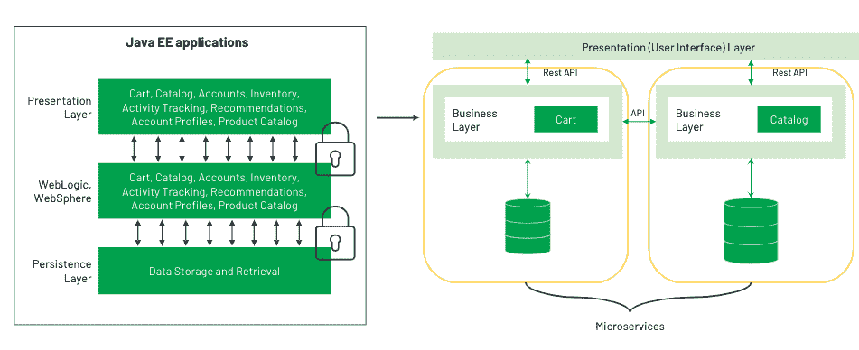
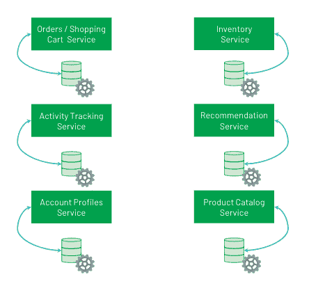

# 使用数据库即服务(DBaaS)释放微服务的价值

> 原文：<https://thenewstack.io/unlock-the-value-of-microservices-using-database-as-a-service-dbaas/>

 [安德鲁·戴维森

安德鲁是 MongoDB 的云产品副总裁。他之前在谷歌从事全球地图业务，拥有物理学背景，并在南亚生活过。](https://www.linkedin.com/in/andrewad/) 

随着应用成为客户体验，构建优秀软件的能力已经成为所有行业的竞争优势，并导致了微服务的兴起。微服务架构将应用程序分解为小型自治服务，每个服务专注于特定的功能，并沿着业务和数据边界分离，这允许团队在服务之间拥有自主权。对于微服务，您通常希望利用现代的无服务器功能来简化构建和操作。

微服务最初是从大型 web 属性和移动应用程序开始的，随着越来越多的组织和企业看到其好处并开始利用它们来为自己谋利，它变得越来越受欢迎。通过为客户开发新功能来快速响应市场变化的能力已经成为组织的关键任务。这就是为什么微服务正在成为现代应用程序的默认服务。

在本文中，我将介绍一些用例，以及基于微服务的架构如何影响您的数据库选择。

## 优秀软件的三个关键要素

公司希望尽快将其应用推向市场。这使他们能够开始建立品牌忠诚度并扩大用户群，同时产生反馈以改进应用程序并引入新功能。无论你身处哪个行业，当今最成功的应用程序都有可能是由以下人员创建的:

1.  自给自足的团队，利用…
2.  模块化架构，以及…
3.  敏捷云基础设施

[福布斯](https://www.mongodb.com/blog/post/forbes-cloud-migration-helps-worlds-biggest-media-brand-continue-standard-digital-innovation)就是这么做的。这家拥有 100 年历史的出版商已经成为世界上最大的商业媒体品牌，每月在全球范围内接触超过 1.4 亿人。它最初于 2011 年在 MongoDB 上构建其 CMS，最近将整个平台迁移到 Google Cloud 上的 MongoDB Atlas，以利用福布斯的 50 多个微服务。云迁移使构建速度提高了 58%，发布周期缩短了 2 到 10 倍(取决于服务)。

### **那么数据库呢？**

之前，我[写过](https://thenewstack.io/why-database-as-a-services-dbaas-are-do-or-die-for-todays-cloud/)为什么我们看到托管基础设施服务的采用在增加。总之，这些服务允许开发人员抽象出数据库层，腾出时间为新特性编写代码。借助微服务架构，能够利用诸如 [MongoDB Atlas](https://www.mongodb.com/cloud/atlas) 之类的数据库即服务对于成功至关重要。

因为每个微服务都有自己的堆栈，所以您可能有 20 个不同的数据库来支持应用程序的所有子组件。鉴于许多公司不再拥有集中的数据库管理员团队，而是将数据库管理员和运营专业人员转变为云架构师和开发运维工程师，您如何管理这些团队？好消息是，这种转变完全是通过以声明方式使用现代工具管理数据库等基础设施来扩大影响，这是数据库即服务真正大放异彩的地方。

您的基础架构可以通过 API 或 Terraform 等基础架构代码框架进行管理，从而可以在 DevOps 团队管理的环境中轻松实现数据库和其余配置的自动化。最终，这将允许每个团队独立工作，而不必学习如何操作和扩展数据库的细微差别。

借助云原生基础架构的灵活性并利用 DBaaS 方法，您现在可以自动内置以下所有功能，供每个微服务团队使用:

*   通过细粒度访问控制和端到端加密来保护您的数据的安全功能。
*   内置复制功能，实现永不停机的可用性。可以启用公共云中的跨区域复制，以帮助容忍整个云区域的故障。
*   全面管理、连续和一致的备份，具有防止数据损坏的时间点恢复功能，并且能够在无需完整恢复的情况下就地查询备份。
*   细粒度监控和可定制警报，实现全面的性能可见性。
*   每个微服务都具有独立的弹性可扩展性，因此您不会因为使用自动扩展或一键垂直和水平扩展而过度调配资源。

## **微服务+ DBaaS 在发挥作用**

微服务正在改变所有行业的软件开发团队，甚至是传统上更保守的行业。我们与英国的 HMRC 合作，彻底改造他们的整体架构，并在云原生环境中过渡到微服务。在他们的旧平台上，数字服务需要两年时间才能交付，而且每年只限发布两次。

可以想象，扩展这项服务并发现性能问题的成本非常高，如果不升级，就会导致停机。通过迁移到云并将他们的整体分解为微服务，他们能够在 15 个较小的团队中每周交付 50 个版本，为用户提供无缝的可扩展性。这也为他们每年节省了数百万的运营成本。他们现在有超过 300 个利用托管数据库服务的微服务。

*我们希望了解更多关于您正在构建的应用程序，以及您如何在 MongoDB Atlas 上利用微服务架构。点击了解更多[。](https://www.mongodb.com/what-are-microservices)*

<svg xmlns:xlink="http://www.w3.org/1999/xlink" viewBox="0 0 68 31" version="1.1"><title>Group</title> <desc>Created with Sketch.</desc></svg>