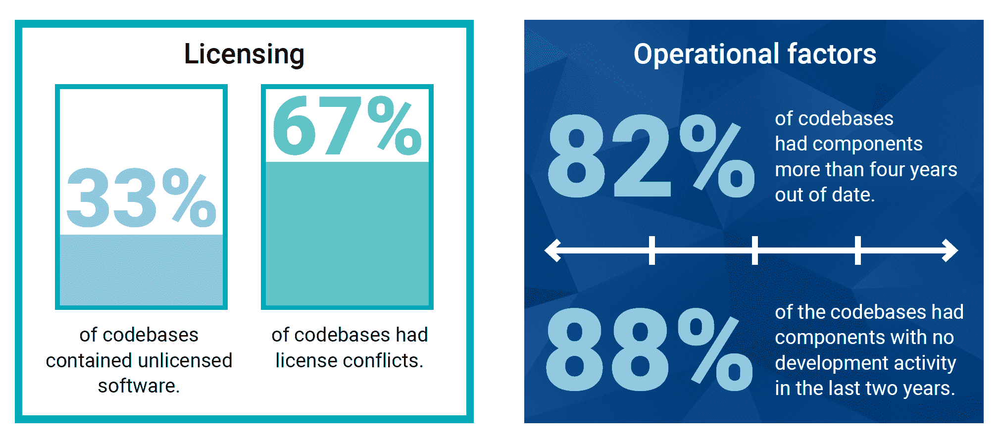

# 非维护依赖项和其他衡量 CI/CD 安全性的方法

> 原文：<https://thenewstack.io/unmaintained-dependencies-and-other-ways-to-measure-ci-cd-security/>

需要多少份报告来回答关于软件供应链安全性的重要问题？本周我们来看看最近的五项研究，重点是 CI/CD 和开源。一如既往，这份分析超越了你可能在别处读到的基于新闻稿的报道。

首先，我们要宣布 New Stack 在 2020 年 4 月 14 日至 5 月 5 日进行的民意调查结果。对原始数据和列表结果的访问在[公开工作簿](https://docs.google.com/spreadsheets/d/13Q2_xU-yjycV-svoo8E5FLES5QuY-DW5cn7sBtK7B9o/)中。因为样本量很小(79)，我们没有用花哨的图表来宣传结果，但答案为我们对其他调查的分析增添了背景。例如，几乎四分之三(79 个中的 58 个)认为过时的软件组件依赖关系的百分比(即，已经发布了较新的版本)应该是 DevOps 团队的性能指标。Synopsys [的一项研究](https://www.synopsys.com/software-integrity/resources/analyst-reports/2020-open-source-security-risk-analysis.html?cmp=pr-sig)发现，82%被分析的代码库的组件在过去四年中没有更新过。在这种类型的 KPI 真正实现之前，行业需要变得更加细化。

虽然我们的问题涉及 DevOps 角色，但另一项调查，来自 [GitLab](https://about.gitlab.com/resources/downloads/2020-devsecops-report.pdf) 的调查发现，让开发人员对发现代码漏洞负责仍然存在问题。我们之前已经指出，当安全是一项共同的责任时，会出现许多问题。我们的发现表明，安全团队使用的工具类型有很大的不同，这取决于哪个团队在选择 CI/CD 管道的部署或发布管理阶段使用的工具方面起主导作用。

[Snyk 的开源安全调查状态](https://snykteam.typeform.com/to/Iu8Uve)仍在进行中，并着眼于如何以及何时对集装箱图像进行安全性分析。根据我们的调查结果，我们预计与其他工作相比，安全团队对扫描集装箱图像更感兴趣。

来源:新思公司《2020 年源安全和风险分析(OSSRA)报告》。

读者可以在下面找到来自三个调查的附加分析，以及来自两个调查的有趣问题。

*   **根据 [Synopsys](https://www.synopsys.com/software-integrity.html?cmp=pr-sig) 网络安全研究中心对 1000 多个商业应用程序进行的尽职调查，82%的代码库的组件已经过时超过四年。几乎四分之三的代码库都存在许可问题。如果该报告能够提供关于未维护组件的平均数量的数据，并量化这些问题导致需要立即解决的高风险漏洞的频率，那么该报告将会更加有用。**
*   **70%的审计代码是开源的，比 2015 年报告的 36%有所上升。**Synopsys 使用实际代码的字节数(即消耗的存储空间),而不是基于代码行计算统计数据。尽管该报告称 99%的代码库都有开源组件，但它并没有描述开源组件的比例。就像计算应用程序中的微服务很困难一样，创建软件组件的可度量定义也很困难。
*   Synopsys 拥有帮助公司识别和补救这些问题的软件。未来的报告可以通过提供额外的数据以及描述其客户的审计代码库的代表性来加强。

*   对更快发展的估计被广泛夸大了(第一部分)。调查答案表明，60%的人每天部署多次代码，一天一次，或每隔几天一次，但这与去年调查[中的 45%相比并没有显著提高](https://about.gitlab.com/blog/2019/07/15/global-developer-report/)。2019 年版的问题实际上发现，43%的人每天部署一次以上，另有 45%的人每天部署一次至每月一次。GitLab 没有透露每周部署一次的数量，因此几乎不可能进行真正的比较。
*   对更快发展的估计被广泛夸大了(第二部分)。令人信服的是，83%接受调查的开发人员发布代码的速度比去年更快、更频繁。接下来的一个问题要求人们量化这些收益，29%的人不能提供关于发布速度的信息。调查的答案选择加剧了量化发布速度的问题，因为根据调查，“最慢”的可能增长是前一年的两倍(35%的答复)。另外 29%的人部署速度提高了 10 倍，这意味着近三分之二的人表示他们的部署速度同比至少提高了一倍。如果部署速度从两天提高到一天，这可能是一个可信的发现，但是为什么受访者不能说他们的速度提高了 1%-199%？
*   **样本量只是有效发现的一个指标。**尽管有 3，650 份调查反馈，GitLab 的最新报告受到一项调查的限制，该调查可能低估了员工人数超过 100 人的公司(50%)，高估了 GitLab 用户(59%的用户将其作为工作的主要 Git 工具)。这导致 Jenkins 和 GitHub 操作持续集成(构建)的使用量被低估。此外，尽管报告中有一部分声称代表了安全专家的观点，但大多数回答这个问题的人并不是安全的主要负责人。
*   **严格来说，38%的 DevOps 实施包括 CI/CD 平台。**我们不知道“实施”在本次调查中的含义，但 82%的调查受访者已经实施 DevOps 超过一年。我们也不知道确切的 CI/CD 平台是什么，尽管它可能指的是一个包含软件开发生命周期的许多方面的供应商解决方案(如 GitLab)。

*   **安全团队在应用发布前进行安全扫描。**静态应用程序安全测试(SAST)是大多数受访者的信息安全职能部门在生产前访问的唯一一种扫描类型。在 DevOps 主导选择扫描工具的公司中，信息安全团队更有可能使用依赖性扫描。
*   **调查疲劳是真实存在的。我们的四个问题的快速投票的独特价值在对这个主题进行深入研究的众多调查中并不突出。**

*   你如何审查你使用的开源软件包？
*   您如何确保在 Kubernetes 上运行的工作负载得到安全配置？

*   您是否有来自整个工具链的高质量数据来准确地报告开发进度和发布时间，以便所有利益相关者做好准备？

Snyk 和 GitLab 是新堆栈的赞助商。

Pixabay 的特征图像。

<svg xmlns:xlink="http://www.w3.org/1999/xlink" viewBox="0 0 68 31" version="1.1"><title>Group</title> <desc>Created with Sketch.</desc></svg>