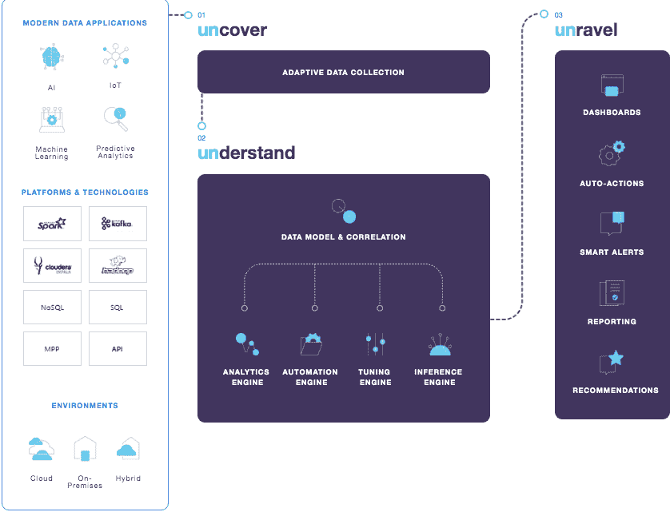

# 解开数据添加人工智能以防止云迁移成本遗留问题

> 原文：<https://thenewstack.io/unravel-data-adds-ai-to-prevent-cloud-migration-cost-hangovers/>

尽管迁移到云有很多好处，但成本越来越被认为是未知领域的一部分。在对账单感到震惊的公司中，这甚至被称为“云宿醉”。

[FinOps Foundation](https://www.finops.org/) 的 j . r . stor ments 和 Michael Fuller 写道:“从资本支出数据中心运营模式向运营支出可变模式的内部转变让许多 IT、财务和业务团队感到意外。

据 unlable Data 首席执行官 [Kunal Agarwal](https://www.linkedin.com/in/kunalkunal/) 称，确定成本只是将使用 Spark 或 Hadoop 的大数据应用程序迁移到云的复杂性的一部分。

他的公司发现，其最初针对应用性能管理的全栈数据方法也可用于帮助客户更智能地进行云迁移。

unallow 在日志数据的基础上使用机器学习和人工智能来监控应用程序性能，检测异常行为，并提供补救建议。

早在四月份，它就宣布了它的云迁移能力。现在，它正在吹捧一个结合了其技术和专业知识的[云迁移评估](http://www.dbta.com/Editorial/News-Flashes/Unravel-Data-Creates-Cloud-Migration-Assessment-133333.aspx)，包括针对迁移到 Azure、AWS 或谷歌云的[新模型。](https://info.unraveldata.com/lp-cloud-migration-assessment.html)

Agarwal 说，迁移到云的公司通常会面临一些共同的问题。他们通常不了解所需的成本和努力，并且低估了所需的时间，当他们从一个环境转移到另一个环境时，项目要么进展缓慢，要么彻底失败。

他说，一些客户已经有过项目失败，但还想再试一次。

“但你为什么要通过重复同样的事情来引发另一场垃圾箱火灾呢？”他问。

## 人工智能辅助的云迁移规划

该服务从现有环境的基于人工智能的发现阶段开始，这是大多数组织通常手动完成的过程。

“我们收集这种全栈数据，我们过去常常这样做来进行性能监控和优化。现在使用它来帮助公司了解他们应该将哪些应用程序迁移到云。如果您将一个应用程序或整个集群迁移到云中，会花费您多少钱？您如何比较现有各种云选项的性能、兼容性和功能？然后真正帮助这些客户理解依赖性。需要哪种计算和资源？”他问。

新模型旨在帮助客户了解哪个云提供商最适合特定的工作负载，以及该云提供商的哪些实例类型和虚拟机类型最适合。

该评估可与领导层一起使用，以证明云的价值:我们将节省多少？我们的敏捷性会提高多少？它支持云容量规划和按存储容量使用计费报告，以及其他关键洞察。

该服务确定适合云的工作负载，根据业务战略确定最佳云拓扑，并计算预期的每小时成本。它还提供了提高应用程序性能的建议。

它可以作为项目管理工具来跟踪你的进展。您可以使用 unflare 来确定性能和成本基线。

然后，它允许您创建一个项目计划:首先移动哪些部分？之后，您可以使用它来评估您是否达到了预期的服务质量、性能和成本。如果没有，你可以使用 Unravel 的优化功能让项目回到正轨。

Agarwal 说:“在这个过程中，解开不会完全取代其他工具和人。”。对于读/写应用程序、重构应用程序、移动数据湖和类似的任务，您仍然需要其他工具和人员。

“但你会知道你需要做什么，不会被这个过程中的任何一步蒙蔽，”他说。

该公司最近宣布与 Informatica、Attunix、戴尔和 RCG 全球服务部建立合作伙伴关系，以帮助客户应对云迁移挑战。M12，前身是微软风险投资公司，是该公司在 T2 的投资者之一。

来自 Michal Jarmoluk 和来自 Pixabay 的 Clker-Free-Vector-Images 的特征图像。

<svg xmlns:xlink="http://www.w3.org/1999/xlink" viewBox="0 0 68 31" version="1.1"><title>Group</title> <desc>Created with Sketch.</desc></svg>