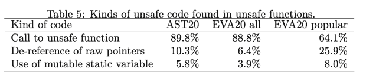

# 野外不安全的铁锈

> 原文：<https://thenewstack.io/unsafe-rust-in-the-wild/>

Rust 是一种系统编程语言，与 c 等传统系统语言相比，它具有更强的类型安全性。更重要的是，安全保证嵌入在语言本身中，并在编译时进行检查。在一个 Rust 程序通过编译器之前，困扰传统语言的常见编程错误，如未初始化的变量、悬空指针、内存泄漏甚至数据竞争，基本上都被消除了。

铁锈最突出的两个安全特征是所有权和寿命。一般来说，Rust 程序中的每一条内存数据都有一个变量，这个变量就是数据的所有者。当变量超出范围时，它所拥有的内存被释放。有了这种所有权机制， [Rust](https://thenewstack.io/rust-by-the-numbers-the-rust-programming-language-in-2021/) 可以确保一个程序基本上没有内存泄漏，而无需求助于显式释放或垃圾收集。当一个对象变量被分配给另一个对象变量时，所有权可以被永久转移或移动，或者当一个变量被分配给一个引用变量时，所有权可以被临时借用。

因为引用可能会导致与别名相关的内存访问问题，所以 Rust 强加了严格的规则，对于任何给定的对象，任何时候都只允许多个只读引用，或者单个可变引用，而不允许其他引用。

这些安全特性，以及其他一些特性，使得 Rust 成为比传统语言更安全的语言。如果一个程序可以被成功编译，程序员就可以确信它没有内存错误。一旦最初的学习曲线被克服，程序员已经掌握了 Rust 安全特性，那么[开发](https://thenewstack.io/rust-in-the-linux-kernel-by-2023-linus-torvalds-predicts/)的效率就会非常高，因为大多数(如果不是全部的话)常见的难以查明的错误都是在编译时而不是运行时检测到的。

## 不安全生锈

然而，在实践中，Rust 关于所有权、生存期和引用的严格规则可能过于严格，因此程序员有时不得不寻找方法来绕过这些规则。对于这种情况，Rust 语言本身提供了一种机制:不安全 Rust。

不安全 Rust 是指使用 Unsafe 关键字标记的 Rust 代码，它执行安全规则不允许的操作，如取消引用原始指针。换句话说，不安全的代码有可能破坏安全保证。

[不安全的铁锈是必要的“逃生出口”事实上，根据前 Mozilla 公司的布莱恩·安德森和拉斯·博格斯特伦以及其他人的说法，Rust 本身的许多基本特性都是用不安全的代码实现的。例如，不安全代码允许`Vec`类型有效地管理其缓冲区，允许`std::io`模块与操作系统交互等等。](https://ieeexplore.ieee.org/document/7883291)

需要指出的是，仅仅因为一段代码被标记为不安全并不一定意味着它是不安全的。不安全意味着编译器不能确保代码的安全；因此，安全的责任落在了编写不安全代码的程序员身上。

虽然 Rust 是一种相对年轻的语言，但它已经使用了很多年，并获得了令人印象深刻的普及。在本文中，我们将调查不安全铁锈在野外的使用情况。结果和发现，从几个最近的研究，对现实世界的使用不安全的铁锈进行了讨论，以及从我们自己的实验结果，他们提出了一个统一的方式。目的是帮助揭开不安全 Rust 的神秘面纱，并提供与不安全 Rust 最相关的问题的答案，例如:

*   不安全铁锈的使用有多普遍？
*   不安全铁锈主要用于什么目的？
*   不安全 Rust 的使用方式是否符合软件工程原则？

## 不安全代码的种类

Rust 有三种不安全代码:不安全函数、不安全块和不安全特征。它们都标有关键字`unsafe`。这符合默认情况通常更保守的隐含原则。标记不安全代码有助于提高程序员的意识，即不安全代码正在被创建，必须格外小心。这也使得不安全的代码更容易被代码审查或软件工程工具发现。

**不安全函数** —不安全函数是用`unsafe`关键字在`fn`关键字之前定义的。例如，标准库中的函数`[String::from utf8 unchecked()](https://doc.rust-lang.org/std/string/struct.String.html#method.from%20utf8%20unchecked)`
定义如下:

```
pub unsafe fn from_utf8_unchecked(bytes:  Vec<u8,  Global>)  ->  String  {...}

```

该函数获取一个字节向量(u8)并从中创建一个`String`。Rust `String`是以 UTF-8 格式存储的 unicode 字符序列，这是一种可变长度编码。这个函数是不安全的，因为为了提高效率，它不检查输入的字节向量是否确实是 UTF 8 编码的字符序列。由调用者来确保输入是预期的。

一般来说，一个函数被标记为不安全的，因为它有一些关于其输入的前提条件，在该函数可以被安全调用之前必须满足这些条件，并且编译器不能检查这些条件。在上面的例子中，编译器无法检查字节向量是否是有效的 UTF-8 字符序列。这样的条件有时被称为功能的“契约”因此，在保证安全之前，呼叫者有责任确保满足约定。

**不安全的块** —不安全的块是一对花括号中的代码块，前面有 Unsafe 关键字。例如，当一个原始指针被取消引用时，它必须包含在一个不安全的块中。此外，不安全的函数只能在不安全的块中调用。不安全函数的体自动成为不安全块。下面的示例显示了在不安全块中调用的上述不安全函数。

```
let euro_utf8  =  vec![0xe2,  0x82,  0xac];
let euro_str  =  unsafe  {
         String::from_utf8_unchecked(euro_utf8)
};
println  !("{}"  ,  euro_str  );

```

在本例中，由三个字节 0xE2、0x82 和 0xAC 组成的欧元符号的 UTF-8 编码被放入一个向量中。然后在 unsafe 块中调用 unsafe 函数`String::from utf8 unchecked()`将 vector 转换成 s 字符串。

此时一个自然的问题是什么时候使用不安全的函数，什么时候使用不安全的块。一般来说，函数，尤其是公共函数，不应该无缘无故地被标记为不安全的。只有当函数有调用约定时，才应该将其标记为不安全的。注意，仅仅因为一个函数是不安全的，并不意味着它的调用者函数也应该是不安全的。如果调用者能够确保不安全函数的前提条件，那么这个调用是完全安全的。例如，我们可以有下面的安全函数，即使它包含一个不安全的块。

```
fn get_euro_str  ()  ->  String  {
    let euro_utf8  =  vec![0xe2,  0x82,  0xac];
    unsafe  {
          String::from_utf8_unchecked(euro_utf8)
    }

}

```

事实上，安全函数包含不安全块是相当常见的。将不安全代码以这种方式封装在安全函数中实际上是一种很好的编程实践。

**不安全特征**—Rust 特征类似于 Java 中的接口:它通常包含一组相关方法的声明。因此，从面向对象的角度来看，特征可以被看作是一个抽象的基类。然后，程序员可以通过实现 trait 的方法来实现给定数据类型的 trait。

一个不安全的特征在`trait`关键字之前有`unsafe`关键字。不安全特征的所有实现都必须标记为不安全。不安全的特征可能是混乱的来源。首先，尽管不安全特征的实现必须标记为`unsafe impl`，但是实现的方法并不是自动不安全的，因此不需要在不安全块中调用。同样，什么时候一个特征需要被声明为不安全的也不是很清楚。相关信息分散且不充分。

也许由于这些原因，不安全的特征在实践中并不常见。例如，在 Rust 标准库中，我们只发现了 12 个不安全的特征，其中 8 个被标记为实验性的，只剩下 4 个被认为是成熟的。

总之，当一个函数被声明为不安全时，调用者必须确保它的契约得到满足。不安全的操作，比如调用不安全的函数，必须放在不安全的块中。当一个特征被声明为不安全时，实现者必须格外小心以确保方法的契约得到尊重。

## 野外不安全的铁锈

我们现在将讨论这个特性的实际用法。Rust 已经被广泛采用。关于不安全生锈，自然会出现一些问题，例如:

*   不安全的铁锈经常用吗？
*   不安全的铁锈用于什么目的？
*   不安全的铁锈是否以合理的方式使用？

我们相信这些问题的答案会引起很多人的极大兴趣，尤其是刚接触 Rust 的程序员和软件工程工具的创造者。通过检查大量真实世界的 Rust 箱(库或可执行文件),最近对不安全 Rust 的实际使用进行了一些深入分析。它们包括以下内容，这些内容以代码名称列出，以便以后参考:

我们自己也收集了一些数据。在接下来的部分中，我们将以统一的方式呈现结果，这应该有助于回答上面列出的问题。

## 数据集

[Astrauskas 等人【AS](https://dl.acm.org/doi/10.1145/3428204)检查了截至 2020 年 1 月 crates.io 上所有可用的板条箱。在这些板条箱中，有 31，867 个可以被整理并用于他们的研究。 [Evans 等人【EVA 20】](https://dl.acm.org/doi/10.1145/3377811.3380413)也研究了在 crates.io 注册的板条箱，但时间更早，是在 2018 年 9 月。从大约 18，000 个可用的板条箱中，他们选择了 13，096 个可以汇编的。其中，462 个流行板条箱的子集，占下载板条箱的 90%，被单独研究。其中还包括 Mozilla 的[伺服网络浏览器引擎](https://ieeexplore.ieee.org/document/7883291)使用的大约 400 个板条箱。

Qin 等人[QIN20] 的工作覆盖了五个真实世界的 Rust 应用程序和五个流行的库，总共有大约 849，000 行源代码。我们还从两个真实世界的 Rust 项目中收集了一些数据，即[氧化还原操作系统](https://www.redox-os.org/) (415 个相关板条箱)和 rustc 编译器 Rust (98 个板条箱)。对于氧化还原，我们使用它的依赖库；对于 rustc，我们使用来自`compiler`和`library`子目录的库。表 1 给出了数据集的简要总结。


## 不安全代码的使用频率如何？

为了确定使用不安全代码的频率，Evans 和 Astrauskas 检查了使用三种不安全代码的板条箱数量。我们对氧化还原和 rustc 做了同样的工作。然而，秦报告了每种不安全代码的实例数量，而不是每箱的百分比。这些结果如表 2 所示。

在埃文斯和阿斯特劳斯卡斯之间，被调查的板条箱数量从大约 13K 增加到大约 32K。具有不安全代码的板条箱的比例从 29.4%降至 23.6%，这意味着在新注册的板条箱中，超过 80%的板条箱没有不安全代码，而第一次快照的比例约为 70%。

尽管有这种下降趋势，带有不安全代码的板条箱数量仍然相当可观，这表明不安全代码的使用相当普遍。如果我们只考虑最受欢迎的板条箱，这一点甚至更加突出。如表 2 所示，52.5%的流行板条箱有不安全的代码。因此，在一个普通的真实世界 Rust 项目中，你可以预料到大量的依赖装箱都有不安全的代码。我们在 Redox 和 rustc 上收集的数据证实了这一点，它们分别有 56.6%和 53.1%的板条箱带有不安全代码。


Evans 等人分析了他们研究的函数的调用图。他们认为包含不安全块的安全函数可能是不安全的。事实上，如果不安全块中的代码被证明是不安全的，封闭的安全函数就不再安全。有了这个概念，他们发现在他们自己和他们依赖的箱子中没有不安全代码的箱子，即那些通过静态分析可以被认为是真正安全的箱子，只占所有箱子的 27%。

理解不安全代码流行的另一种方法是查看不安全函数的总数。我们在表 3 中列出了可用的数据。


根据 Astrauskas 的说法，crates.io 的 crates 中有 7.5%的功能被宣布为不安全。对于氧化还原，该百分比要低得多，为 1.7%。不过，对于 rustc 来说，这个数字非常高，为 31.1%。其原因是，仅一个假定处理硬件架构的机箱`core-arch`就定义了 18，524 个或 94.6%的不安全函数。这个机箱总共有 22，095 个函数，所以它主要由不安全的函数组成。如果我们排除这个异常情况，所有其他情况中不安全函数的百分比是 2.7%。

## 不安全的特征

与不安全的块和不安全的函数相比，不安全的特征要少得多。如表 2 所示，对于板条箱. io 板条箱,[AST20]和[EVA20]均报告约 1%的板条箱包含不安全特性声明。


我们的测量显示，对于氧化还原和 rustc 数据集，具有不安全性状声明的板条箱的百分比分别为 5.8%和 5.1%，略高于流行的 Evans 集。

此外，我们调查了 [Rust 的标准库](https://doc.rust-lang.org/std/)中的不安全特征声明。基于 2022 年 9 月初访问的版本，标准库中有 172 个性状。其中，12 个，或者说 7%，被标记为不安全。在这 12 个不安全特征中，有 8 个是实验性的。

在表 4 中，我们显示了与特征总数相比，不安全特征声明的实际数量。你可以看到这些数字通常都很低，这表明不安全的特征并不常用。

本节中的数据表明，如果我们考虑可能不安全的板条箱的概念，不安全铁锈的使用是普遍和普遍的。

## 不安全代码操作的种类

在不安全的块/函数中，常见的不安全代码操作有哪些？

Astrauskas 等人和 Evans 等人都通过检查不安全块/函数中的代码来回答这个问题。Astrauskas 等人列出了大约 13 种最常见的不安全代码类型，而 Evans 等人给出了三种顶级类型，这与 Astrauskas 等人的前三种不安全代码类型相吻合，结果如表 5 所示。



到目前为止，不安全块/函数中最普遍的操作是对不安全函数的函数调用。根据 Astrauskas 等人和 Evans 等人的说法，这种不安全代码出现在将近 90%的不安全块/函数中。

第二种最常见的不安全代码是原始指针的解引用，这显然是不安全的。然而，如果我们只看流行的 crates，调用不安全函数下降到 64%，而原始指针的解引用变得比在整个 crates 集合中更常见(25.9%对 6.4%)。

Evans 提供的一个解释是，流行的 crates 比一般的 crates 与 C 库有更多的交互。第三种最常见的不安全代码类型是可变静态变量的使用。基本上，这些是可写的全局变量，它们本身就有线程安全问题，因此只允许在不安全的块中使用。

此外，Astrauskas 中指出，对于绝大多数(83.5%)使用不安全代码的函数来说，调用不安全函数是使用不安全的唯一原因。这表明，要保证不安全代码的安全性，大部分工作在于保证不安全函数的契约在被调用时得到满足。

最后，我们注意到表 5 中的结果可以通过跟踪对不安全函数的调用来进一步细化，以揭示基本的不安全代码类型。例如，假设我们有一个解引用原始指针的不安全函数和几个调用这个函数的不安全块。在这种情况下，如果我们跟踪对不安全函数的调用，我们会发现所有的不安全块最终都会涉及到原始指针的解引用。

## 使用不安全铁锈的原因

研究人员采取了不同的方法来研究这个话题。

Astrauskas 等人研究了使用不安全 Rust 的六个可能原因，比如数据共享、类型检查器不完整、文档。有些情况非常罕见。表 6 列出了他们工作中的三大原因。


最常见的原因是与外部函数的交互，这总是被认为是不安全的。其次是需要绕过 Rust 严格的安全规则。虽然性能被列为首要原因，但他们指出，出于性能目的使用不安全代码只集中在少数大量使用它的情况下。

在 Evans 等人的文章中，作者通过对 20 名程序员进行调查，研究了使用不安全代码的原因。表 7 列出了调查中的三大原因。


前两个原因与其他人发现的主要原因一致。第三个原因没有被别人举报。这里，程序员似乎为了方便而使用不安全的代码。这不是不安全代码的预期目的，因此这个原因似乎并不令人信服。程序员应该只将 unsafe 用于其预期目的。

在秦等人的文章中，作者通过分析源代码来寻找使用不安全代码的原因。它们的分类方法不同于其他分类方法，表 8 列出了前三个原因以及使用百分比。最主要的原因，重用现有代码，包括调用外部函数等操作，这是 Astrauskas 等人确定的最主要原因。其他两个最主要的原因也由其他研究人员确定。秦特别指出，在某些情况下，一个不安全函数的执行速度要比相应的安全函数快 4 到 5 倍。


结合这些发现，我们得出结论，使用不安全代码的主要原因包括:

*   与外语的互操作，尤其是 c。
*   避开对编程任务来说过于严格的安全限制。
*   提高性能。

## 不安全的铁锈用起来有多好？

我们在实践中已经看到了不安全铁锈的一些用法。我们想探究的最后一个问题是它的使用效果如何。换句话说，是否有原则地使用不安全的铁锈？

基于提倡的实践，Astrauskas 等人提出了不安全生锈的三个原则:

1.  不安全代码应该谨慎使用。
2.  不安全的代码应该是简单明了和独立的。
3.  不安全的代码应该被很好地封装。

第一项原则在实践中似乎没有得到遵守。正如已经显示的，超过 23%的注册板条箱具有不安全代码，如果我们认为包含不安全代码的安全功能可能是不安全的，那么 Evans 等人已经表明他们检查的板条箱中只有 27%是真正安全的。

至于第二个原则，Astrauskas 等人的结论是，这是实践中普遍遵守的。有两个指标证明了这一点。首先，大多数不安全块都很小，平均只有 22 条 MIR(Rust 编译器的中间表示)语句。第二，当一个不安全的块调用一个不安全的函数时，目标大部分都在同一个机箱中——只有 7.4%的调用是针对其他机箱的。

对于第三个原则，Astrauskas 等人主要测量了被声明为公共的不安全函数的比例。这里我们看到一个双峰分布:在他们检查的 78.5%的箱子中，或者没有(34.7%)或者所有(43.8%)的不安全函数是公共的。对后一类的进一步分析表明，这些机箱主要用于与外语接口、嵌入式编程等目的，其中的不安全函数并不打算封装。因此，程序员似乎在努力不暴露不安全的函数。

最后，Astrauskas 等人指出，许多不安全的函数没有很好地记录它们的契约。这当然是一种需要改进的做法。

Evans 等人进行的调查表明，程序员普遍意识到不安全代码的潜在安全问题，并采取积极措施来测试和验证这些代码。常见的技术包括仔细阅读代码、添加运行时检查、编写更多的单元测试、与他人讨论等等。

秦等人指出，一般来说，不安全代码的使用是出于好的或不可避免的原因。然而，他们也发现，不安全的代码比安全的代码更容易出现安全漏洞。这进一步强化了这样一个原则，即不安全代码应该有节制地使用，并有充分的理由。他们进一步建议，语言本身和工具都应该改进，以帮助减少不安全代码导致的潜在安全问题。

## 结论

因为，当需要绕过严格的安全规则、与外语接口或提高性能以满足系统编程需求时，不安全 Rust 是不可或缺的工具。

在这篇文章中，我们介绍了不安全铁锈，并汇集了最近几项关于不安全铁锈的研究以及我们自己的实验的结果和发现。基于这些结果，我们发现不安全 Rust 在实践中经常被使用，并且它的使用在很大程度上符合软件工程原则。然而，不安全代码比安全代码更容易出现安全错误。所以程序员在处理不安全的代码时应该格外小心。迫切需要改进语言和工具来改善这种情况。

<svg xmlns:xlink="http://www.w3.org/1999/xlink" viewBox="0 0 68 31" version="1.1"><title>Group</title> <desc>Created with Sketch.</desc></svg>