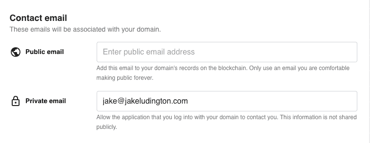

# Unstoppable Domains 为 Web3 推出单点登录

> 原文：<https://thenewstack.io/unstoppable-domains-launches-a-single-sign-on-for-web3/>

 [杰克·卢丁顿

杰克是一名自由记者和博客写手，对 Web3 技术、企业 IT 和流媒体视频充满热情。在推特上关注他@ jakeludington。](https://twitter.com/jakeludington) 

身份管理是 web 开发的核心挑战之一，这个问题的解决从来没有让任何人满意过。在用户方面，我们来到了一个地方，脸书、谷歌、Twitter 和其他一些大公司提供了一个简化的登录过程，交换条件是与这些公司和任何连接到他们 OAuth 服务器的公司共享一定程度的个人数据。开发人员需要选择集成部分或全部的登录解决方案，以减少用户获取和身份验证的摩擦。

Web3 进一步使用户认证和身份复杂化，为新用户带来了严峻的入职体验，他们目前需要创建和管理多个钱包，这取决于他们想要连接的 Dapp(去中心化应用程序)底层的区块链。身份验证是一个复制并粘贴其中一个钱包地址的过程，或者从手机上的钱包应用程序中扫描二维码，以访问网络浏览器中的 Dapp。

[势不可挡的登录](https://docs.unstoppabledomains.com/login-with-unstoppable/high-level-overview)旨在简化 Web3 登录流程，将每个令牌钱包中的十六进制地址替换为 NFT 域形式的唯一标识符。正如[不可阻挡的域名](https://www.linkedin.com/in/matthew-gould-7877361/)[的首席执行官马修·古尔德](https://unstoppabledomains.com/)在接受新堆栈采访时所说，“如果我们这个星球上有 30 亿人互相发送加密信息，他们将需要使用一个名字来使这变得更容易。”

## 什么是 Web3 域？

Web3 域不同于传统的 DNS 地址，如 Amazon.com 或 the newstack . io。web 3 域不是提供一组人类可读(也更容易记忆)的字符集来代替 IP 地址，而是一个人类可读的地址，代表您的加密钱包。一个 42 个字符的十六进制字符串变成了类似 thenewstack.crypto 的东西。当有人想给你发送 ETH 时，他们可以简单地记住这个更短的短语作为你的钱包地址。

作为一种身份验证解决方案，开发人员对使用 Unstoppable 登录背后的底层技术会很熟悉。Unstoppable 正在用钱包签名扩展 [OpenID Connect](https://openid.net/connect/) (OIDC)。这个签名取代了给予脸书或谷歌与应用程序共享部分用户账户数据的许可。古尔德说:“这是第一个完全免费使用、完全由用户控制的功能性登录服务。它通过 OIDC 协议连接到传统的 Web2 技术堆栈，因此用户可以将他们的 Web2 离线数据带到他们在 Web3 中的交互中。”

为了推出“登录不可阻挡”,链上钱包身份验证得到了扩展，能够将电子邮件地址作为离线数据点传递给任何在其 NFT 域配置文件中包含该地址的用户。目标是包括其他外链数据。古尔德的另一个例子是:“捆绑与 KYC 有关的信息，或者信贷信息，对于分散式金融来说非常有趣。对你来说，要让 KYC 在不同的服务中保持一致并不容易。如果有一种数据的数字表示形式，可以暂时与所有这些应用程序共享，那不是很好吗？”

【T2

## 联合 Dapp 登录

使用 Unstoppable 登录并不是联合 Dapp 登录的唯一解决方案。 [Wallet Connect](https://walletconnect.com/) 是这一领域的另一个参与者，尽管 Unstoppable 的登录在验证 Web3 和提供离线数据的能力上有很大的不同。通过扩展开放标准，在 OIDC 的基础上进行构建也会有所帮助。

各种流行的 javascript 库中提供了初始参考设计，包括通过 GitHub 上的 [UAuth 库](https://github.com/unstoppabledomains/uauth)提供的 React 和 Modal。当前的实现支持多边形和以太坊。

Web3 仍处于起步阶段，ConsenSys 报告称，截至 2021 年 11 月，Metamask(一种领先的加密货币钱包)的月活跃用户数为[2100 万，因此我们距离 30 亿人相互发送加密还有很长的路要走。为了达到这个数字，开发人员将需要像不可阻挡的登录这样的工具，以减少与 Dapps 交互的关键摩擦点，并创造更多的用户至上的参与体验。](https://consensys.net/blog/press-release/metamask-surpasses-21-million-maus-as-consensys-raises-200-million-to-make-web3-universally-easy-to-use-access-and-build-on/)

<svg xmlns:xlink="http://www.w3.org/1999/xlink" viewBox="0 0 68 31" version="1.1"><title>Group</title> <desc>Created with Sketch.</desc></svg>