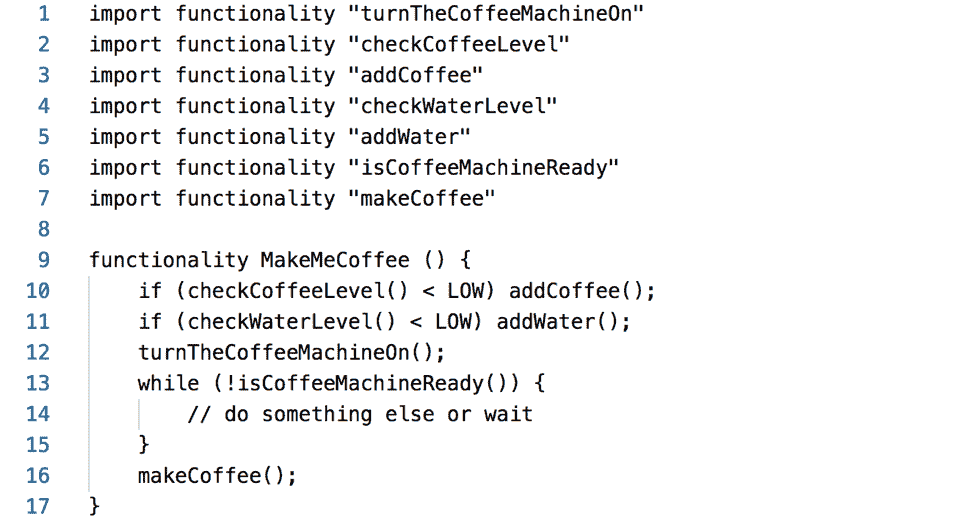

# 解开 Java 模块系统中的依赖关系

> 原文：<https://thenewstack.io/untangle-dependencies-in-java-module-systems/>

维基百科[将地狱](https://en.wikipedia.org/wiki/Hell)定义为“来世遭受折磨和惩罚的地方。”它也定义了[依赖地狱](https://en.wikipedia.org/wiki/Dependency_hell)，但是如果你问我，它应该从“一个折磨和惩罚懒惰和鲁莽的程序员的地方”开始

## 从属关系—从 0 到

 [米伦·季扬科夫

Milen Dyankov 是 Liferay 的开发者倡导者，主要关注 Java 和 OSGi 平台。他热衷于设计和构建软件，同时也帮助他人设计和构建优秀的软件！在为领先的欧洲公司开发、设计和咨询各种 Java EE 解决方案超过 15 年后，他目前将大部分时间花在教学、在世界各地的会议上发言以及研究他最喜欢的关于 Java 模块化、μ服务、分布式系统架构和软件工艺的主题上。](https://www.liferay.com/) 

我在 20 世纪 80 年代早期学习的第一门语言是 Apple II 电脑附带的 Applesoft BASIC。基本就是，嗯，基本。除了语言本身提供的功能，没有什么能让程序从现成的功能中获益。其他的东西，你必须在每个程序里面写！

早在 20 世纪 90 年代初，我学习的能够让我认为自己属于“高级程序员”阶层的语言是 Turbo Pascal。它有一些单元，允许人们编写一些功能，保存在一个文件中，然后从应用程序或其他单元中使用它。那时我清楚地记得的一件事是，在 Pascal 5.5 中没有处理鼠标的 OOTB 单位。我认识的每个开发人员都有一大盒软盘放在他们的桌子下面，并且有一个单元提供这种功能。然而开发人员更喜欢内嵌汇编代码。在不了解实现中“隐藏”了什么的情况下，程序员不喜欢依赖他人的代码。

快进 20 年，我们会遇到花几个小时，如果不是几天，来搜索执行特定任务的库的程序员。然后，他们又花了几个小时*(或者，但愿不会，几天)*从 Slack 上的其他程序员那里寻求确认，确认这个库确实做了它声称做的事情。我的本地 Maven repo 是 12GB，一个同事的 node_modules 目录加起来是 11GB。在 Spring Boot 写的“Hello world”现在产生一个 15MB 的 JAR 文件！

我们支持 Spring Boot“对第三方图书馆的固执己见”对于运行时的固执己见的观点，我们更喜欢容器。我们倾向于容器编排器来提供网络的观点。我们喜欢云，因为它对基础设施有自己的看法。这些都不一定是错的。**只不过是用软件工程的[基本定理](https://en.wikipedia.org/wiki/Fundamental_theorem_of_software_engineering)**(故意引用错了)掩盖了一个根本问题:

*“计算机科学中的所有问题都可以通过另一个间接层次来解决……除了间接层次太多的问题。”*

WYSI **N** WYG 属地

考虑这个 MakeMeCoffee 应用程序的伪代码:

如果你能做到这一点，你的代码将完全依赖于它所需要的，假设所有那些功能都遵循同样的极简方法。使这个概念变得无用的是分发问题(存储、更新和找到正确的功能)。因此，显而易见的解决方案是将这些功能组合成更大的单元。所以我们导入 CoffeMachine，然后使用 CoffeMachine.makeCoffee()之类的功能。当然，这也意味着人们会得到大量其他不需要的功能，比如 *cleanCoffeMachine* 、 *replacePartX* 等。

现在把你自己放在咖啡机的位置上。所有咖啡机都使用相同的水箱，因此有一个*水箱*是有意义的，其中*检查水位*和*加水*功能自然属于该水箱。考虑到所有其他的公共部分，拥有一个 CoffeeMachineVendor 模块是非常有意义的。走过 CoffeMachine 所依赖的所有其他供应商模块，你会得到著名的“下载互联网”或者我更喜欢称之为 WYSI **N** WYG(你所看到的是**而不是**你所得到的)依赖性。你不会得到你所看到的——你会得到更多！通常甚至没有意识到这一点。

从消费者的角度来看，依赖单一功能是最好的，但从生产者的角度来看，这是一种难以管理的方法。

## 包装

让我们先把一切都简化一下，然后说:

*   方法提供功能
*   类是方法的集合
*   包是类的集合
*   JAR 文件是包的集合
*   应用程序是 JAR 文件的集合

从消费者的角度来看，依赖“唯一命名的类”是没有意义的从提供者的角度来看，独立分发“JAR 文件”之下的任何东西是没有意义的满足这两者的解决方案就在中间:包，也许是 Java 中最被忽视、误解和误用的概念。

包必须以一致的方式对类进行分组。这里的关键词是“连贯”。例如，将类别分为咖啡机和 T2 水箱，对生产商来说似乎很棒，但消费者会更喜欢 T4 家庭用户和技术人员。

以这种方式思考包突出了它们是一个多么重要和强大的概念。正确设计的包不会阻止生产者将所有东西打包到一个 JAR 文件中。然而，这样做确实允许消费者只挑选对他们有意义的包，并确保他们避免部署可能导致不必要的副作用的其他包。

认识到包之间的依赖比 JAR 文件之间的依赖更有意义需要一些时间和经验。

## 模块

模块是一个抽象的概念，它不仅将包(和其他抽象的东西，比如我们在这里不讨论的服务)分组，还提供了关于它们和它们之间关系的重要元信息。一个**模块的元信息是应该定义依赖关系(理想情况下是包之间)的地方**。这乍听起来可能很奇怪，但是如果所有的 Java 库在几年前就采用了这个概念，就不需要让 Maven Central 如此受欢迎的外部依赖模型了！代码真的是真理的唯一来源！

## 模块系统

当然，要做到这一点，您需要能够处理这些元信息并将它们连接在一起的东西:模块系统。在 Java 9 之前，Java 中的[标准](https://jcp.org/en/jsr/detail?id=8)模块体系是 [OSGi](https://www.osgi.org/) 。从 Java 9 开始，我们有了一个额外的标准， [JPMS](http://openjdk.java.net/projects/jigsaw/spec/) (又名 Jigsaw)，用于模块化 Java 本身。还有其他模块系统，例如 [JBoss 模块](https://github.com/jboss-modules/jboss-modules)。

尽管模块系统在它们做出的假设和施加的限制方面有很大的不同，但它们都服务于相同的目的:确保所有的东西都正确连接。**从某种意义上说，模块系统是你最后也是最可靠的一层集成测试！**

Java 10 连接中的 JPMS(在其引导层中)看起来如何[很容易被可视化](http://htmlpreview.github.io/?https://github.com/azzazzel/jpms_viz/blob/master/html/index.html)。有一个[类似的可视化](http://htmlpreview.github.io/?https://github.com/azzazzel/osgi_viz/blob/master/html/index.html)展示了 OSGi 运行时的一些通用模块。在这种情况下，由于 OSGi 的动态特性，可视化仅显示检查时的接线。在这两种情况下，重要的是所有的图形都是由模块元数据中提供的信息单独生成的！

虽然 JPMS 和 OSGi 都可以判断给定的模块集是否可以连接在一起，但区别在于他们如何使用元数据来增强外部工具的能力，并防止运行时出现问题。但是为了理解这一点，我们需要首先探索一些更通用的概念。

## 版本控制

随着功能的发展，必须有一种方法来管理变化。通用的解决方案是使用版本。几十年来，我们一直在错误的层面上用 JAR 文件做这件事。对 JAR 文件进行版本控制并不能说明内部发生了什么变化。消费者关心的功能可能会在每一个版本的 JAR 中发生变化，也可能会保持多年不变。另一方面，**版本控制包** **为消费者**提供了宝贵的信息。

另一个重要的方面是版本信息存储在哪里。我们如此习惯于为此使用外部工具，以至于对于许多人来说，应该在模块的元数据中声明**版本的想法看起来很奇怪。**

## 语义版本控制

版本是伟大的，除非他们不是。考虑这两个版本:2016.03 和 2016.09。他们告诉你什么了？自己拍的，不多。现在想象一下，不知何故，一个工具知道 2016.09 包含几个新特性，但其他一切都与 2016.03 完全相同。让我们假设工具知道消费者不使用新功能。然后，它可以自信地决定用旧版本组装一个运行时，不仅节省了磁盘空间，还防止了潜在的类加载冲突。

如果程序员使用[语义版本控制](https://enroute.osgi.org/FAQ/210-semantic_versioning.html)，工具可以知道这一点:

*   一个版本有 4 个部分:major.minor.micro.qualifier
*   版本策略声明了以下更改:
    *   大调表示突破性的变化
    *   次要表示向后兼容的变化*(向后兼容的 API 变化)*
    *   微表示一个错误修复*(无 API 变化)*
    *   限定符表示新版本*(可选，在版本比较中不重要)*

语义版本功能*(方法，类，..)*不切实际。语义上版本化 JAR 文件或模块是没有用的，因为范围太广了。**语义版本化包是多年来被证明非常强大的中间地带**。

## 消费者和提供商

如果你吹毛求疵的那部分反应是“打破谁？”对于前一部分，你是正确的。

假设一个日志 API 在 1.0.0 版的 org.awesome.logging 包中有一个 Logger 接口，然后一个新方法被添加到所述接口中。一旦有人调用这个新方法，这个 API 的几个实现就会崩溃。但是，数百个使用日志 API 的库将不会受到任何影响；他们可以继续使用已经存在的方法。

现在考虑一个调度器 API，它在版本 1.0.0 的 org.awesome.scheduling 包中有一个任务接口。如果添加了一个新方法，它将中断数百个实现该接口的库，以注册计划在给定时间执行的任务。

这个例子演示了为什么相同的更改不能以相同的方式处理。Logger 是[提供者类型](https://osgi.org/javadoc/osgi.annotation/7.0.0/org/osgi/annotation/versioning/ProviderType.html)的一个例子，而 Task 是[消费者类型](https://osgi.org/javadoc/osgi.annotation/7.0.0/org/osgi/annotation/versioning/ConsumerType.html)的一个例子。在决定什么是突破性变化时，这些区别非常重要。org.awesome.logging 的新版本应该是 1.1.0。—**次要版本更新表明，对于消费者而言，变更不会中断**。org.awesome.scheduling 的新版本应该是 2.0.0。— **一个主要版本更新，表明变化打破了所有人**。

## 版本范围

Maven 支持版本范围，但是由于缺乏元数据，它所能提供的只是一些启发。另一方面，语义版本化的包，根据 API*(如果没有 API，实现就是 API)* 进行编译，并且知道变化如何影响提供者和消费者，允许我们自信地表达版本范围的依赖性。

说我的. great.module 用的是 1.0.0 版本的 some.great.api。我们可以确定的是:

*   如果 great.api 包含提供程序类型并且 my.great.module 是一个提供程序(实现或扩展类型),则它可以与 some.great.api 从 1.0.0 到 1.1.0 的任何实现一起工作。
*   如果 great.api 包含提供者类型并且 my.great.module 是消费者，则它可以与 some.great.api 从 1.0.0 到 2.0.0 的任何实现一起工作。
*   如果 great.api 只包含消费者类型，那么 my.great.module 可以与 some.great.api 从 1.0.0 到 2.0.0 的任何实现一起工作。

通过使用来自依赖 API 的模块元数据并应用上述规则，**工具可以解析依赖关系**并更新我们自己模块的元数据。

## 解开 JPMS 的依赖

不幸的是，JPMS 决定不仅忽略版本控制，而且完全忽略包的依赖性，转而依赖模块依赖性。JPMS 的作者声称这更容易，但我认为他们混淆了容易和熟悉。底线是 **JPMS 在逃离依赖地狱**方面没有多大帮助。JPMS 会像 Maven 报告一个丢失的 JAR 文件一样报告一个丢失的模块。但是 JPMS 不能保证有线模块实际上可以一起工作，正如这个[小演示](https://github.com/azzazzel/jpms_issues-modules_vs_packages/blob/master/README.md)所展示的。另一方面，它的设计带来了一些限制，据报道，第一批受害者是:

## 解开 OSGi 的依赖

处理 OSGi 的依赖关系需要改变心态。理解上面讨论的主题并准备好合适的工具至关重要。那么这一切都归结为两件基本的事情:

### 提供适当和完整的元数据。

如果手工完成，非常困难和费时，但使用合适的工具非常容易。包版本通常通过 [@Version](https://osgi.org/javadoc/osgi.annotation/7.0.0/org/osgi/annotation/versioning/Version.html) 提供。语义版本化是通过 [Bnd 的基线](https://bnd.bndtools.org/chapters/180-baselining.html)(也是作为 Maven 插件可用的[)实现的。导出的包标有](https://github.com/bndtools/bnd/tree/master/maven/bnd-baseline-maven-plugin) [@Export](https://osgi.org/javadoc/osgi.annotation/7.0.0/org/osgi/annotation/bundle/Export.html) ，提供者和消费者标有 [@ProviderType](https://osgi.org/javadoc/osgi.annotation/7.0.0/org/osgi/annotation/versioning/ProviderType.html) 和 [@ConsumerType](https://osgi.org/javadoc/osgi.annotation/7.0.0/org/osgi/annotation/versioning/ConsumerType.html) 。依赖包的版本范围是由构建工具使用 [Bnd](https://bnd.bndtools.org/) 进行字节码分析自动生成的。

### 了解旋变器误差。

这是阻碍大多数程序员的原因。通常很难理解错误消息，更不用说找出修复方法了。但是，在大多数情况下，原因是以下之一:

*   **元数据缺失或不正确:**这是传统库经常出现的情况。可以通过[增广](https://bnd.bndtools.org/instructions/augment.html)或者[包裹](https://bnd.bndtools.org/commands/wrap.html)来解决，或者还有已经模块化的流行罐子的[库。](https://servicemix.apache.org/developers/source/bundles-source.html)
*   **提供预期的缺失模块:**与 JPMS 类似，寻找缺失模块是开发人员的任务。与 JPMS 不同，由于冗长的元数据和包级依赖性，OSGi 不允许不兼容的模块假装一切正常。

## “一个人的梦想…是另一个人的噩梦”

模块系统不是一夜之间就能学会的，在某些时候可能会导致很多挫折。许多人认为“模块系统解决的问题——模块系统引入的问题”这个等式会产生一个负数。

JPMS 押注于熟悉度，因此初看起来更容易上手。然而，它允许系统的连线在运行时肯定会中断，即使所有模块都遵循规则。另一方面，OSGi 非常努力地阻止它知道会在运行时出错的东西运行。一旦掌握了，它真的很强大，变得难以放弃，但通往那个层次的道路充满了挫折和荒谬的错误信息。

所以你必须自己选择毒药！无论你选择哪条路，我希望这篇文章能帮助你逃离依赖地狱！

通过 Pixabay 的特征图像。

<svg xmlns:xlink="http://www.w3.org/1999/xlink" viewBox="0 0 68 31" version="1.1"><title>Group</title> <desc>Created with Sketch.</desc></svg>