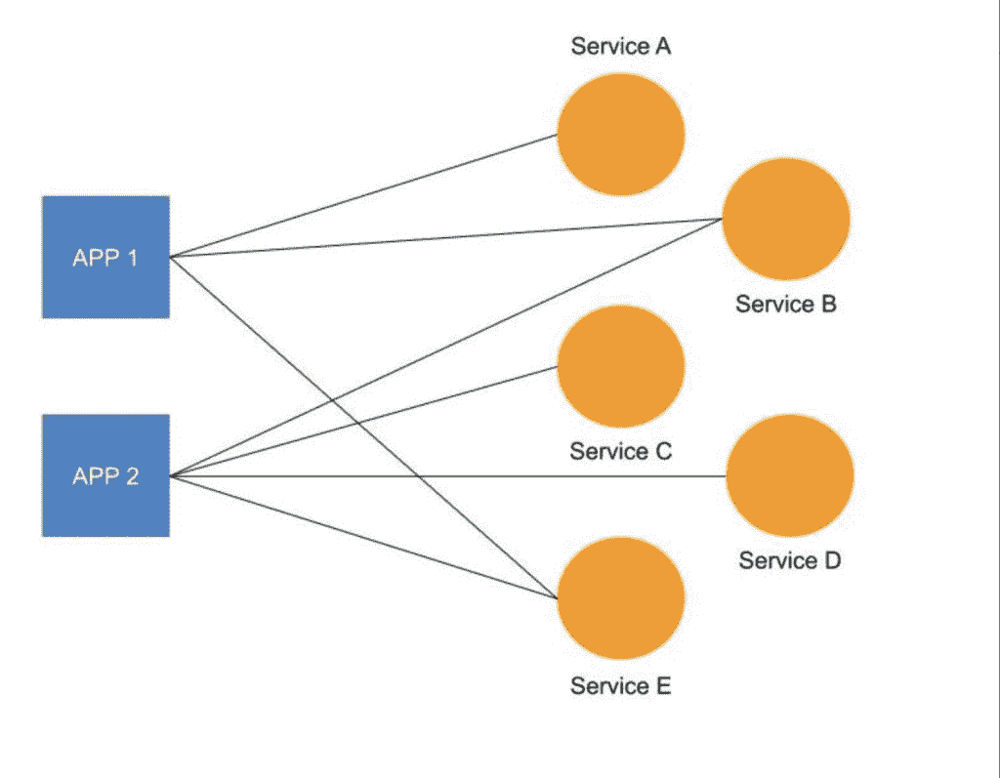
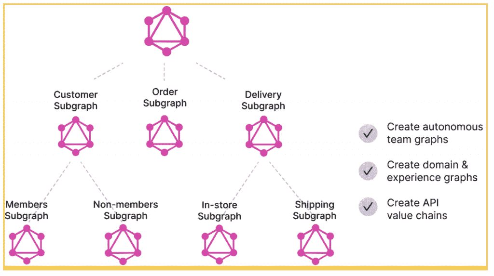

# 用 GraphQL 解开企业 API 架构

> 原文：<https://thenewstack.io/untangling-enterprise-api-architecture-with-graphql/>

对于拥有许多微服务或遗留服务的企业来说，API 架构可能会变得错综复杂，难以管理。

GraphQL 可以通过为客户提供一个单一的端点来帮助解决这一混乱，在这个端点上他们可以获得所有的数据并与之进行统一的交互。在本文中，我们将探索 GraphQL 如何适应企业 API 架构，并描述如何将 GraphQL 用于您现有的服务。

## API 架构很难保持干净

 [罗伊·德克斯

Roy 是一名来自荷兰的开发人员、作家和公共演说家。他的使命是通过培训和激励世界各地的开发者，用技术让世界变得更美好。目前，他正与 StepZen 合作，致力于使 GraphQL 的采用变得容易和可扩展。](https://www.linkedin.com/in/royderks1/) 

没有 API，很难经营一个现代企业。它们允许您连接系统、构建新功能并以新的方式接触客户。但是它们也带来了一些挑战。例如，如何理清组成企业的不同服务？对于拥有多个微服务或传统服务的公司来说，理清 API 架构可能是一项挑战。

您可能有一个发送电子邮件的服务、一个处理支付的服务和一个处理用户验证的服务。所有这些服务都由组织的不同部分或外部方维护，并在各种应用程序中使用。

这些服务中的每一个都可能有自己的 RESTful 端点，或者它们都可以通过一个旧的基于 SOAP 的协议来访问。因为 REST 和 SOAP 已经很久没有更新了，所以很多实现都偏离了规范。

因此，保持所有服务的一致性需要大量的架构指导，并且很难在多年后保持干净。技术可能会发生变化，关键技术员工离开你的公司，持不同技术观点的新员工进入。保持 API 架构更加一致的一个解决方案是 GraphQL，因为它要求所有服务都遵循相同的 API 规范。

## GraphQL 和企业 API 架构

GraphQL 是一种查询语言，它允许您以比 REST 或 SOAP 更强大、对开发人员更友好的方式来描述您的数据需求。它的可组合性有助于理清企业 API 架构。GraphQL 成为您的服务的通信层。使用 GraphQL 规范，您可以在与服务交互时获得统一的体验。

应用编程接口体系结构中的每个服务都变成了一个图，这个图公开了一个 GraphQL 应用编程接口。在这个图中，每个想集成或使用 GraphQL API 的人都能找到它包含的所有数据。

GraphQL 中的数据由一个模式表示，该模式描述了可用的数据结构、数据的形状以及如何检索数据。模式必须符合 GraphQL 规范，负责服务的组织部分可以保持这种模式的一致性。

GraphQL 的可组合性允许您将这些不同的图或子图组合成一个统一的图。有许多工具可以用来创建这样的“图形图”。例如，当您使用 [StepZen](https://stepzen.com/product/federation) 时，您使用相同的声明性方法来组合子图并构建单独的子图。

换句话说，当您使用 GraphQL SDL(模式定义语言)时，您不需要一种不同的技术来为您的服务在 GraphQL 中实现统一的图形。

参见“T2”GraphQL 是为联邦构建的，但是不要做错了，这是对使用 graph QL 构建“联邦”图的许多考虑事项的极好讨论。

## 采用 GraphQL

从本质上说，GraphQL 并不决定如何编写应用程序。相反，它指定了数据的形状和查询方式。因此，如果您遵循 GraphQL 查询数据的规则，那么您可以将它与任何语言或框架一起使用。

[StepZen](https://stepzen.com) 简化了您创建 GraphQL API 的方式；例如，当您使用 StepZen CLI 时，您可以根据服务的现有规范(REST 和 SOAP)自动生成 GraphQL API。基于关系和基于文档的数据库也是如此。因此，您可以开始采用 GraphQL 而无需编写任何代码，而不是在冗长的开发过程中迁移所有现有的服务。

<svg xmlns:xlink="http://www.w3.org/1999/xlink" viewBox="0 0 68 31" version="1.1"><title>Group</title> <desc>Created with Sketch.</desc></svg>