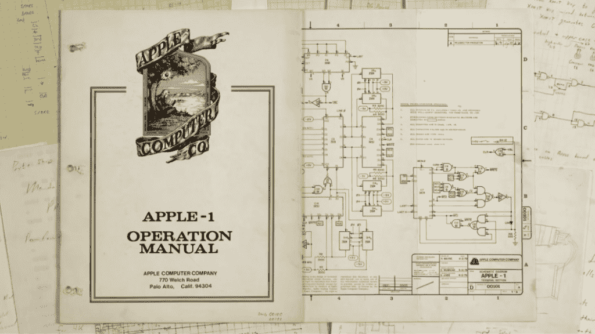
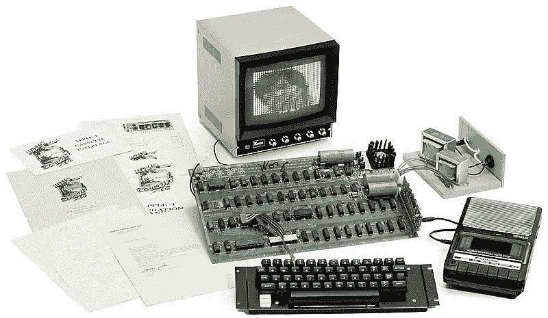
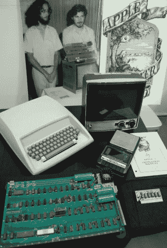
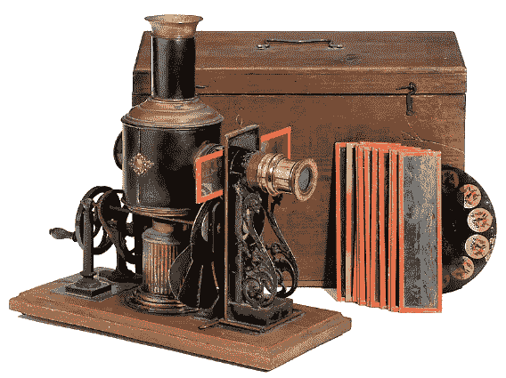
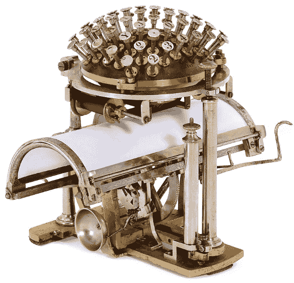

# 即将到来的拍卖以八台剩余的苹果 I 电脑中的一台为特色

> 原文：<https://thenewstack.io/upcoming-auction-features-one-eight-remaining-functional-apple-computers/>

两个月后，一台原始的苹果 I 型电脑将被拍卖给出价最高的买家——这是世界上仅存的八台仍能正常工作的电脑之一。

只生产了 200 台，拍卖商为[制作了一段视频，展示了这台罕见的 1976 年电脑](https://www.youtube.com/watch?v=wTgyll6IqJY&feature=youtu.be)的运行情况——恰当地展示了特殊的 30 周年纪念图形，带有它们的创造者[史蒂夫·沃兹尼亚克](http://www.woz.org/)和[史蒂夫·乔布斯](http://www.biography.com/people/steve-jobs-9354805)的 ASCII 图像。

[https://www.youtube.com/embed/wTgyll6IqJY?feature=oembed](https://www.youtube.com/embed/wTgyll6IqJY?feature=oembed)

视频

在最初出售 41 年后，它现在作为一件珍贵的历史纪念品被拍卖。

中标者还将收到一封日期为 1979 年 4 月 2 日的信件，以确认该设备的真实性，苹果客户服务代表卡罗尔·桑德勒在信中写道，她附上了一份价目表和目录，并补充说“我没有关于你的 Apple I 折价的信息。我建议你与当地经销商联系，看看他是否提供任何类似的程序。”

更有趣的是包含了最初的 Apple I 操作手册，其中显示了该公司的第一个*标志——艾萨克·牛顿爵士坐在一棵树下，头顶悬着一个闪闪发光的苹果。*

一个打印页指出，该手册是“初步的”，并补充说“它将很可能包含错误，不正确的措辞，等等。

"我们将非常感谢你在这些改进方面所做的努力。"

具有讽刺意味的是，因为这个设备从未被交易过，它的价值现在已经暴涨。这款设备的拍卖者夸口说，他们在 2013 年拍卖的另一款苹果 1[卖到了 671，400 美元](http://www.breker.com/english/Apple_1.htm)。[Ars Technica](https://arstechnica.com/apple/2017/03/one-of-eight-remaining-functional-apple-i-computers-goes-up-for-auction-in-may/)开玩笑说:“如果你认为现在的苹果电脑很贵，那就坚持住。”。

维基百科上有一个详细的列表，列出了最近其他苹果 I 的销售价格。一些亮点:

*   2010 年，美国有线电视新闻网(CNN)报道了一个[以 21.3 万美元](http://www.cnn.com/2010/TECH/gaming.gadgets/11/23/apple.computer.auction/)的价格售出，其中包括一份由史蒂夫·乔布斯签名的打字笔记，并由出席拍卖的史蒂夫·沃兹尼亚克的一封新签名信补充。
*   据英国广播公司报道，2013 年，福特基金会以 90.5 万美元的价格购买了一台苹果 I，这在当时创下了新纪录。
*   英国广播公司还报道说，第二年，少数几台完全可用的 Apple I[卖到了 36.5 万美元](http://www.bbc.com/news/technology-30447563)。据报道，“这是苹果联合创始人史蒂夫·乔布斯 1976 年在加州的一个车库里亲自出售的唯一一台机器”。
*   2015 年，同一卖家在易贝以 23.6 万美元[的价格卖出了另一款苹果 I。它也处于工作状态，并且“包括一个罕见的盒式接口，它连接到一个盒式磁带录音机，用于在磁带上存储程序。”](http://www.computerworld.com/article/2915138/apple-mac/antique-apple-1-sells-for-236k-on-ebay.html)

MacRumors 的一位评论者开玩笑说:“有人会因为继续使用那台过时的机器而获得高额回报。”。

但这些罕见的苹果 I 也有一种特殊的光芒。在 1984 年接受《字节》杂志采访时，沃兹尼亚克回忆起这一切是如何开始的，那时他还在将电视显示器连接到调制解调器上，这样他就可以拨入阿帕网玩游戏。这给了他下一个项目的灵感。"我不想花钱使用别人的电脑，所以我决定自己建一台。"

史蒂文·利维在 1984 年的经典著作《T2 黑客》中深情回忆了那个时代沃兹尼亚克白天在惠普工作，而史蒂夫·乔布斯在雅达利工作，沃兹尼亚克拼凑了一块新的主板，向他在[家酿计算机俱乐部](http://www.computerhistory.org/revolution/personal-computers/17/312)的朋友们展示。Levy 写道:“当你把电源、键盘、视频显示器和盒式磁带播放器连接到电路板上时，你就拥有了一台具有视频显示、大容量存储和输入/输出功能的工作电脑。”

那时候，22 岁的史蒂夫·乔布斯“留着被称为‘菲德尔·卡斯特罗式的胡子’，经常不穿鞋，对东方哲学有着加州式的兴趣……”但很快，“两个史蒂夫”就一起创办了他们的第一家业余企业。他们的官方地址是一个邮箱，而他们开始在著名的硅谷车库里工作。

为了给这个设备筹集资金，沃兹尼亚克卖掉了他心爱的惠普计算器，而史蒂夫·乔布斯卖掉了他的大众货车，以筹集 1000 美元，他们需要购买 50 块电路板来开始为家酿电脑俱乐部生产苹果 I 电脑。

2006 年，沃兹告诉传记作家吉娜·史密斯:“信不信由你，仅仅几周之后，我们就想出了这个合作伙伴的名字。”。“我记得我开车送史蒂夫从机场沿着 85 号高速公路回来。史蒂夫刚刚从俄勒冈州回来——从一个他称之为“苹果园”的地方回来。我认为它是一个公社。

“我们需要为公司取一个名字。史蒂夫推荐了一个。苹果电脑。”

但这也代表了沃兹尼亚克的电脑从业余爱好者的项目到创业的关键时刻。“我们生产了 200 台，”沃兹尼亚克告诉 Byte，“在 9 到 10 个月的时间里，除了 25 台，其他都卖出去了。我们只是玩玩，了解一下。

"这是我们一生中做过的最不可思议的事情。"

Apple I 基本上就是所谓的主板套件。MacRumors 解释道:“苹果从未为这款电脑提供外壳。”。“我们提供完全组装在一起的主板，”沃兹尼亚克在 1984 年告诉 *Byte* ，“它有一个视频连接器，但你仍然需要自己连接视频显示器。你还必须得到一个键盘，并将其连接到一个 16 针 DIP 连接器。我们在电路板上安装了电源，但你必须连接两个 5 伏和 12 伏的变压器。”除了最初的 50 台，沃兹和乔布斯还收到了另外 100 台预组装的订单，这份订单他们在短短 10 天内就愉快地完成了。

内布拉斯加州奥马哈的一位家庭医生在网页上解释了 Apple I 的稀缺，他也是 Apple II 的长期粉丝。在写自己的 Apple II 历史时，他报告说 Apple I [在提供技术支持](http://apple2history.org/history/ah04/)时产生了一个问题。

"大多数关于它的问题都必须由史蒂夫·沃兹尼亚克直接处理."

此外，史蒂夫·乔布斯认为 Apple I 与 Apple II 相比显得原始，键盘周围有塑料成型外壳。因此，该公司推出了一项激进的计划，让顾客用苹果 I 型电脑换苹果 II 型电脑。

“正是苹果公司这种咄咄逼人的驱动力导致了苹果 1 型电脑的匮乏，这种情况一直持续到今天”

拍卖的传单声称这是“保存最完好的 Apple-1…直接来自其原主人，一位来自加州伯克利的计算机工程师。”但它被历史的光辉所包围。1976 年的一则广告将 Apple I 描述为“[第一个低成本的微型计算机系统](https://upload.wikimedia.org/wikipedia/commons/4/48/Apple_1_Advertisement_Oct_1976.jpg)，在单个 PC 卡上有一个视频终端和 8K 内存……可以用于从开发程序到玩游戏或运行 BASIC 程序的任何事情。”但这是未来伟大事物的前兆。电脑的口号？

"字节变成苹果。"

一个名为 [Apple I Registry](http://www.willegal.net/appleii/apple1-originals.htm) 的网站声称，现在已知的 Apple I 电脑只有 66 台，尽管“除了这里列出的，我还通过小道消息听说了更多。”但可以肯定的说，每一个都被它的主人所珍惜。蒙大拿州波兹曼的一家计算机博物馆收藏了一台令人垂涎的机器——由史蒂夫·沃兹尼亚克亲自签名并捐赠。

但是，随着拍卖日的临近，你担心会错过一段计算机历史的机会，有其他方式来欣赏复古技术——用更老的设备。同一家公司拍卖的其他物品包括一台 1867 年的打字机(当时被称为“书写球”)和一部 1897 年放映的手摇电影，作为古董加法机、音乐盒和其他机械玩具。

 

图片:[拍卖团队布雷克](http://www.auction-team.de/newsletter/NL_31_en.pdf)。

<svg xmlns:xlink="http://www.w3.org/1999/xlink" viewBox="0 0 68 31" version="1.1"><title>Group</title> <desc>Created with Sketch.</desc></svg>