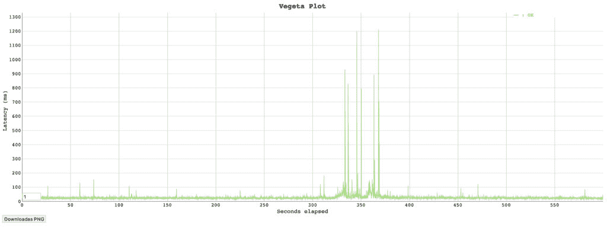

# 不停机升级 Istio

> 原文：<https://thenewstack.io/upgrading-istio-without-downtime/>

[](https://www.linkedin.com/in/nick-nellis/)

 [尼克·内利斯

尼克是 Solo.io 的现场工程师，专门研究多集群服务网格。他也是 Istio 贡献者，多年来一直在消费 Istio。](https://www.linkedin.com/in/nick-nellis/) [](https://www.linkedin.com/in/nick-nellis/)

在我写这篇博客的时候，Istio 正在发布 1.11 版本，所以这是一个很好的机会让我们来讨论一种在不停机的情况下升级 Istio 的方法。如果您使用 Istio 已经有一段时间了，并且已经将它部署到您的环境中，那么您可能正在运行一个非常旧的版本。截至 8 月 24 日，Istio 1.9 不再受[支持](https://istio.io/latest/news/support/announcing-1.9-eol/)。这意味着您的旧版本不再接收有助于保护您安全的关键补丁和更新。Solo.io】通过 Gloo Mesh 及其对当前版本和之前四个版本的长期支持(LTS)支持旧版本的 Istio 。

然而，升级是一个好主意，所以让我们偿还一些技术债务并升级您的 Istio 部署，以便您的应用程序可以利用最新的功能并保持安全。这个博客将解释一个架构和过程，它将帮助您使您的 Istio 部署恢复合规性，并为您将来更容易的升级做好准备。


## **一次升级一个版本**

Istio [建议](https://istio.io/latest/docs/setup/upgrade/)一次升级一个次要版本，[升级到 1.8，你可以从 1.9 跳到 1.10](https://istio.io/latest/blog/2021/direct-upgrade/) 。这意味着如果你还在 Istio 1.6 上，他们建议你升级三次才能到 1.10 (1.6→1.7→1.8→1.10)。使用下面提出的架构，您可以通过并排测试来跳过这些版本。这可能会节省你几个小时，让你更安全、更有效地赶上进度。


Istio.io 升级警告

## **Istio 的两种故障模式**

首先，让我们讨论一下 Istio 因停机而影响工作负载的两种主要方式。

要讨论的第一个故障模式是 Istio 边车的配置传播损失。如果您的 istio-agent sidecars 失去了与 Istiod 通信的能力，或者与正在发送的配置不兼容，您的工作负载将无法加入网格或与网格通信。这甚至会影响现有的工作负载，因为端点发现将不是最新的，您可能会尝试访问不再存在的工作负载。但是，新的工作负载将无法加入，并将保持关闭状态，直到问题得到解决。由于这种类型的中断，建议 istio 代理匹配并保留与控制平面(Istiod)相同的版本。在升级过程中，现有的控制平面部署保持不变，而不是直接升级，这也是有意义的。进行蓝/绿部署是在不停机的情况下升级 Istio 的一个步骤。


蓝/绿 Istio 控制平面展开

第二种故障模式通常更为关键，即通过入口网关的流量丢失。与失去控制平面不同，入口网关的中断会对您的最终用户产生直接影响。由于这是交通流量的关键路径，因此在不停机的情况下升级 Istio 时应格外小心。这包括如果升级失败，能够回退到现有网关。这就是为什么还建议进行蓝/绿入口网关部署。下面显示的是使用外部 Kubernetes 负载平衡服务的升级示例，该服务可以为流量选择“蓝色”或“绿色”入口网关。


蓝/绿网关升级

## **无需停机即可升级 Istio 的架构**

扩展两个故障域的缓解措施，我们可以展示一些较新的 Istio 特性如何帮助我们在不停机的情况下部署和升级 Istio。这个解决方案在很大程度上依赖于 [Istio Canary 部署](https://istio.io/latest/docs/setup/upgrade/canary/)功能。在 1.6 中引入，它允许我们并排部署多个版本的 Istio 控制面板并迁移工作负载。我们也可以使用相同的机制来金丝雀部署入口网关，使用我们自己的托管负载平衡服务。


零停机 Istio 部署架构

当前最好的方法是使用 Istio 操作符来部署带有 Istio operator 配置的 Istio 组件。由于版本之间的运营商兼容性问题，我们必须为每次版本升级部署新的运营商。由于这个限制，通过 Helm 部署 Istio 可能也一样容易，我们可能会在将来推荐这样做。(由于 IstioOperator CRD 比传统的舵值文件更方便，所以现在不推荐使用它。)一旦部署了操作符，我们就可以部署我们的多个 IstioOperator 配置(一个用于 istiod，一个用于每个网关)。每种配置的示例如下所示。

下面是一个带有修订标签的 Istiod 部署示例。它将由 1-9-7 Istio 运营商部署。

```
apiVersion:  install.istio.io/v1alpha1
kind:  IstioOperator
metadata:
  name:  1-9-7
  namespace:  istio-system
spec:
  profile:  minimal
  tag:  1.9.7
  revision:  1-9-7

  # Traffic management feature
  components:
    # Istio Gateway feature
    # Disable gateways deployments because they will be in separate IstioOperator configs
    ingressGateways:
    -  name:  istio-ingressgateway
      enabled:  false
    -  name:  istio-eastwestgateway
      enabled:  false
    egressGateways:
    -  name:  istio-egressgateway
      enabled:  false

```

这里有一个定制负载平衡服务的网关部署示例。我们可以使用服务选择器来蓝色/绿色网关部署的未来版本。注意:我们必须将入口网关服务修改为一个`ClusterIP`服务，这样它就不会创建自己的负载平衡器。

```
apiVersion:  v1
kind:  Service
metadata:
  name:  istio-ingressgateway
  namespace:  istio-gateways
spec:
  type:  LoadBalancer
  selector:
    istio:  ingressgateway
    # select the 1-9-7 revision
    version:  1-9-7
  ports:
  -  name:  status-port
    port:  15021
    targetPort:  15021
  -  name:  http2
    port:  80
    targetPort:  8080
  -  name:  https
    port:  443
    targetPort:  8443
  -  name:  tcp
    port:  31400
    targetPort:  31400
  -  name:  tls
    port:  15443
    targetPort:  15443
---
apiVersion:  install.istio.io/v1alpha1
kind:  IstioOperator
metadata:
  name:  ingress-gateway-1-9-7
  namespace:  istio-gateways
spec:
  profile:  empty
  tag:  1.9.7
  revision:  1-9-7
  components:
    ingressGateways:
      -  name:  istio-ingressgateway-1-9-7
        namespace:  istio-gateways
        enabled:  true
        label:
          istio:  ingressgateway
          version:  1-9-7
          app:  istio-ingressgateway
        k8s:
          service:
            # Since we created our own LoadBalanced service, tell istio to create a ClusterIP service for this gateway
            type:  ClusterIP

```

因为我们创建了自己的负载平衡服务，所以告诉 Istio 为这个网关创建一个 ClusterIP 服务

## **如何迁移您的边车**

部署新的 Istio 控制平面后，您可以将应用程序工作负载迁移到新的 Istio 部署中。如果您已经在使用修订版和修订版标签，那么应该像更新名称空间标签`istio.io/rev=<new_revision>`一样简单。然后，您将需要重新创建您的豆荚，以获得更新的代理边车。

这里有一个更新 sidecar 版本的滚动重启命令的例子。

```
kubectl rollout restart deployment/nginx  -n  nginx

```

## 

## **迁移到修订版**

如果您当前没有使用修订版或 canary 部署，那么迁移到它们仍然是很容易的，建议您这样做。迁移的模式与版本之间的升级惊人地相似。我们建议在您现有的部署旁边部署相同的 Istio 版本，但是添加了修订标签。然后，您可以在空闲时通过移除`istio-injection=enabled`标签并添加新的修订标签`istio.io/rev=<revision>`来迁移您的应用程序 sidecars。

然而，迁移网关可能会更加困难。如果您当前的 Istio 部署拥有负载平衡服务，那么在删除现有的基础设施时，您必须格外小心。在某些情况下，迁移到新的负载平衡服务可能更容易。

## **试用我们的“不停机升级 Istio”演示！**

如果您有兴趣亲自尝试，我们已经创建了一个实验室来测试它。我们部署了两个版本的 Istio，并在向它们请求流量时迁移了 Bookinfo 应用程序。完成后，我们检查一下流量，确保它正常工作。

[Istio 升级演示](https://github.com/nmnellis/istio-upgrade-demo)



当然，你不必单干！Solo 为 Istio 和[提供](https://www.solo.io/blog/our-zero-day-response-to-an-istio-cve/)[企业生产长期支持(LTS)通过补丁和反向端口快速修复 CVEs】。](https://www.solo.io/blog/enterprise-support-for-istio-in-production/)

<svg xmlns:xlink="http://www.w3.org/1999/xlink" viewBox="0 0 68 31" version="1.1"><title>Group</title> <desc>Created with Sketch.</desc></svg>