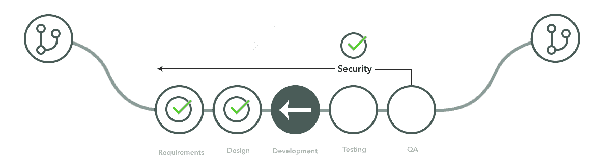

# 提升开发人员技能以应对当今的安全挑战

> 原文：<https://thenewstack.io/upskilling-developers-to-meet-todays-security-challenges/>

普通人相信他们用于网上银行、看电影、购物、点餐等的软件是安全的。他们填写验证码；他们勾选警告网站他们不是机器人的复选框；他们确认自己是人类；并且是“安全的”但我们都意识到，填写验证码并不能保护我们免受软件漏洞和供应链攻击，如太阳风和殖民管道黑客。我们的第一道防线是编写代码的开发人员。

## 向左移动以保护软件

 [洛里·洛鲁索

Lori 是 JFrog 的 DevRel 社区经理。她管理 SuperFrogs 项目，并支持 JFrog 的开发者权益。她是 VJUG(虚拟 Java 用户组)的共同组织者，经常在虚拟和现场活动中志愿支持其他 JUG。](https://www.linkedin.com/in/lorilorusso/) 

开发人员将以极快的速度进行编码，但是我们如何缩小快速开发和检查我们的构建信息之间的差距——构建代理收集的所有信息，包括依赖项、工件、项目模块等。—安全吗？我们如何在验证我们没有遭受攻击的风险的同时，实现快速开发和部署的目标呢？术语“左移”被广泛用于描述将安全扫描和遵从组件带到开发的开始，而不是昂贵的事后想法，这是我们希望所有开发人员达到的标准。

我与 JFrog 的首席技术官约夫·兰德曼和 CISO·T2·莫兰·阿什肯纳兹坐在一起，从首席技术官和 CISO 的角度探讨了开发人员向左转的意义。

两人都认为教育和技能提升是重新定位开发人员的关键，因此向左移动以增加开发过程的安全性不再是一种转变，而是一种标准做法。

“作为 CISO，”Ashkenazi 说，“我的责任是让开发者做出正确的决定。这非常具有挑战性，因为存在知识差距。我们希望我们的开发人员了解潜在安全漏洞的广度和深度，寻找危险信号，以便他们能够独立地做出正确的决策，并相应地调整他们的开发。但有时他们没有这方面的知识。我的工作是给他们工具[和]培训，并和他们一起工作来扩展他们的知识。安全工具为开发人员设置了防护栏，这样他们就可以在开发过程中更好地了解代码中是否存在漏洞或弱点。开发人员应该获得安全授权，而不是被封锁——保护产品是安全团队和开发人员的共同责任。”

兰德曼附和了这一观点。“我完全同意，我们不需要阻止开发人员，但授权给他们，让他们明白安全只是另一种形式的调试，”他说。“开发人员对获取知识和做出明智的决策以避免风险和代价高昂的错误感到兴奋。”

“被黑不仅仅是被黑，”兰德曼继续说道。“被黑可能意味着倒闭；游戏可以结束了。我们正在创建越来越多的软件，自动化流程，加快开发发布周期，从消费者到企业到政府，每个人都处于数字化转型阶段。我们正在编写代码，采用别人的代码，给我们的软件增加更多的层次和复杂性，[所以]对“黑暗力量”的刺激只会越来越大。实践 DevSecOps，缩小开发人员和安全团队之间的信任和知识差距，建立故障安全机制来帮助减少漏洞，当发现问题时，在投入生产之前扫描和失败构建——这些是我们可以保护我们软件的方法。但是我们需要从发病开始；我们需要从开发商开始。"

## 准备好工具和培训

随着技术社区中围绕软件材料清单(SBoM)和供应链安全流传的所有流行词汇 bingo，有一件事是肯定的:软件正在运行这个世界，有许多坏人正在寻找机会渗透漏洞。当他们成功时，结果是混乱。消费者失去了信任，公司可能会支付天文数字的费用来修复已经造成的损害——或者完全失去业务。公司需要提高开发人员的技能，提供必要的工具和培训，以创建一个更强大、更有凝聚力的 DevOps 或 DevSecOps 团队。安全始于发展，教育是他们完成工作所需的转变。

*要了解更多关于 DevOps 和其他云原生技术的信息，请考虑参加 10 月 11 日至 15 日举行的 [KubeCon+CloudNativeCon 北美 2021](https://events.linuxfoundation.org/kubecon-cloudnativecon-north-america/) 。*

<svg xmlns:xlink="http://www.w3.org/1999/xlink" viewBox="0 0 68 31" version="1.1"><title>Group</title> <desc>Created with Sketch.</desc></svg>