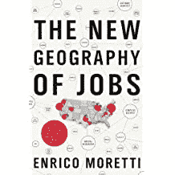

# 美国城市试图用现金吸引远程技术人员

> 原文：<https://thenewstack.io/us-cities-try-luring-remote-tech-workers-with-cash/>

据《华尔街日报》 [上周](https://www.livemint.com/technology/tech-news/71-cities-and-towns-are-paying-tech-workers-to-abandon-silicon-valley-it-s-working-11658155215863.html)报道，城市和小城镇正在分发大量现金来吸引可以远程工作的居民。

这是报纸之前记录的趋势。“很多人问我，‘你到底在托皮卡做什么？’"一名 41 岁的远程工作者在 10 月告诉*日报* ["他们给了我一万美元。《华尔街日报》写道，他们只是托皮卡慷慨资助的 19 个接受者之一，托皮卡也只是几十个“用诱人的奖励来吸引偏远地区员工”的城市之一。](https://www.msn.com/en-us/news/us/these-cities-and-small-towns-want-remote-workers/ar-AAPiARn)

逻辑很简单。与其竞相把公司吸引到一个城市，为什么不干脆说服工人呢？《华尔街日报》上周指出，“这些地方成功吸引和留住的每一个远程员工，就像是获得了一个新工厂或公司办公室的一小部分”(引用布鲁金斯学会(Brookings Institution)一位政策主管的话，他指出，这也要便宜得多，风险也小得多)。

《华尔街日报》补充道，“由于这些经济发展项目的规模相对较小，即使是小社区也能以一种他们从未有过的方式参与进来。”

当然，一个新的苹果公司在镇上的办公室可以启动一个城市的经济活动。恩里科·莫雷蒂在 2012 年出版的新书《新的工作地理》中估计，在一个城市中，每一个新的高科技工作岗位，都会创造五个非高科技工作岗位——服务员、理发师、木匠、护士、教师、律师。但《华尔街日报》指出，将整个公司或办公室吸引到一个地区的成本比试图吸引一些员工的成本更高。

莫雷蒂写道:“可以说，它们为该国被排除在科技繁荣之外的部分地区构成了一种新型的刺激计划——这是大型科技公司的好意。”。

愿意远程招聘的公司有一个意想不到的好处？他们的多样性指数提高了。

## 在移动中

根据 MakeMyMove.com 的列表，现在美国将近一半的州都有一个城市提供某种奖励。有阿拉斯加、阿拉巴马、佐治亚、伊利诺伊、印第安纳、爱荷华、堪萨斯、肯塔基、路易斯安那、缅因、明尼苏达、密西西比、内布拉斯加、新墨西哥、纽约(布法罗或罗切斯特)、俄亥俄、俄勒冈、宾夕法尼亚、田纳西、德克萨斯、佛蒙特、西弗吉尼亚和威斯康星。

MakeMyMove 将自己描述为一个“数字市场”,将远程工作人员与诱人的城镇相匹配,《华尔街日报》称，城市和城镇现在甚至与该网站签约，以建立搬迁激励计划。去年夏天开始的时候，MakeMyMove 只列出了 40 个程序，但是现在这个数字已经攀升到了 T2 的 71 个程序。

“如果说过去的两年教会了我们什么，那就是生命太短(而日子太长)而不能困在一个你不喜欢的地方，”MakeMyMove 在最近的[博客帖子](https://www.makemymove.com/articles/how-to-find-your-own-schitt%E2%80%99s-creek)中写道。

## 事情是如何发展的

《华尔街日报》上周指出，“因为这些计划专门针对高工资的远程员工，所以利用这些计划的人中有很大一部分在科技行业工作，尤其是大型科技公司。”报纸给出的一个例子是，一名亚马逊工程师在 5000 美元的激励下，搬到了印第安纳州格林斯堡(人口 11221 人)。

在俄克拉荷马州塔尔萨的一个项目中，参与者曾为 Adobe、Airbnb、亚马逊、苹果、戴尔、谷歌、微软、Lyft、网飞、甲骨文和西门子远程工作，甚至还有一名 IBM 项目经理。“我在这里感受到了前所未有的爱和了解，”他告诉该报——甚至被选为他所在社区协会的副主席。

塔尔萨还有一位 Meta 远程工作者，他之前住在硅谷的一居室公寓里，他告诉《华尔街日报》,在塔尔萨租一个带院子的三居室房子花费更少。“在某种程度上，我已经能够找到自己了。”

虽然塔尔萨的项目是由慈善机构乔治·凯泽家庭基金会资助的，但大多数项目都是从城市自己的经济发展基金中获得资金的。《华尔街日报》指出，塔尔萨的项目已经吸引了 1，360 人来这座城市，这个数字预计到今年年底将上升到 2，400 人。

但不仅仅是塔尔萨。

《华尔街日报》10 月份报道称，已经有 71 人被浅滩经济发展局(Shoals Economic Development Authority)一个 60 万美元的项目(由半美分的销售税资助)吸引到阿拉巴马州。

另外 50 名远程工作人员(和 60 名家庭成员)通过 Intuit 执行主席和他的妻子发起的 2500 万美元的项目前往西弗吉尼亚州。数百人被吸引到佛蒙特州——尽管“一些立法者质疑付款是否真的是人们搬到那里的决定因素。”

## 朝那个方向去了

这位经济学教授在 2012 年的著作中警告称，“创新中心”和其他所有人的命运将出现“巨大分化”。

有一个反对这些项目的案例。

威斯康星大学麦迪逊分校的助理教授 Tessa Conroy 警告《华尔街日报》,该项目的一些参与者可能已经在考虑搬到一个城镇。

如果他们不是——好吧，那就有自己的问题了。"这真的是一个理想的居民吗，一个有收入的人？"

这位托皮卡的 41 岁远程工作者甚至告诉《华尔街日报》:“我们不必永远呆在这里。但如果我们喜欢，我们可以。”

康罗伊提出了另一种方法:投资阻止现有居民搬走。

但是这些项目确实将高收入者带入了一个社区。根据经济创新集团(Economic Innovation Group)委托进行的一项分析(T1)，从一开始，塔尔萨的项目就引进了平均年收入超过 104，600 美元的工人。

但该分析还计算出，第一批最终创造了 5130 万美元的新本地收入，这些收入“直接归因于”那些重新安置的远程工人，同时还为经济带来了 1070 万美元的额外增长，并创造了相当于 198 个新的全职工作岗位。(这意味着在塔尔萨，每两名异地员工就有一份新工作。)

该研究得出结论，这些举措可能会“带来巨大回报”，预计到 2025 年将为当地带来 5 亿美元的新收入。

报告首先指出，否则，许多“中心地带”社区难以吸引和留住受过高等教育的工人，并面临“高科技、高工资行业和工作岗位的滞后增长”。

但是，现在城市之间只是为了争夺远程工作人员而相互竞争吗？这是“新的军备竞赛”，俄克拉荷马州斯蒂尔沃特商会的首席执行官 10 月份告诉《华尔街日报》。两个已经收到该市邀请的人回答说，他们仍在考虑其他城市的激励措施——3M 公司一名有进取心的远程员工甚至制作了一份电子表格，记录每个城市的优势。

## 改变工作场所

就在疫情之前，在 2019 年底，美国只有 4%的远程职位广告工资超过 8 万美元——但到 2021 年秋季，这一数字攀升至 15%。这是根据《华尔街日报》10 月份的一篇文章，引用了求职网站[theladders.com](https://www.theladders.com/)的制造商的统计数据，其首席执行官认为这一趋势是“美国劳动力中一个真实的、结构性的永久变化。”

去年九月，一项针对美国全职员工的[盖洛普民意测验](https://news.gallup.com/poll/355907/remote-work-persisting-trending-permanent.aspx)发现，25%的全职员工在家工作，另外 20%是兼职。但对于白领来说，这个数字甚至更高，高达 67%的人说他们要么完全在家工作(41%)，要么一周至少有一部分时间在家工作(26%)。

然而，该调查最引人注目的统计数据是员工对这种安排的喜爱程度。“91%的美国员工至少有一部分时间是远程工作的，他们希望在疫情之后，他们在家工作的能力能够持续下去……十分之三的远程工作员工表示，如果他们的公司取消远程工作，他们极有可能寻找另一份工作。”

虽然员工肯定愿意远程工作，但也可能会给公司带来意想不到的好处。

一月份，Slack 的“未来论坛”研究联盟发现，西班牙裔、黑人和亚裔/亚裔美国知识工作者对远程或混合工作的偏好更高，本周，脸书的首席多元化官表示，远程工作有助于他们从代表性不足的群体中招聘(并留住)更多员工。

“硅谷从来都不是黑人占主导地位的地方，”高管[在一次采访中告诉《华盛顿邮报》。"所以你会看到人们选择像亚特兰大、纽约这样的地方."](https://www.msn.com/en-us/news/us/facebook-s-workforce-grew-more-diverse-when-it-embraced-remote-work/ar-AAZJtBV)

在 2021 年至 2022 年期间，Meta 的美国劳动力中白人工人的比例下降了 1.5%，同时该职位描述为黑人、西班牙裔、多种族和亚裔工人的比例“略有上升”。(女性领导人的数量也增加了 1.2%，黑人和西班牙裔经理的数量增幅较小，不到 0.5 个百分点。)

通过减少对特定城市的强调，远程工作可能会给我们的对话增加新的声音——一些投资者已经在探索这种可能性。

在早期风险公司 O'Reilly AlphaTech Ventures，出版商蒂姆·O ' Reilly 了解到“打破硅谷的地理孤立主义”的重要性。

在他接受 TechCrunch 采访的 [2020 中，奥赖利认为，当他的长期投资伙伴布莱斯·罗伯茨在不同的地方追求不同类型的投资时，“他自然会发现反映美国多样性的企业家”，他们最终拥有超过 50%的女性创始人和 30%的有色人种。](https://techcrunch.com/2020/06/26/tim-oreilly-makes-a-persuasive-case-for-why-venture-capital-is-starting-to-do-more-harm-than-good/)

因此，也许远程工作最终会带来机会的重新分配。

几十个美国城市正在探索这种可能性。

* * *

# WebReduce

<svg xmlns:xlink="http://www.w3.org/1999/xlink" viewBox="0 0 68 31" version="1.1"><title>Group</title> <desc>Created with Sketch.</desc></svg>