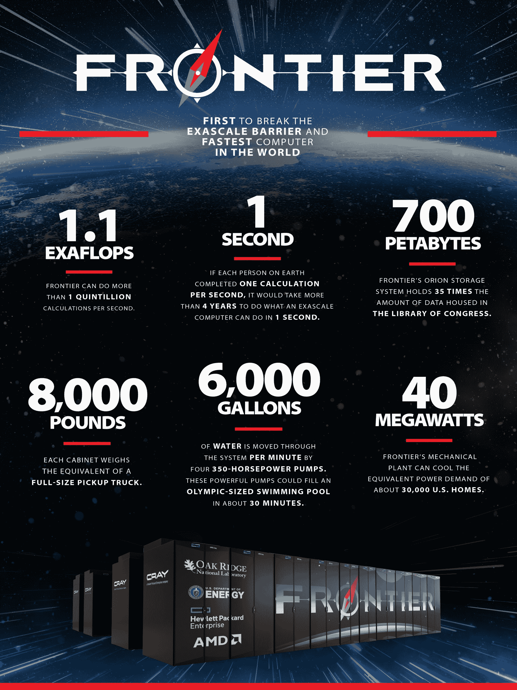

# 美国获得世界首个数据库云服务器系统的吹嘘权

> 原文：<https://thenewstack.io/us-gets-bragging-rights-for-worlds-first-exascale-system/>

第一台超级计算机登陆地球。

美国能源部橡树岭国家实验室(ORNL)的一台名为 Frontier 的新型超级计算机在 LINPACK 基准测试中的持续性能为 1.1 万亿次。

该基准将 Frontier 置于周二发布的全球最快超级计算机 500 强排行榜的首位。该系统淘汰了位于日本神户的 RIKEN 计算科学中心的 Fugaku 系统，该中心连续两年蝉联榜首。

## 奔向顶峰

触发器的度量包括 18 个零，美国、中国、日本和欧洲之间首次达到这一里程碑的竞争已经持续了十多年。一个触发器大约比一个十亿次触发器快 1000 倍，这是 2008 年由 IBM 在洛斯阿拉莫斯国家实验室的超级计算机首次实现的。

前沿超级计算机基于 HPE 克雷 EX235a 架构，并拥有 AMD 的 EPYC 64C CPU 和本能 MI250X 图形处理器。该系统的核心总数为 8，730，112，包括 CPU 和 GPU。它有 700 的存储空间分布在橱柜上。

日本的 Fugaku 系统屈居第二，性能达到 442 千兆次。该系统采用基于 64 位 ARM 架构的 A64FX 处理器。

排在第三位的是芬兰的新 LUMI 系统，该系统隶属于欧盟领导的一个公私合作的超级计算项目 EuroHPC。该系统提供了 152 的性能，并且使用了 AMD 的 Epyc 芯片。

AMD 是前 500 强中的大赢家，前 500 强中的前三个系统中有两个使用了该公司的 Epyc 芯片。AMD 在 x86 服务器市场上与英特尔展开竞争，英特尔预计将把自己的芯片放在一台名为 Aurora 的超大型计算机上，该计算机将很快投入使用。英特尔首席执行官[帕特·基尔辛格](https://www.linkedin.com/in/patgelsinger/)表示，该公司的至强服务器芯片和 GPU 加速器庞特·韦奇奥将推动超级计算超越 2 万亿大关。

虽然美国可能有公开吹嘘一台万亿次计算机的权利，但有传言称[中国去年已经秘密部署了万亿次系统](https://www.nextplatform.com/2021/10/26/china-has-already-reached-exascale-on-two-separate-systems/)。中国有两个系统进入前十，包括第六名的神威太湖之光和第九名的天河 2A，这两个系统都不是万亿次系统。鉴于与美国的贸易战，中国正在开发自己的芯片，并隐瞒其技术进步，美国还禁止向中国出口英特尔等公司制造的最新超级计算芯片。

## 人工智能和量子计算

随着专门的应用程序被卸载到人工智能加速器等替代系统，以及不久的量子计算，500 强名单可能处于十字路口。人工智能系统应用了一种基于概率和关联的新计算形式，这种系统的性能与传统计算的逻辑风格不同。 [ML Commons 的 MLPerf](https://mlcommons.org/en/) 已经成为各种加速器上人工智能应用的领先基准，包括 GPU、ASICs 和其他芯片。

慕尼黑附近的 [Liebniz 超级计算中心(LRZ)](https://www.lrz.de/english/) 正在测试新系统，其中包括量子计算机和由 HPE 和[cereberas](https://www.cerebras.net/)联合制造的专用机器学习系统，该系统制造了一个 85 万字节的专用人工智能芯片，只有一个晶片大小。

“如果你做类似 LINPACK 的应用，这是一个很好的衡量标准。但是如果你不做类似 LINPACK 的应用程序，它就没有多大用处，”LRZ 主任 Dieter Kranzlmüller 博士说。

LRZ 现在不再评估超级计算机的原始性能，而是着眼于人工智能等工作负载，以获得更快的科学计算结果。

“我真正想做的是确保基础设施适合应用程序用户的需求，这正是我们如何进行采购，也是我们想要探索的，”Kranzlmüller 说。

英伟达已经在为人工智能工作负载推出一种替代的超级计算性能衡量标准。在正在进行的国际超级计算会议上。英伟达和洛斯阿拉莫斯国家实验室宣布了一个名为 Venado 的新系统，该系统的 AI 性能将超过 10 exaflops，将于 2023 年或 2024 年上线。

<svg xmlns:xlink="http://www.w3.org/1999/xlink" viewBox="0 0 68 31" version="1.1"><title>Group</title> <desc>Created with Sketch.</desc></svg>