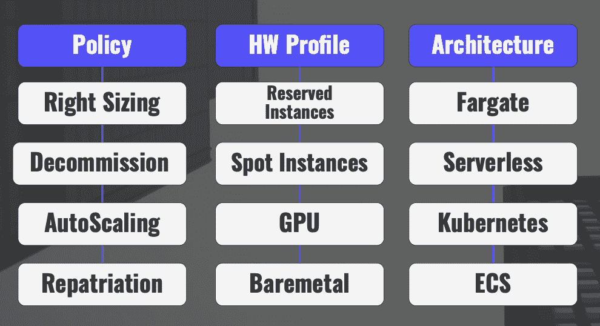
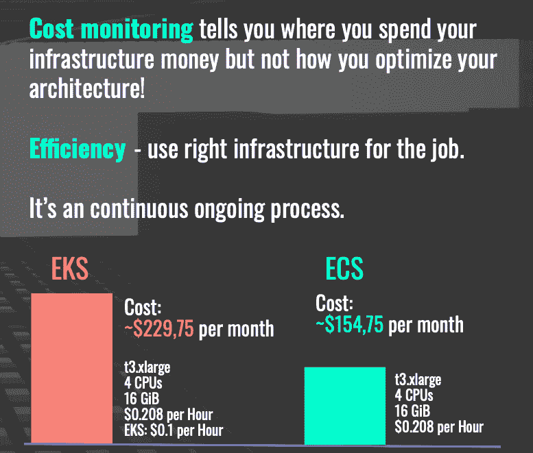
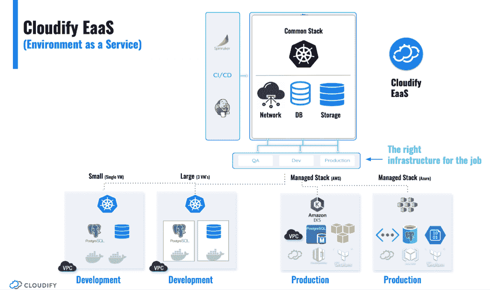
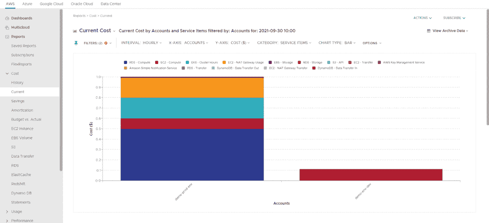
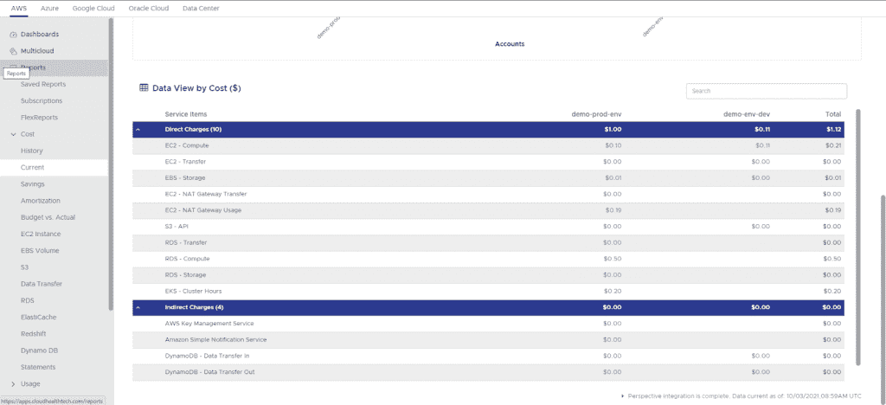

# 利用监控洞察力优化成本

> 原文：<https://thenewstack.io/use-monitoring-insights-to-optimize-cost/>

 [纳蒂·沙洛姆

纳蒂·沙洛姆是 Cloudify 的 CTO 和创始人。他是一位连续创业者，也是开源、多云协调、网络虚拟化、DevOps 和边缘计算领域的思想领袖和演讲者。Nati 获得了包括 YCombinator 在内的多项认可，是 cloud native 和 DevOps Israel 团队的领导者之一。](http://cloudify.co) 

对公共云的“淘金热”的副作用之一是，许多组织现在面临着快速增长的云成本，包括大规模和突然的高峰。Anodot 的调查中，约 55%的受访者表示他们对云成本感到“惊讶”,或者遇到过云成本突然飙升的情况。随着软件公司规模的扩大，这个问题变得更加严重。许多超大规模公司已经超过了将其总 COGS 的 50%分配给云支出的水平，这使得云基础架构成本优化成为一项战略要务，正如我在之前的帖子[中所指出的，减少云支出不一定是一个悖论](https://thenewstack.io/reducing-cloud-spend-need-not-be-a-paradox/)。

在这篇文章中，我将比较两种控制云成本的方法:成本监控和成本效率。我还将使用一个具体的示例来说明我们如何通过为开发和生产创建独立的优化环境，将效率提高 10 倍，并接近最佳效率水平。

造成这一成本上升问题的部分原因是人为错误。让我们看看下面的真实例子:

*“一名员工选择了错误的 EC2 实例，在错误被发现并纠正之前的几天内，公司损失了近 40，000 美元。”*

*“内部用户让基于云的 GPU 继续运转，即使对它们的工作已经停止。”— Danny Zalkind，Kenshoo 的 DevOps 组经理*

## 实现成本效益的方法

成本效益就是让合适的基础设施与工作相匹配。

云以不同的成本提供了广泛的基础设施资源。例如，仅在 EC2 上，AWS 目前就提供了近 400 个不同的实例，可以跨存储选项、网络和操作系统进行选择。更复杂的是，用户可以从位于全球 24 个地区和 77 个可用区域的机器中进行选择。

这只是您可以用来优化基础架构的选项中的一小部分，而且这个列表还在继续增长。为了简单起见，我将主要的优化选项分为三个主要类别。

1.  策略指的是使用模式。例如，停用策略是指某个工作负载有一个时间限制，以避免运行未使用的闲置资源。自动扩展是我们使用策略驱动的方法将基础架构容量与实时需求相匹配的另一种方式。放置策略可用于在运行时根据可用性、位置等为特定工作负载定义正确的基础架构目标。在遣返策略中，我们使用混合云将一些工作负载卸载到专门为运行此特定工作负载而构建的高度优化的专用云基础架构中。Dropbox storage 或网飞 CDN 就是这种工作负载的一个例子。

2.  硬件配置文件是指选择可提供最佳性价比的特定计算或存储资源组合。仅这一类别就包括从 Spot 到专用裸机的数千种可能组合。

3.  架构是指特定平台架构的选择，如 EKS、ECS、Servlets 等。通常，平台的选择需要专门为该平台编写应用程序，以实现最佳的性价比。

## 成本监控与成本效率

成本监控可以告诉您基础架构成本的支出情况，还可以突出潜在的低效领域。然而，对于如何解决这些效率低下的问题，它提供的指导很少。与任何其他监控系统一样，成本监控会很快用数据淹没你，使你很难从噪音中过滤出重要的见解。

另一方面，成本效益不断关注如何将特定工作负载与正确选择的体系结构和基础架构相匹配。这种优化经常会涉及到代码或架构的改变，因此它需要更专注和持续的工程工作。

下面的例子很好地展示了这种差异。在本例中，我们使用相同的容器化工作负载，并在同一家云提供商 EKS 和 ECS 的两个不同平台上运行。从该基准测试中可以看出，通过选择 ECS 而不是 EKS，我们可以节省 67%的成本。在这种特殊情况下，这种优化是以牺牲可移植性为代价的。

这个非常简单的例子告诉我们，成本效益是一项持续的工程任务，因为我们必须不断地在相互冲突的权衡中做出选择，这些权衡有时会产生长期影响，并且不能通过简单地使用工具来解决问题。

在本例中，ECS 比 EKS 节省了 67%,但代价是限制了工作负载的可移植性。

## 实现最佳—适合工作的基础架构

就效率而言，理论上的最佳做法是专门为每个特定的工作负载定制基础架构。这实际上是不可能的，但尽管如此，它给了我们一个更高的基准，我们可以努力实现。

随着基础架构选择和平台数量的持续增长，在细粒度基础架构资源级别处理工作负载和基础架构之间的匹配变得越来越困难。

虽然可供选择的基础架构非常多，但工作负载环境的类型相对较少。如果我们考虑消耗大量基础架构资源的工作负载，情况尤其如此。

环境即服务(EaaS)提供了一种为每个工作负载环境创建优化堆栈的方法。这种环境类型的一个例子可以是:

*   开发和生产环境

*   机器学习环境

*   每个项目/客户/产品的环境

我们将这些环境称为“认证环境”

## 示例—优化开发与生产环境

在下面的例子中，我们采用了一个典型的基于 Kubernetes 的环境，其中包括 [Kubernetes](https://thenewstack.io/category/kubernetes/) 集群以及共享基础设施服务，如网络、存储和数据库。

我们创建了同一个堆栈的多个版本。第一个针对 AWS 和 Azure 中的生产进行了优化。在这种情况下，我们选择了完全托管的堆栈、托管的 Kubernetes (EKS，AKS)、托管的存储和数据库。对于开发环境，我们选择了一个针对低成本和灵活性进行优化的堆栈。对于该堆栈，我们选择了 Minikube 和 K3S 作为轻量级 Kubernetes、单实例存储( [Minio](https://min.io/?utm_content=inline-mention) )、Postgres 和一个简单的网络，它们都运行在单个虚拟机上。

下图显示了该环境不同风格的具体映射。

## 实现 10 倍成本节约

我们使用实时成本监控来衡量每个环境的实际成本。正如我们所料，开发环境成本相当于单个虚拟机的成本，比普通的生产堆栈慢 10 倍。

有趣的是，通过查看详细的资源细分，我们还可以看到，每当我们创建一个托管资源时，包括的资源数量和相关的隐藏成本都要高得多，如下面的资源细分表所示:

您应该注意到，在这种情况下，我们没有包括地理冗余之类的东西，这将使生产资源数量翻倍，并增加带宽和网络成本。这些生产资源的动态性质也使得预测实际成本的能力几乎不可能，而在开发堆栈中，我们在单个虚拟机中获得所有资源，这使得成本预测相当确定。

## 最终注释

成本效益是一项持续的工程任务。我们可以通过将我们的工作负载转移到云中，或者通过选择云原生堆栈和自动化工具，尽可能使用 spot 实例等来实现更高的效率。是一个好的开始，但仍会使我们远离最佳状态。

成本监控工具可以帮助我们检测异常情况，并向我们显示我们在哪里花费了基础架构成本，但它不能取代优化我们的堆栈所需的持续工程工作。

随着基础架构选择和平台数量的不断增长，在粒度基础架构资源级别优化堆栈几乎是不可能的。EaaS 通过采用一种更加跨粒度的方法简化了这项工程工作，在这种方法中，我们根据目标使用情况将我们的环境组织成少量高度优化的堆栈。这种环境的一个常见例子是分离生产和开发环境，正如我们在上面的例子中所演示的。

用这种方法，我们可以更接近理论上的最佳值。

## 这不仅仅是成本的问题

向环境即服务和认证环境的转变通过使我们的开发环境民主化，带来了除成本效益之外的其他好处(例如更好的敏捷性)。敬请关注这方面的更多内容。

<svg xmlns:xlink="http://www.w3.org/1999/xlink" viewBox="0 0 68 31" version="1.1"><title>Group</title> <desc>Created with Sketch.</desc></svg>