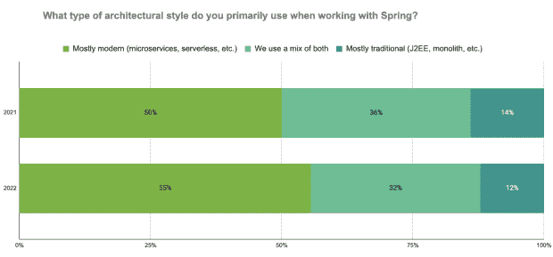

# Spring 的使用转向了现代应用和架构

> 原文：<https://thenewstack.io/use-of-spring-shifts-toward-modern-apps-and-architecture/>

我们正忙着完成今年的“春天的状态”报告，在这个过程中，我们发现自己在反思一些让春天变得伟大的事情。“Spring 状态”调查汇集了数千名 Spring 开发人员的意见，是了解企业应用开发和交付方向的一个好地方。

对于商业领袖、应用开发团队和 IT 高管来说，这是一个了解他们的同行如何以及在哪里使用 [Spring framework](https://thenewstack.io/microsoft-vmware-add-azure-spring-cloud-enterprise-tier/) 的机会。这些见解有助于他们制定今年的数字业务战略。

作为调查的赞助商，VMware 还利用反馈来集中我们自己的努力，以确保 Spring 在软件基础架构和应用程序开发方面领先于最重要的创新。

例如，去年回复的 Spring 开发者告诉我们他们需要更快的启动时间和更少的内存使用。于是经过三年多的孵化，Spring Native 与 [Spring Framework 6](https://spring.io/blog/2022/11/16/spring-framework-6-0-goes-ga?utm_source=thenewstack.io&utm_medium=referral&utm_content=TNS4) 和 [Spring Boot 3 合二为一。](https://spring.io/blog/2022/11/24/spring-boot-3-0-goes-ga?utm_source=thenewstack.io&utm_medium=referral&utm_content=TNS4)如今，原生映像为 Java 应用程序提供了几乎即时的启动时间和更少的内存消耗。

使用 Spring 构建它们，您甚至可以从 VMware 获得[生产支持](https://spring.io/support?utm_source=thenewstack.io&utm_medium=referral&utm_content=TNS4)，这是社区要求的另一件事。我们还改进了与第三方库的兼容性，与社区一起在这个过程中修复和改进我们的原生支持，使 Spring 对更多的用例有用。

为了更详细地了解将 Spring 用于 GraalVM 的用例，[该视频深入](https://www.youtube.com/watch?v=TOfYlLjXufw?utm_source=thenewstack.io&utm_medium=referral&utm_content=TNS4)了 Spring Framework 6 和 Spring Boot 3 中用于 GraalVM 的超前(AOT)编译引擎。完全披露:这是两个小时长，所以安顿下来！

我们将在 1 月 24 日至 26 日举行的在线会议上发布完整的“春季状况”报告。但与此同时，我们想强调一个令人兴奋的具体发现，即开发人员越来越多地使用 Spring 来构建现代应用和微服务，而不是传统应用和 monoliths。

几年来，Spring Boot 一直是构建基于 Java 的微服务(T2)的首选框架。它也非常适合支持构成当今数字业务的 API 优先架构。这就是为什么 VMware 和 Spring 社区中的其他人一直在努力使 Spring 更容易与更多的库和生态系统一起使用，包括使用 Kubernetes 的[容器化环境和像](https://www.youtube.com/watch?v=Xe7K1biKcs0?utm_source=thenewstack.io&utm_medium=referral&utm_content=TNS4) [Azure](https://tanzu.vmware.com/content/blog/azure-spring-apps-enterprise-live-view-app-accelerators?utm_source=thenewstack.io&utm_medium=referral&utm_content=TNS4) 这样的公共云服务。

Spring Cloud 今年也发布了一个重要版本，使其与更广泛的产品组合保持一致，包括 Java 17 基线和迁移到 Jakarta EE 名称空间。看看 Josh Long 的这篇关于 Spring 框架和 Java 17 上的 Spring Boot 的高水平文章。为此，我们已经听说了升级 Java 的挑战。然而，你们中的大多数人都在使用 Java 8，渴望升级到 17，这样你们就可以充分利用 Spring 的所有优点，从增强的安全性到改进的[应用级可观察性](https://spring.io/blog/2022/10/12/observability-with-spring-boot-3?utm_source=thenewstack.io&utm_medium=referral&utm_content=TNS4)。

这些只是我们利用“春天的状态”调查继续从根本上改善[企业开发者体验](https://tanzu.vmware.com/content/analyst-reports/forrester-vmware-executive-checklist-for-devex?utm_source=thenewstack.io&utm_medium=referral&utm_content=TNS4)的一些方式。Spring [已经发展了近 20 年](https://tanzu.vmware.com/content/blog/vmware-developer-experience?utm_source=thenewstack.io&utm_medium=referral&utm_content=TNS4)，随着用户和充满激情的 Spring 社区的宝贵投入，这种发展只会继续下去。

<svg xmlns:xlink="http://www.w3.org/1999/xlink" viewBox="0 0 68 31" version="1.1"><title>Group</title> <desc>Created with Sketch.</desc></svg>