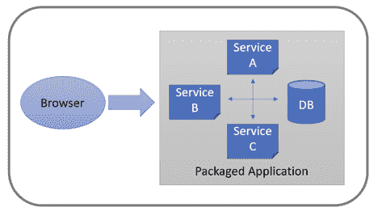
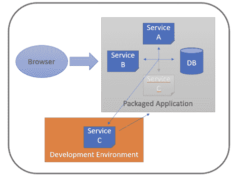

# 使用 Ruckstack 简化您的开发环境

> 原文：<https://thenewstack.io/use-ruckstack-to-simplify-your-development-environment/>

 [内森·沃克兰

内森·沃克兰已经做了 20 多年的软件开发人员，开始了几个开源项目，包括 Liquibase 和 Ruckstack。](https://www.linkedin.com/in/nathan-voxland-1942866) 

通常，Ruckstack 用于打包和连接您的服务、数据库等。为现场客户安装成一个单一的。但是，同样的打包逻辑也可以用来收集开发环境安装所需的一切。

问问你自己:一个新的开发人员开始从事基于服务器的应用程序需要什么？当您的有经验的开发人员跨代码的不同区域工作时，他们花费多少时间来重新配置和维护他们的本地环境？

他们需要安装和配置数据库吗？信息系统？他们需要为前端和后端代码安装和配置单独的构建工具包吗？在调试器中运行部分应用程序需要什么？

即使你不使用 [Ruckstack](https://ruckstack.com) 来将你的软件部署到产品中，它仍然可以简化你的开发过程。

## 打包您的所有产品

Ruckstack 为开发团队解决的第一个问题是简化让整个应用程序栈在他们的本地机器上运行的过程。通过在构建服务器中建立一个 Ruckstack 构建，您可以获得一个包含运行软件所需的所有内容的可安装文件。

为 Ruckstack 配置应用程序从一个 [ruckstack.yaml 配置文件](https://ruckstack.com/docs/cli/project-file)开始。对于许多人来说， [dockerfile 格式](https://ruckstack.com/docs/cli/dockerfile-services)是最简单的，因为它只需要标准的 dockerfile。但是，如果你已经利用了 [Helm](https://ruckstack.com/docs/cli/helm-services) 或 [Kubernetes](https://ruckstack.com/docs/cli/manifest-services) ，你也可以使用你现有的配置。

如果您想继续学习，而不想重复现有应用程序的堆叠工作，您可以:

1.  运行“`ruckstack init --template example`”来创建一个示例 Ruckstack 项目。
    1.  看一下生成的 ruckstack.yaml，了解一下配置应用程序需要什么
2.  运行“`ruckstack build`”创建安装程序文件
    1.  这是您想要添加到您的 buildserver 中的东西
3.  运行新的安装程序文件
4.  使用“INSTALL _ DIR/bin/example-manager start”启动服务器
5.  在 [http://localhost](http://localhost) 查看正在运行的服务器

## 插入打包的服务

虽然易于安装预打包的代码很好，但您的团队真正需要的是一种快速有效地开发和调试新代码的方法。

您已经有了快速重载和调试代码的首选工具。也许你有一个从 IDE 中运行的 Java 应用程序。也许你用`nodaemon`搭配 NodeJS。不管你用什么，你继续做你自己。

让你的 Ruckstack'ed 安装更容易的是，你的数据库和其他外部服务已经为你建立和运行。您不再需要构建、配置或计算如何运行所有支持服务。相反，您可以在您选择的开发环境中启动您的代码，并将其指向它需要的预构建、预打包和预配置的服务。注意:默认情况下，打包的服务不会暴露在内部系统之外。使用 ruckstack.yaml 文件中的“代理”设置，为外部运行的应用程序提供所需的服务。

Ruckstack 给你的最后一个优势是能够让那些本地运行的服务就像在你的打包系统中运行一样。这避免了浏览器需要处理的麻烦的后端与前端主机名差异，并允许跨服务通信继续运行，无需重新配置。

Ruckstack 通过提供一种简单的方法来透明地将流量从特定的预打包服务“重新路由”到您的开发版本来支持这一点。

在重新路由流量之前，您需要使用“/path/to/your/manager dev enable”将服务器设置为“开发模式”。如果您使用的是示例模板，则管理器被称为“示例管理器”。

`bash$ sudo bin/example-manager dev enable`

`WARNING: 'Development Mode' is designed to help with the development and testing of this system.`

`WARNING: It is NOT intended for production systems and may impact performance and/or security.`

`Enable Development Mode: [y|N]`

`y`

`Development mode enabled`

一旦启用了 dev 模式，您就可以将应用程序中的调用“重新路由”到运行在打包系统之外的服务器。

`bash$ bin/example-manager dev reroute --service backend --target-host localhost --target-port 8080`

对服务“后端”的请求现在将被代理到 http://localhost:8080

如果您正在使用示例应用程序，点击 [http://localhost](http://localhost) 会弹出一个“网关超时”窗口，因为对后端服务的请求被代理给了一个当前不存在的服务。

您可以使用以下命令从示例项目的“backend”目录本地启动后端服务:

`bash$ export POSTGRES_HOST=<CONFIGURED EXTERNAL IP>`

`bash$ export POSTGRES_PASSWORD="$(sudo bin/example-manager secure-config-data show --name postgresql --key postgresql-password)"`

`bash$ npm install`

`bash$ nodejs server.js`

`Running on http://0.0.0.0:8080`

`Notes table created`

注意，我们的后端项目有一些可配置的设置，使用环境变量将数据库指向打包的数据库。您可以根据自己的需求来决定需要配置什么以及如何配置。

现在，当你点击 http://localhost 时，应用程序像正常一样加载——但是打包的前端服务实际上是在与你单独运行的后端服务器对话。您可以看到这一点，因为您的本地服务日志请求了 GET /api/notes。

完成服务开发后，您可以使用以下命令删除重新路由:

`bash$ bin/example-manager dev remove-route --service backend`

对服务“后端”的请求现在将由打包的服务提供服务。

## 摘要

示例 Ruckstack 项目使用 NodeJS 服务，但是相同的模式适用于您使用的任何技术:

1.  下载一个预打包的、Ruckstack 格式的文件，其中包含您的整个应用程序堆栈
2.  在您选择的开发环境中启动您的代码，根据需要从预打包的服务中提取数据
3.  将打包系统中的请求重新路由到开发中的服务器来处理
4.  利润！

<svg xmlns:xlink="http://www.w3.org/1999/xlink" viewBox="0 0 68 31" version="1.1"><title>Group</title> <desc>Created with Sketch.</desc></svg>