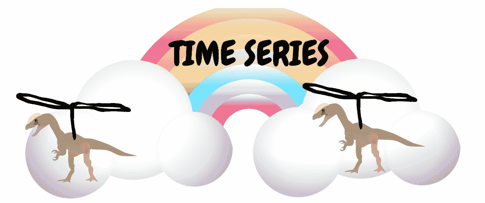

# 为什么我应该使用时间序列数据库？

> 原文：<https://thenewstack.io/use-time-series-database/>

[时间序列数据](https://thenewstack.io/time-series-data-care/)很特别——不仅仅在于它捕捉的独特数据，还在于我们与这些数据互动的方式。也许你开始使用公司恒温器中传感器的时间序列数据(最终证明爸爸在晚上调低温度)或分析历史数据来预测市场价格。你把它压碎了。

但是新类型的数据带来了新的责任。时间序列数据转瞬即逝，数量庞大，也就是说，它来去匆匆，数量巨大。与其他类型的数据相比，这需要考虑不同的存储和检索问题。如果希望从关系数据库的表中检索用户，可以通过模式中任意数量的属性进行查询:ID、姓氏、名字、最喜欢的土、风和火成员。如果你想知道你的无人机(别名:Skynosaur)将坐标发送回家的准确时间，你也可以这样做。但也不是没有一些权衡。

## 何时使用时间序列数据库

许多公司和个人成功地将他们的时间序列数据存储在其他类型的数据库(关系数据库，noSQL)中。如果你是其中之一，你很快乐，你没有当前的问题，我不会要求你改变。你做你的。

但是，使用为时间序列数据设计的数据库肯定有好处。

### 可量测性

可伸缩性是我们经常听到的神奇词汇之一，有时会被正确使用*。*在[时间序列数据库](https://www.influxdata.com/time-series-database/)之外，时间序列和规模的一般问题是这样的:如果 Skynosaur 飞行 1500 小时(商业飞行员执照的最小小时数)，我们已经为一个设备达到了超过一百万个数据点。Skynosaur (Skynosaurus Rex，Inc .)的制造商可能有数千台设备向家里发送数据。通过时间戳查询将涉及关系数据库中数百万行数据。

 [凯蒂·法默

凯蒂和她的丈夫以及两条狗住在加州的奥克兰(其中至少有一条会和她聊一些有趣的科技话题)。她喜欢试验代码，破坏东西，并试图修复它。她在科罗拉多州丹佛市的图灵软件与设计学院学习编码，这给了她一个绝好的机会，在她知道如何修复之前就把东西弄坏了。](https://www.influxdata.com/) 

人们经常声称 SQL 数据库不能很好地扩展，而 NoSQL 数据库可以，但是从酸和碱的角度来看，我更容易理解。简而言之，符合 ACID 的数据库关心的是保证有效性——数据应该是原子的、一致的、隔离的和持久的。基本模型允许我们为了速度、规模或任何我们想优先考虑的事情而放弃一些不切实际的原则。为了决定哪个系统工作，我们需要建立数据库的主要目的。

如果我们不关心持久数据，我们可以在不刷新到磁盘的情况下编写命令(这意味着数据可能无法在重启后存活)。如果我们不关心原子性，我们可以缩短数据集被锁定的持续时间。时序数据库通过提供适合时序数据的原则来平衡酸/碱关系。

【T2

例如，时间序列数据作为一个整体比作为单个点更有价值，因此数据库知道它可以为了更高的写入次数而牺牲持久性。Skynosaur 每五秒钟向家里发送一次数据，因此，如果我们在 1500 小时的飞行时间里丢失了一些数据点，我们的总体趋势仍然完好无损。

在这种情况下，可伸缩性意味着时间序列数据库专门处理更大数量的最终一致性写入，甚至跨分布式存储，这种专门性意味着关心该数据的人更少担心。

### **可用性**

如果我们所有的数据都存放在一个安全、耐用的黑匣子里，我们就可以放心了。但是，我们如何访问数据可能与数据的存储同样重要。每个数据库都有自己的查询语言，旨在尽可能高效地访问内容。请记住这一点，因为正如我们前面提到的，时间序列数据是特殊的。这是有时间戳的双彩虹。

再想想天空之龙的军队给天空之龙雷克斯总部发送数据。有数百万个数据点需要搜索，但现在我们有了一种为手边的任务构建的查询语言——不是查看与模式的其他部分相关的数据，而是查看时间上下文中的数据，以便汇总、设置窗口或查看趋势。这不是关于其他数据库是否有能力做这样的事情，而是关于我们如何选择使用我们的资源。

### 权衡取舍

数据库架构是关于权衡和优先级的。您需要速度、准确性、容量还是预定义的模式？证据就在基准测试中。衡量一切。不要选择工具或产品，而是选择解决问题的方案。专业工具是为特殊问题而制造的，所以时序数据库是为时序问题而优化的。

<svg xmlns:xlink="http://www.w3.org/1999/xlink" viewBox="0 0 68 31" version="1.1"><title>Group</title> <desc>Created with Sketch.</desc></svg>