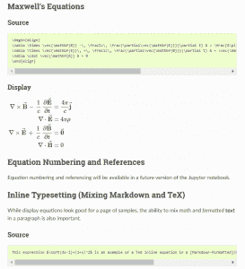
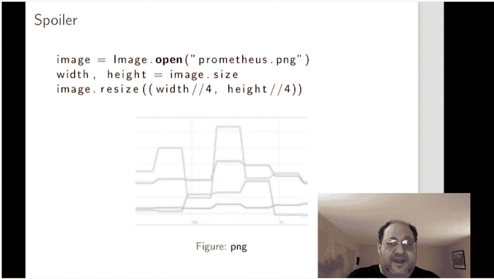
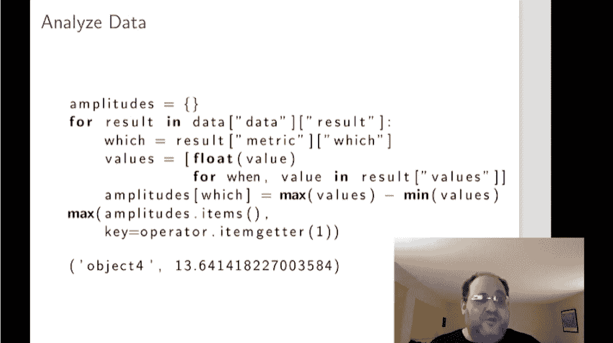
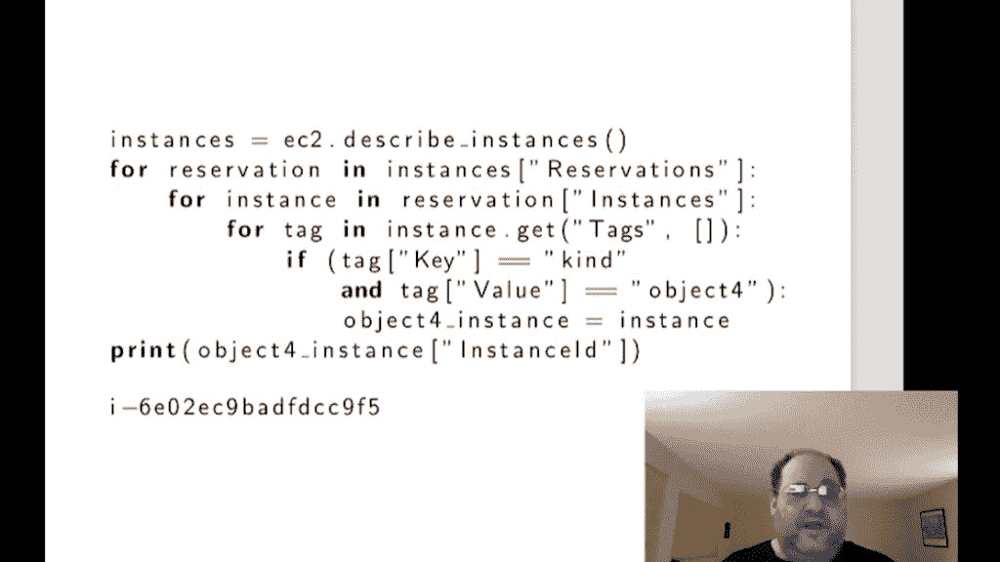
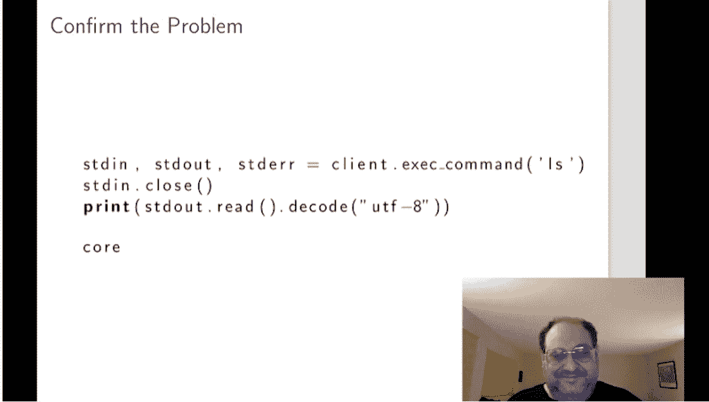

# USENIX:朱庇特笔记本可以帮助 SREs 更好地侦察事件

> 原文：<https://thenewstack.io/usenix-jupyter-notebooks-could-help-sres-better-sleuth-incidents/>

科学！

“每个事件都是一个侦探故事。关键是要找出是谁干的，”[扭曲矩阵实验室](https://labs.twistedmatrix.com/)的高级现场可靠性工程师 Moshe Zadka 在上个月举行的 [USENIX SREcon20 America](https://www.usenix.org/conference/srecon20americas) 会议上说。

Zadka 说，Jupyter notebooks 是一款开源工具，最初是为科学研究团体设计的，它可以成为帮助站点可靠性工程师(SREs)和其他操作人员调查、记录甚至重建站点事故修复程序的宝贵工具。毕竟，这两项工作都需要侦查和细致的笔记来获取真相。

“事件解决本质上是探索性的，”Zadka 说，这是一种得到笔记本格式良好支持的活动。就像数据科学家一样，SRE 必须做大量的探索，测试多种假设，看看哪里出了问题。“当你遇到事故时，你不知道发生了什么，”他说。

正如许多数据科学社区所知，Project Jupyter 为用户提供了一个 web 界面来创建和共享包含实时代码、等式、可视化和文本的文档。

研究人员在笔记本上记录了事实发现的整个过程，包括实时代码、样本数据和叙述性笔记。然后可以将其导出为 HTML 格式，其他人可以查看，甚至可以一步一步地完成相同的步骤。

## 一个新病例出现了…

Zadka 提供了一个工程师如何使用 Jupyter 记录事件的基本示例。这个例子中最值得注意的部分是事件过程*的每一步都是在 Jupyter 笔记本本身*中进行的。

“如果有人需要倒回同样的步骤，他们只需拿起笔记本再运行一次，”他说。

在这个假设的事件中，基于云的服务未能满足其服务级别协议(SLA)。尽管每台服务器的表现略有不同，但服务器都低于 P90 的延迟限制。结果是其中一个服务崩溃了，这导致查询的响应时间偶尔会很长。哪个服务？该服务的实例是什么？

参与的工程师将打开一个新的 Jupyter 笔记本，记录每个步骤——数据、使用的代码和注释——甚至是死胡同和失误。记录过程中的每一步，SRE 实际上创建了一个问题如何被修复的文档。“这个记录以后会有用的，”扎德卡说。

在这个假设中，工程师打开 [Prometheus](https://prometheus.io/) 来获取服务器的一些性能数据，但不知道要寻找什么:

看着这个图表，Zadka 建议不要先看最高或最低的线，而是看显示最大振幅的线。理论上，你可以编写一个详细的 Prometheus 查询来获得这个数字，但是“这通常很烦人，”他说，并解释说 PromQL (Prometheus 查询语言)更适合于基本查询(“亲爱的上帝，它并不真的像一种编程语言。”)

相反，用 Python 来解析性能数据，这是一项容易得多的任务。尽管 Jupyter 最初是为运行 Python 而创建的，但它是一个语言无关的工具。这里需要的代码是以 10 秒为增量查询 5 分钟的性能数据，在所有服务器中寻找最大幅度:

下一个技巧是找出发生故障的服务运行在哪个 EC2 实例上。幸运的是，Python 有一个工具可以直接连接到 Amazon Web Services 的 API。因此，可以编写另一组代码来查询能够描述所有实例的 AWS API，以及 SRE 早先放置的方便的识别标签:

一旦确定了 EC2 实例，下一步就是通过 SSH 连接到该实例，以确认它有一个核心转储文件，指示崩溃的服务:

为了完成这项工作，核心文件被转移到其他地方。很简单。

至少事件本身解决了。然而，任何组织都希望进行事后分析或回顾，以揭示问题是什么，如何解决的。“幸运的是，你已经有了大部分的笔记”已经在笔记本里了，Zadka 说。通常，此时需要一些额外的文档，通常是决策背后的思考过程，可以通过 markdown 添加到笔记本中。

完成后，工程师可以导出到笔记本上的 HTML，任何人都可以将其作为演示文稿查看，并将其附加到事故单上。有人甚至可以再次运行相同代码，做进一步的分析。

点击此处查看整个演示文稿:

[https://www.youtube.com/embed/3ijBdYb37tI?feature=oembed](https://www.youtube.com/embed/3ijBdYb37tI?feature=oembed)

视频

shell_ghostcage de Pixabay 的特征图像

<svg xmlns:xlink="http://www.w3.org/1999/xlink" viewBox="0 0 68 31" version="1.1"><title>Group</title> <desc>Created with Sketch.</desc></svg>