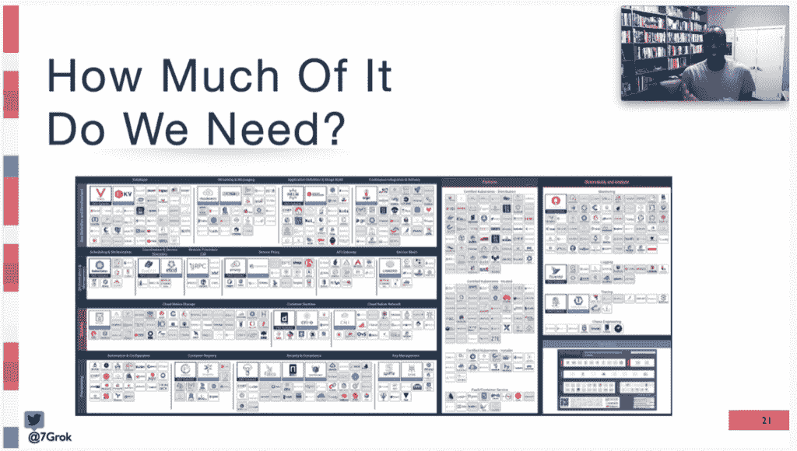

# USENIX·斯雷肯:我们在抽象方面走得太远了吗？

> 原文：<https://thenewstack.io/usenix-srecon-have-we-gone-too-far-with-the-abstractions/>

自从计算机科学诞生以来，抽象就一直伴随着我们。它们提供了一种简化计算机工作复杂性的方法。第一代汇编语言简化了程序员向机器输入指令的方式，今天我们充斥着抽象:Kubernetes、React 和 Linux 内核都在“抽象”复杂的低级系统。如果没有抽象，今天的软件工程师不可能详细了解这些技术的许多方面。

但是，我们是否在使用抽象方面走得太远了，给开发人员带来了不必要的复杂性？

这是去年 12 月 [USENIX SRECon](https://www.usenix.org/srecon) 上 [Venmo](https://venmo.com/) 系统工程师 [André Henry](https://www.linkedin.com/in/andrehenry/) 提出的众多问题之一。他认为，抽象将我们从与软件的一对一关系带到了“多层配置和部署”模型，这在许多情况下本来就更麻烦。

“就好像我们现在都是星舰舰长了。我们已经成为复杂生态系统的管理者，”他告诉虚拟人群。“如果应用程序有问题，我们现在必须开始剥离所有这些层，以找出导致问题的原因”抽象被破坏了吗？它的抽象层坏了吗？另一层坏了吗？一个单独的软件可能不理解抽象所覆盖的所有层。"

作为过度复杂的一个例子，他提到了[云原生计算基金会](https://cncf.io/?utm_content=inline-mention)关于云原生技术的大量[景观图](https://landscape.cncf.io/)。首席技术官如何理解所有这些技术，每项技术都是分布式云本地计算的某个方面的抽象？

例如，容器如此受欢迎至少部分是因为它解决了依赖性管理的问题。但是也许更多的努力应该应用于改进包装管理工具本身？“如果您的抽象是为了弥补另一个工具中的问题，您应该为此编写一个抽象，还是应该在另一个工具中解决它？”

这些抽象可能会欺骗您使用可能根本不需要的技术。以 Kubernetes 为例，它提供了快速扩展资源的真正好处。但是所有的 web 服务都需要如此快速的扩展吗？

Henry 举了一个以前在教育公司工作时的例子。在那里，该公司需要在每天早上增加服务，然后在一天结束时，当学生回家时，再减少服务。虽然这可以由 Kubernetes 轻松处理，但实际上根本不需要 Kubernetes，因为工作量是可预测的。一种更简单的方法是预先缩放或预先安排这些时间的一组预烘焙图像。不需要 k8。

“想想你正在解决的问题的目标，比如你想完成什么，这是不是最有效和可持续的方式，”他建议道。“所有的抽象都会有生命。他们必须得到正确的管理。”

由 [USENIX](https://www.usenix.org/) 提供，在 [YouTube](https://www.youtube.com/watch?v=bkZxgQ4BjFg&t=1937s) 上观看整个演示。

[https://www.youtube.com/embed/bkZxgQ4BjFg?start=1937&feature=oembed](https://www.youtube.com/embed/bkZxgQ4BjFg?start=1937&feature=oembed)

视频

云计算原生计算基金会是新堆栈的赞助商。

由 [Unsplash](https://unsplash.com/s/photos/abstraction?utm_source=unsplash&utm_medium=referral&utm_content=creditCopyText) 上的[paweczerwiński](https://unsplash.com/@pawel_czerwinski?utm_source=unsplash&utm_medium=referral&utm_content=creditCopyText)拍摄的特征图像。

<svg xmlns:xlink="http://www.w3.org/1999/xlink" viewBox="0 0 68 31" version="1.1"><title>Group</title> <desc>Created with Sketch.</desc></svg>