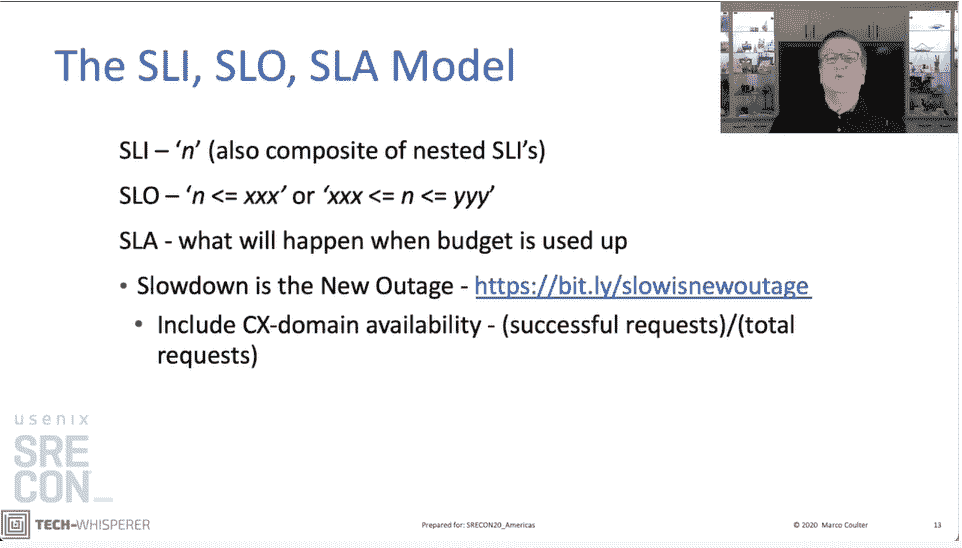
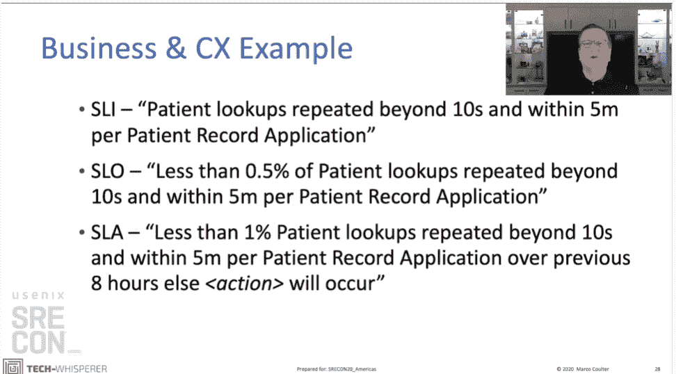

# USENIX:成功的现场可靠性工程的三个衡量标准

> 原文：<https://thenewstack.io/usenix-the-3-measures-of-successful-site-reliability-engineering/>

AppDynamics 的技术布道者 [马可·库尔特](https://tech-whisperer.com/)引用了 20 世纪 70 年代的一个经济观点，警告出席 [SRECon20](https://www.usenix.org/conference/srecon20americas) 的与会者不要过于纠结于具体的指标，因为它们可能无法为被测系统的整体成功提供完整的指导。

“每当一项措施成为目标，它就不再是一个好的措施，”他在上个月 USENIX 虚拟活动上的演讲中说，他引用了英国经济学家 Charles Goodhart 关于管理英国货币政策的文章。

> "任何观察到的统计规律性，一旦出于控制的目的对其施加压力，就会趋于崩溃."

—查尔斯·古德哈特。

相反，SRE 必须考虑整个系统，特别是在客户满意度方面。“作为技术人员，我们专注于作为目标的测量，”库尔特说。相反，SRE 应该与最终用户一起定义整体成功。

在他的演讲中，Coulter 讲述了一个为医院服务提供商工作的故事，特别是管理一个可以将新的实验室结果插入到患者记录中的系统，该记录由主机系统管理。医院的护士抱怨更新病人记录的时间太长，快速分析后发现邮件被卡在队列中。

为了解决这一问题，开发团队与医院制定了服务水平协议(SLA ),如果队列增长到 100 条以上，医院将获得退款。这些信息必须在 10 秒钟内得到处理。Coulter 编写了一个脚本，如果队列增长到接近 100，就会触发警报，这样管理员就可以采取行动，并且重新调整容量规划，以便队列处理可以获得所需的所有服务器能力。

然而，问题是，该系统仍然滞后，这让依赖它的忙碌护士很恼火，尽管消息队列是空的。“事务甚至在到达消息队列之前就已经超时了，”他说。消息队列不一定是导致不满的瓶颈。

开发团队是按照标准管理应用程序，而不是结果。

## 三维现场可靠性工程

SRE 的诀窍是在取悦客户的需求与过度配置运营或抑制创新的不必要费用之间进行平衡。库尔特认为，三个关键维度可以涵盖这一点。

“你需要考虑成功的所有三个方面，”库尔特说。大致来说，它们是:

*   **服务水平指示器** (SLIs):这些是描述运行系统状态的数字。sli 是在系统边界或团队边界定义的。SLIs 应该测量系统变慢，而不是停机，这在 T2 已经很少发生了。这些数字可以由应用程序监控平台(APM)捕获，如 [AppDynamics](https://www.appdynamics.com/?utm_content=inline-mention) 、 [DataDog](https://www.datadoghq.com/) 或 [New Relic](http://newrelic.com/?utm_content=inline-mention) ，或许多新的可观察性工具中的任何一个，如 IBM 的 [Instana](https://www.instana.com/) 的 [Honeycomb.io](https://www.honeycomb.io/) 。
*   **服务水平目标** (SLOs):这些是服务提供商和最终用户之间商定的 SLIs 数字需要达到的基准。它们可以用性能曲线来表示。
*   **服务水平协议**(SLA):这些是服务水平协议未能实现时，提供商必须遵守的约定措施。这可能是退款，或者开发周期可能会暂停 28 天，以解决正在进行的问题。

“在一个完美的世界中，[SLA]是由业务或客户定义的，然后您在它下面构建 SLO 和 sli，”他说。

就医院而言，速度变慢的原因是由专有应用程序发出的格式错误的数据包——不符合医院数据标准的消息。开发团队除了向供应商提交错误报告之外，对这个应用程序没有任何控制，但是他们可以控制 SLO 如何定义成功，以及最终用户的期望。

在许多情况下，工程团队不需要将 SLO 设置为最高的性能水平。事实上，对于服务提供商来说，维持这样的水平可能过于昂贵。相反，它们应该根据客户的期望来设置(该规则的一个例外是金融机构，在这些机构中，交易速度是一个非常有竞争力的区分因素)。

这项措施最困难的部分是了解最终用户。库尔特说，在医院的情况下，这包括“观察病房里的行为和与护士交谈”。在这种情况下，他们发现护士对实验室结果何时会回来有一种“本能的期待”——大约五分钟左右——尽管一些护士会反复点击提交按钮，特别是在系统很慢的时候，这进一步拖低了平均响应时间。

有了这些知识，服务提供商将能够设置一个 SLA，集中在 5 分钟内返回完整的结果，而不是 10 秒的处理时间。

“SLA 不是用来互相殴打的。他们在那里捕捉相互理解。你通过谈判达成相互理解，”库尔特说。"对任何一个 SRE 人来说，谈判都是一项关键技能."

请点击此处欣赏完整演示:

[https://www.youtube.com/embed/iKjKFeTSJGs?feature=oembed](https://www.youtube.com/embed/iKjKFeTSJGs?feature=oembed)

视频

由[国立癌症研究所](https://unsplash.com/@nci?utm_source=unsplash&utm_medium=referral&utm_content=creditCopyText)在 [Unsplash](https://unsplash.com/s/photos/nurse?utm_source=unsplash&utm_medium=referral&utm_content=creditCopyText) 拍摄的专题图片。

<svg xmlns:xlink="http://www.w3.org/1999/xlink" viewBox="0 0 68 31" version="1.1"><title>Group</title> <desc>Created with Sketch.</desc></svg>