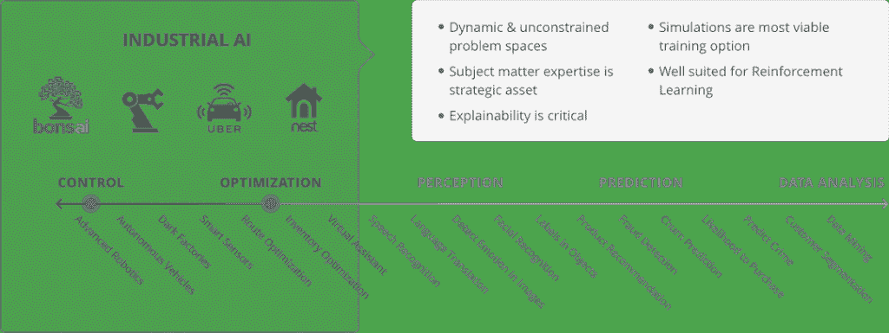

# Bonsai 推出人工智能中间件平台

> 原文：<https://thenewstack.io/using-ai-middleware-bonsai-heavy-industry/>

虽然今天围绕人工智能的大部分讨论都集中在虚拟助手和聊天机器人上，但 [Bonsai](https://bons.ai) 的联合创始人兼首席执行官[马克·哈蒙德](https://www.linkedin.com/in/markisaachammond/)则关注一系列完全不同的问题，围绕着人工智能的可操作化。

“这家公司是建立在这样一个问题上的:‘如何让开发人员成功地使用人工智能？’”哈蒙德问道。他说，该公司的中间件人工智能平台旨在通过抽象人工智能的复杂性，使开发人员和企业更容易理解人工智能模型的编程和管理。

哈蒙德解释说，该公司新的早期访问计划帮助客户通过实施人工智能的正常障碍，并引导他们认识到与人工智能合作的差异。该计划是一个完全沉浸式的项目，Bonsai 的工程师嵌入到现有的客户开发团队中。

哈蒙德希望利用人工智能模型来增强多维工业系统的实时决策支持。想想供应链、机器人、工厂、仓库运营、暖通空调或石油勘探。

例如，供应链可能有自动卡车，这些卡车需要根据天气、位置或其他依赖因素来选择路线。“这是公司需要制造一个受控系统或优化一个与物理世界互动的系统的地方吗？”他说。如果是这样，盆景可能值得一看，他说。

哈蒙德说，与物理世界互动的用例非常适合以机器教学为中心的方法。但是当你对它建模时，它从根本上改变了与物理世界的互动。你不仅仅是在数据集中移动。

在规模上，这种系统很快超过了一般人工智能解决方案的能力。哈蒙德说，但大多数企业缺乏足够快的资源来应对机器学习的复杂性，以建立特定应用的人工智能模型。

他解释说，早期访问计划的要点不仅仅是启动和运行人工智能系统，而是教育客户团队使用人工智能的差异，并让他们能够自己运行和管理他们的系统。

[https://www.youtube.com/embed/6DGxiMnx2g8?feature=oembed](https://www.youtube.com/embed/6DGxiMnx2g8?feature=oembed)

视频

开发人员在三个阶段与 Bansai 平台进行交互:构建、教授和使用。

在[上面的介绍视频](https://www.youtube.com/watch?v=6DGxiMnx2g8&feature=youtu.be)中，第一步是建立一个叫做“大脑”的高级模型现场培训和研讨会涵盖盆景产品，底层技术和工具，以及相关的人工智能技术。

根据 Hammond 的说法，将主题专家(SME)纳入培训研讨会并帮助构建模型至关重要。他说，中小企业拥有并非来自数据的商业知识。

这些联合会议包括为行业和特定业务定制用例的人工智能模型的范围界定、设计和开发。大脑是使用专有的 Bonsai 语言、数据或模拟等适当的训练源，当然还有来自公司的特定用例来构建的。

接下来，他们利用 Bonsai 的人工智能引擎来训练大脑。例如，Bonsai 使用了来自 [Mathworks 的产品 Matlab 和 Simulink](https://www.mathworks.com/products/matlab.html) 的模拟。Matlab 专注于教授数字组合，Simulink 拥有用于模拟机械系统的软件包，这两者对于人工智能程序与物理对象的交互都很有用。

哈蒙德说:“通过搭配模拟模型，我们获得了大量的重复利用。

最后一步，他们通过使用 Bonsai 提供的库将大脑连接到客户现有的硬件或软件应用程序，就像将数据库连接到应用程序一样。

大脑位于现有堆栈旁边，并成为一个实时数据流分析系统。

哈蒙德说，西门子是早期接入计划的一部分，在建立概念验证方面做了大量工作，以将人工智能添加到其商业设备中，他补充说，迄今为止的工作“令人印象深刻”

最后，哈蒙德谈到了将人类智能与人工智能结合，“如果你要解决现实世界的问题，你需要两者。”

通过 Pixabay 的特征图像。

<svg xmlns:xlink="http://www.w3.org/1999/xlink" viewBox="0 0 68 31" version="1.1"><title>Group</title> <desc>Created with Sketch.</desc></svg>