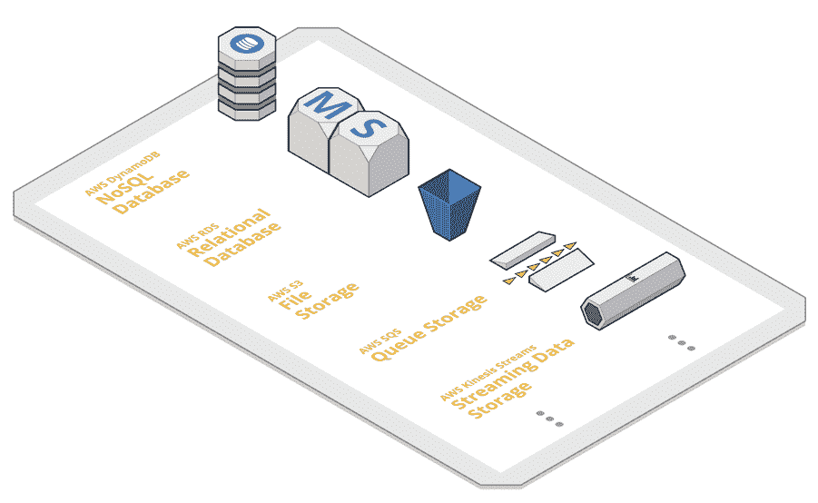
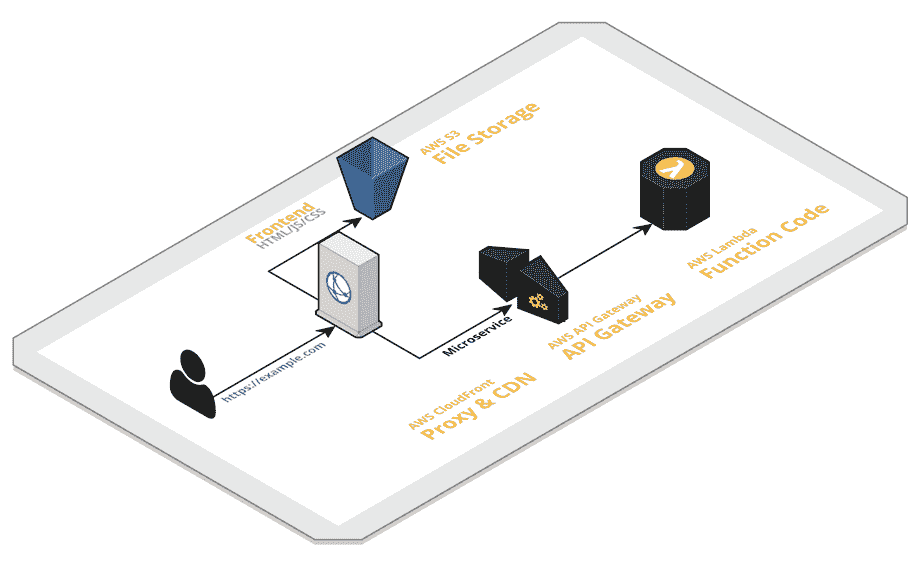
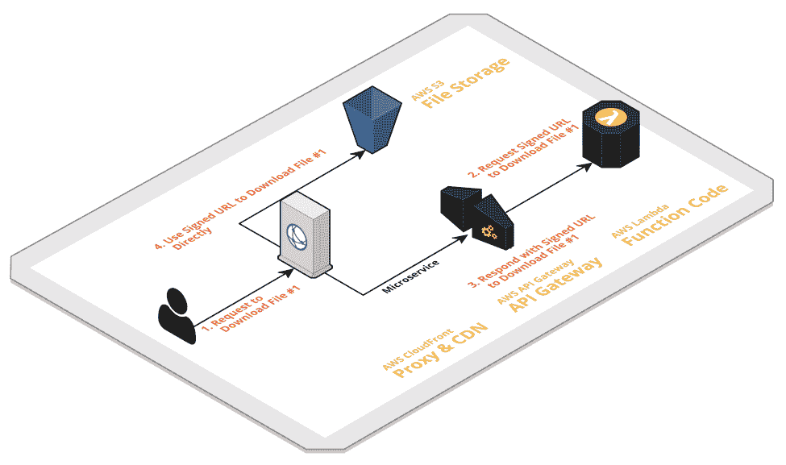
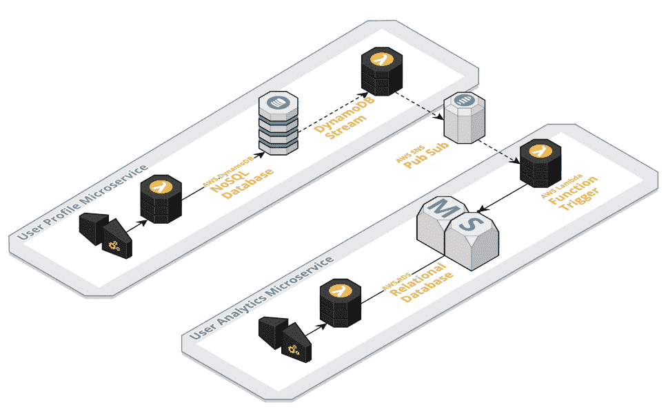

# 将 AWS 存储用于无服务器微服务

> 原文：<https://thenewstack.io/using-aws-storage-serverless-microservices/>

“云中的微服务架构”一词经常与“无服务器”一词一起出现无服务器并不意味着没有服务器，相反，它是一种架构实践，使用云中可用的完全托管服务作为构建微服务的构建块。云中的这些完全托管的服务也称为“无服务器服务”

 [阿山·费尔南多

Ashan Fernando 是 99XTechnology 的技术架构师。他经常旅行，与家人和朋友一起享受闲暇时光。写文章和打羽毛球是他的两大爱好。你可以在 Linkedin 上找到更多关于他的细节。](https://www.linkedin.com/in/ashan256/) 

使用无服务器有几个优势，即基于消费的成本模型和由云提供商完全管理这些服务的安全性、可靠性、性能和效率。使用这些服务时，手动配置的级别很大程度上取决于无服务器服务的具体情况。

下面的列表包含一组无服务器服务，通常用于在亚马逊网络服务中构建[微服务。](https://aws.amazon.com/microservices/)

*   AWS Lambda —无服务器计算(运行您的代码)
*   亚马逊 S3 —无服务器对象存储(在云端存储文件)
*   AWS CloudFront —无服务器代理和 CDN(路由请求和缓存)
*   AWS API 网关—无服务器 API 网关(微服务网关)
*   AWS DynamoDB —无服务器 NoSQL 数据库
*   AWS Aurora 无服务器—带 AWS RDS 的无服务器关系数据库服务
*   AWS Cognito 用户池—无服务器身份提供者

了解无服务器仍然是一个不断发展的技术领域也很重要。在撰写本文时，对于某些用例，仍然需要考虑将其他云服务与无服务器结合使用。例如，频繁修改大文件的微服务在使用块级存储方面是高效的，要么使用[亚马逊 EFS](https://cloud.netapp.com/blog/ebs-efs-amazons3-best-cloud-storage-system) 要么使用 [EBS](https://codeburst.io/aws-ebs-vs-instance-storage-patterns-for-application-use-cases-796bbc1faceb) ，这将需要 AWS EC2 服务器实例，因为 Lambda 无法连接到这些。

## 无服务器微服务的存储

AWS 中有几个存储选项，可以直接用作微服务的构建块。其中包括持久存储服务，如 AWS DynamoDB、AWS Aurora Serverless、亚马逊 S3，以及临时存储服务，如 AWS Kinesis、AWS SQS 等。

## 连接 AWS Lambda 和存储

在构建无服务器微服务时，存储解决方案的主要优势之一是能够[与无服务器计算服务](https://medium.com/99xtechnology/is-aws-lambda-just-another-platform-as-a-service-7c7a1998e786)AWS Lambda 进行交互。这些交互有两种形式。AWS Lambda 函数可以直接访问大多数存储服务，以写入或读取数据，这是最常见的用例。触发 Lambda 函数作为这些存储服务中的一种状态改变的能力是另一种形式的交互。这不仅允许在存储和 Lambda 之间构建复杂的数据流和交互，还允许为数据流的各个阶段连接不同的存储解决方案。

## 不同的存储使用案例

这些存储服务可用于不同的使用情形。它包括数据存储、部署存储以及利用 AWS 中存储服务功能的数据流连接器。下面列出了几个示例用例，以提供在构建无服务器微服务时利用 AWS 存储服务的更广泛意义。

### NoSQL 与关系型

有些用例需要在 AWS DynamoDB (NoSQL)和 AWS Aurora 无服务器(关系数据库)之间做出选择。对于这些用例，重要的是不仅要分析数据模型和关系，还要分析它们是如何被查询的。

我见过的一个常见错误是，当人们从关系型转移到 NoSQL 时，他们试图在 NoSQL 建立关系型结构，这使得事情变得非常复杂。****

此外，了解存储变得比计算更便宜也很重要，在计算中，存储计算或查询的结果和直接检索可能比每次查询和处理更具成本效益。

因此，在设计数据库模式、数据流和处理管道时，正确解决这些问题非常重要。

### 前端部署

当构建无服务器微服务和 web 应用时，如果 web 应用构建为单页面应用(例如，使用 Angular、React、Vue)，则前端部分可以存储在亚马逊 S3 中。这包括静态文件 HTML、CSS、JavaScript、图像、字体等。AWS CloudFront 可以用作 CDN 和代理，根据 URL 的相对路径为亚马逊 S3 和微服务路由消息。

### 文件对象存储

如果您正在构建需要存储和检索文件对象的微服务，您可以考虑使用亚马逊 S3。最佳实践之一是允许微服务消费者直接访问亚马逊 S3，而不是通过微服务网关。但是，只允许授权的客户端访问这些对象也很重要。在验证访问控制后，您的微服务可以生成一个专门的 URL(例如，AWS [CloudFront 签名的 URL/签名的 cookie](https://docs.aws.amazon.com/AmazonCloudFront/latest/DeveloperGuide/PrivateContent.html)，S3 签名的 URL 或 AWS STS 令牌)来授予对相关对象的访问权限。

这种方法既可以用来读写对象，也可以直接读写亚马逊 S3 的对象。如果需要为查询存储对象的元数据，使用亚马逊 S3 触发器来调用 Lambda 函数是一种常见的模式，该函数会将对象的元数据保存到 AWS DynamoDB。

### 用于数据存储同步的发布-订阅消息传递

跨微服务复制数据的一种常见模式是使用发布-订阅消息中间件。在 AWS 无服务器发布-订阅消息服务中，AWS SNS 可用于此目的。每个微服务可以连接到他们感兴趣的 SNS 主题，或者作为发布者或订阅者，或者作为两者。这可以与触发器或流一起使用，如 AWS DynamoDB、Aurora、Kinesis 等。

例如，让我们看一个场景，其中用户简档数据在两个微服务之间共享。有两个微服务，一个用于用户档案，另一个用于用户分析。用户配置文件服务使用 AWS DynamoDB，用户分析服务使用 AWS RDS 作为各自的内部存储。如果用户的名字在用户简档服务中被更新，用户分析服务也应该接收这一改变。这可以通过针对用户数据更改的 SNS 主题来处理，其中用户分析微服务在内部充当订阅者，而用户简档微服务数据更改充当发布者。

### 流式数据存储和处理

对于接收大量事件的微服务，AWS Kinesis 流可以用于临时存储这些事件，而 AWS Lambda 可以批量处理它们。优势在于成本和效率，因为计算资源被用于成批处理这些事件，而不是一次处理一个。

## 结论

数据在设计微服务中起着重要作用。它不仅影响微服务的内部设计，还影响它们如何在内部和外部相互连接。为数据使用正确的存储选项同样重要。

选择正确的存储选项有助于在许多方面影响整体可靠性、性能、效率和成本优化，同时提供所需的变化敏捷性。

因此，在构建无服务器微服务时关注存储不仅对于数据存储非常重要，对于数据流和交互以及部署环境本身也非常重要。

<svg xmlns:xlink="http://www.w3.org/1999/xlink" viewBox="0 0 68 31" version="1.1"><title>Group</title> <desc>Created with Sketch.</desc></svg>