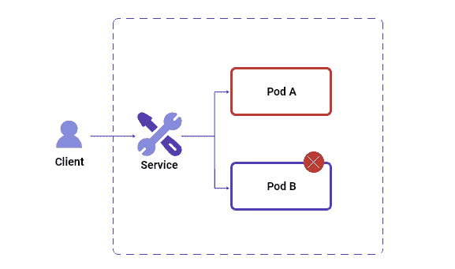
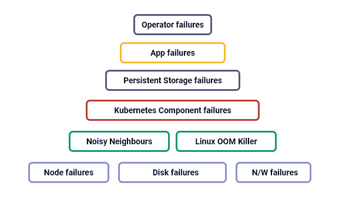
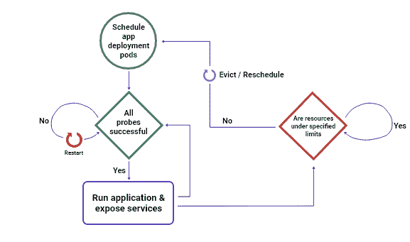

# 利用混沌工程提高 Kubernetes 上有状态应用的弹性

> 原文：<https://thenewstack.io/using-chaos-engineering-to-improve-the-resilience-of-stateful-applications-on-kubernetes/>

[kart hik Satchitanand](https://www.linkedin.com/in/karthik-satchitanand/)

[kart hik 是 MayaData 的质量和自动化主管。他还是 OpenEBS 和 Litmus 开源项目的维护者。](https://www.linkedin.com/in/karthik-satchitanand/)

Kubernetes 似乎正在胜出，尽管将 Kubernetes 用于有状态工作负载的证据还不太明确。一方面，在云计算原生计算基金会的最新调查中，只有 5%的受访者表示他们确实**而不是**打算使用 Kubernetes 存储项目——对于有状态工作负载和 OpenEBS 等 CNCF 项目来说，这显然是个好消息。另一方面，只有 14%的受访者表示他们在生产中使用过存储项目。

是什么阻碍了 Kubernetes 对数据的生产使用？Optoro、Arista、Comcast 和许多其他公司的用户分享了他们使用 Kubernetes 获取数据的积极故事。潜力和兴趣水平是存在的。障碍是什么？

我的观点来自多年来对数百名 Kubernetes 用户的支持，包括我们自己的 SRE 团队，该团队在 Kubernetes 上运行 24×7 SaaS 应用程序，该应用程序运行 Cassandra、ELK 堆栈和其他有状态工作负载。也许令人惊讶的是，我发现那些主动破坏系统的用户——包括底层平台和应用程序本身——会更快地投入生产，并取得更好的结果。

混沌工程使人们更加安心，使系统和流程更有弹性，并加快了 Kubernetes 数据的生产使用。

在这篇文章中，我将解释混沌工程为什么以及如何有用。然后在后续文章中，我将给出一些如何将混沌工程引入您的组织的实际例子。

## 背景

构建和运行弹性应用很难。对于有状态的分布式应用程序来说尤其如此，这些应用程序可能依赖于多层基础架构、网络和服务，此外还依赖于不同的工作负载和应用程序组件。这种应用程序很容易陷入“分布式整体”的反模式，意外地在更大程度上依赖云服务和存储系统以及其他组件，超出预期或理解的范围。这些依赖往往出现在最糟糕的时候，当你偏离了快乐的道路，发现自己滑下了连锁故障。

Kubernetes 还没有完全取代数据库管理团队；因为虽然它为运行和管理容器提供了非常好的构建块，但是这些有状态应用程序的复杂性、维护和供给在可用的操作符和 CRD 中仍然没有得到完美的表达(部分原因是上面提到的隐式依赖)。与此同时，在 Kubernetes 上部署应用程序的低门槛有时会导致团队在完全了解其运营风险之前就深陷其中。

例如，考虑一个 PostgreSQL 集群的情况，该集群正在执行异步复制，具有显著的网络滞后/延迟，然后主 pod 关闭。如果没有我稍后将讨论的那种检查，辅助 pod 可以通过自动选举提升为主 pod 这次初选可能会导致几秒钟的数据丢失。即使您已经将复制委派给存储系统，数据块存储本身也无法跟踪复制日志，因此不会意识到丢失/损坏。此外，您可能已经引入了对特定存储服务或存储系统的依赖。

图 1 K8s 中 pod 之间的故障转移图示

虽然这种风险在很大程度上通过使用特定于应用的操作者和使用 Kubernetes 固有的存储解决方案(如 OpenEBS)得到了缓解，但仍然存在一些挑战。

当然，导致部分分区的网络延迟只是 SRE 可能必须考虑的许多故障点之一。下面的图表概括地说明了在 Kubernetes 环境中可能失败**或**导致最终失败的各种组件(就像吵闹的邻居和 Linux OOM 杀手的情况一样);或者甚至是间歇性故障，就像锅一样，只有在没有观察到的时候才会沸腾。

图 2 Kubernetes 上有状态应用程序的故障表面区域

这种表示仍然没有考虑到文件系统级别的错误(损坏的块，有人知道吗？)并且——再一次——它没有考虑其他的静默依赖，也许是在共享事件总线上，比如 Kafka 或其他共享服务。

尽管如此，还是有好消息。我们一次又一次地从拥有适当流程、技术和组织文化的用户那里看到，人们可以自信地将 Kubernetes 作为数据层来操作，从而获得诸如成本节约和更快乐、更敏捷的开发人员等好处。简而言之，你也可以成为一个成功的故事！

以下是我见过的一些组织获得必要的弹性和信心的方法。

### 1.工程师**部署正确调整适当的参数**

图 3 微服务的特定上下文健康检查

一些具体的要点:

*   公开可由外部健康检查器使用的特定于应用程序的健康端点。
*   错误在于添加更多的就绪性和活性探测器。
*   调整您的资源限制，以确保当推至紧要关头时，应用程序属于“保证”列表(即，由于节点上的整体资源耗尽而发生驱逐)。
*   使用命名空间级别的配额作为另一种资源管理方法。
*   使用拓扑感知调度和反亲缘性策略，确保应用在跨节点和可用性区域的节点级故障中存活。
*   使用云原生和容器连接存储解决方案，以便为每个有状态的工作负载提供其自己的存储控制器，以便持久存储数据。这确保了存储更好地符合 Kubernetes 的操作原则，并允许更顺利的升级，同时最小化潜在的爆炸半径。
*   如果可能的话，使用应用程序和存储相似性(OpenEBS 等解决方案支持这一点)，以便应用程序副本可以在本地使用存储，而不必通过网络。
*   为不同的角色/副本使用特定的标签，使操作员和管理员能够准确了解副本在应用环境中的作用。
*   制定正确的终止政策；您可能希望容忍某些污点，定义节点粘性，等等。
*   在适用的情况下，配置停止前和启动后挂钩，以确保故障转移更有意义并且得到妥善处理。
*   根据应用程序的性质选择正确的升级策略(删除、滚动等)。
*   启用了 Pod 和节点级自动扩展，但具有存储资源调配和应用程序注意事项，因此您可以避免数据重新平衡可能永远持续下去并带来更多问题的情况。
*   应用部署中内置的监控和警报挂钩。

### 2.使应用程序和底层基础设施陷入“混乱”

正如上面的列表所表明的，每个 Kubernetes 部署都有大量的可调参数或配置。因为您的 Kubernetes 平台和在 Kubernetes 上运行的工作负载都在变化，您不能简单地调整环境，然后设置并忘记它。具有讽刺意味的是，如果你已经将 Kubernetes 的运营外包给了你最喜欢的云，那至少也是如此。

这就是混沌工程适合的地方。Chaos Engineering 可以验证您的应用程序的故障处理，并可以衡量 Kubernetes 集群和相关基础架构组件的部署弹性——不只是一次，而是经常作为您的部署的一部分，并在生产中持续进行。

你可以将混沌实验视为一种验证和发现你的**已知-已知**(其中影响是可预测的)**已知-未知**(例如，已知故障在一段延长的时间内的结果，或随着时间的推移可能带来的一连串事件)和**未知-未知**(大多数是最坏的情况或在构建应用程序或部署应用程序时可能没有考虑到的多组件故障)。

在本系列的下一篇文章中，我将深入探讨“有状态混沌”,以及[Litmus](https://litmuschaos.io)——Maya data 最近向 CNCF 贡献的云原生混沌工程解决方案——如何帮助您在有状态应用程序上运行混沌实验。

<svg xmlns:xlink="http://www.w3.org/1999/xlink" viewBox="0 0 68 31" version="1.1"><title>Group</title> <desc>Created with Sketch.</desc></svg>