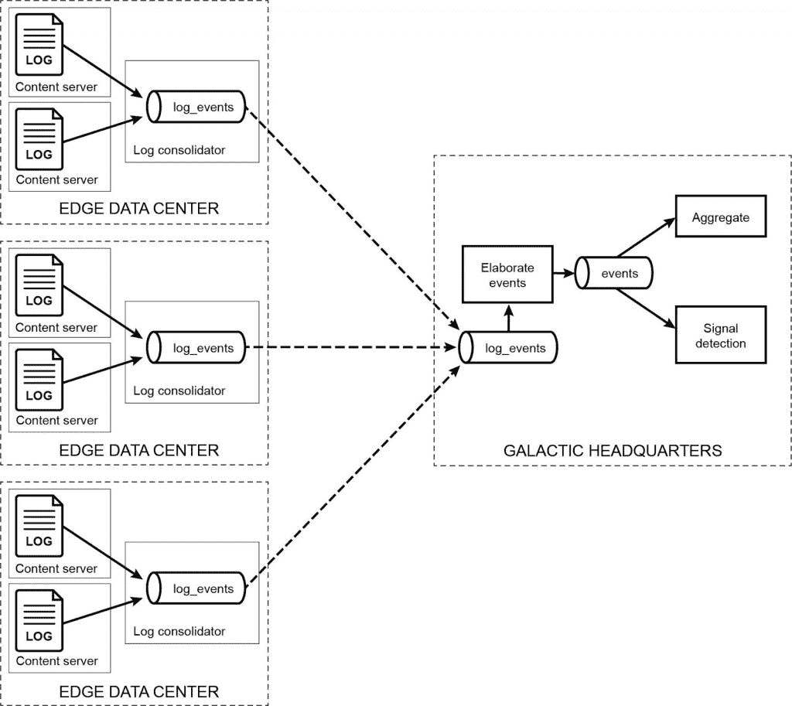

# 在边缘计算中使用数据结构和 Kubernetes

> 原文：<https://thenewstack.io/using-data-fabric-and-kubernetes-in-edge-computing/>

[KubeCon + CloudNativeCon](https://events19.linuxfoundation.org/events/kubecon-cloudnativecon-north-america-2019/) 赞助了这篇文章，期待于 8 月 13 日至 16 日在阿姆斯特丹举办 [KubeCon + CloudNativeCon EU](https://events.linuxfoundation.org/kubecon-cloudnativecon-europe/) 。

 [泰德·邓宁

Ted 是惠普企业公司 MapR 的首席技术官。他是计算机科学博士，著有 10 多本关于数据科学的书籍。他在高级计算领域拥有超过 25 项专利，曼陀林和吉他都弹得很差。](https://www.linkedin.com/in/teddunning/) 

边缘计算的一个令人生畏的挑战是处理这样的情况:数 Pb 的数据在不同地理位置的数千个集群上移动。这种描述会让你想到物联网传感器数据的大型工业用例，但它们不是边缘问题的唯一地方。边缘计算在一系列惊人的行业中变得越来越重要。银行这么做，在线服务提供商需要它，医疗服务提供商、电信、公用事业和汽车制造商也采用它。

这篇文章提出了推动边缘计算的需求，这样读者可以决定边缘设计是否对他们有用。它还分析了 edge 面临的挑战，包括经常被忽视的挑战，并提供了一些在现实情况下运行良好的示例解决方案。

## 为什么要使用边缘计算？

在计算需要在数据源附近完成的情况下，边缘计算是一个有吸引力的(通常甚至是*要求的*)架构选项，这是由于有限的延迟容限、潜在网络故障带来的风险、监管要求，或者只是为了应对在边缘产生的数据规模已经超出了经济地将其传输到中心站点的能力。

边缘计算的广泛采用是由几个因素造成的:

*   由于传感器成本的降低和种类的增加，获取数据比以往任何时候都更容易。今天生产的几乎所有东西都有更多的内置传感器和数据通信能力。
*   网络基础设施使得将比特转移到边缘变得更加便宜。
*   由于 Kubernetes 的进步，管理核心和边缘集群中的分布式计算变得越来越容易。
*   加固硬件可以对数据进行必要的过滤和预处理，即使在边缘可能出现的恶劣条件下也能保持运行。

令人惊讶的是，边缘计算的一大挑战不是计算部分。这是边缘和核心之间几乎普遍的通信需求。指标和诊断数据需要移回核心计算中心，在某些情况下，数据或模型需要移到边缘。

架构师和实现者通常认为与核心的通信很容易处理。其实往往不是。

## Edge 的工作原理是什么？与核心的沟通

以下真实使用案例说明了如何应对边缘计算的挑战，包括与内核的通信。几年前，我们有一个客户构建了一个视频流系统。需要边缘计算，以便提供视频内容的系统靠近最终用户，从而最小化延迟并最大化正常运行时间。我们的客户构建的系统运行良好，但他们在构建遥测系统以将有关系统运行状况和客户视频消费的数据传回核心时遇到了麻烦，这些数据是在出现问题时提醒核心支持团队并进行计费所必需的。

这个特殊的问题非常具体，但问题的形式——边缘计算加上从边缘到核心的遥测——对许多其他行业来说是普遍的。在这个例子中，遥测技术被推迟到项目的最后，这是很常见的；难度被大大低估了。这就是我们进来的地方。

### 我们做了什么

为了解决将数据返回核心的典型边缘问题，我们添加了一个分布式数据结构，并使用其消息传输功能来创建一个简单可靠的解决方案。

我们的目标是支持从数十个小型边缘数据中心采集数据，并以合理的低延迟将所得数据可靠地传输到核心数据中心进行分析和计费。临时网络分区不应该影响数据完整性，并且应该在修复此类分区后立即传输数据。该系统还需要最大限度地减少物理故障造成的停机时间。图 1 展示了如何使用数据结构来满足这些需求。

图一。数据结构的使用将边缘连接到核心，而不会使任何一端的系统复杂化。虚线框代表数据中心，包括边缘和核心，提醒人们数据结构跨越整个架构。黑色虚线箭头显示了通过数据结构的消息传输系统(水平圆柱体)从多个边缘位置返回总部的指标数据流。

以前，我们客户的开发人员尝试了几次遥测技术，但都没有成功，结果大大落后于计划。相比之下，我们基于数据结构的设计允许非常简单的传输程序在边缘将消息插入到消息流中。然后，数据结构处理从边缘到核心的所有数据移动。消息流中的主题记录了数据中心名称、源机器名称和传感器名称或事件类型，以便来自所有边缘中心的所有数据可以合并到单个消息流中，同时仍然允许对数据的任何子集进行分析。数据结构处理静态和动态数据的安全性。

这种设计非常容易实现和操作，并很快让客户的开发人员按时回来。这种设计在几年的时间里也非常可靠。这种最终数据结构设计的一个特别的好处是关注点的高度分离。例如，边缘的数据采集独立于处理数据的中央程序。数据结构的地理位置完全由管理员指定，管理员现在可以专注于配置数据移动和访问控制，而不必关心数据内容。

这种关注点的分离意味着运行在边缘和核心的程序可以更简单，只关注一个问题。这一优势适用于广泛的用例。

### 今天我们会做哪些不同的事情(或不做)？

如果我们现在设计这种边缘解决方案，我们仍然会使用数据结构来移动数据，保留数据结构处理数据安全性、数据移动、复制和高可用性容错的所有方面的优势。但是今天，通过使用 Kubernetes 进行容器编排，我们也将从中心软件的完全云本机实现中受益匪浅。五年前，与今天的 Kubernetes 相比，容器编排相当原始。

具有适当功能的数据结构为 Kubernetes 下运行的容器化应用程序提供数据访问和状态持久化。

> 一个数据持久层来补充 Kubernetes 在编排计算中的角色，对于充分发挥云原生计算的能力至关重要。
> 
> 数据会比处理它的容器更长寿。

然而，在边缘集群上，我们可能会改变很少——至少今天不会。然而，明天可能会是一个不同的故事。

### 剩余的挑战:未来是什么？

我们正处于边缘容器编排非常有用的尖端。这使得现在成为边缘计算的辉煌时刻。有了真正的边缘协调，我们可以在边缘系统上进行比原始设计更高级的处理，并使边缘集群的配置更加容易。

## 作为目的地的边缘

此使用案例强调了数据进入核心的常见边缘问题。但是数据从边缘*到*的出口呢？我们需要 egress 将 AI/机器学习模型部署到边缘，将状态信息或报告数据推送到边缘，或者更新在边缘运行的软件。数据结构可以使所有这些变得相当简单，同时还可以最小化通过开放互联网访问存储库所带来的安全风险。

让数据双向流动使我们能够真正“在本地行动，但在全球学习。”

## 安全呢？

边缘系统的安全性至关重要，因为它们面临巨大的威胁。至少，应该不可能伪造新的边缘集群，模仿现有的集群，或者窃听从边缘移动到核心的数据。理想情况下，这种安全级别是基于某种信任的硅根，一直延伸到最低的硬件级别。它还应该向上扩展，以便在执行之前验证所有操作系统和容器映像，并且保护静态或传输中的数据，而无需专门设计应用程序。

运行在安全硬件平台上的安全容器执行框架以及默认安全的数据结构可以满足这些需求。但是，如果做不到这一点，安全性可能会大大降低。

## 关键要点

*   比许多人想象的更多的行业需要边缘计算。
*   边缘计算不仅仅是在边缘计算或运行模型；将指标和运营数据拉回到核心是一个几乎无处不在且经常被忽视的需求。
*   从边缘到核心的统一数据结构解决了与边缘之间的可靠数据移动问题。
*   Kubernetes 已经为编排核心的容器化计算提供了巨大的好处，在边缘使用 Kubernetes 的能力正在迅速成熟。

通过 Pixabay 的特征图像。

<svg xmlns:xlink="http://www.w3.org/1999/xlink" viewBox="0 0 68 31" version="1.1"><title>Group</title> <desc>Created with Sketch.</desc></svg>