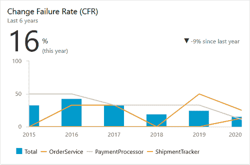
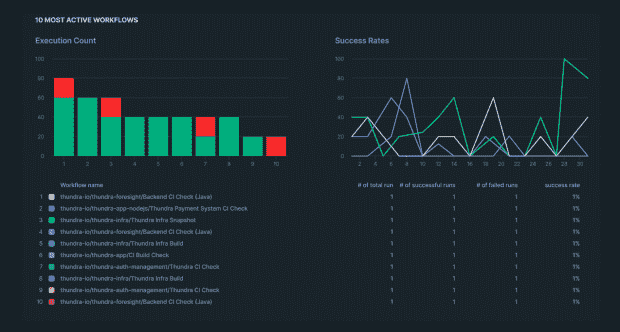
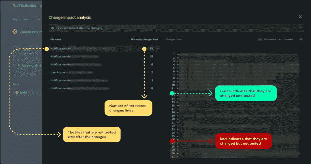
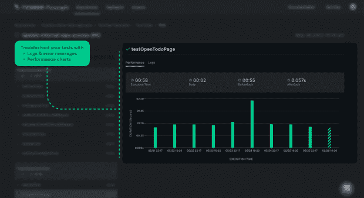

# 使用 DORA 指标优化 CI 渠道

> 原文：<https://thenewstack.io/using-dora-metrics-to-optimize-ci-pipelines/>

在当今高度竞争的环境下，只有保持软件的高质量和高可用性，才能对快速变化的市场需求做出响应。只有通过持续快速地交付高质量的软件，才能最大限度地保持用户体验。

我们将重点介绍三个 DORA 指标，这些指标有助于在主动监控时提高持续集成(CI)管道的性能。我们将通过三个指标来衡量 CI 渠道的成功:变更失败率、变更提前期和部署频率。

## 使用 DORA 指标衡量 CI 绩效

在他们的书《[加速](https://www.amazon.com/Accelerate-Software-Performing-Technology-Organizations/dp/1942788339)》中，[devo PS Research and Assessment](https://www.devops-research.com/research.html)(DORA)研究项目确定了一组他们认为是软件团队绩效指标的指标。它们为开发运维团队如何持续改进他们的流程和能力提供了指导。这些指标被称为 DORA 指标:变更前置时间、部署频率、平均解决时间和变更失败率。

DORA 指标使得 DevOps 在整个开发生命周期中都是可测量的。换句话说，这些度量帮助工程团队采取数据驱动的决策来改进最佳实践，并在整个 CI/CD 管道中更快、更可靠地交付软件。

## 变更失败率

更改失败率(CFR)是导致生产失败的代码更改的百分比。它是在部署后需要修复或回调的代码。由代码变更引起的产品缺陷构成了这个度量。

[一改故障率仪表盘，来源](https://marketplace.visualstudio.com/items?itemName=solidify.devops-metrics)

在跟踪变更失败率时，我们只考虑生产中发生的故障，而不考虑在测试阶段发现和修复的故障。除此之外，缺陷可能发生在用户端，而不是开发人员的过错。变更失败率度量应该只在代码中有变更时才被计算，这些变更可以是从新特性到快速修复的任何东西。

## 如何在生产前提高 CFR

通过整体和持续的努力，改善变更失败率是可能的。不仅在生产环境中，而且在测试阶段，都应该仔细监控异常和缺陷。

审查拉取请求(PR)是一项困难的任务，因为您可能并不确切知道该代码在生产中的影响。自然，最重要的是代码中发生变化的部分，所以您会想知道并理解它们。因此，代码作者很难确保他们的测试策略与他们的应用程序实际使用的方式一致。此外，变更管理流程大多是手动的，令人望而生畏。

这个度量揭示了代码评审的质量。这就是为什么代码评审员对这个指标有直接的影响。更准确地说，拉式请求应该根据它们可能对生产产生的风险影响进行评级。代码审查者应该自动地了解他们将要审查的 PR 的风险级别。这样，不精确的审查将被消除。

提高变更失败率的理想方法是在 CI 工作流的测试阶段发现错误、缺陷或失败。

Foresight 的错误工作流程仪表板

## 更改提前期

变更交付周期(CLT)帮助你理解你的软件开发过程的效率。它是通过测量给定问题的代码的第一次提交和部署之间的时间来计算的。

因此，快速交付无缺陷软件至关重要。当关注 CI 性能和运行状况时，我们倾向于关注测试覆盖率，以加速无故障部署。

测试覆盖率不应该与代码覆盖率同等对待。测试覆盖率是测试或测试套件覆盖的软件功能和特性的百分比。代码覆盖率是测试框架和套件中被测试用例覆盖的代码的百分比。代码覆盖率和测试覆盖率都与提高代码质量的软件测试有关，因此也提高了变更的交付时间。

从 Foresight 测试差距分析仪表板

您浪费了这么多时间，却没有快速调试测试失败，检测不可靠的测试，识别缓慢的测试，并随着时间的推移可视化性能以识别趋势。除此之外，对于每一次提交，都要测试所有的东西，这是一种非常老派的做法。因此，由于测试周期长，发布会延迟和变慢。

长时间运行的测试套件和频繁失败的测试是减慢构建时间并因此降低部署频率的最常见原因。您应该能够看到测试运行，以快速调试测试失败，检测不稳定的测试，识别缓慢的测试，并随着时间的推移可视化性能以识别趋势。

## 部署频率

部署频率是对您的团队将变更推向生产的频率的度量。它表明了你的团队交付软件的速度，从而也表明了你的速度。

从 Foresight 测试监控仪表板

软件团队应密切监控并遵循以下实践来提高部署频率:

*   任何潜在的 bug 或错误都应该在生产前阶段通过引入调试器或特定的监控解决方案来识别。
*   测试自动化是必须的，但是人工质量保证也应该是 QA 策略的一部分。测试策略应该足够强大、严格和广泛，以确保代码的任何部分都得到很好的测试。
*   大多数缺陷应该在引入生产之前被发现。应密切监控生产前环境，并仔细检查错误的测试或具有意外延迟的测试。

## 监控您的 CI 渠道

通过度量标准提高您的 CI 绩效意味着理解您的持续集成过程、架构、运行时、工程团队和开发过程。

能够跟踪、监控和深入了解 CI 绩效意味着在 CI 渠道中具有清晰的可观察性。如今，现有的解决方案/工具，如应用程序性能监控工具、监控工具、错误跟踪工具或 CI/CD 工具和平台，都不能满足对可见管道的需求。防止产量下降的最佳方法是建立一个可观察的 CI 渠道。

虽然对于一些人来说，只有一个 CI 渠道的度量仪表板就足够了，但是其他人可能需要能够跟踪他们的 CI 步骤和工作。

Foresight 为 CI 管道和测试提供了复杂的监控功能。您可以监视工作流资源指标，如 CPU 负载、内存使用、磁盘和网络 I/O。在内核级别跟踪流程，以监控内部工作流步骤；监控测试套件和测试；了解代码更改对生产环境的影响，并确定测试的优先级，以优化每个 CI 工作流的性能。可以自己试试 [Foresight 的 GitHub 应用](https://github.com/marketplace/thundra-foresight)。

<svg xmlns:xlink="http://www.w3.org/1999/xlink" viewBox="0 0 68 31" version="1.1"><title>Group</title> <desc>Created with Sketch.</desc></svg>