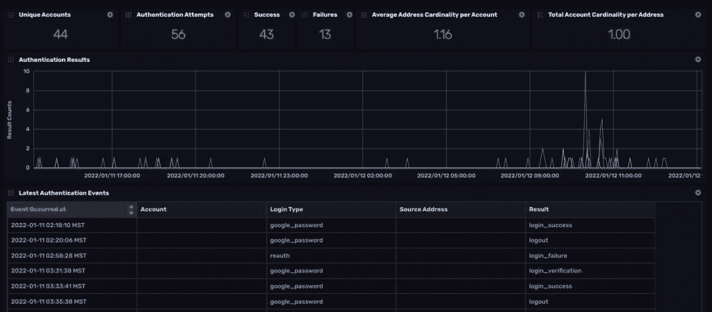

# 使用 Google Workspace 数据进行安全观察

> 原文：<https://thenewstack.io/using-google-workspace-data-for-security-observability/>

保持系统安全是一项永无止境的挑战。不仅有必要监控和保护自己的技术堆栈，而且公司使用的每项新服务都为不良行为者创造了另一个潜在的途径来试图利用它们达到自己的目的。

## 时间序列数据是安全数据

幸运的是，有一种类型的数据可以提供关于人们与任何系统或服务交互方式的关键数据:时间序列数据。

 [达林·费希尔

Darin 拥有超过 30 年的技术经验，涵盖技术支持、网络工程、软件开发和大规模数据处理系统。在职业生涯的大部分时间里，他都在银行和科技公司工作，现在他开始把时间花在整合运营、工程和安全上，同时努力降低自己的高尔夫分数。](https://www.linkedin.com/in/darinfisher/) 

每一个事件都发生在时间的背景下。例如，登录尝试在特定时间发生。该事件的数据会被打上时间戳。这些带有时间戳的数据告诉您谁尝试了该登录、尝试发生的地理位置等等。当您考虑到所有这些关键数据都有时间戳这一事实时，很明显时序数据*就是*安全数据。

通过扩展安全含义的范围，将时间作为安全的一个恒定上下文来维护，可以更深入地了解您的安全状况。

系统监控可以实时揭示安全威胁。然而，不像法庭上的戏剧，很少有“啊哈！”当涉及到安全威胁时。这就是为什么安全缺陷可以长时间不被发现。是的，一个事件可能很重要。这就是异常检测存在的原因。但这些事件往往发生得很快，这使得它们更容易被错过。将事件放在其他事件和模式的上下文中可以创建更全面的安全配置文件。

## 利用时序数据构建安全解决方案

使用时间和历史可以让你识别活动模式。然后，当异常发生时，您可以使用这些模式进行测试。在 InfluxData，我们的安全团队正在开发一种解决方案，使用 InfluxDB 来收集和处理时间序列数据，以构建安全配置文件。

被攻破的凭证是[的主要攻击媒介](https://owasp.org/www-project-top-ten/)，所以从认证数据开始是有意义的。这也很方便，因为身份验证数据覆盖了我们团队的每个成员，每个人都会产生大量的身份验证数据。因此，您可以很快看到身份验证数据的模式，因为人们往往有一致的习惯。InfluxDB 使我们能够详细跟踪每个人的这些模式。例如，如果某人通常在家工作，但某天下午去了咖啡店工作，那么这个新位置会创建一系列新数据，并改变此人的身份验证活动的基数。

有时候缺乏一种模式也可以是一种模式。经常出差的人可能有许多地理上不同的身份验证活动。但是知道这些人经常旅行可以减轻异常的紧迫性，例如在 IP 地址定位方面。

跟踪身份认证活动还可以帮助我们消除误报。如果同一个团队成员在周一早上有两三次失败的登录尝试，我们可以将其标记为潜在的问题，然后一旦我们确定它是一种独特的模式，就可以将这种异常放在一边。(当然，尝试登录前喝咖啡可能会有帮助！)

## 人数上的优势

作为一家使用数十家 SaaS 提供商的公司，每一家都为我们提供了一个向员工安全配置文件和模式添加上下文和粒度的机会。

获得对单个 SaaS 提供商的身份验证数据的访问权可能是一项挑战。我们发现的一个关键解决方案是跟踪 Google Workspace (GW)认证。当团队成员使用他们的 Gmail 链接电子邮件地址登录我们使用的任何服务时，我们可以使用该交互生成的数据来跟踪使用情况和身份验证，否则将无法使用。

Google 身份验证非常有用，尤其是在考虑时间序列数据时，因为每个事务都会生成几个数据点，比如请求、响应和实际授权等。一些事务可以生成数百个数据点，这取决于用户试图完成的任务。

我们想要获取的基本信息包括:

*   认证时间戳
*   公司帐户 ID
*   用户名
*   用户标识
*   用户域
*   认证类型
*   认证结果

出于我们的目的，我们将键映射到静态事件或 Google Workspace 事件字段。

*   时间:GWS id . time
*   服务 _ 来源:“G 套件”
*   service_domain: "influxdata.com "
*   源地址:GWs.ipAddress
*   电子邮件地址:GWs.actor.email
*   SaaS _ account _ id:GWS . actor . profile id
*   客户标识:GWs.id.customerId
*   应用程序:GWs.id.applicationName
*   auth_results: GWs.events[X]。名字
*   login_type: GWs.events[X]。参数[Y]。价值

捕获这些数据一直都是可能的，但是将其用于安全分析并没有很好地扩展。使用 InfluxDB 使我们能够轻松地接收和处理这些事务产生的所有数据，因为它是为处理这种带时间戳的数据而设计的。

随着我们引入新的团队成员，我们开始识别他们的模式，并立即建立他们的安全配置文件。这有助于确定基准使用概况，然后我们将它与老员工和其他新员工加入公司时的使用模式进行比较。

我们在 InfluxDB 中将这些数据可视化，并使用 [Flux](https://www.influxdata.com/products/flux/) 来生成每个元素的值。



```
<script src="https://gist.github.com/DrJRMyers/1fba6093d4c1de3a1bc848ab5e169d80.js"></script>

```

## 持续发展

目前，我们正在探索如何利用这些数据使用布林线。这包括使用简单移动平均线周围的标准差来建立正常范围。当我们跟踪周与周、日与日、小时与小时等的正常含义时，这些阈值还提供了对此数据的更细粒度的理解。

这种安全监控的潜力是巨大的。随着我们继续开发和构建这一解决方案，我们将能够监控整个公司的整个供应链。例如，包含来自 GitHub 的交易数据意味着我们将能够跟踪像 GitHub repo 克隆这样的活动。如果有人从可疑的位置发起克隆请求，这很快就会被发现，我们可以采取适当的对策。

纵向跟踪和警报仍在开发中，因为它们的功能取决于布林线建立的容差水平。但是 InfluxDB 的本机警报功能可以处理这些类型的事件。

最终，我们的目标是开发一个整体的、可伸缩的系统来监控安全威胁。因为一切都是随着时间的推移而发生的，所以所有的安全数据都是时间序列数据。我们利用时序数据和 InfluxDB 来维护这种环境。

<svg xmlns:xlink="http://www.w3.org/1999/xlink" viewBox="0 0 68 31" version="1.1"><title>Group</title> <desc>Created with Sketch.</desc></svg>