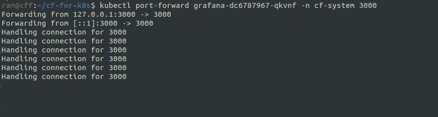

# 使用 Grafana 监控运行在 Kubernetes 上的 Cloud Foundry 对象和应用

> 原文：<https://thenewstack.io/using-grafana-to-monitor-cloud-foundry-objects-and-apps-running-on-kubernetes/>

 [拉姆·艾扬格

Ram 实际上是一名工程师，本质上是一名教育家。在他作为一名开发人员的旅程中，他被推上了技术福音传道者的位置，并且从那以后再也没有回头看！他喜欢帮助世界各地的工程团队发现新的和创造性的工作方式。](https://www.linkedin.com/in/ramanujank/) 

继我们之前关于普罗米修斯云铸造厂监控的教程之后，这篇文章是关于采取下一步——在与[普罗米修斯](https://prometheus.io/)合作之后——也就是[格拉夫纳](https://grafana.com/)。许多对早期文章做出回应的工程师提到，他们想知道 [CF-for-k8s](http://cf-for-k8s.io) 对 Grafana 的支持。

本教程将作为在 CF-for-k8s 实例中使用 Grafana 和 Prometheus 的基础。您可以定制 Grafana 仪表板，并在您的应用程序中采用尽可能多的遥测技术，然后将它们发送到您的 Prometheus 装置。

一般来说，应用程序性能是向软件应用程序的最终用户提供最佳用户体验的关键组成部分。当使用 PaaS 工具或基于 Kubernetes 的基础设施(或任何其他抽象)时，有可能将“未知的未知”引入到运行在产品上的软件组件中。因此，强大的监控体系对于帮助预防和排除生产事故至关重要。

数据驱动和可视化交流是工程团队的两个核心原则，尤其是在遥测、监控和可观测性方面。Grafana 帮助数以千计的工程团队使用数据源来构建仪表板，仪表板提供了对应用程序和基础架构如何执行的洞察。

[Cloud Foundry](https://www.cloudfoundry.org/?utm_content=inline-mention) 社区已经采取了一种包含电池的方法，使 Grafana 和 Prometheus 可供其开发者用户使用。当安装 cf-for-k8s 时，包括几个额外的配置文件将把 Prometheus 和 Grafana 部署到 Kubernetes 集群。使用 kubectl 和端口转发从本地端口到 pod 的连接允许用户访问 Prometheus 或 Grafana 实例。

让我们快速看一下安装步骤:

0.先决条件:

1.将您的本地 kubectl 上下文连接到 Google Cloud Kubernetes 集群。

2.在 cf-k8s-prometheus 克隆 repo。该 repo 将拥有部署所需的配置文件。

3.克隆 cf-for-k8s 部署的 repo。这个 repo 包含部署应用程序所需的所有文件。

4.利用 cf-for-k8s repo 中包含的自动生成脚本来生成要使用的 YAML 模板。

。/hack/generate-values . sh-d 35 . 192 . 46 . 62 . xip . io>/home/ram/tempdir/cf-values . yml

生成后，将凭证添加到符合 OCI 标准的容器注册表中。

VI/home/ram/tempdir/cf-values . yml

5.接下来，使用 ytt 生成最终的声明性模板，该模板将用于在 Kubernetes 基础设施上部署 CF_for-K8s。

6.使用生成的 YAML 文件将 CF-for-K8s 部署到您的基础设施中。

7.为 Kubernetes 集群分配一个静态 IP，以便可以通过互联网访问它。

8.运行以下检查以确保安装已成功完成。

9.复制 Grafana pod 名称，并将其与 kubectl port forward 命令一起使用。这将允许您从您的机器访问 Grafana 服务器。

10.复制 Prometheus pod 名称，并将其与 kubectl port forward 命令一起使用。这将允许你从你的机器访问普罗米修斯。

最后一点:CF-for-k8s 对 Grafana 的支持目前还处于试验阶段。社区目前正在打磨一些粗糙的边缘。最相关的问题之一是一个持久的 Grafana 实例。还有一些关于将遥测转发到现有的 Prometheus 和 Grafana 实例的公开问题，社区也正在努力解决。

要加入对话，您可以使用[cloud foundry Slack](https://slack.cloudfoundry.org/)——特别是#logging-and-metrics channel。我们感谢所有级别的参与，但特别是来自用户的输入对我们来说是极其宝贵的。你也可以通过我们的推特账号 [@cloudfoundry](https://twitter.com/cloudfoundry) 联系我们。

通过 Pixabay 引导图像。

<svg xmlns:xlink="http://www.w3.org/1999/xlink" viewBox="0 0 68 31" version="1.1"><title>Group</title> <desc>Created with Sketch.</desc></svg>