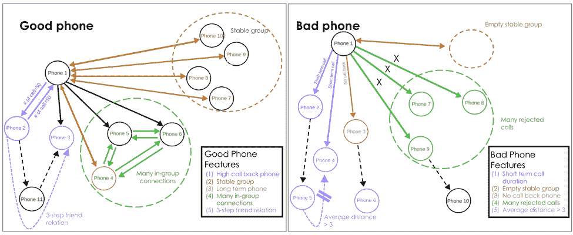
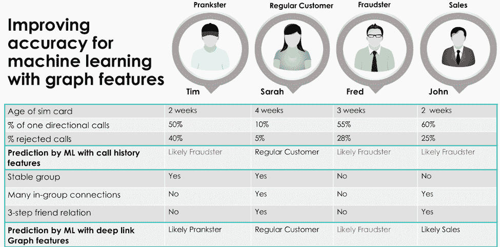

# 使用图表和机器学习大海捞针

> 原文：<https://thenewstack.io/using-graphs-and-machine-learning-to-find-needles-in-a-haystack/>

[](https://www.tigergraph.com/)

[TigerGraph 营销副总裁高拉夫·德什潘德](https://www.tigergraph.com/)

 [高拉夫·德什潘德是 tiger graph 的营销副总裁。他花了 15 年时间监管 IBM 的人工智能、区块链和云产品组合的营销，这些产品面向银行和金融、电信以及零售市场。此外，他还构建并定位了 IBM 的大数据和分析产品组合。](https://www.tigergraph.com/) [](https://www.tigergraph.com/)

在许多方面，欺诈检测就像大海捞针。你必须对海量数据进行分类和理解，以便找到你的“针头”，或者在这种情况下，找到你的欺诈者。

让我们以一家电话公司为例，该公司的网络中每周都会发生数十亿次呼叫。它如何从堆积如山的通话记录中识别欺诈活动的迹象？这就是机器学习提供价值的地方，提供了一块磁铁，在这种情况下，就是识别潜在欺诈者的行为和模式的能力。使用图形模型，机器变得更善于识别可疑的电话呼叫模式，并能够将它们从普通人的数十亿次呼叫中分离出来，这些呼叫构成了我们的数据堆。

事实上，越来越多的组织正在利用机器学习和图表来防止各种类型的欺诈，包括电话诈骗、信用卡拒付、广告、洗钱等。在我们进一步讨论机器学习和图表的强大组合的价值之前，让我们看看当前基于机器学习识别欺诈者的方法是如何遗漏目标的。

## 机器学习算法的好坏取决于它的训练数据

为了检测特定条件，例如电话参与诈骗或支付交易涉及洗钱，机器学习系统需要足够数量的可能与洗钱有关的欺诈电话或支付交易。让我们以基于电话的欺诈为例进一步深入研究。

除了可能是欺诈的呼叫量之外，机器学习算法还需要与电话欺诈行为高度相关的特征或属性。

由于欺诈(很像洗钱)只占总交易量的不到 0.01%或万分之一，因此确认有欺诈活动的训练数据的数量非常少。拥有如此有限数量的训练数据反过来会导致机器学习算法的准确性较差。

发现欺诈者的特征或属性基于简单的分析。在基于电话的欺诈中，它们包括特定电话与网络内外的其他电话的通话记录、预付费 SIM 卡的使用年限、单向通话的百分比(电话接听者未回复电话的情况)以及被拒绝通话的百分比。同样，为了发现洗钱中涉及的支付交易，支付交易的规模和频率等特征被输入到机器学习系统中。

但是，如果只依赖于单个节点的特征，就会导致很高的误报率。例如，经常进行单向通话的电话可能属于销售代表，他正在给潜在客户打电话以寻找线索或销售商品和服务。它也可能涉及骚扰，即一个用户打电话给另一个用户是恶作剧。大量的误报导致调查非欺诈电话的努力白费，导致对欺诈检测的机器学习解决方案的信心降低。

## 更好地吸引电话诈骗

现实生活中的例子证明了图表和机器学习在打击欺诈方面的价值。目前，一家大型移动运营商使用具有实时深度链接分析的下一代图形数据库，来解决当前用于训练机器学习算法的方法的不足。该解决方案分析了 4.6 亿部手机的 100 多亿次通话，并为每部手机生成 118 个特征。这些都是基于对通话记录的深入分析，并超越了通话的直接接收者。

下图说明了图形数据库如何识别手机是“好”手机还是“坏”手机。一部坏手机需要进一步调查，以确定它是否属于欺诈者。



图 1–通过分析网络或图形关系特征来检测基于电话的欺诈

一个拥有好手机的客户打电话给其他用户，他们的大部分电话都会被回复。这有助于表明用户之间的熟悉程度或信任关系。一部好手机还会定期呼叫一组其他手机——比如每天或每月——并且这组手机在一段时间内相当稳定(“稳定组”)。

指示良好电话行为的另一个特征是当一部电话呼叫另一部已经在网络中待了几个月或几年的电话并接收回电时。我们还发现，好电话、长期电话联系人和网络中的其他电话之间有大量呼叫，这些电话经常呼叫这两个号码。这表明我们的好手机有许多组内连接。

最后，一部“好手机”通常包括三个步骤的朋友联系——这意味着我们的好手机会呼叫另一部手机，即手机二，后者会呼叫手机三。好的电话还可以通过电话 3 直接通话。这表明一个三步朋友连接，表明一个信任和相互联系的圈子。

通过分析电话之间的呼叫模式，我们的 graph 解决方案可以轻松识别不良电话，这些电话可能与诈骗有关。这些电话与多个良好的电话有短暂的通话，但没有收到回电。他们也没有一个定期通话的稳定电话组(代表“空稳定组”)。当一个坏电话呼叫网络中的一个长期客户时，该呼叫不会被返回。坏电话还会收到许多拒绝的电话，并且缺乏三步朋友关系。

图形数据库平台利用了超过 118 项新功能，这些功能与我们使用案例中 4.6 亿部手机的良好和不良手机行为高度相关。反过来，它会生成 540 亿个新的训练数据特征，以供机器学习算法使用。其结果是提高了机器学习对欺诈检测的准确性，减少了误报(例如，将非欺诈电话标记为潜在欺诈电话)和漏报(例如，参与欺诈的电话没有被标记为潜在欺诈电话)。

为了了解基于图形的功能如何提高机器学习的准确性，让我们考虑一个使用四个移动用户的简档的示例(图 2 ): Tim、Sarah、Fred 和 John。



图 2–利用图形特征提高机器学习的准确性

传统的通话记录特征，如所用 SIM 卡的年龄、单向通话的百分比和被接听者拒绝的总通话的百分比，导致我们的四分之三的客户 Tim、Fred 和 John 被标记为可能或潜在的欺诈者，因为根据这些特征他们看起来非常相似。基于图表的功能，以及对电话和用户之间的深度链接或多跳关系的分析，有助于机器学习将 Tim 归类为恶作剧的人，将 John 归类为销售人员，而将 Fred 标记为可能的欺诈者。让我们考虑如何。

以 Tim 为例，他有一个稳定的团队，这意味着他不太可能是一个销售人员，因为销售人员每周都会打不同的电话。Tim 没有太多的群内联系，这意味着他可能会给陌生人打电话。他也没有任何三步朋友关系来确认他打电话的陌生人没有关系。根据这些特征，蒂姆很可能是一个爱恶作剧的人。

让我们考虑一下 John，他没有一个稳定的团队，这意味着他每天都在寻找新的潜在客户。他打电话给有很多内部关系的人。当 John 介绍他的产品或服务时，如果一些接听电话的人认为该产品或服务会引起他们的兴趣或与他们相关，他们很可能会将他介绍给其他联系人。约翰还通过三步朋友关系建立联系，这表明他正在作为一名有效的销售人员完成闭环，在一个团队中导航他的第一个联系人的朋友或同事，因为他接触到了他的产品或服务的最终买家。这些特征的组合将约翰归类为销售人员。

在弗雷德的例子中，他没有一个稳定的群体，也没有与一个有很多群体内联系的群体互动。另外，在他打电话的人中，他没有三级朋友关系。这使得他很有可能成为电话诈骗者或诈骗犯。

回到我们最初的类比，我们能够在干草堆中找到我们的针，在我们的情况下，它是潜在的欺诈者 Fred，通过利用图形分析进行更好的机器学习来提高准确性。这是通过使用图形数据库框架对数据建模来实现的，这种方式允许识别和考虑更多的特征来进一步分析我们的数据堆。反过来，机器会接受越来越准确的数据训练，使其更智能，更成功地识别潜在的诈骗者和欺诈者。

## 打造更好的反洗钱磁石

除了识别基于电话的诈骗之外，图表和机器学习还用于许多欺诈检测用例。机器学习算法正在接受训练，以检测各种其他类型的异常行为，例如识别潜在的洗钱行为。

根据普华永道的报告，全球洗钱交易约占全球 GDP 的 2-5%，或每年约 1-2 万亿美元。洗钱的风险遍及整个金融服务生态系统，包括银行、支付提供商和较新的加密货币，如比特币和 Ripple。考虑到每天每一秒都有大量的金融活动发生，如何在一堆数据中找到我们的欺诈者呢？

当前的方法集中在单个节点的属性或特征上，例如所讨论的支付或用户，但是这经常导致大量的误报。同样的数据被输入到机器学习算法中，导致机器学习系统对未来欺诈预测的准确性很差——糟糕的数据输入，糟糕的洞察力输出！

正如您所料，欺诈者通过他们自己与已知的不良活动或不良参与者之间的迂回联系来掩饰他们的活动。任何单独的连接路径可能看起来是无辜的，但如果可以找到从一点到另一点的多条路径，欺诈的可能性就会增加。由于需要更多的遍历跳跃来找到两个或更多交易之外的数据连接，这就是图提供价值的地方——通过识别和找到数据连接和关系的特征，这些特征可以用来更好地通知和训练机器学习。这些特征可以包括支付交易的规模和频率，或者它们可以更抽象地基于数据之间的关系。

例如，基于图的方法可以揭示节点之间语义上有意义的连接路径。让我们考虑一个传入的信用卡交易，以显示如何识别它与其他实体的关系:

```
New Transaction  →  Credit Card  →  Cardholder  →  (other)Credit Cards  →  (other)Bad Transactions

```

该查询使用四跳来查找距离传入事务只有一张卡的连接。任何连接路径的个人都可能看起来是无辜的，但如果可以找到从 A 到 B 的多条路径，欺诈的可能性就会增加。鉴于此，需要更多的跳跃来发现两个或更多事务之间的连接。通过这种方式，实时深度链接分析在发现多个隐藏的联系以最大限度地减少欺诈方面提供了价值。

第二，图驱动的方法允许使用基于图的统计来测量节点、链接和路径的全局相关性。例如，*介数*的特征给出了一个实体落在其他实体之间的最短路径上的次数。此度量显示哪个实体充当其他实体之间的桥梁。中间状态可以是检测任何洗钱或可疑活动的起点。可能表明某人或某物是诈骗团伙或洗钱团伙的中间人。社区检测通过比较组内连接与组间连接的相对密度来发现网络中的自然分组。

类似地，其他基于图形的分析，如*度中心性*和最短路径，可以为原本不起眼的数据点添加必要的颜色。度中心性提供了每个实体进出的链接数量，提供了每个实体与网络中其他实体的直接连接数量。这尤其有助于找到联系最紧密的客户或实体，这些客户或实体可能充当一个中心，并连接到一个更广泛的网络。

通过将数据链接在一起，图形分析可以实时支持基于规则的机器学习方法，以自动化自动洗钱(AML)流程并减少误报。使用图形引擎将复杂的数据科学技术(如自动化数据流分析、社交网络分析和机器学习)整合到反洗钱流程中，企业可以利用更好的数据更快地提高洗钱检测率。他们还可以摆脱繁琐的交易流程，转向更具战略性、更高效的反洗钱方法。

### 例如:电子支付公司

举一个图表和机器学习推动反洗钱的例子，我们可以看看世界上排名第一的电子支付公司。目前，该组织拥有超过 1 亿的每日活跃用户，并使用图表分析来实现其调查方法的现代化。

以前，该公司的反洗钱实践是一项非常手工的工作，因为调查人员参与了从检查数据到识别可疑资金流动行为的所有工作。运营费用高昂，而且流程极易出错。

通过实施图表分析，该公司能够利用机器学习，使用实时响应反馈自动开发智能 AML 查询。结果包括使用更有效的 AML 流程获得了高经济回报，减少了假阳性，并转化为更高的检测率。

### 例如:信用卡公司

同样，一家排名前五的支付提供商试图提高其反洗钱能力。关键难点包括高成本和无法遵守联邦反洗钱法规，从而导致处罚。该组织依赖由数百名调查人员组成的机器学习团队执行的手动调查流程，导致流程缓慢、成本高昂且效率低下，90%以上的误报率。

该公司利用图形引擎来实现调查流程的现代化。它已经从让其机器学习团队拼凑流程转向将图形分析的力量与 ML 结合起来，以提供对个人、账户、公司和位置之间联系的洞察。

通过整合更多维度的数据，并整合额外的数据点(如客户的外部信息)，它能够自动实时监控潜在的洗钱活动，从而使调查人员能够更具战略性地利用他们现在更丰富的数据。其结果是对其海量数据进行全面而深入的观察，从而减少误报警报。

## 结论

在当今数据爆炸的时代，组织充分利用海量数据进行实时分析以检测欺诈变得越来越重要。图形与机器学习的强大结合在确保机器算法获得高质量数据方面提供了巨大的价值。随着机器训练变得更加有效，结果是更多的欺诈活动被发现。图表是一种强大的资产，有助于确保可以识别更高质量、更复杂的特征，以支持旨在找到干草堆中的针的精确机器学习。

通过 Pixabay 的特征图像。

<svg xmlns:xlink="http://www.w3.org/1999/xlink" viewBox="0 0 68 31" version="1.1"><title>Group</title> <desc>Created with Sketch.</desc></svg>