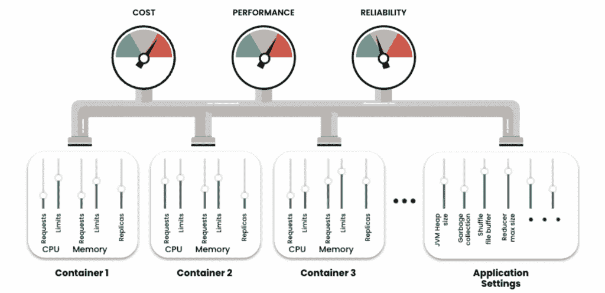
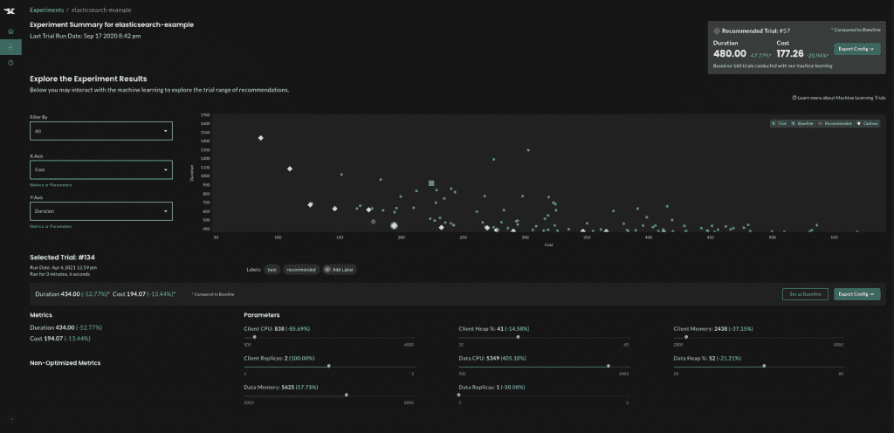
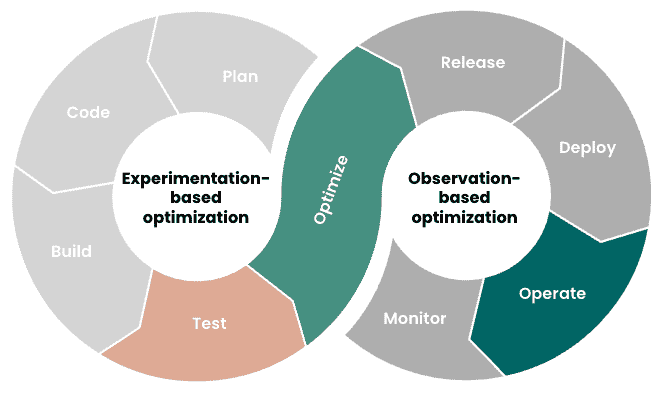

# 使用机器学习自动化 Kubernetes 优化

> 原文：<https://thenewstack.io/using-machine-learning-to-automate-kubernetes-optimization/>

 [布莱恩·利科萨

布莱恩是一名开源极客，热衷于在人与技术的交汇处工作。在他的职业生涯中，他一直参与开源，无论是在 Red Hat 时参与 Linux、Ansible 和 OpenShift/Kubernetes，还是在 Confluent 时参与 Apache Kafka，或者在 AWS 时参与 Apache Flink。他目前是 StormForge 的高级解决方案架构师，住在芝加哥地区，喜欢恐怖、体育、现场音乐和主题公园。](https://www.linkedin.com/in/brianlikosar/) 

*注意:这是包含 Kubernetes 资源管理和优化的五部分系列的第三部分。在本文中，我们解释了如何使用机器学习来有效地管理 Kubernetes 资源。以前的文章解释了* [*Kubernetes 资源类型*](https://thenewstack.io/understanding-kubernetes-resource-types/) *和* [*请求和限制*](https://thenewstack.io/kubernetes-requests-and-limits-demystified/) *。*

随着 Kubernetes 成为应用程序容器编排的事实上的标准，它也提出了关于优化策略和最佳实践的重要问题。组织采用 Kubernetes 的原因之一是提高效率，即使是在扩大和缩小规模以适应不断变化的工作负载的同时。但是，使 Kubernetes 如此灵活的细粒度控制也使有效调优和优化变得非常困难。

在本文中，我们将解释如何使用机器学习来自动调整这些资源，并确保针对不同的工作负载进行有效的扩展。

## 优化的复杂性

为 Kubernetes 优化应用程序主要是确保代码尽可能高效地使用其底层资源——即 CPU 和内存。这意味着以尽可能低的成本和最少的工作量确保性能达到或超过服务级别目标。

创建集群时，我们可以在容器级别配置两种主要资源的使用——内存和 CPU。也就是说，我们可以设置应用程序可以使用和请求多少资源的限制。我们可以将这些资源设置视为我们的输入变量，而输出则是运行应用程序的性能、可靠性和资源使用(或成本)。随着容器数量的增加，变量的数量也随之增加，集群管理和系统优化的总体复杂性也随之成倍增加。

我们可以将 Kubernetes 配置视为一个等式，其中资源设置是我们的变量，成本、性能和可靠性是我们的结果。

更复杂的是，不同的资源参数是相互依赖的。更改一个参数可能会对集群性能和效率产生意想不到的影响。这意味着手动确定最佳性能的精确配置是一项不可能的任务，除非您有无限的时间和 Kubernetes 专家。

如果我们在容器部署期间没有为资源设置定制值，Kubernetes 会自动分配这些值。这里的挑战是 Kubernetes 非常慷慨地提供资源来防止两种情况:由于内存不足(OOM)错误导致的服务失败和由于 CPU 节流导致的不合理的缓慢性能。然而，使用默认配置来创建基于云的集群将导致不合理的高云成本，而不能保证足够的性能。

当我们试图管理几个集群的多个参数时，这一切变得更加复杂。为了优化环境的度量值，机器学习系统可以是不可或缺的附加部分。

## 机器学习优化方法

基于机器学习的优化有两种通用方法，每种方法都以不同的方式提供价值。首先，基于实验的优化可以在非生产环境中使用各种场景来模拟可能的生产场景。其次，基于观察的优化可以通过观察实际的系统行为在 prod 或非 prod 中执行。接下来描述这两种方法。

## 基于实验的优化

通过实验进行优化是一种强大的、基于科学的方法，因为我们可以尝试任何可能的场景、衡量结果、调整变量并再次尝试。因为实验是在非生产环境中进行的，所以我们只受限于我们可以想象的场景以及执行这些实验所需的时间和精力。如果实验是手动完成的，那么所需的时间和精力将会是巨大的。这就是机器学习和自动化的用武之地。

让我们探索基于实验的优化在实践中是如何工作的。

### 第一步:确定变量

要建立一个实验，我们必须首先确定哪些变量(也称为参数)可以调整。这些通常是 CPU 和内存请求和限制、副本以及特定于应用程序的参数，如 JVM 堆大小和垃圾收集设置。

一些 ML 优化解决方案可以扫描您的集群，以自动识别可配置的参数。这个扫描过程还捕获集群的当前值或基线值，作为我们实验的起点。

### 第二步:设定优化目标

接下来，你必须明确你的目标。换句话说，您试图最小化或最大化哪些指标？一般来说，目标将由多个代表权衡的指标组成，比如性能与成本。例如，您可能希望在最小化资源成本的同时最大化吞吐量。

一些优化解决方案允许您对每个优化目标进行加权，因为在某些情况下，性能可能比成本更重要，反之亦然。此外，您可能希望为每个目标指定界限。例如，您可能甚至不想考虑任何导致性能低于特定阈值的场景。提供这些护栏将有助于提高实验过程的速度和效率。

以下是为您的优化目标选择正确指标的一些注意事项:

*   如果一个容器化的应用程序是基于事务的，那么尽量减少响应时间和错误率。在这种情况下，最大速度是最理想的，资源使用是最不关心的。
*   如果应用程序仅仅是为了计算，那么尽量减少错误率。我们希望优化性能效率。
*   如果应用程序处理数据，速度可能是次要的。优化成本。

当然，这只是几个例子。确定适当的度量标准来划分优先级需要开发人员和负责业务运营的人员之间的沟通。确定组织的主要目标。然后检查技术如何实现这些目标，以及实现这些目标需要什么。最后，制定一个计划，强调最能平衡成本和功能的指标。

### 步骤 3:建立优化场景

使用基于实验的方法，我们需要建立优化的场景，并将这些场景构建到负载测试中。这可能是一系列预期的用户流量，也可能是一个特定的场景，如基于零售假日的流量高峰。该性能测试将在实验过程中用于模拟生产负载。

### 第四步:进行实验

一旦我们用优化目标和可调参数建立了实验，我们就可以开始实验了。一个实验由多个试验组成，您的优化解决方案会针对每个试验重复以下步骤:

1.  实验控制器使用第一次试验的基线参数在集群中运行容器化的应用程序。
2.  然后，控制器运行之前创建的性能测试，为我们的优化场景向系统施加负载。
3.  控制器捕获与我们的目标相对应的度量，例如，持续时间和资源成本。
4.  机器学习算法分析结果，然后为下一次试验计算一组新的参数。
5.  然后，无论在配置您的实验时指定了多少次试验，都会重复这一过程。典型的实验从 20 到 200 次试验不等，更多的参数需要更多的试验才能得到确定的结果。

机器学习引擎使用每次试验的结果来构建表示多维参数空间的模型。在这个空间中，它可以检查彼此相关的参数。随着每一次迭代，ML 引擎更接近于识别优化目标度量的配置。

### 第五步:分析结果

虽然机器学习会自动推荐会产生最佳结果的配置，但一旦实验完成，就可以进行额外的分析。例如，您可以可视化两个不同目标之间的权衡，查看哪些参数对结果有重大影响，哪些不太重要。

结果通常是令人惊讶的，并可以导致关键的体系结构改进，例如，确定大量较小的副本比少量“较重”的副本更有效。

可以对实验结果进行可视化和分析，以全面了解系统行为。

## 基于观察的优化

虽然基于实验的优化对于分析各种场景非常有效，但是不可能预测到所有可能的情况。此外，高度可变的用户流量意味着，随着情况的变化，某个时间点的最佳配置可能不再是最佳配置。Kubernetes 自动缩放器可以有所帮助，但它们是基于历史使用情况的，没有考虑到应用程序的性能。

这就是基于观察的优化可以发挥作用的地方。让我们看看它是如何工作的。

### 步骤 1:配置应用程序

根据您使用的优化解决方案，为基于观察的优化配置应用程序可能包括以下步骤:

*   指定名称空间和标签选择器(可选),以标识要优化的资源。
*   指定护栏(最小。还有麦克斯。)来调整 CPU 和内存参数。
*   指定系统推荐更新参数设置的频率。
*   指定是自动部署建议还是批准部署建议。

### 第二步:机器学习分析

一旦配置完成，机器学习引擎就开始分析从[普罗米修斯](https://prometheus.io/)、[数据狗](https://www.datadoghq.com/)或其他可观察性工具收集的可观察性数据，以了解实际的资源使用和应用性能趋势。然后，系统开始以配置期间指定的时间间隔提出建议。

### 步骤 3:部署建议

如果您在配置过程中指定了自动实施建议，优化解决方案将在建议时自动使用建议的配置修补部署。如果选择了手动部署，则可以在决定批准与否之前查看建议，包括容器级别的详细信息。

## 最佳实践

您可能已经注意到，基于观察的优化比基于实验的方法更简单。它以更少的努力更快地提供价值，但另一方面，基于实验的优化更强大，可以提供基于观察的方法无法实现的深入应用洞察。

使用哪种方法不应该是一个非此即彼的决定；这两种方法各有其用武之地，可以共同缩小 prod 和非 prod 之间的差距。以下是一些需要考虑的指导原则:

*   *   因为基于观察的优化易于实现，并且可以很快看到改进，所以应该在您的环境中广泛部署。
    *   对于更复杂或关键的应用程序，可以从更深层次的分析中受益，使用基于实验的优化来补充基于观察的优化。
    *   基于观察的优化也可以用于识别场景，这些场景保证了基于实验的优化所提供的更深入的分析。
    *   然后使用基于观察的方法，在生产环境的良性优化循环中不断验证和改进基于实验的实现。

使用基于实验和基于观察的方法创造了一个系统的、持续优化的良性循环。

## 结论

优化我们的 Kubernetes 环境以最大限度地提高效率(性能成本比)、智能扩展并实现我们的业务目标需要:

1.  部署前我们的应用程序和环境参数的理想配置。
2.  部署后的持续监控和调整。

对于小型环境，这项任务非常艰巨。对于一个在 Kubernetes 上大规模运行应用的组织来说，这可能已经超出了人工劳动的范围。

幸运的是，机器学习可以弥合自动化差距，并为优化 Kubernetes 环境的各个层面提供强大的见解。

StormForge 提供了一种解决方案，它使用机器学习来基于[观察](https://www.stormforge.io/how-stormforge-optimize-live-works/?utm_medium=affiliate&utm_source=thenewstack&utm_campaign=sf-tutorial-series-pt3)(使用可观察性数据)和[实验](https://www.stormforge.io/how-stormforge-optimize-pro-works/?utm_medium=affiliate&utm_source=thenewstack&utm_campaign=sf-tutorial-series-pt3)(使用性能测试数据)进行优化。

要在您的环境中试用 StormForge，您可以[在这里](https://www.stormforge.io/try-free/?utm_medium=affiliate&utm_source=thenewstack&utm_campaign=sf-tutorial-series-pt3)申请免费试用，体验一下完整的优化如何不需要完全令人头痛。

*请继续关注本系列的后续文章，在这些文章中，我们将解释如何解决优化运行在容器中的 Java 应用程序和数据库所涉及的特定挑战。*

<svg xmlns:xlink="http://www.w3.org/1999/xlink" viewBox="0 0 68 31" version="1.1"><title>Group</title> <desc>Created with Sketch.</desc></svg>