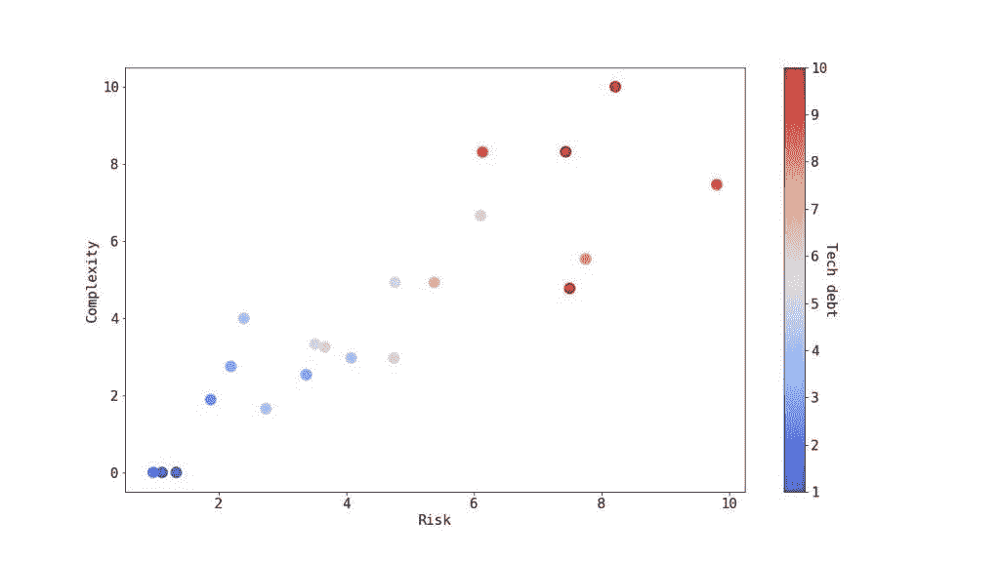

# 使用机器学习来衡量和管理技术债务

> 原文：<https://thenewstack.io/using-machine-learning-to-measure-and-manage-technical-debt/>

[Ori Saporta](https://www.linkedin.com/in/ori-saporta-9023b43/?originalSubdomain=il)

[Ori 共同创立了 vFunction 并担任其系统架构师。在创建 vFunction 之前，Ori 是 WatchDox 的首席系统架构师，直到被 Blackberry 收购，他继续担任杰出的系统架构师。在此之前，Ori 是以色列情报局 8200 部门的系统架构师。Ori 拥有特拉维夫大学的计算机工程学士学位和计算机科学硕士学位。](https://www.linkedin.com/in/ori-saporta-9023b43/?originalSubdomain=il)

如果你是一名软件开发人员，那么“技术债务”可能是你熟悉的一个术语。简而言之，技术债务是大量阻碍您编码工作的小妥协的日积月累。有时，由于当前版本的紧迫性，您(或您的经理)选择“下次”处理这些挑战。

对于许多组织来说，这是一个持续的循环，直到出现真正的转折点或危机。如果软件团队决定直面技术债务，这些勇敢的软件工程师可能会发现情况变得如此复杂，以至于他们不知道从哪里开始。

困难之处在于，我们对技术债务所做的决定必须在积累此类债务的短期和长期影响之间取得平衡，强调在规划开发周期时需要正确评估和解决它。

在最近对 250 名高级 IT 专业人员进行的调查[中可以看到这一点的真实含义](https://vfunction.com/resources/report-wakefield-why-app-modernization-projects-fail/)，其中 97%的人预测组织会推迟应用程序现代化项目，高管和架构师的主要担忧是“风险”对于架构师来说，我们可以将此视为“技术风险”——对应用程序的一部分进行更改将会在其他地方产生不可预测且不受欢迎的下游影响的威胁。

## 衡量技术债务背后的科学

在他们 2012 年的开创性文章[“寻找管理架构技术债务的指标”](https://resources.sei.cmu.edu/asset_files/conferencepaper/2012_021_001_88045.pdf)中，作者罗伯特·l·诺德、伊佩克·奥兹卡亚、菲利普·克鲁奇滕和马尔科·冈萨雷斯-罗哈斯提供了一种基于架构元素之间的依赖关系来衡量技术债务的指标。他们使用这种方法来展示一个组织应该如何计划开发周期，同时考虑累积技术债务对每个后续版本发布所需的总体资源的影响。

虽然这篇文章发表于近 10 年前，但它在今天的相关性是很难夸大的。今年三月早些时候，[在第 19 届 IEEE 软件架构国际会议上获得了“最具影响力论文”奖。](https://twitter.com/ICSAconf/status/1499633253724360707)

在本帖中，我们将展示技术债务不仅是针对任何特定应用做出决策的关键，而且在尝试对多个应用之间的工作进行优先级排序时也很重要——特别是现代化工作。

此外，我们将展示一种方法，它不仅可以用于比较单个应用程序的不同设计路径的性能，还可以比较多个应用程序在其开发生命周期中任意点的技术债务水平。

## 准确测量全系统技术债务

在上面提到的 IEEE 文章中，计算技术债务是使用一个公式来完成的，这个公式主要依赖于给定应用程序中架构元素之间的依赖关系。值得注意的是，这篇文章并没有定义什么构成一个架构元素，或者在处理一个应用程序时如何识别这些元素。

我们采用了类似的方法，并设计了一种基于类之间的依赖图来度量应用程序技术债务的方法。依赖图是一个有向图 G=V，e，其中 V=c1，c2，…是应用程序中所有类的集合，如果原始代码中的类 c1 依赖于类 c2，则在两个顶点之间存在边 e=⟨c1，c2⟩E。我们对图表进行多方面的分析，最终得出一个描述应用程序技术缺陷的分数。以下是我们从原始图表中提取的一些指标:

1.  图中顶点的平均/中值外向度。
2.  图中任意节点的顶点 *N* 出度。
3.  班级间最长的路径。

使用图上的标准聚类算法，我们可以识别图中的类社区，并测量它们的附加度量，例如:

1.  已识别社区的平均外向度。
2.  社区间最长的路径。

这里的假设是，通过在依赖图上使用这些通用的度量，我们可以识别在原始代码库中代表真实技术债务的架构问题。此外，通过分析这两个层次——类和社区——上的依赖关系，我们给出了实践中架构元素是什么的广义解释，而不试图正式定义它。

为了测试这种方法，我们创建了一个包含来自各种领域(金融服务、电子商务、汽车和其他)的 50 多个应用程序的数据集，并从中提取了上述指标。我们以两种方式使用这个数据集。

首先，我们将高等级的外索引和长路径的具体实例与代码中的本地问题相关联。例如，通过它们的高 outdegree 来识别 [god 类](https://en.wikipedia.org/wiki/God_object)。这被证明是有效的，并增加了我们的信心水平，即这种方法在识别本地技术债务问题方面是有效的。

其次，我们试图提供一个高水平的分数，不仅可以用来识别单个应用程序中的技术债务，还可以用来比较应用程序之间的技术债务，并使用它来帮助确定应该解决哪些问题以及如何解决。为此，我们引入了三个索引:

1.  **复杂性** —代表向软件添加新特性所需的努力。
2.  **风险** —代表添加新功能对现有功能稳定性的潜在风险。
3.  **总负债** —代表尝试添加新功能时所需的额外工作的总量。

## 从图论到可行的见解

我们利用负责产品开发的架构师和开发人员的专业知识，对数据集中的应用程序进行了手动分析，并对每个应用程序的复杂性、风险和总体负债进行了评分，分值范围为 1 到 5，其中 1 分表示需要的工作量很小，5 分表示工作量很大。我们使用这些基准来训练一个机器学习模型，该模型将提取的指标值与指标相关联，并将其标准化为 0 到 100 的分数。

这使我们能够使用这种 ML 模型为我们遇到的任何新应用程序发布每个指数的分数，使我们能够分析整个应用程序组合，并将它们相互比较，并与我们预先计算的基准进行比较。下图描述了 21 个应用程序的示例，展示了上述指标之间的关系:

资料来源:vFunction 公司，2022 年

然后，将总体债务水平转换为货币单位，以描述向系统中添加新功能所需的投资水平。例如，对于应用程序开发和创新的每 1 美元投资，有多少是专门用于维护架构技术债务的？这是为了帮助组织建立一个商业案例，从他们的应用程序中处理和移除架构技术债务。

我们已经展示了一种基于类之间的依赖性来度量应用程序技术债务的方法。我们已经成功地使用这种方法来识别导致技术债务的本地问题，并提供可以在应用程序之间进行比较的全局分数。通过使用这种方法，组织可以成功地评估他们软件中的技术债务，这可以导致围绕它的决策的改进。

<svg xmlns:xlink="http://www.w3.org/1999/xlink" viewBox="0 0 68 31" version="1.1"><title>Group</title> <desc>Created with Sketch.</desc></svg>