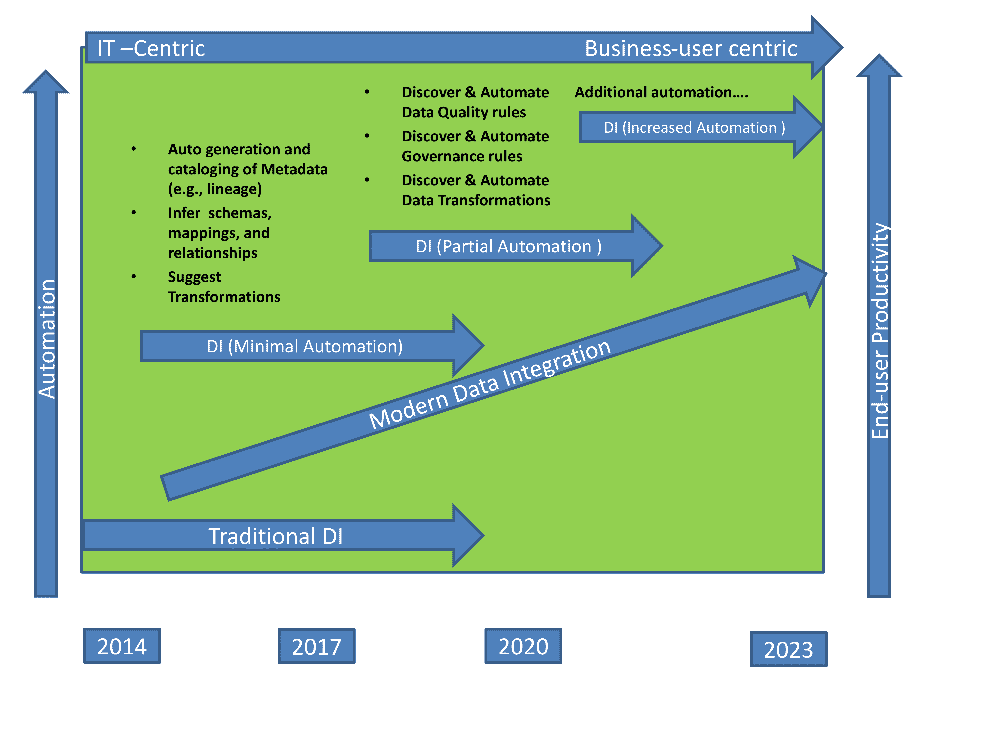

# 元数据和机器学习一起可以帮助自动化数据集成

> 原文：<https://thenewstack.io/using-metadata-machine-learning-drive-integration-automation/>

企业以前所未有的速度捕获信息，这种速度一直超过了他们分析和使用信息的能力。数据类型、传感器、操作设备和收集数据的应用程序的激增助长了现状。这大大增加了数字企业的数据集成挑战，这些企业需要实现数据集成策略的现代化。它们还需要由元数据驱动的方法支持的工具，以便在超连接的基础设施中集成数据，而不管其结构或来源。

## 为什么元数据驱动的集成至关重要

元数据已经成为现代数据集成的重要组成部分，原因有几个，包括:

 [拉克什米·兰德尔

Lakshmi Randall 是数据虚拟化软件的领导者 Denodo 的产品营销总监。此前，她是 Gartner 的研究总监，负责数据仓库、数据集成、大数据、信息管理和分析实践。](https://www.denodo.com/) 

*   **设备的激增和数据源的分布式特性**:为元数据创造了不可或缺的角色。通过提供关于(1)生成数据的设备和(2)正在生成的数据的性质等信息，元数据提供了对于超连接世界中的数据集成至关重要的知识。
*   **多样化集成策略**:创造了对多种集成工具的需求，这些工具必须共存并通过元数据共享(交换)有效地协同工作，以实现企业的数据集成目标。元数据通过提供对上游和下游流程的可见性，支持不同的、或多或少专门化的工具之间的合作。
*   **利用数据质量和治理过程作为数据集成的一部分**:在集成管道中嵌入这些过程需要在集成工具、质量和治理工具之间双向共享元数据。
*   **集成场景中的性能优化:**元数据提供了支持动态优化策略的底层数据源的特性知识。
*   **整合逻辑数据架构的集成解决方案:**如逻辑数据仓库。利用元数据，企业可以构建与不同业务部门相关的多种语义，以支持 BI 和分析。

## 机器学习推动集成自动化

尽管[机器学习](/category/machine-learning/)目前在数据集成中仅占据次要地位，但鉴于其在现代数据集成范式框架内推动自动化的潜力，它的重要性将会加速提升。目前，企业在数据集成中利用机器学习的方式有两种:

*   在集成流程或管道中嵌入机器学习组件，以支持实时分析和决策制定。
*   利用机器学习最小化集成组件的自动化，包括自动化:
    *   数据编目和数据表征(例如，推断模式和结构)
    *   转型建议
    *   元数据映射

## 元数据和机器学习一起

数据集成的未来在于更高的自动化程度，其目标是提高最终用户的工作效率，减少构建集成工作流所花费的时间，从而总体降低集成成本并提高敏捷性。

如图 1 所示，目前数据集成的自动化程度很低，例如生成和编目元数据以建立数据谱系、推断模式和关系以及建议转换。在不久的将来，自动化将发展到包括数据质量和治理规则的发现和自动化，以及数据转换，但仍然只代表数据集成的部分自动化。此后，进一步自动化的程度将取决于供应商对其产品现代化投资的承诺。

图一。元数据和机器学习推动了数据集成(DI)的自动化进程。

元数据和机器学习共同推动数据集成自动化。元数据提供了至关重要的信息和见解，如数据的特征，如格式、位置、关系、数据质量和使用信息。机器学习利用这些信息来提出和自动化与集成任务相关的建议。当一起使用时，组织可以利用各自的优势，使他们能够捕获和应用信息以获得竞争优势。

由 Pietro Jeng [通过](https://unsplash.com/photos/n6B49lTx7NM) Unsplash 拍摄的特写图像。

<svg xmlns:xlink="http://www.w3.org/1999/xlink" viewBox="0 0 68 31" version="1.1"><title>Group</title> <desc>Created with Sketch.</desc></svg>