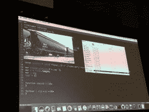
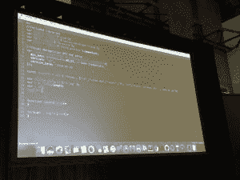

# 使用开源软件和 IBM Watson 从视频中提取数据

> 原文：<https://thenewstack.io/using-opensource-watson-turn-videos-data/>

随着近 70%的互联网数据预计在明年以视频格式出现，很明显，从视频中提取文本数据的任务对数据工程师来说将是至关重要的，而且这个过程必须自动化。BlueChasm 的首席技术官[瑞安·瓦纳斯坦](https://www.linkedin.com/in/ryanvanalstine)和软件开发者[罗伯特·里奥斯](https://twitter.com/RobertFromBC)在最近于三藩市举行的[沃森开发者大会](http://www.ibm.com/watson/developer-conference/)上演示了如何将原始视频转化为标记数据。

使用各种开源工具和简单的算法，他们能够从视频中提取足够的意义来总结其内容。该程序能够在新视频提交时自动启动，整个过程无需人工干预。代码可以在他们的博客上找到。

视频只是一系列图像，但是通过视觉识别发送所有图像在成本和时间上都是不允许的。关键是通过视频发送一个代表性的样本。从 30 帧中挑选一帧，代码将图像发送到沃森的视觉识别程序，该程序返回标记的图像。该程序将所有标签相加，以确定视频的内容。

关键成分？IBM 的 [Bluemix](https://console.ng.bluemix.net/home/) 服务平台， [FFmpeg](https://www.ffmpeg.org/) 视频转换软件， [OpenCV](http://opencv.org/) 在 [Node.js](/tag/node.js/) 之上的多核处理库，再加上一点点 [Watson 的视觉识别 API。](https://www.ibm.com/watson/developercloud/visual-recognition.html)

BlueChasm 的视频识别程序

Rios 将视频放入 FFmpeg 中，FFmpeg 处理视频，创建静止图像，在 30 帧中选择一帧，并将这些帧作为 jpeg 图像发送到一个文件夹中。他说，1/30 的帧数是一个任意的数字，选择这个数字是因为他知道视频速度较慢。如果视频有多个摄像机角度，或者有很多人，您可能希望降低比率以获得更多帧。

与其他工具相比，他更喜欢 FFmpeg，因为它为他提供了更大的视频灵活性，允许他添加时间戳和创建元数据。FFmpeg 创建静态图像(每秒 1 帧)并将 jpegs 加载到一个文件夹中。

产生的 jpegs 被发送到一个新创建的文件夹，并为每张图像设置一个循环，该循环将图像发送到 Watson 的视觉识别 API，再到 classify 端点。

Rios 说:“分类端点程序会做一些错误检查，因为有时分类器会空出来，或者加载标签时出现错误。”。节点同步发送图像，因此在接收结果时有时可能会导致错误，所以在将结果相加之前最好进行错误检查。如果图像返回错误，它会被标记为不可用。

让它工作的代码在 BlueChasm 博客上

下一步是调用 count 方法，该方法计算标签，告诉您视频中有什么。

该过程可以与音频处理相结合，以创建更有用的标签。例如，一个名人的视频将只返回名人的名字，剥离音频并将其发送到[沃森的音频识别 API](https://www.ibm.com/watson/developercloud/speech-to-text.html) 将确定视频是关于什么的。

你也可以通过 Watson [Tonal Analysis API](https://www.ibm.com/watson/developercloud/tone-analyzer.html) 发送它，它将返回音频的情感内容，这将有助于评估客户服务响应或上传的产品评论以及其他有用的应用程序。

要注意的是，VanAlstine 说，面部识别比物体识别更昂贵，所以你要把它分开。在他们交付给客户的程序中，通常通过对象识别来运行视频过程，然后如果视频主要是关于人的，则通过面部识别来发送它。例如，你可以有一个关于汽车比赛的视频，有两个人在场边。没有理由将视频发送到面部识别，因为对象识别数据显示视频是关于一场汽车比赛的。

IBM 是新堆栈的赞助商。

<svg xmlns:xlink="http://www.w3.org/1999/xlink" viewBox="0 0 68 31" version="1.1"><title>Group</title> <desc>Created with Sketch.</desc></svg>