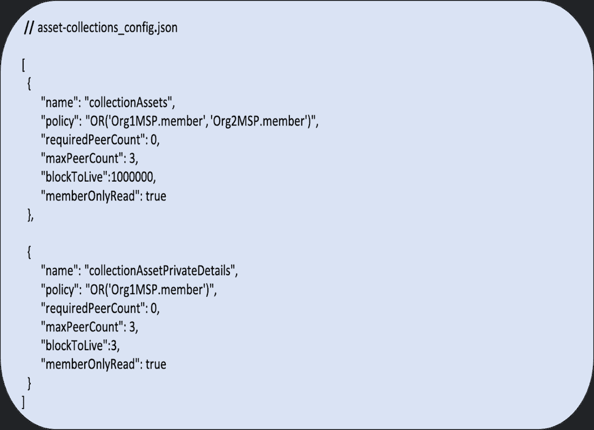

# 在 Hyperledger 结构中使用私有数据集合

> 原文：<https://thenewstack.io/using-private-data-collections-in-hyperledger-fabric/>

Linux 基金会赞助了这篇文章。

 [克里斯·加布里埃尔

克里斯是 Hyperchain 实验室的创始人兼首席执行官。](https://www.linkedin.com/in/chris-gabriel/) 

在商业和政府中使用区块链变得越来越重要。当我写这篇文章的时候，全球性的新冠肺炎疫情正在全球肆虐。从个人、企业到政府，每个人都不得不加快数字化转型，从最初的几年时间线转变为几个月甚至几周的时间线。企业、政府和它们的运作过程就像心脏动脉，由于不良饮食和缺乏锻炼，会在很长一段时间内慢慢堵塞。突然要求主持人几周后跑半程马拉松，动脉没有做好准备。

许可区块链是一个业务流程和契约真相讲述者，可用于不暴露个人信息(私人数据，如我们将在下面讨论的)的联系追踪，在全国选举中以验证的身份投票(从任何地方)，以及大规模支付分配(避免运行在 20 世纪 90 年代技术上的维护不善的州失业福利支付系统的现状)。简而言之，我相信在后新冠肺炎时代，区块链技术将对企业和政府变得越来越重要，因为它们反映了未来解决这些和其他问题需要什么技术。

## 什么是 Hyperledger Fabric？

Hyperledger Fabric 是一种企业级许可的区块链，通过使用加密身份管理、智能合同和不可变的分布式分类帐来替代不同的 ERP 系统、纸质合同、电子邮件、电话和人工干预点，在受信任方之间使用它来消除常见业务流程中的摩擦。 [Hyperledger Fabric](https://www.hyperledger.org/use/fabric) 是由 [Linux 基金会](https://www.linuxfoundation.org/)主持的众多开源区块链项目之一。

## 什么是私人数据收集，为什么使用它们？

私有数据集合是预定义的数据集合(通常为 JSON 格式),使 Hyperledger Fabric 区块链联盟中的公司能够保持某些交易数据的私有性，同时仍然允许在所有必需的节点之间达成共识。

私有数据收集由两个主要部分组成:

1.  **实际私有数据**；数据存储在授权组织的对等节点上的私有数据库中，并通过这些授权对等节点上的链码进行访问；和
2.  **私有数据散列**；背书、订购并写入渠道上每个对等方的分类账。

使用许可区块链的商业案例是，通过将所有竞争对手、供应商和监管机构置于同一个区块链网络中，你可以获得规模效益和网络效应。这种方法有两个主要的商业好处:第一，至少网络效应的一些好处归属于网络的所有成员，而不仅仅是少数成员；第二，使用私人数据收集确保网络成员不会损害他们可能拥有的竞争优势，方法是将敏感数据暴露给不需要查看这些数据的网络成员*但*仍然需要让他们的节点达成共识。

**图 1** 显示了一个 JSON 格式的私有数据集合在资产集合中的样子:

**图 1**

请注意， **"collectionAssets"** 中的 **"policy"** 允许 Org1 **或** Org2 的成员访问和处理数据，而**" collectionAssetPrivateDetails "**中的 **"policy** "只允许 Org1 的成员访问和处理私有数据细节。

该系列中其他感兴趣的领域有:

*   **requiredPeerCount** ，指定了传播私有数据所需的对等体数量，作为链码认可条件。
*   **maxPeerCount** ，为了冗余的目的，认可对等体将尝试向其分发数据的对等体的数量。
*   **blockToLive** ，指定敏感数据在对等体的私有数据库中以块为单位应该存在多长时间。
*   **memberonryread**，设置为 true 时，表示对等端自动强制只有属于某个集合成员组织的客户端才允许读取私有数据。

关于 **blockToLive** ，需要注意的是，数据会一直存在，直到达到所需的块数后被清除。但是，您可以通过将 **blockToLive** 设置为“0”来无限期保留私有数据

**图 2** 显示了上述概念的可视化图形。Org2 可以查询 Org1 拥有的与 **asset1，**相关的数据，但请记住，私有数据收集策略只允许 Org1 的成员访问 Org2 保存的私有数据详细信息。

图 2

随着企业和政府机构越来越多地采用区块链技术，对 Hyperledger 结构中的私有数据等强大隐私机制的需求将变得越来越重要。当一个区块链网络的所有成员都通过分享企业联盟的整体利益而受到激励时，我们将开始看到企业和政府数十年来交易的传统技术堆栈的终结。

要获得更多关于私有数据如何在 Hyperledger Fabric 许可的区块链网络中工作的详细信息，请查看关于“[在 Fabric](https://hyperledger-fabric.readthedocs.io/en/release-2.2/private_data_tutorial.html#pd-build-json) 中使用私有数据”的教程有多个 [Hyperledger Fabric 教程可用](https://hyperledger-fabric.readthedocs.io/en/release-2.2/tutorials.html)，几乎涵盖了如何部署 Hyperledger Fabric 企业级区块链网络的所有方面。你也可以在 Github 上找到 [Hyperledger Fabric 代码。](https://github.com/hyperledger)

通过 Pixabay 的特征图像。

目前，新堆栈不允许直接在该网站上发表评论。我们邀请所有希望讨论一个故事的读者通过推特或脸书访问我们。我们也欢迎您通过电子邮件发送新闻提示和反馈:[feedback @ thenewstack . io](mailto:feedback@thenewstack.io)。

<svg xmlns:xlink="http://www.w3.org/1999/xlink" viewBox="0 0 68 31" version="1.1"><title>Group</title> <desc>Created with Sketch.</desc></svg>