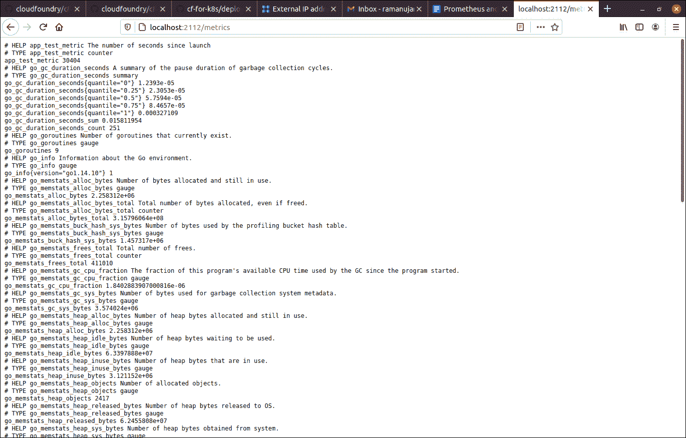

# 使用 Prometheus 监控运行 Cloud Foundry 的 Kubernetes 集群

> 原文：<https://thenewstack.io/using-prometheus-to-monitor-kubernetes-clusters-running-cloud-foundry/>

[云代工厂](https://www.cloudfoundry.org/)赞助本帖。

 [拉姆·艾扬格

Ram 实际上是一名工程师，本质上是一名教育家。在他作为一名开发人员的旅程中，他被推上了技术福音传道者的位置，并且从那以后再也没有回头看！他喜欢帮助世界各地的工程团队发现新的和创造性的工作方式。](https://www.linkedin.com/in/ramanujank/) 

遥测是每个需要优化性能的应用的核心。此外，在运行这些应用程序的云基础架构上构建的每个抽象层都会引入一组新的参数，需要观察这些参数来发现潜在的故障。

容器使得应用程序监控比以前稍微复杂一些。然后， [Kubernetes](https://thenewstack.io/category/kubernetes/) 的引入带来了另一层抽象，无意中监控挑战变得更加复杂。使用 Kubernetes 意味着有新的参数需要监控和故障排除。如果您也在使用微服务，一系列新的应用程序监控挑战就会出现。

每个平台即服务(PaaS)工具都承诺“专注于您的代码”此外，考虑 PaaS 工具通常附带专有组件和黑盒环境，作为整个构建和部署工具链的一部分。工程师会完全失去对性能优化能力的控制吗？

让我们具体来看一下 [Cloud Foundry](https://www.cloudfoundry.org/) 及其承诺: *Cloud Foundry 旨在为打算将其微服务部署到 Kubernetes 的开发人员提供简化的 PaaS 体验。*

PaaS、Kubernetes 和微服务——听起来像是监控灾难的良方，不是吗？

不完全是！Cloud Foundry (CF)是开源的，反过来，它使用其他流行的开源框架来实现简化开发人员体验的承诺。使用所有这些开源组件允许 PaaS 框架前所未有的透明性。具体来说， [CF-for-K8s](https://cf-for-k8s.io/) 采用了其他开源组件——如 [FluentD](https://www.fluentd.org/) 、 [Istio](https://istio.io/) 、 [Envoy](https://www.envoyproxy.io/) 、 [Eirini](https://github.com/cloudfoundry-incubator/eirini-release) 等——并将开发人员友好的 Cloud Foundry API 与 Kubernetes 的强大功能相结合。

CF-for-K8s 利用 [Prometheus](https://prometheus.io/) 来收集指标和触发事件。CF 社区决定使用 Prometheus 的原因有很多，但主要是因为它在 DevOps 社区中很受欢迎，而且它是开源软件。Prometheus 也是健壮的和可扩展的，提供了很大的度量覆盖范围，并且有一个作为容器安装的经过测试的方法。最重要的是，当与诸如 [Grafana](https://grafana.com/) 、 [OpenTracing](https://opentracing.io/) 、 [Zipkin](https://zipkin.io/) 或 [Jaeger](https://www.jaegertracing.io/) 等互补技术搭配使用时，选择 Cloud Foundry 的工程师可以获得完整的监控堆栈。

一个常见的问题是，带普罗米修斯的 CF-for-K8s 会装[头盔](http://helm.sh)吗？虽然可以使用舵轮图安装 Prometheus，但需要大量的配置才能使它与内部名称空间、网络策略和安全证书一起工作。因此，使用 Helm 在 CF-for-K8s 实例上安装 Prometheus 不是推荐的方法。

相反，在使用 CF-for-K8s 时，有一种更简单的方法来设置 Prometheus。在 Kubernetes 上安装 Cloud Foundry 抽象时，您可以包含一些配置文件，这些配置文件也包含作为 CF API 部署一部分的 Prometheus pods。

让我们切换到教程模式，学习如何在 CF-for-K8s 安装中安装 Prometheus。

1.  首先克隆 GitHub repo cf-k8s-prometheus。

2.  切换到克隆的目录。在这个 repo 中，您将找到所需的配置文件。

3.  接下来，使用 Carvel(以前的 k14s)工具 ytt 来创建将用于部署的模板。所有需要的工具，包括 Prometheus，都将作为声明性语法包含在生成的 YAML 文件中。

4.  然后，我们将使用 kapp 工具部署应用程序。这将在 [Kubernetes 集群](https://thenewstack.io/what-does-it-take-to-manage-hundreds-of-kubernetes-clusters/)上安装 CF-for-K8s 和 Prometheus。

5.  通常，用户需要为 Istio 入口网关安装一个域或静态 IP，以便从外部网络访问它。

在 Cloud Foundry 安装中，您需要采取几个额外的步骤来登录和创建目标空间。这超出了本文的讨论范围(详情请见)。

可以通过获取 Kubernetes 集群上 cf-system 名称空间上运行的所有 pod 的信息来确认 Prometheus 部署。

6.  为了证明 Prometheus 功能齐全，您可以部署一个配置了一些遥测技术的测试应用程序。在这个特殊的例子中，我们使用 GitHub 上可用的用 Go 编写的应用程序。

7.  manifest.yml 文件位于应用程序的 TLD 中，包括以下元数据:

Prometheus 使用此元数据来设置路由和本地端口，原始度量数据将被转发到这些端口。使用标准命令部署应用程序:

8.  一旦应用部署成功，我们就可以在 cf-workloads 名称空间中获得它们的状态和 pod 名称。复制 pod 的名称–

–并将本地端口的流量转发到运行 Prometheus 的 pod。

9.  终端上将显示端口转发设置成功的确认信息。

10.  在浏览器中打开路由(在本例中为 localhost:2112/metrics)将显示从 pod 上运行的应用程序收集的所有指标。

11.  或者，您也可以从端子向右弯曲端点。结果是一样的。

Cloud Foundry 社区正在努力为 CF 用户提供全面的监控堆栈支持。目前支持 Grafana，可用于可视化普罗米修斯捕获的数据。这是一项正在进行的工作，许多改进正在进行中。

到目前为止，我们收到了一些功能请求:

*   CF 如何与现有的监控堆栈集成？
*   会支持分布式跟踪吗？
*   CF 和 ZipKin，Jaeger 一起用吗？

还有许多与监控工具相关的开放性问题需要解答，我们将在不久的将来提供答案。同时，邀请你加入 Slack 上的 [Cloud Foundry 社区，讨论在 Kubernetes 上运营 Cloud Foundry 的方方面面。您可以在#logging-and-monitoring 频道上找到有关监视和可观察性的问题。](https://slack.cloudfoundry.org/)

<svg xmlns:xlink="http://www.w3.org/1999/xlink" viewBox="0 0 68 31" version="1.1"><title>Group</title> <desc>Created with Sketch.</desc></svg>