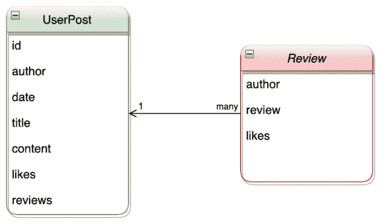

# 使用 Pydantic 通过 Couchbase 验证 JSON 文档

> 原文：<https://thenewstack.io/using-pydantic-to-validate-json-documents-with-couchbase/>

[Couchbase 五车二](https://www.couchbase.com/products/capella)是一个完全托管的 JSON 文档数据库即服务(DBaaS)产品，它消除了数据库管理任务，降低了总体成本。

 [里克·雅各布斯

里克是 Couchbase 的技术营销经理。他之前在 Cloudera 担任职务；IC-CAP 有限责任公司；实践分析；还有 IBM。](https://www.linkedin.com/in/rick-jacobs-819ba98/) 

五车二在现代云原生分布式数据库中提供了强大的性能、灵活性和可扩展性，该数据库融合了关系数据库功能(如 SQL 和 ACID 事务)的优势以及定义 NoSQL 的 JSON 灵活性和规模。

Pydantic 是一个库，它允许开发人员使用 Python 类型的注释来定义和验证定制的 JSON 对象。Pydantic 通过在运行时强制类型提示和引发用户友好的验证错误来加速编码时间。使用 pydantic 生成的 JSON 文档可以在五车二平台上使用，而不用担心通过字符串标准连接创建 JSON 文档时可能出现的文档格式不良。

**要运行快速启动项目，您需要以下先决条件:**

*   Git 存储库 URL:[https://github.com/brickj/capella_pydantic](https://github.com/brickj/capella_pydantic)
*   Python 3 已安装
*   [pip](https://pypi.python.org/pypi/pip) 包管理工具
*   已安装的 Couchbase 五车二 SDK:
    *   完整文档位于[此处](https://docs.couchbase.com/python-sdk/current/hello-world/start-using-sdk.html)。
    *   Python 命令示例:`pip install couchbase`
*   安装的 pydantic Python 库:
    *   完整文档位于[此处](https://pydantic-docs.helpmanual.io/)。
    *   Python 命令示例:`pip install pydantic`
*   Couchbase 五车二帐户:
*   名为“pydantic”的 Couchbase 五车二集群和存储桶

在这篇博客中，我将快速浏览一个使用 pydantic 创建有效 JSON 文档并将它们存储在 Couchbase 五车二中的例子。

Couchbase Python SDK 使开发人员能够在 Couchbase 集群中的指定桶上执行 CRUD 操作。例如，下面的代码片段执行一个 upsert(如果文档键不在存储桶中，则插入；如果文档已经存在，则更新):

```
1. # Store a Document
2. cb_coll.upsert('u:king_arthur',  {'name':  'Arthur',  'email':  'kingarthur@couchbase.com',  'interests':  ['Holy Grail',  'African Swallows']})

```

Python 开发人员通常使用字符串或整数来创建 JSON 文档，以填充存储键值对的字典对象。然后，该字典对象被发送到五车二数据库中的指定存储桶进行插入。创建和填充 dictionary 对象的示例代码类似于下面的代码片段:

```
1. # Dictionary object with keys and values
2. sample_dict  =  {1:  'document 1',  2:  'document 2'}

```

使用 pydantic，开发人员可以灵活地为 JSON 对象指定一个模式，该模式可以在创建文档时强制执行。例如，下面的步骤为用户文章创建了一个 JSON 文档。文档模型如下所示:



每个 UserPost 对象都有帖子中使用的字段，但是每个帖子可以有多个需要嵌套在帖子中的评论。为了启用这个功能，开发人员可以为 UserPost 和 Review 创建两个单独的类。比如:

```
1. class Review(BaseModel):
2. author:  str
3. review:  str
4. likes:  int
5. 
6. class UserPost(BaseModel):
7. author:  str
8. date:  str
9. title:  Optional[str]  =  None
10. content:  str
11. id:  int
12. likes:  List[str]
13. reviews:  List[Review]

```

一旦创建了对象，填充文档就很容易:

```
​​1. review  =  [
2. Review(author="johndoe",  review="This is a comment!",  likes=3),
3. Review(author="rickJ",  review="This is a Rick J comment!",  likes=1),
4. Review(author="janedoe",  review="This is a Jane Doe comment!",  likes=2)
5.    
6. ]
7.    
8. user_post1  =  UserPost(author="johndoe",
9. date="1/1/1970",
10. title="Cool post",
11. content="Cool content",
12. id=10101,
13. likes=["johndoe",  "janedoe"],
14. reviews=review)

```

现在您可以将 UserPost 对象用作字典，并使用与前面所示的 upsert 代码类似的代码将它 upsert 到 Couchbase 五车二，但是使用该对象的 dict()方法:

```
1. # Upsert JSON dict with key 'u:pydantic_document'
2. cb_coll.upsert('u:pydantic_document',  user_post1.dict())

```

本博客中展示的完整项目包括以下内容:

*   带说明的自述文件。
*   创建 UserPost 和 Review 对象的代码。
*   生成并打印输出文档的代码。
*   使用 Couchbase Python SDK 连接到 Couchbase 五车二的代码。
*   向上插入生成的 JSON 文档的代码。

可以在[https://github.com/brickj/capella_pydantic](https://github.com/brickj/capella_pydantic)为 Git 克隆公共项目

## **接下来的步骤**

**了解更多关于 [Couchbase 五车二](https://www.couchbase.com/products/capella)的信息，我们的数据库即服务产品:**

至此，您应该能够快速使用 pydantic 库来创建有效的 JSON 文档，以便与 [Couchbase 五车二](https://www.couchbase.com/products/capella)一起使用。

如果您有任何问题或意见，请在 [Couchbase 论坛](https://forums.couchbase.com/)与我们联系！

<svg xmlns:xlink="http://www.w3.org/1999/xlink" viewBox="0 0 68 31" version="1.1"><title>Group</title> <desc>Created with Sketch.</desc></svg>