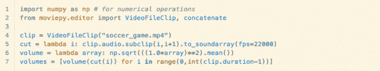
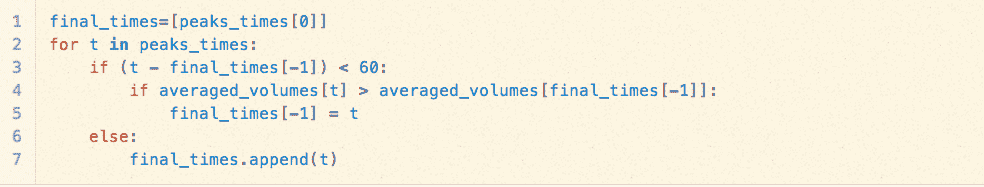

# 使用 Python 跟踪并制作足球比赛的视频集锦...还是世界杯集锦卷轴？

> 原文：<https://thenewstack.io/using-python-to-track-and-make-a-video-highlight-of-a-soccer-match-or-a-world-cup-highlight-reel/>

我上周看到了这个，觉得它很聪明。使用 Python，开发者创建了一个职业足球比赛视频集锦的自动摘要。祖尔科认为，足球比赛的精彩部分可以通过球迷在比赛中的吵闹程度来追踪。

他用 Python 打开了视频文件，并计算了比赛中每一秒钟的音量:

通过绘制数据，祖尔科展示了每一个进球得分后比赛的响度:

他发现五个最高的音量峰值与进球的时间相关。然后，他选取其他峰值音量的前 10%来寻找其他亮点。他进一步重新组织了相隔不到一分钟的欢呼数据。

`final_times "`包含了 21 个事件的时间(以秒为单位),从中我们可以剪切我们的视频。在 321 个项目中，每一个项目，他都在开始前五秒钟起跑，在结束后五秒钟停止。

结果是一个 3:30 长的视频。他写道，比赛的某些方面让算法变得混乱。例如，在进球后进行大量回放或降低声音的广播员。

祖尔科为那些想亲自尝试的人提供了整个剧本。

Zulko 写道，这种方法可以用于其他运动、电影集锦和其他视频。

那么…谁来制作自动化的世界杯集锦卷轴呢？

<svg xmlns:xlink="http://www.w3.org/1999/xlink" viewBox="0 0 68 31" version="1.1"><title>Group</title> <desc>Created with Sketch.</desc></svg>