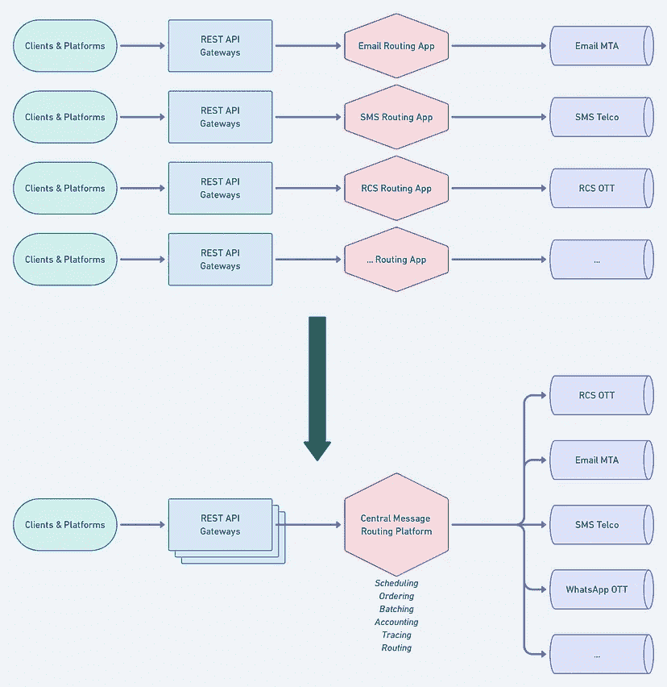

# 使用 Rust 构建 100% scyllab 碎片感知应用程序

> 原文：<https://thenewstack.io/using-rust-to-build-a-100-scylladb-shard-aware-application/>

在 Numberly，Omnichannel Delivery 团队拥有我们为客户提供支持和运营的所有类型的信息，从知名且成熟的电子邮件到仍在出现的丰富通信服务(RCS)——不要忘记诸如 WhatsApp 之类的超高层(OTT)平台。

该团队最近有机会构建一个“平台来统治他们所有人”，目标是简化我们所有组件发送和跟踪消息的方式，无论它们是什么形式。一般逻辑如下:客户端或编程平台使用 REST API 网关发送消息或消息批，这些网关负责验证和呈现消息有效负载。然后，这些网关都汇聚到一个中央消息路由平台，该平台将实现全功能的调度、计费、跟踪，当然，还包括使用正确的平台或运营商连接器对消息进行路由。

从每个频道的专用平台转移到一个

## 查看中央消息平台

### 高约束

孤注一掷总是有风险的，对吗？进行这种移动会对我们的平台需求造成很多限制。它必须非常可靠:首先，就高可用性和弹性而言，因为它将成为我们所有消息的单点故障；其次，就能够快速扩展以适应路由需求变化时一个或多个通道的增长而言。

### 强有力的保证

与我们的可观测性和幂等性要求相比，高可用性和可扩展性看起来很容易。当你想象你所有的信息都经过一个地方时，追踪每一条信息或者一组信息的能力就变成了一个真正的挑战。更糟糕的是，最大的挑战之一，在分布式系统中更是如此，就是我们在其他管道上所缺乏的幂等性保证。保证一个信息不会被发送两次说起来容易做起来难。

## 设计思维和关键概念

我们将我们的目标分为三个主要概念，我们承诺严格遵守，以跟上我们平台的限制和保证。

### **可靠性**

*   简单:很少分享(几乎？)没有组件
*   低耦合:将远程依赖性保持在最低限度
*   编码语言:高效的显式模式和严格的范例

### **秤**

*   应用层:易于部署和扩展，具有强大的恢复能力
*   数据总线:高吞吐量、高弹性、水平可伸缩、时间和顺序保持能力的消息总线
*   数据查询:低延迟、一或多查询支持

### **幂等**

*   处理隔离:工作负载分布应该是确定性的

## 可能的默认选择

考虑到 Numberly 的堆栈，第一个进入架构可能是这样的:

*   运行在 Kubernetes 上的应用层。
*   Kafka 作为来自网关 API 的消息传递总线。
*   卡夫卡作为一个日志的信息被处理和发送。
*   ScyllaDB 作为存储层来查询单个消息或一组消息的状态。
*   Redis 作为一些优化的热缓存。
*   Kafka 作为我们的中央消息路由平台与各个通道路由代理之间的消息总线。

理论上，这听起来像是一个可靠且经过验证的设计，对吗？

## 毕竟这不是一个默认的选择

这个看似简单的架构有一些警告，打破了我们承诺坚持的太多概念。

### **可靠性**

*   低耦合的高可用性:我们将依赖并需要在三种不同的数据技术上设计我们的可靠性，每种技术都可能因为我们的平台逻辑应该处理的不同原因而失败。

### **可扩展性**

虽然我们幸运地处理了一种数据技术来匹配我们设置的每个可伸缩性约束，但是这三者的组合并不匹配我们的可靠性和幂等性需求。它们的组合增加了太多的复杂性和故障点，无法一起有效实施:

*   易于部署:Kubernetes 可以很好地完成这项工作。
*   数据水平伸缩:虽然 ScyllaDB 肯定可以伸缩，但 Kafka 使用其分区逻辑进行伸缩需要谨慎，Redis 不能开箱即用地伸缩。
*   数据低延迟查询:ScyllaDB 和 Redis 是这里的明显赢家，而 Kafka 显然不是为轻松“查询”一段数据而设计的。
*   数据排序总线:这是 Kafka 擅长的地方，也是 Redis 展示了一种可以危险扩展的排队能力的地方。另一方面，如果我们仔细考虑一下，ScyllaDB 也许可以充当有序总线。

### **等幂**

正如所料，当您想象在这样一个复杂的生态系统上实现幂等性时，它会成为一个噩梦，混合了许多技术。

*   确定性工作负载分配:加 ScyllaDB + Kafka + Redis 能实现吗？

## 大胆的建筑

我们决定大胆地发表一个大声明:我们将只使用一种数据技术来将所有东西整合在一起！ScyllaDB 最适合面对这一挑战:

*   它是高度可用的。
*   它惊人地扩展。
*   它为单个查询和范围查询提供了惊人的速度。

这意味着 ScyllaDB 也可以被认为是一个分布式缓存，有效地取代了 Redis。现在，使用 ScyllaDB 取代 Kafka 作为有序数据总线并不容易，但似乎是可行的。我们面临的最大问题是，“如果可能的话，我们如何免费获得确定性的工作负载分布？”我由此想到了一个最终被证明并不疯狂的想法:“如果我在自己的应用程序中使用 ScyllaDB 的每核分片架构会怎么样？”

让我们绕个弯，解释一下 ScyllaDB 每核分片架构。

## ScyllaDB 每核分片架构

ScyllaDB 的底层设计使用每核分片架构来确定性地分发和处理数据。主要思想是，数据表设计中的分区键不仅决定了哪个节点负责数据的副本，还决定了哪个 CPU 内核负责其 I/O 处理。

您说对了:ScyllaDB 以确定的方式将数据分布到单个 CPU 内核。

所以我天真的想法是使用与 ScyllaDB 完全相同的逻辑来分布我们的消息传递平台处理:

预期效果将是实际上使 ScyllaDB 的每 CPU 核心处理与我们的应用程序保持一致，并从随之而来的所有延迟/可伸缩性/可靠性中受益。

## 100%碎片感知应用

这就是我们如何有效地创建一个 100%碎片感知的应用程序。它给餐桌带来了惊人的特性:

*   确定性工作负载分布。
*   从应用程序到存储层的超优化数据处理能力。
*   每个应用实例(pod)的强大延迟和隔离保证。
*   无限扩展遵循 ScyllaDB 自身无缝增长的能力。

## 构建支持分片的应用程序

### 选择正确的编程语言

既然我们得到了架构的灵感，是时候回答这个永恒的问题了:“使用哪种语言？”

*   我们需要一种现代语言来反映我们建立一个可靠、安全和高效的平台的愿望。
*   碎片计算算法需要快速散列能力和与 ScyllaDB 驱动程序的良好底层协同。

一旦我们确定了这一点，Rust 就不用费脑子了。

### 确定性数据摄取

传入的消息由我们称之为 ingester 的组件处理。对于我们收到的每条消息，在通常的验证之后，我们计算消息所属的碎片，因为它将存储在 ScyllaDB 中。为此，我们使用 ScyllaDB Rust 驱动程序内部函数(由我们提供)。

更准确地说，我们从我们的消息分区键中计算一个与 ScyllaDB 的存储副本节点和 CPU 核心相匹配的分区键，有效地将我们的应用程序处理与 ScyllaDB 的 CPU 核心对齐。

一旦计算出这个分区键与 ScyllaDB 的存储层匹配，我们就将消息及其所有数据保存在 messagetable 中，同时将它的元数据添加到一个表中，该表名为" buffer *"* ，带有计算出的分区键。

### 确定性数据处理

数据就是这样存储在 ScyllaDB 中的。现在让我们来讨论第二个组件，我们称之为“调度器”调度程序将使用缓冲表中的有序数据，并有效地处理消息路由逻辑。按照碎片到组件的架构，调度程序将独占使用特定碎片的消息，就像 CPU 内核被分配给 ScyllaDB 数据的一个片一样。

调度器将从缓冲表中取出它所负责的数据片。

此时，调度程序将拥有它应该处理的消息的 id。然后，它从消息表中获取消息细节。

然后，调度程序处理消息并将其发送到它负责的正确通道。

通过利用 ScyllaDB 的碎片感知算法，平台的每个组件负责每个通道的一部分消息。从应用程序的角度到数据库，我们实现了 100%一致的数据处理。

## 用 ScyllaDB 代替卡夫卡

使用 ScyllaDB 将 Kafka 替换为有序数据总线并不容易，但这肯定是可行的。让我们从调度器组件的角度更深入地了解它是如何工作的。

我们将消息的元数据作为时间序列存储在缓冲表中，按照 ScyllaDB 的接收时间排序(这是一个重要的细节)。每个调度程序都保留它成功处理的最后一条消息的时间戳偏移量。该偏移量存储在专用表中。当调度程序启动时，它获取分配给它的数据分片的时间戳偏移量。

调度程序是一个无限循环，在某个可配置的时间窗口内获取分配给它的消息。事实上，调度程序并不严格从最后一个时间戳偏移量开始获取数据，而是从最早的时间戳开始。这确实意味着单个消息将被多次提取，但这是由我们的幂等业务逻辑处理的，并由内存缓存进行了优化。由于我们依赖于 ScyllaDB 的时间戳，重叠之前的时间范围可以防止任何可能的消息丢失，这可能是由潜在的写入延迟或节点之间微妙的时间偏差引起的。

## 回顾的

达到我们的目标并不容易。我们失败了很多次，但最终我们成功了，并证明了我们最初的想法不仅是可行的，而且是方便的，同时有惊人的效率。

## 我们学到了什么

我们要强调的第一件事是负载测试非常有用。在开发的早期，我们设置了负载测试，每秒发送数万条消息。我们的目标是测试我们的数据模式设计的规模和幂等性保证。它允许我们发现多个问题，有时是不重要的问题(比如当我们的插入批处理语句之间的执行延迟大于我们的获取时间窗口时)。是啊，调试简直是一场噩梦。

顺便说一下，我们的第一个工作负载是一个简单的插入和删除，负载测试使得大分区看起来非常快。

幸运的是，我们还了解了压缩策略，尤其是我们现在正在使用的时间窗口压缩策略。这让我们摆脱了大分区的问题。作为时间序列处理的消息缓冲允许我们避免大的分区。

## 我们为 ScyllaDB Rust Driver 做了贡献

为了使这个项目成为可能，我们对 ScyllaDB 生态系统做出了贡献，特别是 Rust 驱动程序，提出了一些问题和请求。例如，我们添加了代码来计算主键的副本节点，因为我们需要它来计算消息的碎片:

如果您想在自己的碎片感知应用程序中使用这种很酷的碎片模式，我们希望它能对您有所帮助。

我们还发现了一些 ScyllaDB 错误，所以我们当然会与 ScyllaDB 支持合作修复它们(感谢您的响应)。

## 我们希望我们能做的

正如在所有系统中一样，一切都不是完美的，我们希望在某些方面可以做得更好。显然，ScyllaDB 不是一个消息队列平台，我们怀念 Kafka 的长轮询。目前，我们的架构定期获取每个碎片缓冲区，因此消耗了大量无用的带宽。但是，我们正在努力对此进行优化。

我们还遇到了一些内存问题，我们怀疑 ScyllaDB Rust 驱动程序。我们没有花太多时间去研究，但是它让我们深入研究驱动程序代码，在那里我们发现了大量的内存分配。

作为一个边项目，我们开始思考一些优化；实际上，我们做的不仅仅是思考，因为我们写了一个(几乎)无分配的 ScyllaDB Rust 驱动程序的完整原型。

我们也许会把它作为未来文章的主题，让生锈的司机[再次胜过围棋司机](https://www.scylladb.com/2022/10/12/a-new-scylladb-go-driver-faster-than-gocql-and-its-rust-counterpart/)。

## ScyllaDB 特性的进一步发展

因此，我们将赌注压在 ScyllaDB 上，这是一件好事，因为它有许多我们希望从中受益的其他功能，例如，更改数据捕获:使用 CDC Kafka source connector，我们可以将我们的消息事件流式传输到基础架构的其余部分，而无需接触我们的应用程序代码。易于观察。我们期待 ScyllaDB 向强一致表的方向发展，Raft 是轻量级事务(LWT)的替代方案。目前，我们正在一些地方使用 LWT，特别是对于动态分片工作负载属性，所以我们迫不及待地想测试这个特性！

## 这一突破性设计的奖项

我们非常自豪能够凭借这项工作及其成果获得 [ScyllaDB 创新奖:最高技术成就奖](https://www.scylladb.com/2023/02/21/scylladb-innovation-awards-honor-impressive-nosql-rust-low-latency-achievements/)。这种设计现已大量生产。如果你想了解更多，或者更好，如果你想[加入我们令人惊叹的技术团队](https://numberly.com/en/jobs-en/#jobs=filtertech)，请随时与我们联系。

<svg xmlns:xlink="http://www.w3.org/1999/xlink" viewBox="0 0 68 31" version="1.1"><title>Group</title> <desc>Created with Sketch.</desc></svg>