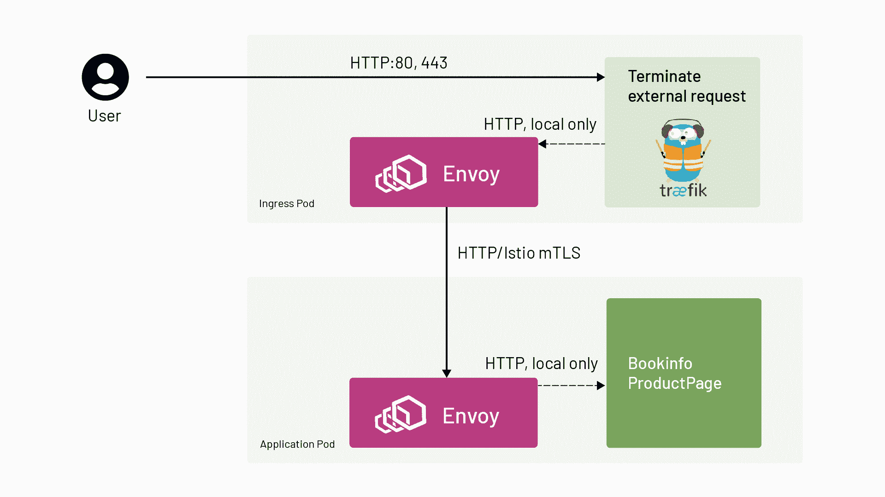

# 将 Traefik 入口控制器与 Istio 服务网格配合使用

> 原文：<https://thenewstack.io/using-traefik-ingress-controller-with-istio-service-mesh/>

[](https://www.linkedin.com/in/petrmcallister/)

 [彼得·麦卡利斯特

Petr 是一名 IT 专业人员，拥有 20 多年的国际经验和计算机科学硕士学位。他是 Tetrate 的技术专家。](https://www.linkedin.com/in/petrmcallister/) [](https://www.linkedin.com/in/petrmcallister/)

Istio 服务网格自带入口，但我们看到客户一直要求使用非 Istio 入口。之前，我们已经介绍过[将 NGINX 与 Istio](https://www.tetrate.io/blog/using-istio-with-other-ingress-proxies/) 集成。最近，我们一直在与使用 [Traefik](https://traefik.io/) ingress 的客户合作。通过对我们之前建议的方法进行一些细微的调整，我们在 [Tetrate](https://www.tetrate.io/?utm_content=inline-mention) 学会了如何将 Traefik 实现为您的 Istio 服务网格的入口网关。这篇文章将告诉你如何做。

交通流量如下图所示。一旦请求从 Traefik 入口到达服务网格，Istio 就能够对请求应用安全性、可观察性和流量控制规则:

[](https://cdn.thenewstack.io/media/2021/02/43c473d3-image1.jpg)

传入流量绕过 Istio 边车，直接到达 Traefik，因此请求在 Traefik 入口终止。

Traefik 使用`IngressRoute`配置来重写“Host”头以匹配目的地，并将请求转发给目标服务，这是一个分几个步骤的过程:

*   退出 Traefik 入口的请求被重定向到 Istio 边车(通过 iptables)。
*   sidecar 接收请求，对其进行加密(因为我们的 Istio `PeerAuthentication`策略规定了严格的 mTLS)，并将请求转发给目标服务的 pod。

下面是一个示例部署的端到端演练，使用 Istio 的 bookinfo 演示应用程序，但整个部署前面有一个 Traefik 入口。简而言之，要让它在您自己的环境中工作:

*   使用 Istio 边车部署 Traefik 控制器，对部署进行注释，以便入站流量绕过 Istio 边车:

*   在应用程序名称空间中启用 Istio sidecar 注入，并部署您需要的任何特定于 Istio 的配置。
*   使用 Traefik `Middleware`对象创建`IngressRoute`,该对象将主机名重写为网格可识别的主机名(即集群中的服务；这将在下面用一个例子详细讨论)。

## 具有 Traefik 入口的 Bookinfo

本文的其余部分将介绍如何部署 Istio 的 Bookinfo 示例应用程序，使用 Traefik 作为部署的入口代理。

### 设置环境

要自己效仿这个例子:

1.部署版本至少为 1.17 的 Kuberentes 集群(最低支持 Istio 1.8 版本)。我们使用由
创建的 Google Kubernetes 引擎集群

```
gcloud container clusters create istio-traefik  \
  --cluster-version=1.17  \
  --region  <GCP region>  \
  --machine-type=e2-standard-4  \
  --project  <GCP Project>  \
  --num-nodes  1  \
  --node-locations  <GCP Zone>  # i.e us-west2-b (otherwise 1 node per zone)

```

2。下载 Istio 1.8.x.

```
curl  -sL https://git.io/getLatestIstio |\
  ISTIO_VERSION=1.8.1  sh  -

```

3。用启用的 HTTP 访问日志安装它。

```
./istio-1.8.1/bin/istioctl install  \
  --set meshConfig.accessLogFile=/dev/stdout  \
  --skip-confirmation

```

### 部署 Bookinfo 应用程序

安装了 Istio 之后，我们就可以开始部署我们的应用程序了。我们将使用 [Istio 的 Bookinfo 应用程序](https://istio.io/latest/docs/examples/bookinfo/)进行演示。这个示例应用程序是 Istio 发行版的一部分(在`./istio-1.8.1/samples/`文件夹中)

4.创建 bookinfo 命名空间。

```
kubectl create ns bookinfo

```

5。贴上标签准备注射。

```
kubectl label namespace bookinfo istio-injection=enabled

```

6。在名称空间中部署 bookinfo 应用程序。

```
kubectl apply  -f  istio-1.8.1/samples/bookinfo/platform/kube/bookinfo.yaml  -n  bookinfo

```

确认所有的 pod 都已启动，并且部署了边车。

### 为应用程序命名空间的服务到服务通信启用 Istio mTLS

```
cat  <<EOF  |  kubectl apply  -f  -  
apiVersion:  security.istio.io/v1beta1
kind:  PeerAuthentication
metadata:
  name:  default
  namespace:  bookinfo
spec:
  mtls:
    mode:  STRICT
EOF

```

### 展开 Traefik 入口

现在是时候按照 [v2.3 文档](https://doc.traefik.io/traefik/user-guides/crd-acme/)部署 Traefik 了(截至本文发布时，Traefik 的最新版本是 2.3，但是如果您根据您的版本需要调整`IngressRoute`和`Middleware`资源，它可以与任何版本的 Traefik 一起工作)。

7.部署 Traefik 构造。请注意，Traefik 网站上记录的部署有一些修改(将指定 bookinfo 命名空间，而不是 Traefik 文档中的默认命名空间)。该文件可在处[访问，应用如下:](http://bit.ly/Traefik-CRDs-and-Roles) 

```
$  kubectl apply  -f  http://bit.ly/Traefik-CRDs-and-Roles
customresourcedefinition.apiextensions.k8s.io/ingressroutes.traefik.containo.us created
customresourcedefinition.apiextensions.k8s.io/middlewares.traefik.containo.us created
customresourcedefinition.apiextensions.k8s.io/ingressroutetcps.traefik.containo.us created
customresourcedefinition.apiextensions.k8s.io/ingressrouteudps.traefik.containo.us created
customresourcedefinition.apiextensions.k8s.io/tlsoptions.traefik.containo.us created
customresourcedefinition.apiextensions.k8s.io/tlsstores.traefik.containo.us created
customresourcedefinition.apiextensions.k8s.io/traefikservices.traefik.containo.us created
clusterrole.rbac.authorization.k8s.io/traefik-ingress-lb created
clusterrolebinding.rbac.authorization.k8s.io/traefik-ingress-lb created

```

8。为传入请求创建服务。该服务将接收外部 IP 地址。(Traefik 网站上的示例有一些变化):

1.  需要指定命名空间。
2.  只发布了两个端口:80 用于 Bookinfo 应用程序，8080 用于 Traefik 管理。
3.  该服务需要使用这里使用的标签(traefik-ingress-lb)指向 Traefik。
4.  添加`Type: Loadbalancer`是为了告诉 GCP 为该服务分配一个外部 IP。

```
cat  <<EOF  |  kubectl apply  -f  -  
apiVersion:  v1
kind:  Service
metadata:
  name:  traefik
  namespace:  bookinfo
spec:
  ports:
    -  protocol:  TCP
      name:  web
      port:  80
    -  protocol:  TCP
      name:  admin
      port:  8080
  selector:
    app:  traefik-ingress-lb
  type:  LoadBalancer
EOF

```

9。确认服务已按预期创建:

```
$  kubectl get svc traefik  -n  bookinfo
NAME      TYPE CLUSTER-IP      EXTERNAL-IP PORT(S) AGE
traefik LoadBalancer 10.35.244.227 35.236.XXX.XXX 80:31718/TCP,8080:31334/TCP 2m6s

```

10。正如 [Traefik 网站](https://doc.traefik.io/traefik/user-guides/crd-acme/)详细描述的，需要应用带有`ServiceAccount`的 Kubernetes 部署。除了名称和命名空间之外，网站示例还引入了以下更改:

1.  为简单起见，删除了安全端点。
2.  `Accesslog`–添加了“`=true`”，因为没有该值就无法工作。
3.  `Log.level`设置为 DEBUG 将有助于我们了解发生了什么。
4.  增加了`traffic.sidecar.istio.io`注解(更多细节请参考之前提到的四重奏 [NGINX 文章](https://www.tetrate.io/blog/using-istio-with-other-ingress-proxies/))。

```
KUBERNETES_SVC_IP=$(  kubectl get svc kubernetes  -n  default  -o  jsonpath='{.spec.clusterIP}'  )

cat  <<EOF  |  kubectl apply  -f  -  
apiVersion:  v1
kind:  ServiceAccount
metadata:
  namespace:  bookinfo
  name:  traefik-ingress-lb

---
kind:  Deployment
apiVersion:  apps/v1
metadata:
  namespace:  bookinfo
  name:  traefik-ingress-lb
  labels:
    app:  traefik-ingress-lb
spec:
  replicas:  1
  selector:
    matchLabels:
      app:  traefik-ingress-lb
  template:
    metadata:
      labels:
        app:  traefik-ingress-lb
      annotations:
        traffic.sidecar.istio.io/excludeInboundPorts:  "80"
        traffic.sidecar.istio.io/excludeOutboundIPRanges:  ${KUBERNETES_SVC_IP}/32
    spec:
      serviceAccountName:  traefik-ingress-lb
      containers:
        -  name:  traefik-ingress-lb
          image:  traefik:v2.3
          args:
            -  --api.insecure
            -  --accesslog=true
            -  --providers.kubernetescrd
            -  --entrypoints.web.address=:80
            -  --log.level=DEBUG
          ports:
            -  name:  web
              containerPort:  80
            -  name:  admin
              containerPort:  8080
EOF

```

11。确认在 Bookinfo 名称空间中部署 trae fik:

```
$  kubectl get pods  -n  bookinfo  -l  app=traefik-ingress-lb
NAME                                  READY STATUS    RESTARTS AGE
traefik-ingress-lb-669fc4b77d-74mpx 2/2 Running 0          2m35s

```

12。获取服务 IP 并记录 BOOKINFO_IP 变量值。

```
BOOKINFO_IP=$(kubectl  -n  bookinfo get service traefik  -o  jsonpath='{.status.loadBalancer.ingress[0].ip}')

```

13。测试来自[入口端口](https://thenewstack.io/kubernetes-ingress-for-beginners/) 80 的响应，并查看它没有到应用程序的路由。

确保它返回“404 未找到”——由于入口规则尚未实施，因此预期不会出现-200 响应。

## 配置 Traefik 入口规则

1.Traefik 的`Middleware`报头重写功能将允许 Istio 服务网格正确运行。在本例中，需要将主机定义为“productpage.bookinfo.svc”。可以根据 Traefik 文档定义标题:

```
cat  <<EOF  |  kubectl apply  -f  -  
apiVersion:  traefik.containo.us/v1alpha1
kind:  Middleware
metadata:
  name:  productpage-header
  namespace:  bookinfo
spec:
  headers:
    customRequestHeaders:
      Host:  productpage.bookinfo.svc
EOF

```

2。最后一步是为入口请求指定路由逻辑，因为本文的重点是[服务网格集成和 Kubernetes](https://thenewstack.io/why-do-you-need-istio-when-you-already-have-kubernetes/) 。定义非常简单，将所有到达端口 80 的传入请求转发到名为 ProductPage 的前端 bookinfo 应用程序服务(在端口 9080 上提供流量服务)。它还使用了上一步中创建的中间件对象:

```
cat  <<EOF  |  kubectl apply  -f  -  
apiVersion:  traefik.containo.us/v1alpha1
kind:  IngressRoute
metadata:
  name:  productpage
  namespace:  bookinfo
spec:
  entryPoints:
    -  web
  routes:
  -  match:  PathPrefix(`/`)
    kind:  Rule
    middlewares:
    -  name:  productpage-header
    services:
    -  name:  productpage
      port:  9080
EOF

```

## 验证您的部署功能

1.重新测试应用程序响应:

我们将收到“200 OK”响应。也可以使用上面的 http:// < BOOKINFO_IP 值通过浏览器进行测试> /productpage:

2.如果将/productpage 添加到 url http:// <bookinfo_ip value="">/productpage，它将返回应用程序响应:</bookinfo_ip>

[](https://cdn.thenewstack.io/media/2021/02/121f9878-image2.png) 
3。通过查询 istio-proxy 容器的 bookinfo 名称空间中的 Traefik pod 日志，可以在 istio-proxy 日志中看到对应用程序的传出请求。没有传入的请求，因为它们直接到达 Traefik 入口。

```
TRAEFIK_POD=$(  kubectl  -n  bookinfo get pods  -l  app=traefik-ingress-lb  -o  jsonpath='{.items[0].metadata.name}'  )

kubectl  -n  bookinfo  logs  ${TRAEFIK_POD}  -c  istio-proxy

```

请注意，请求处理后，日志需要几秒钟才能显示。仅当 Istio 安装使用“mesh config . access log file =/dev/stdout”标志完成时，日志才可用:

```
[2021-01-05T20:13:55.015Z]  "GET /productpage HTTP/1.1"  200  -  "-"  0  5179  1069  1069  "10.32.0.1"  "Mozilla/5.0 (Windows NT 10.0; Win64; x64) AppleWebKit/537.36 (KHTML, like Gecko) Chrome/87.0.4280.88 Safari/537.36"  "4bd443e9-1a2e-4d30-b1e3-398a5005f240"  "productpage.bookinfo.svc"  "10.32.0.18:9080"  outbound|9080||productpage.bookinfo.svc.cluster.local  10.32.0.19:51810  10.32.0.18:9080  10.32.0.1:0  -  default
[2021-01-05T20:13:56.301Z]  "GET /static/bootstrap/fonts/glyphicons-halflings-regular.woff2 HTTP/1.1"  200  -  "-"  0  18028  3  3  "10.32.0.1"  "Mozilla/5.0 (Windows NT 10.0; Win64; x64) AppleWebKit/537.36 (KHTML, like Gecko) Chrome/87.0.4280.88 Safari/537.36"  "8cb44552-c3c8-45dd-8674-4af207ce1648"  "productpage.bookinfo.svc"  "10.32.0.18:9080"  outbound|9080||productpage.bookinfo.svc.cluster.local  10.32.0.19:51810  10.32.0.18:9080  10.32.0.1:0  -  default

```

## 摘要

本文演示了如何将 Traefik 入口实现为 Istio 服务网格的入口点。即使您的环境与我们示例中使用的环境不同，这里应用的基本方法也应该适用。当在第二天实施阶段引入服务网格时，Traefik /服务网格集成可以在不同的云中成功实施，包括全新的或现有的(也称为 brownfield)Traefik 部署。最终，您将获得两个世界的最佳结果:Istio 服务网格与您选择的入口控制器相集成！

通过 Pixabay 的特征图像。

<svg xmlns:xlink="http://www.w3.org/1999/xlink" viewBox="0 0 68 31" version="1.1"><title>Group</title> <desc>Created with Sketch.</desc></svg>