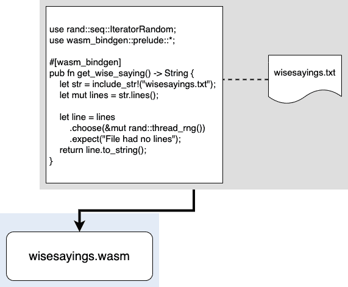
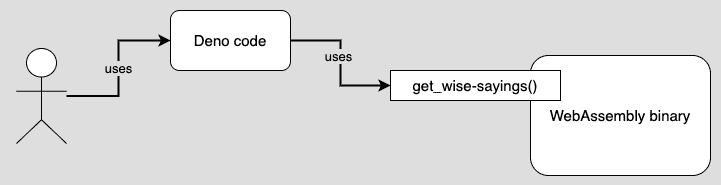

# 在服务器端使用 Rust 编写的 WebAssembly

> 原文：<https://thenewstack.io/using-web-assembly-written-in-rust-on-the-server-side/>

[](https://www.linkedin.com/in/bobreselman/)

 [鲍勃·雷瑟曼

鲍勃是一名软件开发人员、系统架构师、行业分析师和技术作家/记者。他精通各种编程语言和开发框架。他目前的重点是微服务应用程序开发和面向微服务的应用程序架构。](https://www.linkedin.com/in/bobreselman/) [](https://www.linkedin.com/in/bobreselman/)

WebAssembly 允许您用 Rust 等低级编程语言编写代码，然后编译成可移植的二进制文件。然后，该二进制文件可以在 WebAssembly 虚拟机的客户端运行，这是今天的 web 浏览器的[标准。或者，二进制文件可以在服务器端使用，作为另一个编程框架使用的组件，比如 Node.js 或](https://www.infoq.com/news/2017/12/webassembly-browser-support/) [Deno](https://deno.land/) 。

WebAssembly 结合了低级代码编程固有的效率和 Linux 容器中常见的组件可移植性。结果是一种专门面向大规模进行计算密集型工作的开发范式——例如，人工智能和复杂的机器学习任务。

正如 Docker 的创造者 Solomon Hykes，[在 2019 年 3 月 27 日发推文](https://twitter.com/solomonstre/status/1111004913222324225?s=20):“如果 WASM+WASI 在 2008 年存在，我们就不需要创造 Docker。这就是它的重要性。服务器上的 WebAssembly 是计算的未来。”

> WebAssembly 的真正好处是使用该技术在浏览器中完成计算密集型工作。

WebAssembly 是一种引人注目的软件开发方法。然而，为了真正欣赏这项技术，您需要看到它的实际应用。

在本文中，我将向您展示如何用 Rust 编写 WebAssembly 二进制文件，并在 Deno 下运行的基于 TypeScript 的 web 服务器中使用它。我将向您展示如何安装 Rust 并准备运行时环境。我们将把源代码编译成 Rust 二进制文件。然后，一旦创建了二进制文件，我将在 [Deno](https://deno.land/) 下演示如何在服务器端运行它。Deno 是一个基于类型脚本的编程框架，由 Node.js 的创始人 Ryan Dahl 发起。

## 了解示范项目

本文附带的演示项目名为“智慧语录”。该项目在一个名为 wise suggestions . txt 的文本文件中存储了一组“名言”，文本文件中的每一行都是一句至理名言，例如，“*患难之交才是真朋友。*

Rust 代码发布了一个函数，get_wise_saying()。该函数从文本文件 wise sauges . txt 中获取一个随机行，并将该随机行返回给调用者。(参见下面的图 1)

[](https://cdn.thenewstack.io/media/2021/03/50e3e12f-image1.png)

图 1:演示项目将文本文件中的数据直接编译成 WebAssembly 二进制文件

代码和文本文件都被编译成一个单独的 WebAssembly 二进制文件，名为 wise sauges . wasm。然后执行另一层处理，使 WebAssembly 二进制文件可供 Deno web 服务器代码使用。Deno 代码调用 WebAssembly 二进制文件中的函数 get _ wise _ sauges()来产生一个随机的 wise 语句。(参见图 2。)

[](https://cdn.thenewstack.io/media/2021/03/ed3a0b83-image2.png)

图 2: WebAssembly 二进制文件可以由 Deno 等服务器端编程框架使用。

*您可以在 GitHub 上获得本文使用的智慧语录演示项目的源代码[。本文中描述的所有步骤都列在存储库的主](https://github.com/reselbob/wisesayingswasm) [Readme](https://github.com/reselbob/wisesayingswasm/blob/main/README.md) 文档中。*

## 准备开发环境

让代码启动并运行的第一件事是确保 Rust 安装在开发环境中。以下步骤描述了该过程。

**步骤 1:** 通过键入:
确保 Rust 已安装在您的机器上

您将得到类似如下的输出:

```
rustc  1.50.0  (cb75ad5db  2021-02-10)

```

如果对 rustc-version 的调用失败，说明您没有安装 Rust。遵循以下说明并**确保完成给定安装方法**提出的所有任务。

要安装 Rust，请到这里并在 Linux/MAC 上安装:…

```
curl  --proto  '=https'  --tlsv1.2  -sSf https://sh.rustup.rs | sh

```

…或点击此处将其安装在 Windows 上:

下载并运行 rustup-init.exe，您可以在以下网址找到它:https://static . rust-lang . org/rust up/dist/i686-PC-windows-GNU/rust up-init . exe

**第二步:**修改系统路径

```
export PATH="$HOME/.cargo/bin:$PATH"

```

**第三步:**如果您在 Linux 环境下工作，请按照以下步骤安装所需的附加 Linux 组件。

```
sudo apt-get update  -y

sudo apt-get install  -y  libssl-dev

apt install pkg-config

```

***开发者注:**运行这段代码的最佳开发环境是使用 Linux 操作系统的环境。*

**步骤 4:** 获取用于生成 TypeScript/JavaScript 适配器文件的 CLI 工具。这些适配器文件(也称为垫片)负责将 WebAssembly 二进制文件中的函数 get_wise_saying()公开给将托管该二进制文件的 Deno web 服务器。在命令行执行以下命令来安装工具， [wasm-bindgen-cli](https://rustwasm.github.io/docs/wasm-bindgen/reference/cli.html) 。

```
cargo install wasm-bindgen-cli

```

开发环境现在已经安装了 Rust，以及必要的辅助库。现在我们需要得到智者说的源代码。

## 使用项目文件

明智的说法是源代码存放在 GitHub 库中。采取以下步骤将源代码从 GitHub 克隆到本地开发环境中。

**第一步:**执行以下命令，从 GitHub
中克隆智慧语录源代码

```
git clone https://github.com/reselbob/wisesayingswasm.git

```

**第二步:**转到工作目录

下面的清单 1 列出了组成从 GitHub 仓库克隆的源代码的文件。

```
.
├──  Cargo.toml
├──  cheatsheet.txt
├──  LICENSE
├──  lldbconfig
├──  package-lock.json
├──  README.md
├──  server
│ ├──  main.ts
│ └──  package-lock.json
└──  src
    ├──  fortunes.txt
    ├──  lib.rs
    └──  main.rs

```

*清单 GitHub 存储库中托管的智慧语录演示项目的源代码文件*

让我们花点时间来描述清单 1 中列出的源代码文件。与创建 WebAssembly 二进制文件相关的特定文件是第 11 行名为 src 的目录中的文件和第 2 行名为 Cargo.toml 的文件。

我们先讨论 Cargo.toml。Cargo.toml 的内容如下面的清单 2 所示。

```
[package]
name  =  "wise-sayings-wasm"
version  =  "0.1.0"
authors  =  ["Bob Reselman <bob@CogArtTech.com>"]
edition  =  "2018"

[dependencies]
rand  =  "0.8.3"
getrandom  =  {  version  =  "0.2",  features  =  ["js"]  }
wasm-bindgen  =  "0.2.70"

[lib]
name  =  "wisesayings"
crate-type  =["cdylib",  "lib"]

```

*清单 Cargo.toml 的内容为示范项目名言*

Cargo.toml 是[清单文件](https://doc.rust-lang.org/cargo/reference/manifest.html)，它描述了正在开发的 Rust 项目的各个方面。Wise Saying 项目的 Cargo.toml 文件分为三个部分:包、依赖项和库。货物清单规范中定义了各部分的名称，您在这里可以读到。

### 了解 Cargo.toml 的包装部分

包部分指明了包的名称(wise-saughts-wasm)、开发者分配的版本(0.1.0)、作者(鲍勃·雷斯曼<[bob@CogArtTech.com](mailto:bob@CogArtTech.com)>)以及用于编写二进制文件的 Rust 版本(2018)。

### 了解 Cargo.toml 的依赖关系部分

依赖项部分列出了 WebAssembly 项目完成工作所需的依赖项。如清单 2 第 8 行所示，Cargo.toml 将 rand 库列为依赖项。rand 库提供了生成随机数的能力，该随机数用于从 wise sauges . txt 文件中获取随机的一行明智的话语文本。

上面清单 2 中第 9 行对 getrandom 的引用表明 WebAssembly 二进制文件的 [getrandom](https://docs.rs/getrandom/0.2.2/getrandom/) 正在 Javascript 下运行，并且应该使用 [JavaScript 接口](https://docs.rs/getrandom/0.2.2/getrandom/#webassembly-support)。这种情况对于在 JavaScript 下运行 WebAssembly 二进制文件非常特殊。总之，如果 Cargo.toml 中不包含 getrandom = { version = "0.2 "，features = ["js"] }，WebAssembly 二进制文件将无法创建随机数。

第 10 行的条目将 [wasm-bindgen](https://rustwasm.github.io/docs/wasm-bindgen/) 库声明为一个依赖项。wasm-bindgen 库为 wasm 模块提供了与 JavaScript 对话的能力，以及 JavaScript 与 wasm 模块对话的能力。

### 了解 Cargo.toml 的 Lib 部分

Cargo.toml 文件的 lib 部分第 14 行的条目 [crate-type =["cdylib "，" lib"]](https://rustwasm.github.io/docs/wasm-pack/tutorials/npm-browser-packages/template-deep-dive/cargo-toml.html#1-crate-type) 告诉 Rust 编译器创建一个没有启动函数的 wasm 二进制文件。通常，当指示 cdylib 时，编译器将创建一个带有扩展名的动态库[。Windows 中的 dll。所以在 Linux 或者。迪里布在马科斯。在这种情况下，因为部署单元是一个 WebAssembly 二进制文件，编译器将创建一个扩展名为. wasm 的文件，wasm 文件的名称将是 wise sauges . wasm，如清单 2 中的第 13 行所示。](https://en.wikipedia.org/wiki/Library_(computing)#Shared_libraries)

关于 Cargo.toml 需要理解的重要一点是，它提供了启动和运行 Rust 代码所需的设计和运行时信息。如果 Cargo.toml 文件不存在，Rust 编译器不知道该做什么，构建会失败。

## 了解核心函数，get_wise_saying()

从文本文件 Wise suggestions . txt 中获取一个包含智慧谚语的随机行的实际工作是由函数 get_wise_saying()完成的。get _ wise _ saughts()的代码在 Rust 库文件中。Rust 代码如下面的清单 3 所示。

```
use rand::seq::IteratorRandom;
use wasm_bindgen::prelude::*;

#[wasm_bindgen]
pub fn get_wise_saying()  ->  String  {
    let str  =  include_str!("fortunes.txt");
    let mut lines  =  str.lines();

    let line  =  lines
        .choose(&mut rand::thread_rng())
        .expect("File had no lines");
    return line.to_string();
}

```

*清单 3:函数文件 lib.rs 包含函数 get_wise_saying()。*

关于源代码，需要知道的重要事情是，它在第 4 行用属性#[wasm_bindgen]进行了标记，这让 Rust 编译器知道源代码的目标是 WebAssembly 二进制文件。代码在第 5 行发布了一个函数 get_wise_saying()。智者名言文本文件加载到内存的方式是使用 [Rust 宏](https://doc.rust-lang.org/book/ch19-06-macros.html)， [include_str！](https://doc.rust-lang.org/std/macro.include_str.html)。这个宏负责从磁盘获取文件并将数据加载到内存中。宏将文件作为字符串加载，函数 str.lines()将字符串中的行分隔成一个数组。(第 7 行。)

第 10 行的 rand::thread_rng()调用返回一个数字，该数字被。在第 10 行选择()函数。所有这一切的结果是一个字符数组(一个字符串),它反映了函数返回的明智的说法。

## 创建 WebAssembly 二进制文件

让我们继续创建 wasm 目标并将代码编译成 WebAssembly 二进制文件。

**第一步:**添加二进制目标。

```
rustup target add wasm32-unknown-unknown

```

**第二步:**将源代码编译成 WebAssembly 如下图所示。

```
cargo build  --lib  --target wasm32-unknown-unknown

```

**其中**

*   **cargo build** 是调用编译器的命令
*   **–lib**表示您将构建一个库
*   **–目标**是表示目标信息的选项
*   **wasm-unknown-unknown** 是目标的名称，也是将为目标资产创建的目录的名称

### **了解 Rust 目标三重命名约定**

Rust 对目标有一个命名约定。《公约》使用的术语是*目标三联*。目标三元组使用以下格式:ARCH-VENDOR-SYS-ABI。

**哪里有**

**ARCH** 描述了预期的目标架构，例如用于 WebAssembly 的 wasm32，或用于当前一代英特尔芯片的 i686。

**厂商**描述发布目标的厂商；比如苹果或者英伟达。

**SYS** 描述操作系统；比如 Windows 或者 Linux。

ABI 描述了这个过程是如何开始的，因为 eabi 用于裸机，而 gnu 用于 glibc。

因此，名称 i686-unknown-linux-gnu 意味着 Rust 二进制文件的目标是 i686 架构，供应商被定义为未知，目标操作系统是 linux，ABI 是 gnu。

在 wasm32-unknown-unknown 的情况下，目标是 WebAssembly，操作系统未知，ABI 未知。该名称的非正式推断是“这是一个 WebAssembly 二进制文件。”

Rust 定义了一组标准的内置目标，可以在这里[找到](https://docs.rust-embedded.org/embedonomicon/compiler-support.html#built-in-target)。

如果您发现命名约定令人困惑，因为有可选字段，有时名称会有四个部分，而有时会有三个部分，那么您并不孤单。

## 使用 Deno 部署二进制服务器端

在我们构建了基本的 WeAssembly 二进制文件之后，我们需要创建适配器(也称 shim)文件和特殊版本的 WebAssembly 二进制文件——所有这些都可以在 JavaScript 中运行。我们将使用 [wasm-bindgen](https://rustwasm.github.io/wasm-bindgen/) 工具创建这些工件。

**第 1 步:**我们使用如下所示的命令创建这些新工件。

```
wasm-bindgen  --target deno  ./target/wasm32-unknown-unknown/debug/wisesayings.wasm  --out-dir  ./server

```

在哪里

**wasm-bindgen** 是创建适配器文件和特殊 WebAssembly 二进制文件的命令。

**–目标分母。/target/was m32-unknown-unknown/debug/wise lasts . wasm**是指示适配器文件将作为 Deno 的目标的选项。此外，该选项表示作为工件生成过程基础的原始 WebAssembly wasm 二进制文件的位置。

**–输出方向。/server** 是声明创建的适配器文件将存储在磁盘上的位置的选项；在这种情况下，**。/服务器**。

运行 wasm-bindgen 的结果是下面清单 4 所示的服务器目录。

```
.
├──  Cargo.toml
├──  cheatsheet.txt
├──  LICENSE
├──  lldbconfig
├──  package-lock.json
├──  README.md
├──  server
│ ├──  main.ts
│ ├──  package-lock.json
│ ├──  wisesayings_bg.wasm
│ ├──  wisesayings_bg.wasm.d.ts
│ ├──  wisesayings.d.ts
│ └──  wisesayings.js
└──  src
    ├──  fortunes.txt
    ├──  lib.rs
    └──  main.rs

```

*列表 4:服务器目录包含运行 wasm-bindgen 的结果*

请注意，上面清单 4 中显示的服务器目录的内容现在增加了一些 JavaScript (js)和 TypeScript (ts)文件。此外，服务器目录有一个特殊版本的 WebAssembly 二进制文件，名为 wise lasts _ BG . wasm。这个版本的 WebAssembly 二进制文件是 wasm 文件的精简版本，最初是在调用早期的货物构建时通过初始编译创建的。您可以把这个新的 wasm 文件看作是原始 WebAssembly 二进制文件的一个 JavaScript 友好版本。后缀 _bg 是 bindgen 的缩写。

## 运行 Deno 服务器

一旦运行 WebAssembly 的所有工件都被生成到服务器目录中，我们就可以调用 Deno web 服务器了。下面的清单 5 显示了 main.ts 的内容，它是 Deno web 服务器的源代码。

```
import  {  serve  }  from  "https://deno.land/std@0.86.0/http/server.ts";
import  {  get_wise_saying  }  from  "./wisesayings.js";

const env  =  Deno.env.toObject();

let port  =  4040;
if(env.WISESAYING_PORT){
  port  =  Number(env.WISESAYING_PORT);
};

const server  =  serve({  hostname:  "0.0.0.0",  port});
console.log(`HTTP  webserver  running  at  ${new Date()}.  Access it at:  http://localhost:${port}/`);

for await  (const request of server)  {
    const saying  =  get_wise_saying();
    request.respond({  status:  200,  body:  saying  });
  }

```

*清单 5: main.ts 是使用 WebAssembly 二进制文件*的 Deno webserver 代码

您会注意到 WebAssembly wasm 二进制文件并不是直接导入的。这是因为表示 WebAssembly 二进制文件的工作是由前面生成的 JavaScript 和 TypeScript 适配器(也称 shim)文件完成的。WebAssembly/Rust 函数 get _ wise _ 语录()在自动生成的 JavaScript 文件 wise 语录. js 中公开。

函数 get _ wise _ say 被导入到上面第 2 行的 webserver 代码中。该函数用在第 16 行，得到一个明智的说法，它将作为 HTTP 响应由 web 服务器返回。

要启动并运行 Deno web 服务器，请在终端窗口中执行以下命令。

**第一步:**

```
deno run  --allow-read  --allow-net  --allow-env  ./main.ts

```

哪里

deno run 是调用 web 服务器的命令集。

–allow-read 选项允许 Deno webserver 代码具有从磁盘读取文件的权限。

–allow-net 是允许 Deno webserver 代码访问网络的选项。

–allow-env 选项允许 Deno webserver 代码读取环境变量。

。/main.ts 是 Deno 要运行的 TypeScript 文件。在这种情况下，它是 web 服务器代码。

当 web 服务器启动并运行时，您将得到类似如下的输出:

HTTP 网络服务器运行于 2021 年 3 月 11 日星期四 17:57:32 GMT+0000(协调世界时)。请访问:http://localhost:4040/

**第二步:**

在计算机的终端上运行下面的命令来练习 Deno/WebAssembly 代码

你会得到一句至理名言，比如:

真正的美存在于内心。

**恭喜恭喜！**您已经创建并运行了一个服务器端 WebAssembly 二进制文件。

## 把所有的放在一起

在本文中，我向您展示了在 Deno web 服务器中创建和使用 WebAssembly 二进制文件所需的一切。然而，尽管本文提供了如此详细的信息，仍然有更多的东西需要了解。记住，Rust 是一种低级编程语言。它意味着直接与处理器和内存对抗。这才是它真正的力量所在。WebAssembly 的真正好处是使用该技术在浏览器中完成计算密集型工作。非常适合 WebAssembly 的应用程序是视觉密集型游戏和活动，需要复杂的机器学习能力——例如，实时语音识别和语言翻译。WebAssembly 允许您在客户端进行以前只能在服务器端进行的计算。正如 Solomon Hykes 所说，WebAssembly 是计算的未来。他很可能是对的。

需要理解的重要一点是，WebAssembly 为那些想要探索现代分布式计算前沿方法的人提供了巨大的机会。希望这篇文章中的信息能激励你去探索那些机会。

<svg xmlns:xlink="http://www.w3.org/1999/xlink" viewBox="0 0 68 31" version="1.1"><title>Group</title> <desc>Created with Sketch.</desc></svg>