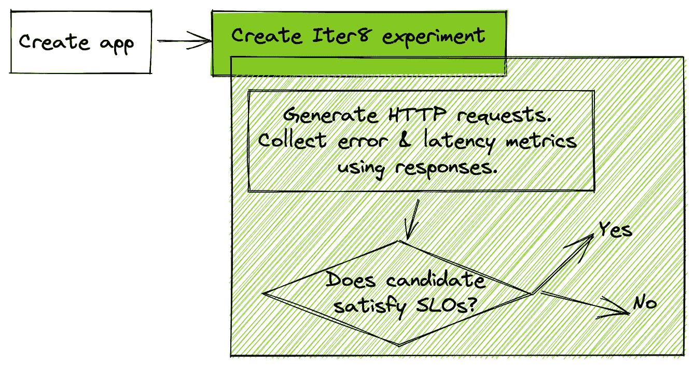

# 使用 Iter8 验证 REST APIs 的服务级别目标

> 原文：<https://thenewstack.io/validate-service-level-objectives-of-rest-apis-using-iter8/>

[](https://www.linkedin.com/in/sriumcp/)

[Srinivasan Parthasarathy](https://www.linkedin.com/in/sriumcp/)

[Sri 是一名应用机器学习研究员，拥有为混合云、网络安全和数据探索问题领域创建可扩展的 AI/ML/高级优化企业解决方案的记录。作为 Iter8 的联合创始人，他曾在 Kubecon 2020 和 2021 以及 Knative 和 KFServing 等社区会议上发表过演讲。](https://www.linkedin.com/in/sriumcp/)

[](https://www.linkedin.com/in/sriumcp/)[](https://www.linkedin.com/in/sriumcp/)

基于 REST 的应用发布前的服务水平目标(SLO)验证是 devo PS/mlop/SRE 团队的主要关注点。谷歌关于网站可靠性工程的经典著作[普及了应用程序的错误预算和基于均值/尾部延迟的 SLO 的概念。在本文中，我们将探索一种使用](https://sre.google/sre-book/table-of-contents/) [Iter8](https://iter8.tools/) 对基于 REST 的应用进行 SLO 验证的简单方法。

Iter8 是一个开源的云原生(基于 Kubernetes)实验平台，可以轻松优化、验证和安全发布新版本的应用。Iter8 引入了自动化发布工程任务的实验概念，如 SLO 验证、使用业务指标的 A/B(/n)测试、混沌注入、黑暗启动、金丝雀发布和使用镜像的渐进式推出、增量流量转移、用户细分和会话关联性。Iter8 实验可以打包成舵图，以便在应用程序间重用。Iter8 还提供了一个名为 iter8ctl 的命令行实用程序，可以帮助操作员更深入地理解实验。

[](https://cdn.thenewstack.io/media/2021/10/6e9c86f5-image1.png)

在本文中，我们将探索上面的 Iter8 实验。Iter8 实验与它们验证的应用一起部署。该实验为应用程序生成合成的 HTTP 请求，根据其响应构建应用程序的延迟和错误配置文件，并确定应用程序是否满足实验中指定的 SLO。我们将在两个场景中演示这个实验，一个应用程序实现 REST API 来服务 HTTP GET 请求，另一个应用程序实现 REST API 来服务带有 JSON 负载的 HTTP POST 请求。这个实验非常普通，不需要应用程序的测量来收集指标。它也没有假设像 Prometheus 这样的度量收集数据库的可用性，或者像 Istio 或 Linkerd 这样的 Kubernetes 服务网格的存在。

## 集群和本地设置

[在您的 Kubernetes 集群中安装 Iter8](https://iter8.tools/0.7/getting-started/install/#install-iter8) ，[在本地克隆 Iter8 GitHub repo](https://iter8.tools/0.7/getting-started/setup-for-tutorials/#iter8-github-repo) ，将 Iter8 环境变量设置为您的本地 Iter8 repo 的根，并在您的本地机器上安装 [Helm](https://helm.sh/docs/intro/install/) 和 [iter8ctl](https://iter8.tools/0.7/getting-started/install/#get-iter8ctl) 实用程序。这些步骤在以下可复制和粘贴的示例中:

## 场景 1: HTTP GET API

HTTP GET API 的 SLO 验证实验如下所示:

在上面的 asciicast 中，我们部署了一个简单的 *hello* 应用程序，它由一个 Kubernetes 服务和一个在集群本地 URL HTTP://hello . default . SVC . cluster . local:8080 上服务 HTTP GET 请求的部署组成。接下来，我们使用下面的 Helm 命令创建一个 Iter8 SLO 验证实验:

```
helm upgrade  -n  default my-exp  $ITER8/samples/first-exp  \
  --set URL='http://hello.default.svc.cluster.local:8080'  \
  --set limitMeanLatency=50.0  \
  --set limitErrorRate=0.0  \
  --set limit95thPercentileLatency=100.0  \
  --install

```

这在集群中创建了一个 Iter8 实验。该实验为应用程序生成 HTTP 请求流，根据 HTTP 响应构建应用程序的延迟和错误率配置文件，并根据响应验证应用程序满足平均延迟(50 毫秒)、错误率(0.0)和第 95 百分位尾部延迟(100 毫秒)SLOs。这个实验很短，打算在几秒钟内完成。使用以下命令，我们可以轻松断言实验已经完成，并且应用程序满足指定的 SLO:

`iter8ctl assert -c completed -c winnerFound`

在这个实验中，假设应用程序满足所有 SLO，Iter8 会宣布该应用程序获胜。在这种假设下，上面的命令将在打印一条消息说所有断言都被满足后正常退出(代码 0)。否则，如果应用程序未能满足 SLO，该命令将会退出，并显示一条相关的错误消息(代码 1)。在这两种情况下，可以使用以下命令详细描述实验结果:

`iter8ctl describe`

该命令显示关于实验进度的详细信息、为应用程序收集的指标、哪些 SLO 得到了满足，哪些没有得到满足。

## 场景 2: HTTP POST API

HTTP POST API 的 SLO 验证实验如下所示:

这个场景与 HTTP GET API 场景有两个不同之处。首先，在这个场景中部署的 *httpbin* 应用程序公开了一个接受 JSON 有效负载的 POST API 端点。其次，用于部署 Iter8 实验的 Helm 命令包括 *payloadURL* 和 *contentType* 参数。该实验从 *payloadURL* 下载 JSON 对象，并将其用作发送给应用程序的每个 POST 请求中的有效负载。

*iter8ctl* 子命令断言实验结果，并以与场景 1 相同的方式描述实验。

## 后续步骤

使用本文中介绍的 SLO 验证工作流，或者以各种方式扩展它们，以满足您的 API 测试需求。以下是这样做的几个选项。

**您的应用:**通过使用 Helm 值中的适当 URL，对您的应用执行 SLO 验证实验。应用程序不需要使用 Kubernetes 部署来实现；它们可能涉及状态集合或自定义资源，如无服务器服务(例如 Knative)或机器学习推理服务(例如 KFServing、Seldon)。您甚至可以为实现 HTTP GET 或 POST APIs 的非 Kubernetes web 服务执行这些实验。

**版本提升:**扩展上述场景中使用的掌舵图，以便实验在验证 app 满足 SLO 后将其提升为产品集群。[这里的](https://iter8.tools/0.7/tutorials/deployments/slo-validation-payload/)是 Iter8 执行 SLO 验证，然后通过 GitHub pull 请求进行版本升级的例子。

**更多内容类型:**在 POST API 场景中，您可以使用任何有效的 HTTP 内容类型。例如，要将 JPEG 图像作为 POST 请求的一部分发送，请确保该图像驻留在 *payloadURL* (即，对 *payloadURL* 的 GET 查询应该返回包含该图像的响应)，并将 *contentType* 设置为 *image/jpeg* 作为 Helm 命令的一部分。

**其他 Helm 值:**在上面的实验中，实验过程中发送的请求数，以及这些请求发送的速率(qps)分别设置为它们的默认值 100 和 8.0。这些参数也可以设置为舵值。使用*舵获取值*子命令查看用户提供的和计算的舵值。

<svg xmlns:xlink="http://www.w3.org/1999/xlink" viewBox="0 0 68 31" version="1.1"><title>Group</title> <desc>Created with Sketch.</desc></svg>